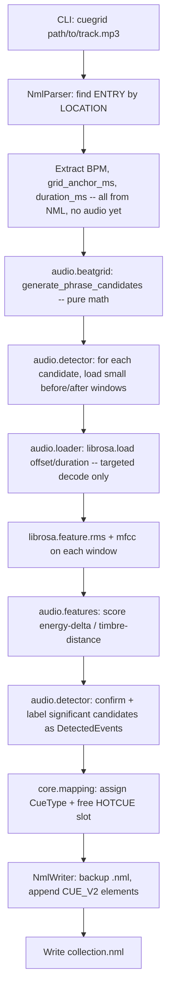

# Spec: Traktor Auto-Cue Automation

Status: Current implementation synchronized 2026-07-13 (single-track, batch, metadata, playlist, discovery, NDJSON, and cue-mutation sidecar contracts)
Source of truth: `.openspec/1-proposal.md`

This document is the binding technical specification for the project. Per
`CLAUDE.md`, no feature should be implemented unless it is explicitly
described here. If an edge case is discovered during implementation, this
file must be updated (via a proposed diff) before code changes proceed.
All open questions from the v1 draft were resolved in sections 6 and 7.

## Current implementation synchronization

The current package is under `core/src/cuegrid/`, not a root `src/`
directory. The implementation currently takes precedence over historical
revision notes below that still describe a feature as "proposed" or "not yet
implemented". In particular, batch processing, `--json` NDJSON output,
`--list-playlists`, `--get-playlist-tracks`, `--get-track-metadata`,
`--discover-nml`, `--update-cues`, and `--delete-cue` are implemented in
`cuegrid.cli`.

`NmlParser` loads `collection.nml` once and retains both the normalized
`Path` (`nml_path`) and live `ElementTree`. `core.pipeline` creates one parser
per single-track or batch run, passes the parsed `TrackEntry` into analysis,
and gives the same parser to `NmlWriter`. `NmlWriter` mutates that in-memory
tree and uses the retained path for the `.bak` backup and atomic `.tmp` to NML
replacement. This is the shared read/write document model for both automated
analysis and frontend-originated manual changes.

The frontend-facing write paths are deliberately separate: `--update-cues`
updates existing standard HotCues or creates missing standard HotCues from
`[{"hotcue": number, "start_ms": number}]`; `--delete-cue` removes exactly one
standard `TYPE="0"` cue by its zero-based `HOTCUE` slot. Neither operation
runs audio analysis. The CLI resolves the NML path before constructing the
parser, and the process exit code is authoritative for the sidecar caller.

**Revision note (v2):** the audio analysis strategy was fundamentally
changed from blind whole-track novelty detection to **Grid-Guided Phrase
Analysis** (sections 4 and 6 below). Any prior implementation of
`audio/beatgrid.py::snap_to_grid` and a whole-track `audio/detector.py`
based on `librosa.util.peak_pick` over the full novelty curve is
**superseded** by this revision and must be replaced, not extended — see
the Migration Impact note at the end of section 6.

**Revision note (v1.1, proposed):** adds **Batch Processing by Playlist
or Title** (new section 8). v1.0's single-track, exact-path-only
invocation (`cuegrid TRACK_PATH`) remains fully supported and
unchanged; batch selection via `--playlist NAME` or `--track-title TITLE`
is purely additive. This section of the document is a **proposal**:
`nml/parser.py`, `core/pipeline.py`, and `cli.py` do not yet implement
any of section 8's requirements. Do not implement v1.1 code until this
proposal is reviewed and the Status line above is updated to "Resolved".

**Revision note (v2.2, superseded by v2.7):** the former Multi-Source
Validation design used stem-only detection followed by optional Master
cross-validation and `--verify smart` relabeling. That post-detection
classifier/filter architecture is retired. Empty-stem handling remains as
source-availability fallback, while the current section 10 defines Parallel
Signal Fusion with simultaneous Master and Drum envelopes.

**Revision note (v2.5, resolved):** pauses structural scoring boosts and adds
mechanical cue guards. `major_phrase_multiple` may continue to tag candidates
for traceability, but it must not affect confidence or selection priority. A
candidate with `beat_index < 8` is rejected before audio feature decoding.
During mapping, a candidate is rejected when it is fewer than 8 beats from any
active existing cue or previously accepted new cue. Existing standard HotCues
are excluded from this active set only when `clear_existing` is true; retained
markers remain active.

**Revision note (v2.7, proposed):** Smart Mode is being refactored from a
post-detection classifier/filter into **Parallel Signal Fusion**. When a drum
stem is available, the detector extracts aligned onset/energy envelopes from
both the Master track and the Drums/Rhythm stem simultaneously, then selects
peaks from their weighted combination. The new defaults are
`master_weight = 0.6` and `drum_weight = 0.4`. Standard single-track analysis
is strictly backward compatible: without a drum stem it uses
`master_weight = 1.0`, `drum_weight = 0.0`, and skips all stem calculations.
The binary `Smart_Boost` telemetry field is deprecated and is replaced by
`Drum_Weight_Applied`; `Drum_Score` is the exact drum RMS at the combined peak
frame index.


**Revision note (v2.3, proposed):** adds **Machine-Readable JSON Output**
(new section 11): a new `--json` flag that switches `cli.py` to emit
Newline-Delimited JSON (NDJSON) progress/result messages on `stdout`
instead of the existing human-readable text, so the Python core can run
headless as a Tauri sidecar for the GUI described in `1-proposal.md`
Phase 2 and specified in `3-gui-spec.md` section 6. Purely additive and
presentation-only: no detection math, `AppConfig` field, or NML
read/write behavior changes. This section is a **proposal**: `cli.py`
and `core/pipeline.py` do not yet implement any of section 11's
requirements. Do not implement v2.3 code until this proposal is
reviewed and this note's status is updated to "Resolved".

**Revision note (v2.4, resolved):** adds **a `--list-playlists`**
metadata-only flag (new section 12): a lightweight `cli.py` mode for a
future GUI dropdown that lists every playlist name in the collection
as a single JSON array on `stdout`, without running any audio
analysis. Purely additive; no `AppConfig`, detection, or NML
read/write behavior changes.

**Revision note (v1.3, proposed):** adds **HotCue deletion** (new section
13): a standalone `--delete-cue HOTCUE_INDEX` sidecar operation that
requires an exact track identifier, removes the matching standard
`<CUE_V2 TYPE="0">` from that track's `<ENTRY>`, and atomically writes
the updated `collection.nml`. It bypasses audio analysis and is intended
for the Phase 3 player's Delete Cue context-menu action. This is a
proposal: do not implement it until this Status line is updated to
"Resolved".

**Revision note (v1.4, proposed):** defines the sensitivity preset matrix.
The CLI's `--mode` flag binds the energy, timbre, and relative-confidence
thresholds together as one preset, so Soft, Medium, and Hard produce
structurally distinct detection behavior rather than merely shifting an
absolute threshold. Do not implement this revision until this Status line
is updated to "Resolved".

**Revision note (v1.5, superseded by v2.7):** the explicit `--no-stems` CLI
override remains supported. Its Master-only behavior is now defined by
section 10's strict backward-compatible fallback; it no longer selects a
post-detection multi-source validation path.

**Revision note (v1.7, proposed):** formalizes the single-track CLI/sidecar
contract in section 8.6. A single-track invocation receives one absolute
filesystem path directly, without playlist-selection wrappers, and isolates
all failures to that invocation. This revision is documentation-only until
this Status line is updated to "Resolved".

---

## 1. Scope

In scope (matches `1-proposal.md` requirements):

1. Parse `collection.nml` to locate a `<ENTRY>` for a given track and read
   its `BPM` (`<TEMPO>`) and grid anchor (`<CUE_V2 TYPE="4">`, a.k.a.
   `AutoGrid`).
2. **Calculate candidates first:** using only the `BPM` and grid anchor from
   step 1 (plus track duration, read directly from the NML's `<INFO>`
   element — see the `PLAYTIME_FLOAT`/`PLAYTIME` note in section 2.3),
   mathematically compute every phrase-boundary timestamp (every 16 and
   32 beats) across the track — *before* touching the audio file at all.
   See section 4.
3. **Targeted analysis only:** for each computed candidate, decode and
   analyze only a small `librosa` window immediately before/after that
   timestamp (RMS energy + MFCC timbre) — never the whole file. Compare
   the two windows and confirm a candidate as a real structural event
   only if the change is significant, then keep the most confident
   candidates across the whole track as a single, unified pool of cues
   (no position-based roles). See section 6.
4. Write the confirmed points back into the same `<ENTRY>` as new
   `<CUE_V2>` HotCue elements, without corrupting the rest of the file.
   Because every candidate was generated from Traktor's own beat math, no
   quantization/snapping step is needed at write time — the confirmed
   timestamps are already exact grid multiples.

Out of scope for v1.0 (do not implement without a spec update):

- Key detection / harmonic mixing.
- Loop (`TYPE="5"`) generation.
- Batch/parallel processing of an entire collection in one run (v1.0
  processes one track at a time, identified by its exact audio file path).
- Any GUI.

**v1.3 deletion scope:** deleting an existing HotCue through the
standalone CLI operation in section 13 is in scope; deletion is not part
of the analysis pipeline or batch processing modes.

**v1.1 (proposed, section 8) narrows the batch exclusion above**:
*multiple* tracks by playlist name or track title, and processing them
sequentially in one CLI invocation, is now in scope. Still out of scope
for v1.1:

- Parallel/concurrent processing of a batch (sequential only -- see
  section 8.3).
- Batch selection by any criteria other than playlist name or exact
  title (e.g. genre, key, BPM range, smart-playlist-style filters).
- Any GUI.

---

## 2. Architectural Layout

Modular Python package under `core/src/cuegrid/`, organized by responsibility so that XML
handling, audio analysis, and orchestration never live in the same module.

The authoritative package paths are `core/src/cuegrid/cli.py`,
`core/src/cuegrid/core/pipeline.py`, and `core/src/cuegrid/nml/writer.py`.
The older tree illustration immediately below is retained as historical
context only; it must not be used to infer a root-level `src/` directory.

```
traktorco/
├── .openspec/
│   ├── 1-proposal.md
│   └── 2-spec.md
├── src/
│   └── traktorco/
│       ├── __init__.py
│       ├── cli.py                 # argparse entrypoint for the `cuegrid` CLI
│       ├── config.py              # AppConfig dataclass: paths, thresholds, defaults
│       │
│       ├── nml/
│       │   ├── __init__.py
│       │   ├── constants.py       # CueType IntEnum, NML tag/attribute name constants
│       │   ├── models.py          # TempoInfo, CuePoint, TrackEntry dataclasses
│       │   ├── parser.py          # NmlParser: load file, locate ENTRY by LOCATION, by playlist NAME (8.1), or by TITLE (8.2)
│       │   └── writer.py          # NmlWriter: merge CuePoints into ENTRY, atomic write + backup
│       │
│       ├── audio/
│       │   ├── __init__.py
│       │   ├── loader.py          # load_window(path, offset_sec, duration_sec, sr) -> (y, sr); NEVER loads a whole track
│       │   ├── beatgrid.py        # beat_length_ms(), generate_phrase_candidates() math from section 4
│       │   ├── features.py        # pure math: energy_delta_db(), timbre_distance(), confidence_score() from section 6
│       │   └── detector.py        # PhraseAnalyzer: candidates -> targeted windowed features -> scored/confirmed DetectedEvent list
│       │
│       ├── core/
│       │   ├── __init__.py
│       │   ├── pipeline.py        # process_single_entry() (shared primitive) + run_pipeline() (single-track) + run_batch_pipeline() (8.3)
│       │   └── mapping.py         # DetectedEvent.label -> CueType + HOTCUE slot assignment policy
│       │
│       └── utils/
│           ├── __init__.py
│           ├── xml_utils.py       # atomic write, .bak backup helpers
│           └── logging_utils.py   # module logger setup
│
└── tests/
    ├── fixtures/
    │   ├── sample_collection.nml    # now includes a PLAYLISTS/NODE[@NAME="prueba"] fixture (section 8)
    │   └── sample_track.wav
    ├── nml/
    │   ├── test_parser.py
    │   └── test_writer.py
    ├── audio/
    │   ├── test_beatgrid.py
    │   ├── test_features.py
    │   └── test_detector.py
    └── core/
        └── test_pipeline.py
```

> **Note on `audio.loader`:** with Grid-Guided Phrase Analysis, the full
> waveform is never decoded. Track duration comes from the NML's `<INFO>`
> element (see section 2.3), not from `librosa`, so `loader.py` only
> ever needs to decode the small windows requested by `detector.py`
> around each candidate (via `librosa.load(path, offset=..., duration=...)`,
> which seeks rather than decoding the whole file for seekable formats).
> There is intentionally no whole-file `load_audio()` function

### 2.1 Module responsibilities

| Module | Responsibility | Must NOT do |
|---|---|---|
| `nml.parser` | Load `collection.nml` once, retain `nml_path` and the live `ElementTree`, locate `ENTRY` by `LOCATION`, playlist, or title, and shape metadata/query results | Does not mutate the tree |
| `nml.writer` | Reuse the parser's live tree to append generated cues, update manual cue positions/create missing cues, delete one standard HotCue, and serialize atomically with a `.bak` backup | Never re-parse or re-derive cue math; never alter `TYPE=4` grid markers |
| `audio.beatgrid` | Pure math: beat length + phrase-candidate generation (section 4) from BPM/grid anchor/duration alone | Never read files or decode audio |
| `audio.loader` | Decode only a small requested window of audio (`offset`/`duration`) to a mono waveform + sample rate | Never decode/load a whole track |
| `audio.features` | Pure math: energy-delta / timbre-distance / confidence scoring on precomputed RMS + MFCC values (section 6) | Never call `librosa` directly; never read files |
| `audio.detector` | Orchestrate: for each phrase candidate, call `audio.loader` for the before/after windows, run `librosa.feature.rms`/`mfcc` on them, score via `audio.features`, confirm + label `DetectedEvent`s | Never analyze anything outside a candidate's window; never touch XML |
| `core.mapping` | Decide `CueType` + `HOTCUE` slot per detected label | Never read/write files |
| `core.pipeline` | Creates and retains the parser for one run, selects entries, resolves audio sources, detects events, maps cues, and delegates writes to the matching writer; exposes `serialize_gui_payload` and sequential batch callbacks | Should contain no XML- or DSP-specific logic itself; must isolate failures per batch track |
| `cli` | Resolves/discovers the NML path, parses arguments, routes read-only queries, manual cue mutations, single-track analysis, batch analysis, NDJSON, and GUI export | Does not duplicate detection or XML mutation logic |

### 2.2 Configuration (`config.py`)

All tunable thresholds used by `audio.beatgrid`, `audio.detector`,
`audio.features`, and `core.pipeline` live in one `AppConfig` dataclass so
they are never hard-coded inside logic modules:

```python
from dataclasses import dataclass

@dataclass
class AppConfig:
    # audio.beatgrid: phrase-candidate generation (section 4)
    phrase_beats: int = 16               # base phrase granularity, in beats (4-bar block)
    major_phrase_multiple: int = 2       # every Nth candidate is also an 8-bar (32-beat) "major" boundary

    # audio.loader: decoding a small window around each candidate
    sample_rate: int | None = None       # None = keep native sample rate
    hop_length: int = 512                # frame hop used by librosa.feature.rms/mfcc within a window

    # audio.detector: sizing the before/after analysis window, scaled in beats (not seconds)
    # so it automatically adapts to the track's tempo.
    window_beats: float = 4.0            # 1 bar of context on each side of a candidate
    mfcc_count: int = 13

    # audio.features: significance thresholds for confirming a candidate as a real event
    # Medium sensitivity is the default preset; --mode binds all three values together (section 2.2.1).
    energy_change_threshold_db: float = 4.0        # energy_threshold: min |delta RMS| in dB
    timbre_change_distance_threshold: float = 18.0 # timbre_threshold: min Euclidean MFCC distance

    # audio.detector: unified structural-cue selection (section 6)
    # The CLI accepts values from 1 through 8; the default preserves the
    # existing eight-cue behavior.
    max_cues: int = 8                              # cap on how many cues are written per track
    relative_confidence_threshold: float = 0.30    # keep candidates >= this fraction of track max confidence

    # Parallel Signal Fusion (section 10): when a drum stem is available,
    # combine aligned Master and Drum energy envelopes before peak selection.
    # If no drum stem is available, the pipeline overrides these values with
    # master_weight=1.0 and drum_weight=0.0 and skips stem calculations.
    master_weight: float = 0.6
    drum_weight: float = 0.4

    # Source selection override; --no-stems forces standard Master-only mode.
    no_stems: bool = False
```

### 2.2.1 Sensitivity preset matrix (`--mode`)

`--mode` binds three detection variables simultaneously; it is not an
independent adjustment of only one absolute threshold. The exact presets are:

| Mode | `energy_threshold` (`energy_change_threshold_db`) | `timbre_threshold` (`timbre_change_distance_threshold`) | `relative_confidence_threshold` |
|---|---:|---:|---:|
| Soft | 2.0 | 8.0 | 0.15 |
| Medium (default) | 4.0 | 18.0 | 0.30 |
| Hard | 7.0 | 30.0 | 0.50 |

The CLI must resolve `--mode soft|medium|hard` to the complete row before
analysis. Direct advanced threshold flags, if supported by the CLI, must not
silently override the selected preset; the mode binding is the source of truth
for these three variables.

### 2.2.2 Why the relative threshold is structural

In the confidence equation (section 6), changing either absolute threshold
scales its corresponding confidence component linearly. Those absolute values
therefore alter the scale of the score, but the decisive track-level selection
gate is `relative_confidence_threshold`, which compares each candidate with the
track's maximum confidence. Binding that gate to the same preset makes the modes
meaningfully distinct: **Soft** acts as an explorer and admits cues at 15% of
maximum confidence, while **Hard** acts strictly and demands at least 50% of
maximum confidence.

Note what is deliberately **absent**: there is no whole-track peak-picking
config (`peak_pre_max`, `peak_delta`, etc.). A fixed millisecond spacing
config is also unnecessary: the mechanical mapper enforces a fixed 8-beat
minimum using the track BPM. The first 8 beats are a fixed intro protection
margin; the existing outro guard remains in section 6.

### 2.3.1 Frequency visualization export boundary

This is the binding cross-boundary rule for future spectrum/frequency
rendering in the GUI:

- The Python core owns all frequency preprocessing and band detection. It
  may use `librosa` to derive low/bass, mid, high/treble, or equivalent
  normalized bands from the audio.
- The Vue/Tauri frontend must not calculate real-time FFTs, spectrograms, or
  other heavy frequency features in JavaScript. Rust is likewise a transport
  boundary, not an audio-analysis implementation.
- The core exports a lightweight visualization payload, aligned to waveform
  samples or fixed time buckets. A conforming payload contains a version,
  duration, bucket interval, and normalized band values, for example:

  ```json
  {
    "version": 1,
    "duration_ms": 240000,
    "bucket_ms": 50,
    "bands": [
      {"low": 0.72, "mid": 0.41, "high": 0.18},
      {"low": 0.68, "mid": 0.44, "high": 0.21}
    ]
  }
  ```

- Band values are presentation inputs only: they are normalized to `[0, 1]`
  and must not be interpreted by the GUI as analysis confidence, cue
  validity, or beat-grid data.
- Peaks.js consumes the pre-calculated peaks as a **dumb silhouette renderer**.
  The frontend's CSS-mask layer consumes the color map for presentation; neither
  it nor Peaks.js may invoke FFT/frequency analysis during initial rendering,
  zoom, pan, playback, or marker interaction.
- The payload may be transported as sidecar JSON, cached metadata, or an
  equivalent Tauri response, but the transport must preserve the ownership
  boundary: Python computes; the frontend renders. Exact transport framing
  is deferred until the spectrum feature is formally scheduled.

This export is additive to the targeted cue-detection pipeline. It must not
silently turn `audio.loader` or the existing detector into a whole-track
analysis path; the explicit Stage 1 preview decode in section 15 is the sole
exception. It has its own low-rate decoding, bounded visual-output contract,
and Vue RAM-cache strategy.

### 2.3 Data structures (`nml/models.py`)


```python
from dataclasses import dataclass, field
from src.traktorco.nml.constants import CueType

@dataclass
class TempoInfo:
    bpm: float
    bpm_quality: float = 100.0

@dataclass
class CuePoint:
    name: str
    type: CueType
    start_ms: float          # milliseconds, matches NML START units
    len_ms: float = 0.0
    repeats: int = -1
    hotcue: int = -1          # -1 = not bound to a Hotcue pad; 0-7 = pad slot
    displ_order: int = 0

@dataclass
class TrackEntry:
    title: str
    artist: str
    location_path: str        # resolved absolute path used to match the audio file
    tempo: TempoInfo
    cues: list[CuePoint] = field(default_factory=list)
    grid_anchor_ms: float = 0.0   # convenience: START of the TYPE=GRID cue
    duration_ms: float = 0.0      # from <INFO>; bounds candidate generation -- see PLAYTIME_FLOAT/PLAYTIME note below
```

**`duration_ms` extraction (`nml/parser.py`):** prefer `<INFO
PLAYTIME_FLOAT="...">` (fractional seconds) when present, converting to
milliseconds via `* 1000`. Fall back to the integer-seconds `<INFO
PLAYTIME="...">` (also `* 1000`) when `PLAYTIME_FLOAT` is absent. This
fallback is required in practice, not just defensive: Traktor Pro 4 (NML
`VERSION="20"`) has been observed to omit `PLAYTIME_FLOAT` entirely and
write only integer-seconds `PLAYTIME` (confirmed against
`tests/fixtures/sample_collection.nml`). If neither attribute is present,
`duration_ms` is `0.0` and candidate generation produces at most the
anchor candidate (spec section 4.4, item 3) — never a parse error.

`audio/beatgrid.py` produces (section 4):

```python
from dataclasses import dataclass

@dataclass
class PhraseCandidate:
    beat_index: int       # offset in beats from the grid anchor; always a multiple of phrase_beats
    time_ms: float         # G + beat_index * L; already an exact grid multiple, never needs snapping
    is_major_phrase: bool  # True every major_phrase_multiple-th candidate (default: every 32 beats)
```

`audio/detector.py` produces (section 6):

```python
from dataclasses import dataclass

@dataclass
class DetectedEvent:
    label: str            # always "cue" -- see section 6; a single, unified structural cue type
    time_ms: float          # == the confirming PhraseCandidate.time_ms; already grid-exact, no snapping needed
    beat_index: int          # traceability back to the originating PhraseCandidate
    is_major_phrase: bool    # carried through from the originating PhraseCandidate
    confidence: float        # combined energy/timbre change score from audio.features, arbitrary positive scale
```

---

## 3. Traktor `<CUE_V2>` XML Structure

Traktor's `collection.nml` stores all cue points (including the automatic
beatgrid anchor) as `<CUE_V2>` children of an `<ENTRY>`. There is no bare
`<CUE>` tag in current Traktor versions — historical `CUE`/`CUE_V1` formats
predate `CUE_V2` and are not written by any supported Traktor release, so
this project targets `CUE_V2` exclusively.

### 3.1 Parent context

```xml
<ENTRY MODIFIED_DATE="2026/7/7" MODIFIED_TIME="50000" TITLE="Track Title" ARTIST="Artist Name">
  <LOCATION DIR="/:Users/:dj/:Music/:" FILE="track.mp3" VOLUME="Macintosh HD" VOLUMEID="Macintosh HD"/>
  <INFO BITRATE="320000" PLAYTIME="240" PLAYTIME_FLOAT="240.123000" IMPORT_DATE="2026/7/7" FLAGS="28" FILESIZE="9600"/>
  <TEMPO BPM="128.000000" BPM_QUALITY="100.000000"/>

  <!-- Existing grid anchor, always TYPE=4, usually HOTCUE=0 and unnamed/"AutoGrid" -->
  <CUE_V2 NAME="AutoGrid" DISPL_ORDER="0" TYPE="4" START="356.000000" LEN="0.000000" REPEATS="-1" HOTCUE="0"/>

  <!-- Cues this project adds, one per detected structural event -->
  <CUE_V2 NAME="Intro End" DISPL_ORDER="0" TYPE="0" START="16106.000000" LEN="0.000000" REPEATS="-1" HOTCUE="1"/>
  <CUE_V2 NAME="Drop"      DISPL_ORDER="0" TYPE="0" START="47950.000000" LEN="0.000000" REPEATS="-1" HOTCUE="2"/>
  <CUE_V2 NAME="Outro"     DISPL_ORDER="0" TYPE="0" START="210375.000000" LEN="0.000000" REPEATS="-1" HOTCUE="3"/>
</ENTRY>
```

### 3.2 Attribute reference

| Attribute | Type | Units / Notes |
|---|---|---|
| `NAME` | string | Free text label shown in Traktor's cue list. `"AutoGrid"` is reserved for the grid anchor. |
| `DISPL_ORDER` | int | Display ordering hint. Write `0` unless reordering is required. |
| `TYPE` | int (enum) | See `CueType` below. |
| `START` | float | **Milliseconds** from the start of the audio file. This is the value the phrase-candidate formula in section 4 produces directly — no separate snapping step. |
| `LEN` | float | Milliseconds. `0.0` for point cues (all cues this project writes are point cues, not loops). |
| `REPEATS` | int | `-1` for point cues. Only meaningful for `TYPE=5` (Loop). |
| `HOTCUE` | int | Hotcue pad index the cue is bound to, `0`–`7`. `-1` if not bound to a pad. Traktor supports 8 hotcue slots per deck. |

### 3.3 `CueType` enum (`nml/constants.py`)

Reverse-engineered and confirmed against Traktor's binary `TRAKTOR4` cue
metadata (identical enum is reused in the XML `TYPE` attribute):

```python
from enum import IntEnum

class CueType(IntEnum):
    CUE = 0        # Standard Cue Point / HotCue
    FADE_IN = 1
    FADE_OUT = 2
    LOAD = 3
    GRID = 4       # Beatgrid anchor, NAME="AutoGrid"
    LOOP = 5
```

This project only ever writes `CueType.CUE` (`0`). `CueType.GRID` is
read-only input (used to get `grid_anchor_ms`); it must never be created,
duplicated, or overwritten by the writer.

### 3.4 Writer constraints

- The `AutoGrid` (`TYPE=4`) cue must be preserved byte-for-byte; when
  `clear_existing=False` (the default), the writer only *appends* new
  `TYPE=0` `<CUE_V2>` elements to `ENTRY`, it never removes or reorders
  existing children.
- When `clear_existing=True` (the `--clear-existing` CLI flag), all
  existing standard HotCues (`TYPE=0`) are removed from the entry before
  appending new ones. **Grid markers** (`TYPE=4`, `AutoGrid`) and **Load
  markers** (`TYPE=3`) are never removed — only standard HotCues are
  purged, so the user's beatgrid remains perfectly intact regardless of
  this flag.
- `HOTCUE` slots already in use (read from the existing `CUE_V2` list) must
  not be overwritten. `core.mapping` assigns the lowest free slot in
  `0..7`; if all 8 slots are taken, the event is skipped and logged as a
  warning — never dropped silently, never crashes the run.
- All numeric attributes are serialized with 6 decimal places
  (`f"{value:.6f}"`) to match Traktor's own formatting and avoid diffs that
  make the whole file appear changed under version control.
- Before writing, copy the original file to `<name>.nml.bak` if a backup
  for this run does not already exist.

### 3.5 Frontend-originated cue mutations

The GUI uses the same retained parser/writer document model for manual edits:

- `cuegrid TRACK_PATH --update-cues JSON_STRING [--nml PATH]` is a
  metadata-only mutation path. The JSON value is an array of objects with
  numeric `hotcue` (the NML zero-based slot) and `start_ms` (the cue start
  position). Existing standard `TYPE="0"` nodes are updated in place so
  their existing attributes are preserved; missing slots are created with
  default point-cue attributes. The operation performs no audio analysis.
- `cuegrid TRACK_PATH --delete-cue HOTCUE_INDEX [--nml PATH]` removes exactly
  one standard HotCue. It never removes the `TYPE="4"` grid marker or other
  marker types, and it writes only after a matching node has been found.
- Both paths instantiate `NmlParser` once, pass it to `NmlWriter`, create the
  `.bak` backup when needed, and replace the original NML atomically. A failed
  write restores the in-memory node removed by `delete_cue` before re-raising.
- The frontend treats the sidecar exit code as the commit result. Local cue
  dragging/deletion remains dirty UI state until an explicit save or a
  dedicated delete operation succeeds.

---

## 4. Grid-Guided Phrase Candidate Generation

**This is the load-bearing change in v2.** Instead of detecting arbitrary
timestamps in the audio and then correcting ("snapping") them onto the
grid after the fact, this project now computes every plausible cue
location directly from Traktor's own BPM and grid data *before* touching
the audio file. Dance-music arrangement changes (drops, breaks,
intro/outro boundaries) overwhelmingly land on musical phrase boundaries —
4-bar (16-beat) or 8-bar (32-beat) blocks — so those are the only
timestamps ever considered. There is no free-running novelty search over
the whole track, and consequently **no quantization/snapping step is
needed**: every candidate is, by construction, an exact grid multiple.

### 4.1 Inputs

- `BPM`: from `<TEMPO BPM="...">` on the matched `ENTRY`.
- `G`: the grid anchor, in **milliseconds**, taken from the `START`
  attribute of the `<CUE_V2 TYPE="4">` (`AutoGrid`) element. This is the
  timestamp of beat 0 on Traktor's grid — it is typically a small offset
  near the top of the track, not necessarily `0`.
- `D`: the track duration, in **milliseconds**, taken from the `<INFO>`
  element per the `PLAYTIME_FLOAT`/`PLAYTIME` extraction rule in section
  2.3. This bounds candidate generation and is read directly from the
  NML — `librosa`/audio decoding is not needed to determine it.
- `P`: `AppConfig.phrase_beats` (default `16`) — the base phrase
  granularity, in beats.
- `M`: `AppConfig.major_phrase_multiple` (default `2`) — every `M`-th
  candidate is additionally tagged as a "major" (8-bar / 32-beat) phrase
  boundary.

### 4.2 Beat length

Traktor's grid is a fixed-tempo grid anchored at `G`. The duration of one
beat in milliseconds is:

```
L = 60000 / BPM
```

### 4.3 Candidate generation formula

Enumerate every phrase boundary from the anchor to the end of the track,
in beat-index steps of `P`:

```
for n = 0, 1, 2, ...:
    beat_index = n * P
    t_ms        = G + beat_index * L

    if t_ms > D:
        stop                                   # past the end of the track

    is_major_phrase = (n % M == 0)             # every M-th candidate is also a 32-beat boundary

    emit PhraseCandidate(beat_index, t_ms, is_major_phrase)
```

Equivalently, as a closed-form expression for the `n`-th candidate:

```
t_ms(n) = G + n * P * L,   for n = 0, 1, 2, ... while t_ms(n) <= D
```

With the defaults (`P=16`, `M=2`), this produces a candidate every 16
beats (4 bars), with every other one (`n` even) additionally marking a
32-beat (8-bar) boundary — the two granularities named in the brief are
both covered by a single generator, since 32 is a multiple of 16.

Because every `t_ms(n)` is already `G + k*L` for an integer `k`, it is
trivially and exactly grid-aligned — this is the same form as a snapped
timestamp would have taken in v1, but produced generatively instead of
correctively.

### 4.4 Post-conditions / edge cases

1. **Pre-anchor region:** candidate generation starts at `n = 0`
   (`t_ms = G`), so there are never negative-time candidates — unlike v1's
   corrective snapping, there is nothing before the anchor to consider.
2. **Zero/undefined BPM:** if `BPM <= 0` or is missing, candidate
   generation must be skipped entirely for that track (no candidates, no
   division by zero), and a warning logged. `core.pipeline` must treat
   this the same as "zero confirmed events" — it is not a fatal error.
3. **Duration missing/zero:** if `D <= 0` (e.g. malformed or entirely
   absent `PLAYTIME_FLOAT`/`PLAYTIME` — see the extraction rule in section
   2.3), generation stops immediately after `n = 0`, producing at most one
   candidate (the anchor itself). Log a warning; do not raise.
4. **No de-duplication needed:** any two candidates are at least `P` beats
   (`P * L` ms) apart by construction. This structurally satisfies what
   v1's `min_cue_spacing_beats` post-hoc de-duplication pass existed to
   guarantee, so that pass has been removed (see section 2.2).

### 4.5 Reference implementation shape (`audio/beatgrid.py`)

```python
from dataclasses import dataclass


def beat_length_ms(bpm: float) -> float:
    if bpm <= 0:
        raise ValueError("BPM must be positive")
    return 60000.0 / bpm


@dataclass
class PhraseCandidate:
    beat_index: int
    time_ms: float
    is_major_phrase: bool


def generate_phrase_candidates(
    bpm: float,
    grid_anchor_ms: float,
    duration_ms: float,
    phrase_beats: int = 16,
    major_phrase_multiple: int = 2,
) -> list[PhraseCandidate]:
    if bpm <= 0 or duration_ms <= 0:
        return []

    length_ms = beat_length_ms(bpm)
    candidates = []
    n = 0
    while True:
        beat_index = n * phrase_beats
        t_ms = grid_anchor_ms + beat_index * length_ms
        if t_ms > duration_ms:
            break
        candidates.append(
            PhraseCandidate(
                beat_index=beat_index,
                time_ms=t_ms,
                is_major_phrase=(n % major_phrase_multiple == 0),
            )
        )
        n += 1
    return candidates
```

`audio.detector` consumes this list directly; `core.pipeline` performs no
post-hoc snapping. The later `core.mapping` step still applies the resolved
8-beat active-cue spacing guard from section 6.1.

---

## 5. Pipeline Flow



---

## 6. Grid-Guided Phrase Analysis (`audio/detector.py`, `audio/features.py`)

**Decision:** replace whole-track novelty-curve peak-picking (v1) with
**targeted, phrase-boundary-only analysis**: `librosa` is never run across
the full waveform. It only ever inspects a handful of short windows, one
per `PhraseCandidate` produced by section 4.

**Rationale:**

- **DJ-centric accuracy:** arrangement changes in club-oriented electronic
  music are overwhelmingly aligned to 4-bar/8-bar phrases. A loudness or
  timbre change that does *not* land on a phrase boundary is very unlikely
  to be an intentional structural cue point, so searching for it anywhere
  else in the track is wasted work and a source of false positives.
- **CPU efficiency:** v1's approach ran `onset_strength` and `rms` across
  every frame of the entire track (`O(track_length)`). v2 only decodes and
  analyzes `2 * len(candidates)` short windows of `window_beats` each —
  for a 4-minute track at 128 BPM that's roughly 60 candidates × 2 windows
  × ~1.9s, versus decoding and processing the full 240s waveform. This is
  a substantial reduction in both I/O (via seek-based partial decode) and
  DSP compute.
- **No quantization needed:** every candidate's timestamp already came
  from section 4's grid math, so a confirmed `DetectedEvent` is written
  with that exact timestamp — there is nothing left to snap.

### 6.1 Algorithm

**Revision note (v1.4):** field testing showed that the position-based
`intro_end`/`drop`/`outro_start` roles produced cues near fade-outs and
other low-energy tail material simply because a candidate happened to
fall inside the configured intro/outro search window, regardless of
whether it was musically meaningful. This revision **removes all
position-based roles and search windows** in favor of a single, unified
structural-cue pool: every significant candidate across the *entire*
track competes on confidence alone, with an explicit anti-silence guard
so fade-outs can never be selected.

1. **Get candidates:** call
   `audio.beatgrid.generate_phrase_candidates(bpm, grid_anchor_ms, duration_ms, config.phrase_beats, config.major_phrase_multiple)`
   (section 4). This requires no audio decoding at all.
2. **Size the analysis window:** compute `window_ms = config.window_beats * beat_length_ms(bpm)`
   (default 4 beats — one bar — so the window automatically scales with
   tempo instead of using a fixed number of seconds).
3. **For each candidate**, decode exactly two short windows via
   `audio.loader.load_window`:
   - `before = load_window(path, offset_sec=(candidate.time_ms - window_ms) / 1000, duration_sec=window_ms / 1000, sr=config.sample_rate)`
   - `after  = load_window(path, offset_sec=candidate.time_ms / 1000, duration_sec=window_ms / 1000, sr=config.sample_rate)`
   - If `candidate.beat_index < 8`, reject the candidate immediately with
     `REJECTED_INTRO_MARGIN` and do not decode any audio windows.
   - Otherwise, if `before`'s offset would be negative, skip the `before`
     window entirely; this candidate cannot be scored (there is no evidence
     to evaluate; see step 5) and is dropped from the pool. Do not clamp the
     offset to `0`, which would shrink and bias the window.
   - If `after`'s window would run past `duration_ms`, truncate its
     `duration_sec` to what remains, rather than skipping it.
4. **Extract features** on each decoded window with `librosa`:
   - `rms = librosa.feature.rms(y=window, hop_length=config.hop_length)[0].mean()`
   - `mfcc = librosa.feature.mfcc(y=window, sr=sr, n_mfcc=config.mfcc_count).mean(axis=1)`
5. **Score the candidate** using `audio.features` (pure math, no `librosa`
   dependency, so it is independently unit-testable):
   - `energy_delta_db = 20 * log10(max(rms_after, eps) / max(rms_before, eps))`
   - `timbre_distance = euclidean(mfcc_after, mfcc_before)`
   - `confidence = abs(energy_delta_db) / config.energy_change_threshold_db + timbre_distance / config.timbre_change_distance_threshold`
   - `is_significant = abs(energy_delta_db) >= config.energy_change_threshold_db or timbre_distance >= config.timbre_change_distance_threshold`
   - The three threshold values come from the selected `--mode` preset in
     section 2.2.1 and must be applied as a bound set, not independently.
   - **Anti-silence filter (critical):** regardless of the above, a
     candidate is never significant if its `after` window is
     practically silent — either its `rms_after` is at or below a
     negligible absolute floor, or `rms_after` is extremely low relative
     to the track's average energy (e.g. `rms_after < eps` or
     `rms_after` far below the mean RMS observed across all candidates'
     `after` windows). This is what prevents a phrase boundary that sits
     inside a fade-out from ever being scored as significant, even if
     the energy *ratio* looks large on paper (a quiet-to-near-silent
     transition can otherwise look like a big negative `energy_delta_db`).
6. **Select the unified cue pool** (position is irrelevant; only
   evidence and confidence matter):
   - Start from every candidate with `is_significant = True` (which, per
     step 5, already excludes anything landing in near-silence).
   - **Dynamic confidence threshold:** find
     `max_confidence = max(c.confidence for c in significant_candidates)`
     across the whole track, then discard any candidate whose
     `confidence < max_confidence * config.relative_confidence_threshold`.
     This keeps the cue set proportional to how dramatic the track's
     *strongest* change is, rather than a fixed absolute cutoff.
   - Rank the survivors by `confidence` descending and keep the top
     `config.max_cues`; `is_major_phrase` is traceability metadata only while
     structural scoring is paused.
   - Sort the kept candidates by `time_ms`/`beat_index` ascending for the
     final output — ranking-by-confidence only decides *which* candidates
     survive, not their output order. During mapping, reject a candidate when
     it is fewer than 8 beats from any retained existing cue or accepted new
     cue; log the rejection and do not assign it a slot.
   - If no candidate is significant, the result is an empty list — a
     valid, silent outcome, not an error. There is no fallback to
     non-significant candidates.
7. **Output:** the flat, chronologically ordered list of `DetectedEvent`,
   each carrying `time_ms = candidate.time_ms` verbatim and
   `label = "cue"` (a single, unified label — there are no more
   position-based roles). `core.pipeline` passes this straight to
   `core.mapping` — there is no snapping or de-duplication pass after
   this point.

This keeps `audio.detector` an orchestrator over `audio.loader` +
`librosa.feature.*` + `audio.features`, and keeps `audio.features` a pure
function of scalar/vector inputs (`(rms_before, rms_after, mfcc_before,
mfcc_after, config) -> (energy_delta_db, timbre_distance, confidence,
is_significant)`) with no `librosa` or file-I/O dependency, consistent
with the module boundaries in section 2.1.

### 6.2 Migration impact on existing code

`src/traktorco/audio/beatgrid.py` currently implements v1's
`snap_to_grid(t_raw_sec, bpm, grid_anchor_ms)` and its test suite
(`tests/audio/test_beatgrid.py`). Under this revision:

- `beat_length_ms` is unchanged and must be kept.
- `snap_to_grid` is **obsolete** and must be **removed**, replaced by
  `generate_phrase_candidates` and the `PhraseCandidate` dataclass from
  section 4.5.
- The existing `test_beatgrid.py` tests for `snap_to_grid` must be removed
  and replaced with tests for `generate_phrase_candidates` (candidate
  count/spacing, `is_major_phrase` tagging, zero/negative BPM and
  zero-duration edge cases from section 4.4).

**Revision note (v1.4) migration impact:** the previous revision of this
section assigned `intro_end`/`drop`/`outro_start` labels via
`config.intro_search_fraction`, `config.outro_search_fraction`, and
`config.max_drop_cues`. All three are now **obsolete and removed**:

- `AppConfig.intro_search_fraction` and `AppConfig.outro_search_fraction`
  are **removed** — there are no more position-based search windows.
- `AppConfig.max_drop_cues` is **renamed** to `AppConfig.max_cues`
  (default changed from `3` to `8`) and now caps the single unified cue
  pool, not just "drop"-like candidates.
- `AppConfig.relative_confidence_threshold` drives the dynamic confidence
  cutoff in step 6 above and is bound with the energy/timbre thresholds by the
  `--mode` preset matrix in section 2.2.1 (Medium default: `0.30`).
- `DetectedEvent.label` is now always the literal string `"cue"` — the
  `"intro_end"`/`"drop"`/`"outro_start"` label values, `core.mapping`'s
  `_LABEL_TO_NAME` lookup for them, and any CLI/README text describing
  those roles must be updated accordingly.

---

## 7. NML `LOCATION` Matching & Path Normalization (`nml/parser.py`)

### 7.1 How Traktor stores `LOCATION`

```xml
<LOCATION DIR="/:Users/:dj/:Music/:" FILE="track.mp3" VOLUME="C:" VOLUMEID="..."/>
```

- `DIR`: path segments joined by the literal two-character separator `/:`,
  with a leading and trailing `/:`. Never contains a drive letter or
  volume name — that lives in `VOLUME`.
- `VOLUME`: on Windows this is a drive letter with colon, e.g. `"C:"`
  (confirmed against Native Instruments' own documented default paths,
  e.g. `C: > Users > ... > Documents > Native Instruments`). On macOS it
  is a mounted volume name, e.g. `"Macintosh HD"`. `VOLUMEID` is an
  internal Traktor volume identifier and is not needed for path
  reconstruction.
- `FILE`: bare filename, no path separators.

### 7.2 Normalization function

`nml/parser.py` implements a one-directional converter, since this project
only ever reads existing `LOCATION`s (it never creates new `ENTRY`
elements):

```python
import re
from pathlib import PureWindowsPath, PurePosixPath

_WINDOWS_VOLUME_RE = re.compile(r"^[A-Za-z]:$")

def nml_location_to_path(volume: str, dir_: str, file_: str) -> str:
    """Reconstruct a normalized, comparable path string from a LOCATION.

    Returns a string with forward slashes and normalized casing (via
    os.path.normcase equivalent), NOT a resolved filesystem path — the
    referenced volume may not be mounted on the machine running this tool.
    """
    segments = [s for s in dir_.split("/:") if s]
    if _WINDOWS_VOLUME_RE.match(volume):
        raw = str(PureWindowsPath(volume + "\\", *segments, file_))
    else:
        # macOS-style volume name; best-effort only, not required to
        # resolve on a Windows machine running this tool.
        raw = str(PurePosixPath("/Volumes", volume, *segments, file_))
    return raw.replace("\\", "/").casefold()
```

### 7.3 Matching strategy (`NmlParser.find_entry`)

1. Take the user-supplied audio file path from the CLI, resolve it to an
   absolute path with `pathlib.Path(user_path).resolve()`.
2. Normalize that resolved path the same way as `nml_location_to_path`'s
   output (forward slashes, `casefold()`) so the two sides are comparable
   without requiring the NML-referenced file to exist on this machine's
   currently mounted volumes.
3. For every `ENTRY` in the collection, compute
   `nml_location_to_path(entry.VOLUME, entry.DIR, entry.FILE)` and compare
   it to the normalized user path.
4. **Zero matches:** raise `TrackNotFoundError`, including the normalized
   path that was searched for, so a volume-letter/name mismatch (e.g. the
   collection was cataloged on a different drive letter) is easy to
   diagnose.
5. **Exactly one match:** proceed with that `ENTRY`.
6. **More than one match** (duplicate `LOCATION`s in the collection, which
   Traktor itself normally prevents but can occur in edited/merged
   collections): raise `AmbiguousTrackError`. Resolving ambiguity via
   `--title`/`--artist` CLI filters is required behavior for `cli.py`, not
   new scope — it directly serves requirement 1 in `1-proposal.md`
   ("read `collection.nml` to fetch the BPM and Grid Marker" implies
   finding exactly one matching entry).

This strategy deliberately avoids resolving the NML-derived path against
the filesystem (step 2 only resolves the *user-supplied* path). The NML
path is used purely as a normalized string key for comparison.

---

## 8. Batch Processing by Playlist or Title (Resolved, v1.1)

> **Status: implemented.** Batch processing is fully implemented across
> `nml/parser.py` (playlist and title resolution functions with proper
> error handling), `nml/writer.py` (write_cues_to_element primitive),
> `core/pipeline.py` (run_batch_pipeline with broad exception handling),
> and `cli.py` (mutually exclusive track-selection argument group).
> Comprehensive test coverage added for all batch paths including the
> missing-BPM and audio-analysis-failure skip cases.

**Motivation:** v1.0 requires an exact, single audio file path per
invocation. This is fine for one-off use but tedious for preparing many
tracks at once. v1.1 adds two additional ways to *select* which
track(s) to process — by Traktor playlist name, or by track title — while
leaving the entire detection/mapping/writing pipeline (sections 3-6)
completely unchanged. Batch processing is purely a new **selection**
layer in front of the existing single-track pipeline.

### 8.1 Resolving entries by playlist `NAME` (`nml.parser`)

Traktor stores playlists under `<NML><PLAYLISTS>` as an arbitrarily
nested tree of `<NODE TYPE="FOLDER">` and `<NODE TYPE="PLAYLIST">`
elements. A `TYPE="PLAYLIST"` node contains a `<PLAYLIST>` element whose
children are `<ENTRY><PRIMARYKEY TYPE="TRACK" KEY="..."/></ENTRY>`, one
per track, in playlist order:

```xml
<PLAYLISTS><NODE TYPE="FOLDER" NAME="$ROOT"><SUBNODES COUNT="1">
  <NODE TYPE="PLAYLIST" NAME="My IDM Breaks">
    <PLAYLIST ENTRIES="2" TYPE="LIST" UUID="...">
      <ENTRY><PRIMARYKEY TYPE="TRACK" KEY="C:/:Users/:dj/:Music/:Tidal/:Track One.flac"></PRIMARYKEY></ENTRY>
      <ENTRY><PRIMARYKEY TYPE="TRACK" KEY="C:/:Users/:dj/:Music/:Tidal/:Track Two.flac"></PRIMARYKEY></ENTRY>
    </PLAYLIST>
  </NODE>
</SUBNODES></NODE></PLAYLISTS>
```

See `tests/fixtures/sample_collection.nml`'s `NODE[@NAME="prueba"]` for a
real, checked-in example of this exact shape.

#### 8.1.1 `PRIMARYKEY`'s `KEY` format

The `KEY` attribute encodes the same volume/directory/filename
information as a `<LOCATION>` element (section 7.1), but as a **single
string** using the same `/:` separator throughout, with the volume as
the first segment and the filename as the last:

```
C:/:Users/:dj/:Music/:Tidal/:Track One.flac
     │      │    │     │       └ filename (last segment)
     └──────┴────┴─────┴─────── directory segments (middle)
volume (first segment, e.g. "C:" on Windows, a mounted volume name on macOS)
```

This must **not** be parsed independently of `nml_location_to_path`
(section 7.2) — it must be decomposed into the same `(volume, dir_,
file_)` shape and passed straight through that existing function, so
normalization/casefolding behavior is identical and never duplicated:

```python
def primary_key_to_normalized_path(key: str) -> str:
    """Convert a <PRIMARYKEY> KEY into the same normalized path string
    that nml_location_to_path() produces for a <LOCATION>, by splitting
    on the shared "/:" separator and reusing that function directly.
    """
    segments = key.split("/:")
    volume, *dir_segments, file_ = segments
    dir_ = "/:" + "/:".join(dir_segments) + "/:"
    return nml_location_to_path(volume, dir_, file_)
```

#### 8.1.2 Finding the playlist `NODE`

Playlist folders can nest to arbitrary depth, so the search must recurse
the whole `<PLAYLISTS>` subtree (e.g. via `ElementTree.iter("NODE")`
filtered to `@TYPE="PLAYLIST"`), not assume a fixed depth:

1. Find every `<NODE TYPE="PLAYLIST">` anywhere under `<PLAYLISTS>` whose
   `NAME` attribute case-sensitively equals the requested playlist name
   (Traktor playlist names are user-authored free text; unlike
   `--title`/`--artist` filters in section 7.3, an exact, case-sensitive
   match is used here since playlist names are far less likely to have
   inconsistent casing than track metadata, and silently matching
   "My Breaks" to a differently-cased, unrelated playlist would be
   surprising).
2. **Zero matches:** raise `PlaylistNotFoundError`, naming the playlist
   searched for.
3. **More than one match:** raise `AmbiguousPlaylistError` (Traktor does
   permit two playlists with the same name in different folders) --
   there is no folder-path disambiguation flag in v1.1; the user must
   rename one of the playlists in Traktor. This mirrors
   `AmbiguousTrackError`'s fail-clearly philosophy rather than guessing.
4. **Exactly one match:** proceed with that `<PLAYLIST>`'s children.

#### 8.1.3 Mapping `PRIMARYKEY` entries to `<COLLECTION><ENTRY>` nodes

For each `<ENTRY><PRIMARYKEY TYPE="TRACK" KEY="..."/></ENTRY>` under the
matched `<PLAYLIST>`, in playlist order:

1. Skip any `PRIMARYKEY` whose `TYPE` is not `"TRACK"` (defensive; all
   observed playlist entries are `TRACK`-typed, but this must not crash
   on an unexpected type).
2. Compute `primary_key_to_normalized_path(key)`.
3. Compare it against every `<COLLECTION><ENTRY>`'s
   `nml_location_to_path(...)` value -- i.e. the exact same comparison
   `NmlParser._find_matching_elements` already performs for a
   user-supplied path (section 7.3), just with the playlist-derived path
   as the target instead of a CLI argument. No new matching logic is
   introduced; this reuses that method verbatim.
4. **No matching `<COLLECTION><ENTRY>`** (a stale playlist reference to a
   track no longer in the collection): skip this track, log a warning
   naming the unresolved `KEY`, and continue with the rest of the
   playlist. This must never raise -- a single stale reference must not
   prevent processing the rest of the playlist.
5. **Ambiguous match** (the same defensive case as section 7.3 step 6,
   here with no `--title`/`--artist` filters available since the track
   was selected via playlist, not by hand): skip this track, log a
   warning, and continue. Batch mode never blocks on a single track's
   disambiguation.

#### 8.1.4 Return shape

```python
@dataclass
class BatchTrackRef:
    """One track resolved for batch processing: its parsed data, plus
    the live <ENTRY> Element it came from, so core.pipeline/nml.writer
    never need to re-match it by path (spec section 8.3).
    """
    entry: TrackEntry
    element: ET.Element

def find_entries_by_playlist(self, playlist_name: str) -> list[BatchTrackRef]:
    """Resolve every track in the named playlist to a BatchTrackRef,
    in playlist order, per section 8.1. Raises PlaylistNotFoundError /
    AmbiguousPlaylistError for the playlist lookup itself (section
    8.1.2); per-track resolution failures are skipped with a warning,
    never raised (section 8.1.3, steps 4-5).
    """
```

### 8.2 Resolving entries by `TITLE` (`nml.parser`)

Unlike section 7.3's `find_entry` (which resolves *one* specific,
already-known track by path), `--track-title` is a batch selector in its
own right: **every** `<COLLECTION><ENTRY>` whose `TITLE` matches is
selected and processed, not just a single one. This intentionally
supports the common case of multiple mixes/edits/remixes sharing a title.

```python
def find_entries_by_title(
    self, title: str, artist: str | None = None
) -> list[BatchTrackRef]:
    """Resolve every <ENTRY> whose TITLE matches (case-insensitive exact
    match, reusing the same comparison as the --title/--artist filters
    in section 7.3's _filter_by_title_artist), optionally further
    narrowed by artist (same semantics). In playlist mode there's a
    NODE to anchor the search; here the search is simply every ENTRY
    directly under <COLLECTION>.

    Raises:
        TrackNotFoundError: if zero ENTRYs match. An empty batch is
            still a real, actionable error -- not a silent no-op.
    """
```

Matching reuses `NmlParser._filter_by_title_artist` unchanged (it is
already a pure function of a list of candidate elements plus optional
`title`/`artist` strings -- section 7.3's disambiguation filters and this
batch selector are literally the same comparison, just applied to "all
ENTRYs" instead of "the handful of ENTRYs that already matched a path").

### 8.3 `core.pipeline` batch handling

`core.pipeline` gains `run_batch_pipeline`, alongside the existing,
unmodified `run_pipeline` (v1.0, single track by path):

```python
@dataclass
class BatchTrackResult:
    entry: TrackEntry
    detected_events: list[DetectedEvent] | None  # None if this track was skipped
    written_cues: list[CuePoint]                  # empty if skipped or nothing confirmed
    error: str | None                              # None on success, else a human-readable reason

@dataclass
class BatchResult:
    results: list[BatchTrackResult]

    @property
    def succeeded_count(self) -> int: ...
    @property
    def skipped_count(self) -> int: ...

def run_batch_pipeline(
    nml_path: str | Path,
    config: AppConfig | None = None,
    playlist: str | None = None,
    track_title: str | None = None,
    artist: str | None = None,
) -> BatchResult:
    """Exactly one of `playlist`/`track_title` must be given (ValueError
    otherwise -- a pre-flight validation error, not a per-track one).
    Resolves the batch via NmlParser.find_entries_by_playlist or
    find_entries_by_title, then processes each resolved BatchTrackRef
    SEQUENTIALLY (never in parallel -- explicitly out of scope, section
    1), writing each track's cues to disk immediately after that track
    succeeds (not batched into one final write -- see rationale below).
    """
```

**Per-track processing steps, run for every `BatchTrackRef` in order:**

1. **BPM guard:** if `entry.tempo.bpm <= 0` (missing/invalid `TEMPO`),
   skip immediately -- do not attempt detection at all. Record a
   `BatchTrackResult` with `detected_events=None`,
   `error="missing or invalid BPM"`. This directly satisfies the
   requirement to gracefully skip tracks that "lack a BPM."
2. **Detection, broadly guarded:** call `detect_events(...)` (section 6)
   inside a `try/except Exception`. Audio analysis is the one step
   touching the filesystem/decoding third-party audio data for a track
   the user did not hand-verify (unlike v1.0's single-track mode, where
   the user supplied an exact, presumably-valid path), so *any* failure
   here -- missing file, unsupported/corrupt codec, a `librosa`/`numpy`
   exception, a decode timeout, etc. -- must be caught, logged with the
   track's artist/title for identification, and recorded as a skipped
   `BatchTrackResult` (`error=str(exception)`). This is the requirement
   to gracefully skip tracks that "fail audio analysis."
3. **Map + write, per track:** on successful detection, `core.mapping`
   runs exactly as in `run_pipeline` (section 3.4's slot policy is
   unchanged and is inherently per-`ENTRY`, so there is no cross-track
   slot interaction to worry about in a batch). If there are cues to
   write, call a new writer entry point that appends directly to the
   already-known `BatchTrackRef.element` --
   `NmlWriter.write_cues_to_element(entry_el, cues)` -- **skipping** the
   path-based re-matching that `write_cues` performs in v1.0, since
   batch mode already holds the exact `Element` from section 8.1/8.2 and
   re-deriving it by path would violate `nml.writer`'s "never re-parse or
   re-derive" constraint (section 2.1) and re-introduce the very
   ambiguity/stale-path risk section 8.1.3 already resolved once.
   `write_cues` (the v1.0, path-based entry point) is refactored to
   locate the element and then call this same shared primitive --
   no cue-serialization logic is duplicated between the two call paths.
4. **Write immediately, not batched:** each successfully-processed
   track's cues are written to disk (via the existing atomic
   write-temp-then-replace, section 3.4) **before moving on to the next
   track**, rather than accumulating every track's changes in memory and
   writing once at the end of the whole batch. Rationale: audio analysis
   is the expensive step; if the process is interrupted partway through
   a large batch (crash, Ctrl-C, power loss), already-analyzed tracks'
   cues must not be lost. The existing "don't overwrite an existing
   `.bak`" rule (section 3.4) already makes repeated per-track writes
   within one run cheap and correct -- only the *first* write of the
   whole run creates the backup.
5. Append this track's `BatchTrackResult` (success or skip) to the
   batch's results and continue to the next `BatchTrackRef`
   unconditionally -- **no exception from any single track's processing
   may propagate out of `run_batch_pipeline`**.

`cli.py` (section 8.4) is responsible for summarizing `BatchResult` for
the user (e.g. "Processed 8/10 tracks, 2 skipped: ..."), not for any of
the skip/continue logic itself.

**Known constraint (inherited from section 7.2, now unavoidable for
batch mode):** unlike `run_pipeline`, batch-selected tracks have no
user-supplied literal file path to fall back on -- `detect_events` is
given the *reconstructed* path from `nml_location_to_path`/
`primary_key_to_normalized_path`. Section 7.2 already documents this
reconstruction as best-effort on non-Windows platforms; batch mode simply
has no alternative path available. If the reconstructed path cannot be
opened (wrong drive letter, unmounted volume, moved file), that track's
detection step fails and is skipped per step 2 above -- it does not abort
the batch.

### 8.4 `cli.py`: mutually exclusive track-selection flags

`cli.py` gains a **mutually exclusive** argument group (e.g.
`argparse.ArgumentParser.add_mutually_exclusive_group(required=True)`)
for track selection, replacing the current single required positional
`track_path` with exactly one of three ways to select track(s):

```
cuegrid TRACK_PATH        [--nml ...] [--title ...] [--artist ...] [tuning flags...]
cuegrid --track-title TITLE [--artist ARTIST] [--nml ...] [tuning flags...]
cuegrid --playlist NAME     [--nml ...] [tuning flags...]
```

- `TRACK_PATH` (positional, optional in the group): v1.0's existing
  single-track-by-path mode, unchanged. Calls `run_pipeline`.
- `--track-title TITLE`: batch mode, selects every `ENTRY` matching
  `TITLE` (optionally narrowed by `--artist`, which remains valid
  alongside `--track-title` since it's a *refinement* of the title
  search, not a competing selector). Calls `run_batch_pipeline(...,
  track_title=TITLE, artist=ARTIST)`.
- `--playlist NAME`: batch mode, selects every track in the named
  playlist, in playlist order. Calls `run_batch_pipeline(..., playlist=NAME)`.
  `--title`/`--artist` are **not** accepted together with `--playlist`
  (a playlist's membership is unambiguous by construction -- section
  8.1's `AmbiguousPlaylistError` is about the *playlist name* colliding,
  not about which tracks are in it) -- `argparse` must reject this
  combination with a clear usage error, not silently ignore the extra
  flags.
- Supplying more than one of `TRACK_PATH`/`--track-title`/`--playlist`
  is a usage error (`argparse`'s mutually-exclusive group produces this
  automatically); supplying none of them is also a usage error (the
  group is `required=True`).

The tuning argument for the per-track cue limit is:

```
--max-cues N              Maximum cues written per track (1–8, default: 8)
```

All existing tuning flags (`--phrase-beats`, `--energy-threshold`, etc.,
section 2.2) and `--nml` (including auto-discovery) apply identically in
both single-track and batch modes -- one `AppConfig` is built from the
CLI args exactly as in v1.0 and passed through to whichever pipeline
function is invoked. This includes the new `--max-cues N` tuning flag:
`N` is an integer in the inclusive range 1–8, defaults to 8, and is mapped
to `AppConfig.max_cues`. Values outside that range must be rejected by the
CLI before analysis begins.

`--clear-existing` (boolean, default `False`) is a non-tuning flag that
applies identically in both modes. When set, existing standard HotCues
(`TYPE="0"`) are removed from each matched `ENTRY` before new cues are
written, so all 8 HOTCUE slots are free to reuse. **Grid markers**
(`TYPE="4"`, `AutoGrid`) and **Load markers** (`TYPE="3"`) are
**never** removed under any circumstances — the user's beatgrid remains
perfectly intact. See section 3.4 for the writer-level safety
constraints.

Output for batch mode prints one summary line per track (status,
artist/title, event count or skip reason) followed by a final tally, e.g.:

```
[ok]      Machinedrum - NO 1 KNEW              5 event(s), 5 cue(s) written
[skipped] James Blake, Dave - Doesn't Just Happen   missing or invalid BPM
Processed 1/2 tracks (1 skipped)
```

### 8.5 Fixture updates already made in support of this proposal

`tests/fixtures/sample_collection.nml` has already been updated (ahead of
any code change, purely as test-data groundwork) to include:

- A second `<COLLECTION><ENTRY>` ("James Blake, Dave - Doesn't Just
  Happen", 60 BPM) alongside the original "Machinedrum - NO 1 KNEW", so
  batch tests have more than one real track to iterate over. Note this
  second entry has `TEMPO BPM="60.000179"` -- a real, valid BPM, so a
  distinct fixture (or a targeted mutation of a parsed copy) will still
  be needed to test the "skip on missing BPM" path in section 8.3, step
  1.
- A `<PLAYLISTS>` tree containing `<NODE TYPE="PLAYLIST" NAME="prueba">`
  referencing both tracks via `<PRIMARYKEY>` `KEY`s, matching the format
  described in section 8.1.1 exactly.

### 8.6 Single-track CLI / sidecar contract

The single-track execution path is a first-class, isolated pipeline contract.
It is selected by supplying one absolute filesystem path as the positional
`TRACK_PATH` argument; it does not use playlist names, playlist membership
wrappers, title-based selection, or any other batch-selection architecture.
The path is passed unchanged from the GUI sidecar argument builder to the CLI,
then resolved and normalized only for the NML `LOCATION` lookup described in
section 7.3.

The supported single-track shape is:

```
cuegrid "C:\\Music\\Artist\\Track.flac" --nml "C:\\...\\collection.nml" [options]
```

The CLI must reject a single-track invocation that combines `TRACK_PATH` with
`--playlist` or `--track-title`; those selectors belong exclusively to the
batch path in section 8.4. `core.pipeline.run_pipeline()` is invoked exactly
once for the supplied path and owns the complete sequence: resolve the one
matching entry, analyze it, map its events, and write its cues.

Single-track error isolation is per process invocation: an invalid/missing
path, NML lookup failure, ambiguous match, decode failure, or write failure
must terminate that one run with a non-zero exit code and an actionable error.
It must not mutate or continue into any other track, and it must not be
converted into a batch skip or cause a separate playlist run. In sidecar mode
(`--json`), the same failure is reported through the error/log contract in
section 11, while the process exit code remains the authoritative terminal
result; a successful single-track run reports exactly one completed track.

The sidecar therefore has two intentionally separate contracts:

- **Single track:** one absolute `TRACK_PATH` in, one isolated
  `run_pipeline()` execution, one success/error outcome.
- **Batch:** `--playlist` or `--track-title` in, sequential
  `run_batch_pipeline()` execution, per-track skip/continue behavior.

The sidecar must not wrap a single-track request in a synthetic one-item
playlist or expose batch result semantics for it.

---

## 9. Native Stem Integration (v2.0)

Traktor Pro 4 can generate "native stems" for a track: an isolated
Drums/Bass/Vocals/Melody decomposition, stored as a sidecar
`.stem.mp4` file alongside `collection.nml`, under a hashed
`Stems/<shard>/<basename>.stem.mp4` path derived from the track's
`AUDIO_ID`. When available, analyzing only the isolated Drums/Rhythm
stream gives `audio.detector` a much cleaner energy/timbre signal than
the full mix, without changing any detection math.

### 9.1 Detecting stem availability: the `FLAGS` bitmask

`<ENTRY><INFO FLAGS="...">` is an undocumented bitfield. Comparing a
known stemmed track (`FLAGS="76"`) against otherwise-similar tracks
without a stem (`FLAGS="12"`) isolates the difference to bit `0x40`
(`76 - 12 == 64`). `nml.stems.has_stem_flag(flags)` tests this bit
rather than the literal value `76`, so it still works alongside
whatever other independent flag bits Traktor sets. `nml.models.TrackEntry`
gains two new fields to support this and path prediction:

```python
@dataclass
class TrackEntry:
    ...
    audio_id: str | None = None  # from <ENTRY AUDIO_ID="...">
    flags: int | None = None     # from <INFO FLAGS="...">
```

`nml.parser._entry_from_element` extracts both: `audio_id` directly
from the `<ENTRY>` element's own attribute, `flags` from `<INFO
FLAGS="...">` (parsed as `int`). Both are `None` when absent, never a
parse error.

### 9.2 Path prediction (`nml/stems.py`)

Given a 256-byte `TrackID` (Traktor's own binary track identity, stored
base64-encoded as `AUDIO_ID`), Traktor computes the sidecar's shard
folder and basename with a non-standard MD5-derived routine. This is
reverse-engineered (and reproduced byte-for-byte, with attribution) from
the `zicez/traktor-stem-bridge` project:

1. Decode `AUDIO_ID` from base64 (tolerating missing `=` padding) to
   256 raw bytes.
2. Run those bytes through `MD5::transformByteArray`: standard MD5
   compression rounds and initial state, but final block handling
   differs from real MD5 -- one all-zero 64-byte block is appended and
   compressed, **without** MD5's normal `0x80` marker byte or
   bit-length footer.
3. `shard = words[0] & 0x7F`, zero-padded to 3 digits (e.g. `"097"`).
4. `basename` is the four 32-bit output words encoded 5 bits at a time,
   least-significant first, through the alphabet
   `"ABCDEFGHIJKLMNOPQRSTUVWXYZ012345"` -- 28 characters.
5. The full sidecar path is `Stems/<shard>/<basename>.stem.mp4`.

`nml.stems.resolve_stem_path(entry, nml_path)` combines this with the
known Traktor directory layout (`Stems/` is always a sibling of
`collection.nml`) to return the absolute, predicted `Path`. It performs
no filesystem I/O itself -- callers must check `Path.is_file()` before
using the result (section 9.3). Returns `None` if `entry.audio_id` is
missing.

### 9.3 Pipeline interception (`core/pipeline.py`)

`core.pipeline._resolve_analysis_source(entry, fallback_path, nml_path)`
runs before `detect_events` in both `run_pipeline` and
`run_batch_pipeline`. It receives the explicit `config.no_stems` value:

1. If `no_stems` is `True`, bypass the `has_stem_flag(entry.flags)` check
   entirely and return `(fallback_path, None)`. This is a hard override:
   the original Master file must be analyzed even when `FLAGS & 0x40` is set
   and a valid `.stem.mp4` exists on disk.
2. If Stems are active and `has_stem_flag(entry.flags)` is `False`, return
   `(fallback_path, None)` unchanged -- no stem to try.
3. Otherwise call `resolve_stem_path`. If it returns `None` (no
   `audio_id`) or the predicted file does not exist on disk, log and
   return `(fallback_path, None)` -- a missing sidecar is never an
   error.
4. Otherwise call `audio.loader.extract_drum_stem(stem_path)` to demux
   stream `0:1` (the Drums/Rhythm stem in NI's native stem layout) to a
   temporary mono WAV via `ffmpeg`. If extraction raises, log a warning
   and return `(fallback_path, None)`.
5. Otherwise return `(temp_wav_path, temp_wav_path)` -- the second
   element signals the caller to delete this temp file (in a `finally`
   block) once `detect_events` has finished with it.

This function only decides *which file* `detect_events` reads from; it
never changes which `<ENTRY>`/`<LOCATION>` is matched, and
`nml.writer` is never made aware a stem was used -- cues are always
written against the original `<ENTRY>`, at timestamps relative to the
track's start, which are identical between the full mix and any single
isolated stem stream (NI's stem streams are sample-aligned with the
main mix).

### 9.4 Audio extraction (`audio/loader.py`)

`audio.loader.extract_drum_stem(stem_path, stream_index=1)` uses the
`ffmpeg-python` bindings to run `ffmpeg -i <stem_path> -map 0:<stream_index>
-acodec pcm_s16le <temp>.wav`, then returns the temporary file's `Path`.
NI's native stem `.mp4` multiplexes 5 audio streams: stream `0:0` is the
full mix, and `0:1`-`0:4` are the four isolated stems (Drums, Bass,
Vocals, Melody/Other, per NI's own stem template) -- `0:1` (Drums/Rhythm)
is the default and the only stream this project currently uses. The
resulting WAV is handed to the existing seek-based loader alongside the
original Master path. Section 10 defines the detector changes required to
extract both aligned envelopes and fuse them; the drum file is no longer a
replacement source for the Master signal and must never be used as a
post-detection validation-only input.

### 9.5 Dependency

`ffmpeg-python` is added to `pyproject.toml`'s `dependencies`. It
requires an `ffmpeg` binary discoverable on `PATH` at runtime (not a
Python dependency); this project does not bundle one.

### 9.6 Smart Stems Path resolution (v2.1, Resolved)

**Revision note (v2.1):** v2.0 assumed `Stems/` is always a sibling of
`collection.nml` (section 9.2/9.3). This is wrong: Traktor Pro 4's
default behavior is to place native stem sidecars under the OS's Music
folder (`~/Music/Traktor/Stems/`), not next to the NML -- and the user
can repoint this in Traktor's preferences. Section 9.2/9.3 above are
**superseded** by this section for path resolution only; the hashing
routine (`predict_sidecar`) and pipeline interception step
(`_resolve_analysis_source`) are unchanged.

`nml.stems.resolve_stem_path(entry, nml_path, stems_dir=None)` gains a
new optional `stems_dir` parameter and resolves the `Stems/` root in
this order:

1. **Explicit override:** if `stems_dir` is given (non-`None`), it is
   used verbatim as the `Stems/` root -- no auto-discovery, no
   existence checks against alternatives.
2. **`Traktor Settings.tsi` (definitive source of truth):** if
   `stems_dir` is `None`, read the `Browser.Dir.GeneratedStems` entry
   out of `Traktor Settings.tsi` -- valid XML, and always a sibling of
   `collection.nml`
   (`nml.stems.read_stems_dir_from_settings(nml_path)`). This is
   exactly the path Traktor itself uses, so it is preferred over any
   guessed default. Returns `None` (never raises) if the `.tsi` file is
   missing, unparseable, or has no matching `<Entry>` -- any of those
   fall through to step 3, never an error.
3. **Native Music folder (hardcoded fallback):** if the `.tsi` lookup
   comes back empty, try `Path.home() / "Music" / "Traktor" / "Stems"`.
   If this directory exists on disk, it is used.
4. **Documents fallback:** if the native Music folder does not exist
   either, fall back to the v2.0 behavior -- `Stems/` as a sibling of
   `collection.nml` (`Path(nml_path).parent / "Stems"`).

Steps 3 and 4 only inspect directory *existence*, never individual
sidecar files; step 2 only reads one attribute off one `<Entry>`
element -- consistent with `resolve_stem_path` remaining I/O-light and
deferring the actual sidecar existence check to
`core.pipeline._resolve_analysis_source` (section 9.3).

`AppConfig.stems_dir: str | None = None` and the CLI's `--stems-dir
PATH` flag (section 2.2/8.4) let a user explicitly pass a custom Stems
directory, bypassing both the `.tsi` lookup and the hardcoded
fallbacks entirely. `core.pipeline._resolve_analysis_source` gains a
`stems_dir` parameter and both `run_pipeline`/`run_batch_pipeline` pass
`config.stems_dir` through to it, which forwards it to
`resolve_stem_path` unchanged.

---

## 10. Parallel Signal Fusion (Smart Mode, proposed v2.7)

Smart Mode is **not** a post-detection classifier, validation pass, or binary
filter. It is a parallel signal-fusion architecture: when a valid Drums/Rhythm
stem is available, the pipeline analyzes the original Master track and the
aligned drum stem at the same time. It extracts onset/energy envelopes for
both sources, normalizes them onto the same frame index, and selects peaks
from one combined signal. This allows Master-only events and rhythm-driven
events to compete in the same detection pass without relabeling or rejecting
already-detected cues afterward.

The combined energy used for peak selection is:

```text
combined_energy = (master_energy * master_weight) + (drum_energy * drum_weight)
```

For every aligned frame `i`, this is evaluated as:

```text
combined_energy[i] = (master_energy[i] * master_weight)
                   + (drum_energy[i] * drum_weight)
```

The configured weights are non-negative, have defaults of
`master_weight = 0.6` and `drum_weight = 0.4`, and are applied before peak
selection. The resulting combined envelope is then passed through the normal
phrase-boundary, significance, confidence, and cue-selection rules in section
6. The drum signal is therefore an input to detection, not a post-detection
filter.

### 10.1 Weight parameters and strict backward compatibility

`AppConfig` exposes the following fusion parameters:

| Parameter | Default | Meaning |
|---|---:|---|
| `master_weight` | `0.6` | Contribution of the Master onset/energy envelope |
| `drum_weight` | `0.4` | Contribution of the Drums/Rhythm onset/energy envelope |

The no-stem path is a strict backward-compatibility mode. If no drum stem is
provided or a stem cannot be resolved/extracted, the pipeline must
automatically use:

```text
master_weight = 1.0
drum_weight = 0.0
```

It must also skip stem extraction, stem decoding, stem envelope calculation,
and all other drum-specific work in that path. Standard single-track
analysis therefore retains the Master-only signal and its prior performance
profile rather than paying Smart Mode's additional processing cost.

An explicit `--no-stems` request has the same result and takes precedence over
stem discovery. An empty or practically silent stem must be treated as no
usable drum stem for fusion, cleanly falling back to the same Master-only
parameters and avoiding a zero-information drum signal.

### 10.2 Parallel envelope extraction and peak selection

When a usable drum stem exists:

1. Decode aligned analysis windows from the Master and drum sources for each
   phrase candidate using the existing seek-based loader.
2. Extract onset/energy envelopes from both windows with the same frame and
   hop configuration. Frame `i` in each envelope must refer to the same
   musical time in the source files.
3. Apply the configured weights using the formula above to produce
   `combined_energy[i]`.
4. Select the candidate peak from the combined envelope, retaining the exact
   drum RMS value at that combined peak frame for telemetry as `Drum_Score`.
5. Apply the existing significance, relative-confidence, anti-silence, and
   mechanical cue guards to the fused result. No later Master-vs-Drum
   classification or Smart validation gate is permitted.

The Master and drum envelopes are sample/frame aligned because the native
Traktor stem streams share the Master timeline. If their decoded windows
produce different frame counts, the implementation must use the common valid
frame range rather than inventing an offset or padding a source with signal.

### 10.3 CLI and source selection

The source-selection override remains:

```text
--no-stems   Bypass native Stems and force Master-only analysis
```

With the flag omitted, a valid non-empty drum stem enables Parallel Signal
Fusion. Missing, invalid, unextractable, or empty stems use the strict
Master-only fallback in section 10.1. There is no `--verify smart` post-hoc
classification mode in the new architecture; Smart Mode denotes the fused
analysis path itself.

### 10.4 Telemetry and CSV schema

The binary `Smart_Boost` flag is deprecated and must not be emitted by new
telemetry writers. The replacement field is `Drum_Weight_Applied`:

- In fused Smart Mode, it stores the applied drum/master alpha/beta ratio,
  represented as the numeric ratio `drum_weight / master_weight` (for the
  default weights, `0.4 / 0.6 = 0.666666...`).
- In standard Master-only mode, it stores `0.0`.

`Drum_Score` is not a boolean, classifier score, or post-detection boost. It
is the exact drum RMS energy measured at the frame index where the combined
signal selected the peak. In standard mode, where no drum signal is computed,
`Drum_Score` is `N/A`.

The GUI last-run cache and any exported per-candidate CSV must use this stable
schema shape:

```text
track_title,Formatted_Time,beat,time_ms,energy_delta_db,timbre_dist,confidence,status,track_peak_db,track_perceived_db,Drum_Score,Drum_Weight_Applied
```

The deprecated `Smart_Boost` column must not appear in this schema. Cache
overwrite/GUI export behavior remains as defined in section 14.

### 10.5 Empty stem handling

A fast, chunked RMS probe may still determine whether an extracted drum stem
is practically silent. If it is below the documented silence threshold, the
stem temporary file must be deleted and the pipeline must take the exact
Master-only fallback from section 10.1. This is source availability handling,
not a post-detection filter.

---

## 11. Machine-Readable JSON Output (v2.3, proposed)

**Status: Proposed -- not yet implemented.** This section defines the
contract required by `3-gui-spec.md` section 6.5 for the Tauri GUI to
drive `cuegrid` as a sidecar process. It is purely a new *presentation*
mode layered on top of the existing pipeline (sections 5, 8.3): no
change to `AppConfig`, detection math, `nml.parser`/`nml.writer`
behavior, or the return shapes of `run_pipeline`/`run_batch_pipeline`.
Everything below lives in `cli.py` alone, translating already-existing
data (`PipelineResult`, `BatchResult`, log records) into NDJSON instead
of `print()` text.

### 11.1 `--json` CLI flag

```
--json   Emit machine-readable NDJSON progress/result messages on
         stdout instead of human-readable text. Intended for
         non-interactive consumers (e.g. a GUI sidecar), not
         terminal use.
```

Added to `build_parser()` (`cli.py`) as a plain top-level boolean flag,
alongside `-v`/`--verbose` and `--clear-existing`:

```python
parser.add_argument(
    "--json",
    action="store_true",
    default=False,
    help=(
        "Emit machine-readable NDJSON progress/result messages on "
        "stdout instead of human-readable text. Intended for "
        "non-interactive consumers (e.g. a GUI sidecar)."
    ),
)
```

It is not part of the `AppConfig` dataclass (section 2.2) and is not
routed through `_CONFIG_FIELD_BY_ARG_DEST`/`build_config_from_args` --
it is a pure output-mode switch read directly off `args.json` inside
`main()`, since it affects only how `cli.py` reports results, never how
`core.pipeline`/`audio.*`/`nml.*` behave. `AppConfig`'s existing
docstring note (section 2.2) that only *tunable thresholds* live on that
dataclass is preserved by keeping `--json` out of it entirely.

`--json` is compatible with every existing flag (`--mode`,
single-track and batch selection, `--clear-existing`, etc.) with one
presentation-only interaction: when `--json` is given, `-v`/`--verbose`
no longer changes `logging.basicConfig`'s destination -- see 11.5 --
since Python's stdlib `logging` module still defaults to writing to
`stderr`, which is compatible with `--json`'s stdout contract without
any change, but ad hoc `print()` calls are not, and must be replaced
per 11.4.

### 11.2 NDJSON framing

- One JSON object per line on **stdout**, each terminated by `\n`, no
  pretty-printing (`json.dumps(..., separators=(",", ":"))` or
  equivalent single-line output) so a consumer can safely split on
  newlines and `json.loads()` each line independently (matches
  `3-gui-spec.md` section 6.6's buffering/parsing plan).
- Every line is flushed immediately after being written (`print(...,
  flush=True)` or `sys.stdout.flush()`) rather than relying on Python's
  default buffering, so a GUI consumer sees progress in near-real-time
  during a long batch run rather than only at process exit.
- **stderr is untouched by this section:** uncaught tracebacks, and any
  existing `logging` output when `-v` is combined with `--json` (see
  11.5), continue to go to stderr exactly as today. `3-gui-spec.md`
  section 6.6 already treats all stderr output as an `error`-level log
  line regardless of its shape, so stderr is never required to be JSON.
- Every message object has a required `"type"` field, whose value is
  one of the seven message types in section 11.3. Consumers must ignore
  unrecognized `"type"` values (forwards-compatibility for future
  message types) rather than treating them as a parse error --
  `3-gui-spec.md` section 6.6 already implements this as "any line that
  fails to parse or match a known shape is surfaced as a log line", so
  no core-side behavior change is needed to satisfy it, but it is
  stated here as a hard requirement on any future message type added to
  this section.

### 11.3 Message schema

All fields are required (never omitted) unless explicitly noted as
nullable via `| null`. Field order below is documentation order only --
not significant, since consumers parse by key.

**`log`** -- a free-form diagnostic line, replacing every existing
ad hoc `print(..., file=sys.stderr)` error path in `cli.py` (e.g. the
`AmbiguousTrackError`/`TrackNotFoundError`/`PlaylistNotFoundError`
handlers) plus any `INFO`/`WARNING` currently only visible via
`-v`/`--verbose`:

```json
{"type": "log", "level": "info", "message": "Auto-discovered collection.nml: /Users/dj/Documents/Native Instruments/Traktor 3.11.1/collection.nml"}
```

- `level`: one of `"info"`, `"warning"`, `"error"`.
- `message`: human-readable text; no guaranteed machine-parseable
  structure beyond this envelope.

**`nml_resolved`** -- emitted once, immediately after `_resolve_nml_path`
returns, before any track is processed. Mirrors the existing
`logger.info("Auto-discovered collection.nml: %s", discovered)` call in
`_resolve_nml_path`, but always emitted (even when `--nml` was passed
explicitly), so the GUI can display which file is about to be read from
regardless of how it was resolved:

```json
{"type": "nml_resolved", "path": "/Users/dj/Documents/Native Instruments/Traktor 3.11.1/collection.nml"}
```

**`track_start`** -- emitted immediately before each track begins
processing. In single-track mode (`run_pipeline`), `index=1, total=1`.
In batch mode (`run_batch_pipeline`), emitted once per `batch_ref`
resolved by `NmlParser.find_entries_by_playlist`/`find_entries_by_title`
(section 8.1/8.2), `index` 1-based, `total` fixed for the whole run:

```json
{"type": "track_start", "index": 1, "total": 4, "artist": "Carbon Based Lifeforms", "title": "Central Plains"}
```

**`event_detected`** -- emitted once per confirmed `DetectedEvent`
(section 2.3's `DetectedEvent` dataclass; the pool returned by
`audio.detector.detect_events`, already filtered/scored per section 6),
for the track currently in progress, before that track's `cue_written`
messages (a detected event does not guarantee a written cue -- see
section 3.4/`core.mapping` on free `HOTCUE` slot exhaustion):

```json
{"type": "event_detected", "label": "cue", "time_ms": 64500.0, "confidence": 0.83, "is_major_phrase": true}
```

- `label`: `DetectedEvent.label` verbatim (currently always the literal
  string `"cue"` per section 2.3 -- a single, unified structural cue
  type; not to be confused with the smart-mode classification name,
  which appears only in `cue_written.name` once mapped, per section
  10.2).
- `time_ms`, `confidence`, `is_major_phrase`: `DetectedEvent` fields,
  verbatim, no transformation.

**`cue_written`** -- emitted once per `CuePoint` actually written
(section 2.3's `CuePoint` dataclass; the `new_cues` list returned by
`core.mapping.map_events_to_cues`, after `NmlWriter` has successfully
written it to the entry -- i.e. after `writer.write_cues`/
`writer.write_cues_to_element` returns, not merely mapped), for the
track currently in progress:

```json
{"type": "cue_written", "hotcue": 2, "name": "Cue", "start_ms": 64500.0}
```

- `hotcue`, `name`, `start_ms`: `CuePoint.hotcue`, `CuePoint.name`,
  `CuePoint.start_ms` verbatim. `name` is not post-hoc relabeled by Smart
  Mode; peak selection is determined by the fused Master/Drum signal before
  the cue is written.

**`track_complete`** -- emitted once per track, after that track's
processing finishes (success or failure), before the next track's
`track_start` (batch mode) or the final `summary` message (single-track
mode or after the last track in a batch):

```json
{"type": "track_complete", "artist": "Carbon Based Lifeforms", "title": "Central Plains", "event_count": 3, "cue_count": 3, "error": null}
```

- `event_count`: `len(detected_events)` if not `None`, else `0` --
  mirrors the existing `event_count` computation in `main()`'s batch
  print loop (lines 483-487).
- `cue_count`: `len(written_cues)`.
- `error`: `null` on success; the same human-readable string already
  carried on `BatchTrackResult.error` (section 8.3) when a track was
  skipped in batch mode (e.g. `"missing or invalid BPM"`, or an audio
  analysis exception's `str(exc)`). In single-track mode, `run_pipeline`
  raising `AmbiguousTrackError`/`TrackNotFoundError` aborts the whole
  process before any `track_start`/`track_complete` pair is ever
  emitted for that (nonexistent) track -- that failure is reported via
  a `log` message at `"error"` level plus a non-zero exit code (section
  11.4), not a `track_complete` with a non-null `error`. `error` on
  `track_complete` is therefore only ever non-null in batch mode, where
  per-track failures are caught and the batch continues (section 8.3).

**`summary`** -- emitted exactly once, as the final message before the
process exits (successfully or not):

```json
{"type": "summary", "total": 4, "succeeded": 3, "skipped": 1}
```

- In batch mode: `total = len(batch_result.results)`, `succeeded =
  batch_result.succeeded_count`, `skipped = batch_result.skipped_count`
  -- verbatim from the existing `BatchResult` properties (section 8.3),
  matching the existing human-readable tally line (`main()` lines
  493-497) exactly in substance.
- In single-track mode: `total=1`, and `succeeded=1, skipped=0` if
  `run_pipeline` returned normally (regardless of whether any cues were
  written -- "succeeded" means "processing completed", matching batch
  mode's own definition via `succeeded_count`, which only checks
  `detected_events is not None`, not `written_cues`). A single-track run
  that raises before completion instead emits an `error`-level `log` and
  exits non-zero without ever reaching `summary` (matching today's
  behavior of `main()` returning `1` immediately after printing the
  error, with no trailing tally in that case either).

### 11.4 `cli.py` integration points

All of the following replace, rather than run alongside, the existing
`print(...)` calls in `main()` (lines 378-499) when `args.json` is
`True`. When `args.json` is `False`, `main()`'s behavior is completely
unchanged -- this section adds a second, mutually exclusive rendering
path, never a hybrid of both:

| Existing text output (lines) | Replacement JSON message(s) |
|---|---|
| `logger.info("Auto-discovered collection.nml: %s", discovered)` (`_resolve_nml_path`) | `nml_resolved` |
| `error: --title is only valid...` / `error: no collection.nml found...` (388-402) | `log` (`level="error"`), then exit 1 -- no `summary` |
| `AmbiguousTrackError`/`TrackNotFoundError`/`PlaylistNotFoundError`/`AmbiguousPlaylistError` `except` blocks (418-428, 460-472) | `log` (`level="error"`), then exit 1 -- no `summary` |
| `print(f"{result.entry.artist} - {result.entry.title}")` + per-event loop (430-435) | one `track_start` (index=1,total=1) + one `event_detected` per `result.detected_events` |
| `print(f"Wrote {N} new CUE_V2...")` + optional per-cue smart-mode listing (437-445) | one `cue_written` per `result.written_cues` |
| *(implicit end of single-track success path)* | one `track_complete` (error=null) + one `summary` (total=1,succeeded=1,skipped=0) |
| per-track batch loop (`for track_result in batch_result.results`, 475-491) | one `track_start` + `event_detected`\* + `cue_written`\* + `track_complete` per `BatchTrackResult`, interleaved in the same order the batch was processed (`run_batch_pipeline` already processes/returns them in playlist/title-resolution order, section 8.1/8.2) |
| `print(f"\nProcessed {succeeded}/{total} tracks ({skipped} skipped)")` (494-497) | `summary` |

Note that today's batch loop only has final, already-completed
`BatchTrackResult`s to iterate over (`run_batch_pipeline` runs to
completion before returning, per section 8.3's "writes each track's
cues to disk immediately after that track succeeds" -- immediate
disk writes, not immediate *reporting*). Satisfying `3-gui-spec.md`
section 6's expectation of true per-track streaming (so a GUI shows
progress *during* a long batch, not all at once at the end) requires
`run_batch_pipeline` to accept an optional callback/observer invoked as
each `BatchTrackResult` (and, ideally, each `DetectedEvent`/`CuePoint`
within it) becomes available, rather than `cli.py` only ever seeing the
final aggregated `BatchResult`. **This is a follow-up spec question,
not resolved by this section**: exposing a streaming hook on
`core.pipeline` measurably changes that module's function signature
(section 2.1's "no XML- or DSP-specific logic" contract for
`core.pipeline` is unaffected, but its calling convention is), so it
should be proposed as its own addition to section 8.3 before
implementation, rather than folded silently into this section. Until
that is resolved, an acceptable v2.3 first cut is to emit all of a
batch's messages only once `run_batch_pipeline` returns (i.e.
progress-free, but still fully machine-readable) -- correct per this
section's schema, just not yet streaming mid-batch.

### 11.5 Interaction with `-v`/`--verbose` and logging

`main()`'s existing `logging.basicConfig(level=..., format=...)` call
(lines 381-384) is unchanged by `--json` -- Python's `logging` module
writes to **stderr** by default, which never collides with the NDJSON
`stdout` stream this section defines. `-v`/`--verbose` therefore
continues to control whether `INFO`-level module logs
(`core.pipeline`, `nml.parser`, etc.) are visible on stderr, exactly as
today, independent of `--json`. GUI consumers that want those internal
logs surfaced in the Telemetry Console (`3-gui-spec.md` section 3.3)
already capture stderr as `error`-level `log` lines per that spec's
section 6.6 -- a future refinement could downgrade that blanket
`"error"` severity by having `--json` mode also route Python's
`logging` output through the same `log` message envelope (matching
its real level) instead of leaving it on plain-text stderr, but that is
explicitly deferred, not part of this proposal.

### 11.6 Exit codes

Unchanged by this section: `main()` continues to return `0` on success
and `1` on the same error conditions as today (missing NML, ambiguous
track/playlist, not-found errors, invalid flag combinations). `--json`
changes *what* is written to stdout on the way to that exit code, never
the exit code itself -- `3-gui-spec.md` section 6.6 already treats the
process exit code, not the presence of a `summary` message, as the
final source of truth for the GUI's `success`/`error` run state.

### 11.7 Non-goals

- No change to `run_pipeline`/`run_batch_pipeline`'s return types
  (`PipelineResult`/`BatchResult`, section 2.3/8.3) -- `--json` is
  purely a `cli.py`-side rendering concern.
- No buffering/backpressure handling beyond what section 11.2 already
  specifies (line-flushed writes) -- large batches are expected to
  produce at most a few hundred lines per run, well within what a
  child-process stdout pipe handles without any custom flow control.
- No schema versioning field on individual messages in this revision
  (e.g. no top-level `"schema_version"`). If a future revision needs a
  breaking change to any message shape, add a version field then rather
  than speculatively now.

## 12. Playlist Listing for GUI Dropdowns (v2.4, resolved)

**Status: Resolved.** A future GUI (`3-gui-spec.md`) needs to populate a
playlist-selection dropdown without paying the cost of the full audio
pipeline. This section adds a standalone, read-only metadata query,
independent of `--json` (section 11) and of the track-selection group
(section 8.4).

### 12.1 `--list-playlists` CLI flag

Added to `build_parser()` (`cli.py`) as a plain top-level boolean flag,
outside the mutually-exclusive track-selection group from section 8.4
(it does not select tracks to process, so it must not be forced into
that group):

```python
parser.add_argument(
    "--list-playlists",
    action="store_true",
    default=False,
    dest="list_playlists",
    help=(
        "List every playlist name in the collection as a JSON array on "
        "stdout, then exit immediately. No audio analysis is performed. "
        "Intended for populating a GUI dropdown."
    ),
)
```

### 12.2 `NmlParser.list_playlist_names` (`nml/parser.py`)

```python
def list_playlist_names(self) -> list[str]:
    """Return every playlist NAME in the collection, in document order.

    Recurses the whole <PLAYLISTS> subtree (arbitrary FOLDER nesting,
    same traversal as find_entries_by_playlist, section 8.1.2) and
    collects the NAME attribute of every <NODE TYPE="PLAYLIST">. Unlike
    find_entries_by_playlist, duplicate names are not an error here --
    this is a pure listing, not a lookup-by-name, so both are returned
    as-is, in the order they appear in the file.

    Never raises PlaylistNotFoundError/AmbiguousPlaylistError: an empty
    <PLAYLISTS> tree (or a collection with zero playlists) simply
    yields an empty list.
    """
```

### 12.3 `cli.py` interception in `main()`

`args.list_playlists` is checked immediately after argument parsing and
NML path resolution, and short-circuits everything else in `main()`:

1. Skip `logging.basicConfig(...)` -- this mode never emits log
   records.
2. Resolve the NML path exactly as the standard run does (`_resolve_nml_path`,
   reusing the section 7.1 auto-discovery/`--nml` logic verbatim -- no
   new path-resolution code). If resolution fails, print the same
   plain-text error to stderr and return `1`, same as today.
3. Construct `NmlParser(nml_path)` and call `list_playlist_names()`.
4. Print `json.dumps(names)` (a single line, no NDJSON envelope --
   this is a one-shot value, not a progress stream, so it does not use
   section 11's `_emit_json`/message-type framing) to stdout and
   `sys.exit(0)`.

No `AppConfig`, `core.pipeline`, `audio.*`, or `nml.writer` code runs in
this path. This flag is compatible with `--nml`/`--stems-dir` (path
inputs only) but ignores every tuning flag (section 2.2) and `--json`
(section 11) -- the output is always the plain JSON array described
above, regardless of `--json`, since there is no progress to stream.

### 12.4 Non-goals

- No de-duplication of playlist names, and no folder-path
qualification (e.g. `"Folder/Sub/Name"`) -- callers that need to
disambiguate identically-named playlists still use `--playlist NAME`
and handle `AmbiguousPlaylistError` (section 8.1.2) at that point,
not here.
- No change to `find_entries_by_playlist`'s behavior or signature.

---

## 13. HotCue Deletion and Manual Cue Synchronization for the GUI Sidecar (implemented)

This section defines a destructive, single-track CLI operation for the
Phase 3 player. It is deliberately separate from `--clear-existing`:
that flag clears all standard HotCues before an analysis run, while this
operation removes exactly one user-selected HotCue and persists that
change to the underlying NML file.

### 13.1 CLI contract

The canonical invocation is:

```text
cuegrid TRACK_PATH --delete-cue HOTCUE_INDEX [--nml COLLECTION_NML] [--title TITLE] [--artist ARTIST]
```

`--delete-cue` is a top-level, mutually exclusive operation flag. It
must not be combined with `--playlist`, `--track-title`, analysis
selection modes, `--clear-existing`, or audio-tuning flags. `TRACK_PATH`
is required: it is the track identifier used by
`NmlParser.find_entry(TRACK_PATH, title=..., artist=...)` to locate the
single `<ENTRY>` to mutate. `--nml` is optional only because the normal
NML auto-discovery rules still apply; it identifies the collection file,
not the target track. `--title` and `--artist` remain optional
disambiguators for duplicate locations, with the same semantics as
single-track mode.

`HOTCUE_INDEX` is a required integer in the NML's existing zero-based
`HOTCUE` coordinate system (`0` through `7`). The frontend passes the
cue's `ExistingCue.hotcue` value unchanged; it must not convert the
visible pad number (`1` through `8`) before invoking the sidecar.

### 13.2 Deletion semantics and NML write

After resolving the NML path and locating the track entry, the CLI must:

1. Find the `<CUE_V2>` child whose `TYPE="0"` and `HOTCUE` equals
   `HOTCUE_INDEX`.
2. Remove exactly that child from the matched `<ENTRY>`. If no matching
   standard HotCue exists, fail with a non-zero exit code and leave the
   NML unchanged.
3. Never remove grid markers (`TYPE="4"`), load markers, loop markers,
   or any cue in another track's `<ENTRY>`.
4. Serialize the complete XML tree through the existing atomic writer,
   preserving the existing `.bak` backup and numeric formatting rules.
5. Return exit code `0` only after the NML write succeeds; return a
   non-zero exit code for path resolution, track lookup, invalid index,
   missing cue, or write failure. A failed operation must not report
   success merely because the frontend removed the cue optimistically.

The operation performs no audio decoding, detection, pipeline execution,
or NDJSON analysis progress emission. A concise human-readable error on
stderr is sufficient; if the frontend requests machine-readable output,
the process exit code remains authoritative as in section 11.6.

### 13.3 Sidecar-facing examples

With an explicitly selected collection:

```text
cuegrid C:\Music\track.mp3 --delete-cue 2 --nml C:\Music\collection.nml
```

With the normal auto-discovered collection and a disambiguating artist:

```text
cuegrid /Users/dj/Music/track.mp3 --delete-cue 2 --artist "Artist Name"
```

Both examples delete the cue with `HOTCUE="2"` from only the matching
track entry. They do not delete the visually numbered pad 2; that pad is
represented by NML index `1`, as defined in 13.1.

### 13.4 Non-goals

- No batch deletion and no deletion by cue name or timestamp.
- No renumbering or reassignment of the remaining `HOTCUE` slots.
- No UI behavior is defined here; the frontend execution, optimistic
  update, and rollback contract is defined in `3-player-spec.md` section
  3.13/4.4.

### 13.5 Manual cue update contract (`--update-cues`)

The complementary non-analysis command is:

```text
cuegrid TRACK_PATH --update-cues '[{"hotcue": 0, "start_ms": 12000.0}]' [--nml COLLECTION_NML]
```

The CLI accepts the JSON array before normal track-selector validation,
resolves the selected NML path, constructs `NmlParser(nml_path)`, and calls
`NmlWriter(parser).update_track_hotcues(...)`. The writer resolves the target
`ENTRY` using the same path/title/artist matching rules as analysis, updates
the `START` value of matching standard HotCues, creates missing `TYPE="0"`
nodes with default point-cue attributes, then backs up and atomically writes
the parser's retained XML tree. The frontend sends this command from
`useCueGridSidecar().updateTrackCues()` after the user presses **Save Changes**.

The standalone `--delete-cue` command remains the authoritative physical
deletion path for one slot. A client that removes a cue from local state must
either invoke that command or otherwise issue an explicit deletion operation;
omitting a cue from the update list alone is not a deletion instruction for
`update_track_hotcues`.

---

## 14. Last-Run Telemetry Cache (v1.8)

The Python sidecar engine must persist the evaluation metrics produced by
its most recent execution loop in a fixed internal cache file named
`last_run_telemetry.csv`. The schema below reflects Parallel Signal Fusion;
`Smart_Boost` is deprecated and must not be written. The file is located in the application's local
data directory and is an implementation-owned cache, not a user-selected
output path.

### 14.1 Cache schema and overwrite semantics

The cache CSV must contain the following fields:

```text
track_title,Formatted_Time,beat,time_ms,energy_delta_db,timbre_dist,confidence,status,track_peak_db,track_perceived_db,Drum_Score,Drum_Weight_Applied
```

Each execution must overwrite `last_run_telemetry.csv` rather than append
to it. After an execution completes, the file therefore contains telemetry
exclusively from that most recent execution loop; stale rows from earlier
executions must not remain in the cache. The CSV header and field names
are part of the sidecar contract and must remain stable for GUI export.

---

## 15. Stage 1 Track-Preview Super JSON (`--get-track-metadata`)

`--get-track-metadata` is a read-only preview operation, but it is no longer
an NML-only query. After resolving the `TrackEntry`, it must decode the
requested audio file as mono at `sr=11025`, then return the original metadata
together with renderer-ready waveform and color data in one single-line JSON
object (the **Super JSON**). This deliberately moves preview DSP out of the
browser: Web Audio decoding and browser-side analysis produce disruptive CPU
spikes, whereas the Python sidecar can perform the work once and Vue can reuse
the result from RAM on later previews.

### 15.1 Decode and aggregation contract

- The command loads the complete preview signal through `librosa` at exactly
  `sr=11025`. This decode is for Stage 1 preview generation only; it does not
  alter the targeted, partial-decode cue-analysis contract in sections 5--6.
- `waveform_peaks` is calculated by truncating the decoded signal to its largest
  whole multiple of 128 samples and grouping it with `reshape(-1, 128)`.
  For every row, extract the minimum and maximum and interleave them as
  `[min, max, min, max, ...]`.
- Before conversion to the required signed `int8` JSON representation, apply
  visual dynamic-range expansion to every interleaved peak:
  `sign(x) * abs(x) ** exaggeration_factor`, where the current
  `exaggeration_factor` is `1.8`. Then scale by 127 and convert to `int8`
  (`[-128, 127]`). This is presentation data, not an acoustic measurement:
  it intentionally suppresses mid/low-level audio toward the centre axis and
  preserves sharp transients for a high-contrast DJ waveform.
- Vue must not pad, resample, requantize, or re-extract the peaks. The
  128-sample grouping is mandatory because it preserves the detail required
  for deep zoom levels.
- The sidecar builds the HPSS spectrogram with
  `librosa.stft(y, n_fft=512, hop_length=512)` before running
  `librosa.decompose.hpss`. The short `n_fft=512` analysis window tightly
  resolves fast transients (notably kick drums) and prevents their sub-bass
  tails from being misclassified as sustained harmonic material.
- It computes RMS energy independently for the resulting harmonic and
  percussive signals, aggregates those values into chronological **500 ms**
  buckets, and emits one color entry per bucket. `p` is the
  normalized percussive RMS and `h` is the normalized harmonic RMS for that
  bucket. Both values are finite JSON numbers in `[0, 1]`; silence is
  represented as `{ "p": 0, "h": 0 }`.
- The preview decode/HPSS failure is a command failure: it must not return a
  metadata-only success object that would be indistinguishable from a complete
  preview payload.

### 15.2 Success schema

Every successful `--get-track-metadata` response includes the pre-existing
metadata fields (`artist`, `title`, `bpm`, `grid_anchor_ms`, and
`existing_cues`) plus these required fields:

```json
{
  "artist": "Carbon Based Lifeforms",
  "title": "Central Plains",
  "bpm": 128.0,
  "grid_anchor_ms": 356.0,
  "existing_cues": [],
  "waveform_peaks": [-15, 23, -28, 35],
  "color_map": [{"p": 0.81, "h": 0.24}, {"p": 0.36, "h": 0.68}]
}
```

| Field | Type | Contract |
|---|---|---|
| `waveform_peaks` | `int8[]` serialized as JSON numbers | Interleaved min/max values from 128-sample `reshape(-1, 128)` windows at `sr=11025`; each value is in `[-128, 127]`. |
| `color_map` | `{ p: number, h: number }[]` | Chronological 500 ms HPSS RMS buckets from `n_fft=512`/`hop_length=512`; `p` is percussive and `h` is harmonic normalized energy. |

The one-shot framing, existing metadata shaping rules, JSON error schema, and
exit-code semantics otherwise remain unchanged. The response is designed to
be cached as an indivisible value by `trackPath`; clients must not persist a
partial payload or recompute its peaks/colors in JavaScript.

---

## 16. Core Resource Build and Deployment

The packaged core is a PyInstaller **`--onedir`** resource bundle, not a
`--onefile` executable. The distributable directory is named `cuegrid-core/`
and contains `cuegrid-core.exe` together with every required Python runtime
library and native dependency. Tauri packages that complete directory beneath
its application resources as `resources/cuegrid-core/` and launches the
executable at `resources/cuegrid-core/cuegrid-core.exe` through Rust resource
resolution.

This layout is a cold-start requirement. `--onefile` self-extracts to a
temporary location at every launch; `--onedir` avoids that decompression work,
which is particularly important for Stage 1 metadata/preview requests invoked
from the player. The Rust bridge owns resource-path resolution and process
launching; neither Vue nor the operating system `PATH` may be used to locate a
system Python or a loose core executable. The GUI-side invocation and resource
copy rules are specified in `3-gui-spec.md` §6.
