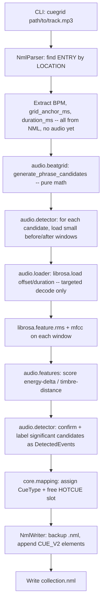

# Spec: Traktor Auto-Cue Automation

Status: Proposed v1.1 (batch processing) — architecture only, not yet implemented
Source of truth: `.openspec/1-proposal.md`

This document is the binding technical specification for the project. Per
`CLAUDE.md`, no feature should be implemented unless it is explicitly
described here. If an edge case is discovered during implementation, this
file must be updated (via a proposed diff) before code changes proceed.
All open questions from the v1 draft were resolved in sections 6 and 7.

**Revision note (v2):** the audio analysis strategy was fundamentally
changed from blind whole-track novelty detection to **Grid-Guided Phrase
Analysis** (sections 4 and 6 below). Any prior implementation of
`audio/beatgrid.py::snap_to_grid` and a whole-track `audio/detector.py`
based on `librosa.util.peak_pick` over the full novelty curve is
**superseded** by this revision and must be replaced, not extended — see
the Migration Impact note at the end of section 6.

**Revision note (v1.1, proposed):** adds **Batch Processing by Playlist
or Title** (new section 8). v1.0's single-track, exact-path-only
invocation (`cuegrid TRACK_PATH`) remains fully supported and
unchanged; batch selection via `--playlist NAME` or `--track-title TITLE`
is purely additive. This section of the document is a **proposal**:
`nml/parser.py`, `core/pipeline.py`, and `cli.py` do not yet implement
any of section 8's requirements. Do not implement v1.1 code until this
proposal is reviewed and the Status line above is updated to "Resolved".

**Revision note (v2.2, resolved):** adds **Multi-Source Validation** (new
section 10): Empty Stem Detection (falling back to the Master track when
an extracted drum stem is practically silent/ambient) and, behind a new
`--verify smart` flag, Smart Validation Gating (cross-checking each
confirmed candidate against the Master audio to classify it as
`"Drop (Rhythm)"` or `"Breakdown (Melodic)"`). Purely additive on top of
v2.0/v2.1's stem-swap (section 9); `--verify fast` (the default) matches
v2.1 behavior plus the always-on empty-stem fallback.

---

## 1. Scope

In scope (matches `1-proposal.md` requirements):

1. Parse `collection.nml` to locate a `<ENTRY>` for a given track and read
   its `BPM` (`<TEMPO>`) and grid anchor (`<CUE_V2 TYPE="4">`, a.k.a.
   `AutoGrid`).
2. **Calculate candidates first:** using only the `BPM` and grid anchor from
   step 1 (plus track duration, read directly from the NML's `<INFO>`
   element — see the `PLAYTIME_FLOAT`/`PLAYTIME` note in section 2.3),
   mathematically compute every phrase-boundary timestamp (every 16 and
   32 beats) across the track — *before* touching the audio file at all.
   See section 4.
3. **Targeted analysis only:** for each computed candidate, decode and
   analyze only a small `librosa` window immediately before/after that
   timestamp (RMS energy + MFCC timbre) — never the whole file. Compare
   the two windows and confirm a candidate as a real structural event
   only if the change is significant, then keep the most confident
   candidates across the whole track as a single, unified pool of cues
   (no position-based roles). See section 6.
4. Write the confirmed points back into the same `<ENTRY>` as new
   `<CUE_V2>` HotCue elements, without corrupting the rest of the file.
   Because every candidate was generated from Traktor's own beat math, no
   quantization/snapping step is needed at write time — the confirmed
   timestamps are already exact grid multiples.

Out of scope for v1.0 (do not implement without a spec update):

- Key detection / harmonic mixing.
- Loop (`TYPE="5"`) generation.
- Batch/parallel processing of an entire collection in one run (v1.0
  processes one track at a time, identified by its exact audio file path).
- Any GUI.

**v1.1 (proposed, section 8) narrows the batch exclusion above**: selecting
*multiple* tracks by playlist name or track title, and processing them
sequentially in one CLI invocation, is now in scope. Still out of scope
for v1.1:

- Parallel/concurrent processing of a batch (sequential only -- see
  section 8.3).
- Batch selection by any criteria other than playlist name or exact
  title (e.g. genre, key, BPM range, smart-playlist-style filters).
- Any GUI.

---

## 2. Architectural Layout

Modular Python package under `src/`, organized by responsibility so that XML
handling, audio analysis, and orchestration never live in the same module.

```
traktorco/
├── .openspec/
│   ├── 1-proposal.md
│   └── 2-spec.md
├── src/
│   └── traktorco/
│       ├── __init__.py
│       ├── cli.py                 # argparse entrypoint for the `cuegrid` CLI
│       ├── config.py              # AppConfig dataclass: paths, thresholds, defaults
│       │
│       ├── nml/
│       │   ├── __init__.py
│       │   ├── constants.py       # CueType IntEnum, NML tag/attribute name constants
│       │   ├── models.py          # TempoInfo, CuePoint, TrackEntry dataclasses
│       │   ├── parser.py          # NmlParser: load file, locate ENTRY by LOCATION, by playlist NAME (8.1), or by TITLE (8.2)
│       │   └── writer.py          # NmlWriter: merge CuePoints into ENTRY, atomic write + backup
│       │
│       ├── audio/
│       │   ├── __init__.py
│       │   ├── loader.py          # load_window(path, offset_sec, duration_sec, sr) -> (y, sr); NEVER loads a whole track
│       │   ├── beatgrid.py        # beat_length_ms(), generate_phrase_candidates() math from section 4
│       │   ├── features.py        # pure math: energy_delta_db(), timbre_distance(), confidence_score() from section 6
│       │   └── detector.py        # PhraseAnalyzer: candidates -> targeted windowed features -> scored/confirmed DetectedEvent list
│       │
│       ├── core/
│       │   ├── __init__.py
│       │   ├── pipeline.py        # process_single_entry() (shared primitive) + run_pipeline() (single-track) + run_batch_pipeline() (8.3)
│       │   └── mapping.py         # DetectedEvent.label -> CueType + HOTCUE slot assignment policy
│       │
│       └── utils/
│           ├── __init__.py
│           ├── xml_utils.py       # atomic write, .bak backup helpers
│           └── logging_utils.py   # module logger setup
│
└── tests/
    ├── fixtures/
    │   ├── sample_collection.nml    # now includes a PLAYLISTS/NODE[@NAME="prueba"] fixture (section 8)
    │   └── sample_track.wav
    ├── nml/
    │   ├── test_parser.py
    │   └── test_writer.py
    ├── audio/
    │   ├── test_beatgrid.py
    │   ├── test_features.py
    │   └── test_detector.py
    └── core/
        └── test_pipeline.py
```

> **Note on `audio.loader`:** with Grid-Guided Phrase Analysis, the full
> waveform is never decoded. Track duration comes from the NML's `<INFO>`
> element (see section 2.3), not from `librosa`, so `loader.py` only
> ever needs to decode the small windows requested by `detector.py`
> around each candidate (via `librosa.load(path, offset=..., duration=...)`,
> which seeks rather than decoding the whole file for seekable formats).
> There is intentionally no whole-file `load_audio()` function

### 2.1 Module responsibilities

| Module | Responsibility | Must NOT do |
|---|---|---|
| `nml.parser` | Read-only XML parsing (`xml.etree.ElementTree`), locate `ENTRY` by matching `LOCATION` (`DIR`+`FILE`+`VOLUME`), by playlist `NAME` (section 8.1), or by track `TITLE` (section 8.2); extract `TempoInfo` and existing `CuePoint`s | Never mutate the tree |
| `nml.writer` | Insert/replace `<CUE_V2>` children on a given `ENTRY`, serialize the whole `NML` tree back to disk atomically with a `.bak` backup of the original file | Never re-parse or re-derive cue math |
| `audio.beatgrid` | Pure math: beat length + phrase-candidate generation (section 4) from BPM/grid anchor/duration alone | Never read files or decode audio |
| `audio.loader` | Decode only a small requested window of audio (`offset`/`duration`) to a mono waveform + sample rate | Never decode/load a whole track |
| `audio.features` | Pure math: energy-delta / timbre-distance / confidence scoring on precomputed RMS + MFCC values (section 6) | Never call `librosa` directly; never read files |
| `audio.detector` | Orchestrate: for each phrase candidate, call `audio.loader` for the before/after windows, run `librosa.feature.rms`/`mfcc` on them, score via `audio.features`, confirm + label `DetectedEvent`s | Never analyze anything outside a candidate's window; never touch XML |
| `core.mapping` | Decide `CueType` + `HOTCUE` slot per detected label | Never read/write files |
| `core.pipeline` | Wires the above together for one track (`run_pipeline`, unchanged from v1.0) or a batch of tracks (`run_batch_pipeline`, section 8.3): parse/select NML entries → generate phrase candidates → targeted detection → map → write, per track, continuing past any single track's failure in batch mode | Should contain no XML- or DSP-specific logic itself; must never let one track's exception abort the rest of a batch (section 8.3) |
| `cli` | Argument parsing, logging setup, calls `core.pipeline`; enforces the mutually-exclusive track-selection flags (section 8.4) | No business logic |

### 2.2 Configuration (`config.py`)

All tunable thresholds used by `audio.beatgrid`, `audio.detector`,
`audio.features`, and `core.pipeline` live in one `AppConfig` dataclass so
they are never hard-coded inside logic modules:

```python
from dataclasses import dataclass

@dataclass
class AppConfig:
    # audio.beatgrid: phrase-candidate generation (section 4)
    phrase_beats: int = 16               # base phrase granularity, in beats (4-bar block)
    major_phrase_multiple: int = 2       # every Nth candidate is also an 8-bar (32-beat) "major" boundary

    # audio.loader: decoding a small window around each candidate
    sample_rate: int | None = None       # None = keep native sample rate
    hop_length: int = 512                # frame hop used by librosa.feature.rms/mfcc within a window

    # audio.detector: sizing the before/after analysis window, scaled in beats (not seconds)
    # so it automatically adapts to the track's tempo.
    window_beats: float = 4.0            # 1 bar of context on each side of a candidate
    mfcc_count: int = 13

    # audio.features: significance thresholds for confirming a candidate as a real event
    energy_change_threshold_db: float = 3.0        # min |delta RMS| in dB to flag an energy change
    timbre_change_distance_threshold: float = 12.0  # min Euclidean MFCC distance to flag a timbre change

    # audio.detector: unified structural-cue selection (section 6)
    max_cues: int = 8                            # cap on how many cues are written per track
    relative_confidence_threshold: float = 0.3   # keep only candidates >= this fraction of the track's max confidence

    # v2.2 Multi-Source Validation (section 10): "fast" (default) or "smart"
    verify: str = "fast"
```

Note what is deliberately **absent**: there is no whole-track peak-picking
config (`peak_pre_max`, `peak_delta`, etc.) and no `min_cue_spacing_beats`.
Both are obsolete under Grid-Guided Phrase Analysis — candidates are, by
construction, always at least `phrase_beats` apart, so minimum-spacing
de-duplication is no longer needed (see section 4). There is also no
position-based intro/outro window config — section 6 evaluates the whole
track as a single, unified pool of candidates.

### 2.3 Data structures (`nml/models.py`)

```python
from dataclasses import dataclass, field
from src.traktorco.nml.constants import CueType

@dataclass
class TempoInfo:
    bpm: float
    bpm_quality: float = 100.0

@dataclass
class CuePoint:
    name: str
    type: CueType
    start_ms: float          # milliseconds, matches NML START units
    len_ms: float = 0.0
    repeats: int = -1
    hotcue: int = -1          # -1 = not bound to a Hotcue pad; 0-7 = pad slot
    displ_order: int = 0

@dataclass
class TrackEntry:
    title: str
    artist: str
    location_path: str        # resolved absolute path used to match the audio file
    tempo: TempoInfo
    cues: list[CuePoint] = field(default_factory=list)
    grid_anchor_ms: float = 0.0   # convenience: START of the TYPE=GRID cue
    duration_ms: float = 0.0      # from <INFO>; bounds candidate generation -- see PLAYTIME_FLOAT/PLAYTIME note below
```

**`duration_ms` extraction (`nml/parser.py`):** prefer `<INFO
PLAYTIME_FLOAT="...">` (fractional seconds) when present, converting to
milliseconds via `* 1000`. Fall back to the integer-seconds `<INFO
PLAYTIME="...">` (also `* 1000`) when `PLAYTIME_FLOAT` is absent. This
fallback is required in practice, not just defensive: Traktor Pro 4 (NML
`VERSION="20"`) has been observed to omit `PLAYTIME_FLOAT` entirely and
write only integer-seconds `PLAYTIME` (confirmed against
`tests/fixtures/sample_collection.nml`). If neither attribute is present,
`duration_ms` is `0.0` and candidate generation produces at most the
anchor candidate (spec section 4.4, item 3) — never a parse error.

`audio/beatgrid.py` produces (section 4):

```python
from dataclasses import dataclass

@dataclass
class PhraseCandidate:
    beat_index: int       # offset in beats from the grid anchor; always a multiple of phrase_beats
    time_ms: float         # G + beat_index * L; already an exact grid multiple, never needs snapping
    is_major_phrase: bool  # True every major_phrase_multiple-th candidate (default: every 32 beats)
```

`audio/detector.py` produces (section 6):

```python
from dataclasses import dataclass

@dataclass
class DetectedEvent:
    label: str            # always "cue" -- see section 6; a single, unified structural cue type
    time_ms: float          # == the confirming PhraseCandidate.time_ms; already grid-exact, no snapping needed
    beat_index: int          # traceability back to the originating PhraseCandidate
    is_major_phrase: bool    # carried through from the originating PhraseCandidate
    confidence: float        # combined energy/timbre change score from audio.features, arbitrary positive scale
```

---

## 3. Traktor `<CUE_V2>` XML Structure

Traktor's `collection.nml` stores all cue points (including the automatic
beatgrid anchor) as `<CUE_V2>` children of an `<ENTRY>`. There is no bare
`<CUE>` tag in current Traktor versions — historical `CUE`/`CUE_V1` formats
predate `CUE_V2` and are not written by any supported Traktor release, so
this project targets `CUE_V2` exclusively.

### 3.1 Parent context

```xml
<ENTRY MODIFIED_DATE="2026/7/7" MODIFIED_TIME="50000" TITLE="Track Title" ARTIST="Artist Name">
  <LOCATION DIR="/:Users/:dj/:Music/:" FILE="track.mp3" VOLUME="Macintosh HD" VOLUMEID="Macintosh HD"/>
  <INFO BITRATE="320000" PLAYTIME="240" PLAYTIME_FLOAT="240.123000" IMPORT_DATE="2026/7/7" FLAGS="28" FILESIZE="9600"/>
  <TEMPO BPM="128.000000" BPM_QUALITY="100.000000"/>

  <!-- Existing grid anchor, always TYPE=4, usually HOTCUE=0 and unnamed/"AutoGrid" -->
  <CUE_V2 NAME="AutoGrid" DISPL_ORDER="0" TYPE="4" START="356.000000" LEN="0.000000" REPEATS="-1" HOTCUE="0"/>

  <!-- Cues this project adds, one per detected structural event -->
  <CUE_V2 NAME="Intro End" DISPL_ORDER="0" TYPE="0" START="16106.000000" LEN="0.000000" REPEATS="-1" HOTCUE="1"/>
  <CUE_V2 NAME="Drop"      DISPL_ORDER="0" TYPE="0" START="47950.000000" LEN="0.000000" REPEATS="-1" HOTCUE="2"/>
  <CUE_V2 NAME="Outro"     DISPL_ORDER="0" TYPE="0" START="210375.000000" LEN="0.000000" REPEATS="-1" HOTCUE="3"/>
</ENTRY>
```

### 3.2 Attribute reference

| Attribute | Type | Units / Notes |
|---|---|---|
| `NAME` | string | Free text label shown in Traktor's cue list. `"AutoGrid"` is reserved for the grid anchor. |
| `DISPL_ORDER` | int | Display ordering hint. Write `0` unless reordering is required. |
| `TYPE` | int (enum) | See `CueType` below. |
| `START` | float | **Milliseconds** from the start of the audio file. This is the value the phrase-candidate formula in section 4 produces directly — no separate snapping step. |
| `LEN` | float | Milliseconds. `0.0` for point cues (all cues this project writes are point cues, not loops). |
| `REPEATS` | int | `-1` for point cues. Only meaningful for `TYPE=5` (Loop). |
| `HOTCUE` | int | Hotcue pad index the cue is bound to, `0`–`7`. `-1` if not bound to a pad. Traktor supports 8 hotcue slots per deck. |

### 3.3 `CueType` enum (`nml/constants.py`)

Reverse-engineered and confirmed against Traktor's binary `TRAKTOR4` cue
metadata (identical enum is reused in the XML `TYPE` attribute):

```python
from enum import IntEnum

class CueType(IntEnum):
    CUE = 0        # Standard Cue Point / HotCue
    FADE_IN = 1
    FADE_OUT = 2
    LOAD = 3
    GRID = 4       # Beatgrid anchor, NAME="AutoGrid"
    LOOP = 5
```

This project only ever writes `CueType.CUE` (`0`). `CueType.GRID` is
read-only input (used to get `grid_anchor_ms`); it must never be created,
duplicated, or overwritten by the writer.

### 3.4 Writer constraints

- The `AutoGrid` (`TYPE=4`) cue must be preserved byte-for-byte; when
  `clear_existing=False` (the default), the writer only *appends* new
  `TYPE=0` `<CUE_V2>` elements to `ENTRY`, it never removes or reorders
  existing children.
- When `clear_existing=True` (the `--clear-existing` CLI flag), all
  existing standard HotCues (`TYPE=0`) are removed from the entry before
  appending new ones. **Grid markers** (`TYPE=4`, `AutoGrid`) and **Load
  markers** (`TYPE=3`) are never removed — only standard HotCues are
  purged, so the user's beatgrid remains perfectly intact regardless of
  this flag.
- `HOTCUE` slots already in use (read from the existing `CUE_V2` list) must
  not be overwritten. `core.mapping` assigns the lowest free slot in
  `0..7`; if all 8 slots are taken, the event is skipped and logged as a
  warning — never dropped silently, never crashes the run.
- All numeric attributes are serialized with 6 decimal places
  (`f"{value:.6f}"`) to match Traktor's own formatting and avoid diffs that
  make the whole file appear changed under version control.
- Before writing, copy the original file to `<name>.nml.bak` if a backup
  for this run does not already exist.

---

## 4. Grid-Guided Phrase Candidate Generation

**This is the load-bearing change in v2.** Instead of detecting arbitrary
timestamps in the audio and then correcting ("snapping") them onto the
grid after the fact, this project now computes every plausible cue
location directly from Traktor's own BPM and grid data *before* touching
the audio file. Dance-music arrangement changes (drops, breaks,
intro/outro boundaries) overwhelmingly land on musical phrase boundaries —
4-bar (16-beat) or 8-bar (32-beat) blocks — so those are the only
timestamps ever considered. There is no free-running novelty search over
the whole track, and consequently **no quantization/snapping step is
needed**: every candidate is, by construction, an exact grid multiple.

### 4.1 Inputs

- `BPM`: from `<TEMPO BPM="...">` on the matched `ENTRY`.
- `G`: the grid anchor, in **milliseconds**, taken from the `START`
  attribute of the `<CUE_V2 TYPE="4">` (`AutoGrid`) element. This is the
  timestamp of beat 0 on Traktor's grid — it is typically a small offset
  near the top of the track, not necessarily `0`.
- `D`: the track duration, in **milliseconds**, taken from the `<INFO>`
  element per the `PLAYTIME_FLOAT`/`PLAYTIME` extraction rule in section
  2.3. This bounds candidate generation and is read directly from the
  NML — `librosa`/audio decoding is not needed to determine it.
- `P`: `AppConfig.phrase_beats` (default `16`) — the base phrase
  granularity, in beats.
- `M`: `AppConfig.major_phrase_multiple` (default `2`) — every `M`-th
  candidate is additionally tagged as a "major" (8-bar / 32-beat) phrase
  boundary.

### 4.2 Beat length

Traktor's grid is a fixed-tempo grid anchored at `G`. The duration of one
beat in milliseconds is:

```
L = 60000 / BPM
```

### 4.3 Candidate generation formula

Enumerate every phrase boundary from the anchor to the end of the track,
in beat-index steps of `P`:

```
for n = 0, 1, 2, ...:
    beat_index = n * P
    t_ms        = G + beat_index * L

    if t_ms > D:
        stop                                   # past the end of the track

    is_major_phrase = (n % M == 0)             # every M-th candidate is also a 32-beat boundary

    emit PhraseCandidate(beat_index, t_ms, is_major_phrase)
```

Equivalently, as a closed-form expression for the `n`-th candidate:

```
t_ms(n) = G + n * P * L,   for n = 0, 1, 2, ... while t_ms(n) <= D
```

With the defaults (`P=16`, `M=2`), this produces a candidate every 16
beats (4 bars), with every other one (`n` even) additionally marking a
32-beat (8-bar) boundary — the two granularities named in the brief are
both covered by a single generator, since 32 is a multiple of 16.

Because every `t_ms(n)` is already `G + k*L` for an integer `k`, it is
trivially and exactly grid-aligned — this is the same form as a snapped
timestamp would have taken in v1, but produced generatively instead of
correctively.

### 4.4 Post-conditions / edge cases

1. **Pre-anchor region:** candidate generation starts at `n = 0`
   (`t_ms = G`), so there are never negative-time candidates — unlike v1's
   corrective snapping, there is nothing before the anchor to consider.
2. **Zero/undefined BPM:** if `BPM <= 0` or is missing, candidate
   generation must be skipped entirely for that track (no candidates, no
   division by zero), and a warning logged. `core.pipeline` must treat
   this the same as "zero confirmed events" — it is not a fatal error.
3. **Duration missing/zero:** if `D <= 0` (e.g. malformed or entirely
   absent `PLAYTIME_FLOAT`/`PLAYTIME` — see the extraction rule in section
   2.3), generation stops immediately after `n = 0`, producing at most one
   candidate (the anchor itself). Log a warning; do not raise.
4. **No de-duplication needed:** any two candidates are at least `P` beats
   (`P * L` ms) apart by construction. This structurally satisfies what
   v1's `min_cue_spacing_beats` post-hoc de-duplication pass existed to
   guarantee, so that pass has been removed (see section 2.2).

### 4.5 Reference implementation shape (`audio/beatgrid.py`)

```python
from dataclasses import dataclass


def beat_length_ms(bpm: float) -> float:
    if bpm <= 0:
        raise ValueError("BPM must be positive")
    return 60000.0 / bpm


@dataclass
class PhraseCandidate:
    beat_index: int
    time_ms: float
    is_major_phrase: bool


def generate_phrase_candidates(
    bpm: float,
    grid_anchor_ms: float,
    duration_ms: float,
    phrase_beats: int = 16,
    major_phrase_multiple: int = 2,
) -> list[PhraseCandidate]:
    if bpm <= 0 or duration_ms <= 0:
        return []

    length_ms = beat_length_ms(bpm)
    candidates = []
    n = 0
    while True:
        beat_index = n * phrase_beats
        t_ms = grid_anchor_ms + beat_index * length_ms
        if t_ms > duration_ms:
            break
        candidates.append(
            PhraseCandidate(
                beat_index=beat_index,
                time_ms=t_ms,
                is_major_phrase=(n % major_phrase_multiple == 0),
            )
        )
        n += 1
    return candidates
```

`audio.detector` (section 6) consumes this list directly; `core.pipeline`
no longer performs any post-hoc snapping or spacing de-duplication, since
both are now structural guarantees of this generator.

---

## 5. Pipeline Flow



---

## 6. Grid-Guided Phrase Analysis (`audio/detector.py`, `audio/features.py`)

**Decision:** replace whole-track novelty-curve peak-picking (v1) with
**targeted, phrase-boundary-only analysis**: `librosa` is never run across
the full waveform. It only ever inspects a handful of short windows, one
per `PhraseCandidate` produced by section 4.

**Rationale:**

- **DJ-centric accuracy:** arrangement changes in club-oriented electronic
  music are overwhelmingly aligned to 4-bar/8-bar phrases. A loudness or
  timbre change that does *not* land on a phrase boundary is very unlikely
  to be an intentional structural cue point, so searching for it anywhere
  else in the track is wasted work and a source of false positives.
- **CPU efficiency:** v1's approach ran `onset_strength` and `rms` across
  every frame of the entire track (`O(track_length)`). v2 only decodes and
  analyzes `2 * len(candidates)` short windows of `window_beats` each —
  for a 4-minute track at 128 BPM that's roughly 60 candidates × 2 windows
  × ~1.9s, versus decoding and processing the full 240s waveform. This is
  a substantial reduction in both I/O (via seek-based partial decode) and
  DSP compute.
- **No quantization needed:** every candidate's timestamp already came
  from section 4's grid math, so a confirmed `DetectedEvent` is written
  with that exact timestamp — there is nothing left to snap.

### 6.1 Algorithm

**Revision note (v1.4):** field testing showed that the position-based
`intro_end`/`drop`/`outro_start` roles produced cues near fade-outs and
other low-energy tail material simply because a candidate happened to
fall inside the configured intro/outro search window, regardless of
whether it was musically meaningful. This revision **removes all
position-based roles and search windows** in favor of a single, unified
structural-cue pool: every significant candidate across the *entire*
track competes on confidence alone, with an explicit anti-silence guard
so fade-outs can never be selected.

1. **Get candidates:** call
   `audio.beatgrid.generate_phrase_candidates(bpm, grid_anchor_ms, duration_ms, config.phrase_beats, config.major_phrase_multiple)`
   (section 4). This requires no audio decoding at all.
2. **Size the analysis window:** compute `window_ms = config.window_beats * beat_length_ms(bpm)`
   (default 4 beats — one bar — so the window automatically scales with
   tempo instead of using a fixed number of seconds).
3. **For each candidate**, decode exactly two short windows via
   `audio.loader.load_window`:
   - `before = load_window(path, offset_sec=(candidate.time_ms - window_ms) / 1000, duration_sec=window_ms / 1000, sr=config.sample_rate)`
   - `after  = load_window(path, offset_sec=candidate.time_ms / 1000, duration_sec=window_ms / 1000, sr=config.sample_rate)`
   - If `before`'s offset would be negative (candidate is within the first
     `window_ms` of the track, i.e. `n = 0`), skip the `before` window
     entirely; this candidate cannot be scored (there is no evidence to
     evaluate; see step 5) and is dropped from the pool. Do not clamp the
     offset to `0`, which would shrink and bias the window.
   - If `after`'s window would run past `duration_ms`, truncate its
     `duration_sec` to what remains, rather than skipping it.
4. **Extract features** on each decoded window with `librosa`:
   - `rms = librosa.feature.rms(y=window, hop_length=config.hop_length)[0].mean()`
   - `mfcc = librosa.feature.mfcc(y=window, sr=sr, n_mfcc=config.mfcc_count).mean(axis=1)`
5. **Score the candidate** using `audio.features` (pure math, no `librosa`
   dependency, so it is independently unit-testable):
   - `energy_delta_db = 20 * log10(max(rms_after, eps) / max(rms_before, eps))`
   - `timbre_distance = euclidean(mfcc_after, mfcc_before)`
   - `confidence = abs(energy_delta_db) / config.energy_change_threshold_db + timbre_distance / config.timbre_change_distance_threshold`
   - `is_significant = abs(energy_delta_db) >= config.energy_change_threshold_db or timbre_distance >= config.timbre_change_distance_threshold`
   - **Anti-silence filter (critical):** regardless of the above, a
     candidate is never significant if its `after` window is
     practically silent — either its `rms_after` is at or below a
     negligible absolute floor, or `rms_after` is extremely low relative
     to the track's average energy (e.g. `rms_after < eps` or
     `rms_after` far below the mean RMS observed across all candidates'
     `after` windows). This is what prevents a phrase boundary that sits
     inside a fade-out from ever being scored as significant, even if
     the energy *ratio* looks large on paper (a quiet-to-near-silent
     transition can otherwise look like a big negative `energy_delta_db`).
6. **Select the unified cue pool** (position is irrelevant; only
   evidence and confidence matter):
   - Start from every candidate with `is_significant = True` (which, per
     step 5, already excludes anything landing in near-silence).
   - **Dynamic confidence threshold:** find
     `max_confidence = max(c.confidence for c in significant_candidates)`
     across the whole track, then discard any candidate whose
     `confidence < max_confidence * config.relative_confidence_threshold`.
     This keeps the cue set proportional to how dramatic the track's
     *strongest* change is, rather than a fixed absolute cutoff.
   - Rank the survivors by `confidence` descending (ties broken in favor
     of `is_major_phrase` candidates) and keep the top `config.max_cues`.
   - Sort the kept candidates by `time_ms`/`beat_index` ascending for the
     final output — ranking-by-confidence only decides *which* candidates
     survive, not their output order.
   - If no candidate is significant, the result is an empty list — a
     valid, silent outcome, not an error. There is no fallback to
     non-significant candidates.
7. **Output:** the flat, chronologically ordered list of `DetectedEvent`,
   each carrying `time_ms = candidate.time_ms` verbatim and
   `label = "cue"` (a single, unified label — there are no more
   position-based roles). `core.pipeline` passes this straight to
   `core.mapping` — there is no snapping or de-duplication pass after
   this point.

This keeps `audio.detector` an orchestrator over `audio.loader` +
`librosa.feature.*` + `audio.features`, and keeps `audio.features` a pure
function of scalar/vector inputs (`(rms_before, rms_after, mfcc_before,
mfcc_after, config) -> (energy_delta_db, timbre_distance, confidence,
is_significant)`) with no `librosa` or file-I/O dependency, consistent
with the module boundaries in section 2.1.

### 6.2 Migration impact on existing code

`src/traktorco/audio/beatgrid.py` currently implements v1's
`snap_to_grid(t_raw_sec, bpm, grid_anchor_ms)` and its test suite
(`tests/audio/test_beatgrid.py`). Under this revision:

- `beat_length_ms` is unchanged and must be kept.
- `snap_to_grid` is **obsolete** and must be **removed**, replaced by
  `generate_phrase_candidates` and the `PhraseCandidate` dataclass from
  section 4.5.
- The existing `test_beatgrid.py` tests for `snap_to_grid` must be removed
  and replaced with tests for `generate_phrase_candidates` (candidate
  count/spacing, `is_major_phrase` tagging, zero/negative BPM and
  zero-duration edge cases from section 4.4).

**Revision note (v1.4) migration impact:** the previous revision of this
section assigned `intro_end`/`drop`/`outro_start` labels via
`config.intro_search_fraction`, `config.outro_search_fraction`, and
`config.max_drop_cues`. All three are now **obsolete and removed**:

- `AppConfig.intro_search_fraction` and `AppConfig.outro_search_fraction`
  are **removed** — there are no more position-based search windows.
- `AppConfig.max_drop_cues` is **renamed** to `AppConfig.max_cues`
  (default changed from `3` to `8`) and now caps the single unified cue
  pool, not just "drop"-like candidates.
- A new `AppConfig.relative_confidence_threshold` (default `0.3`) drives
  the dynamic confidence cutoff in step 6 above.
- `DetectedEvent.label` is now always the literal string `"cue"` — the
  `"intro_end"`/`"drop"`/`"outro_start"` label values, `core.mapping`'s
  `_LABEL_TO_NAME` lookup for them, and any CLI/README text describing
  those roles must be updated accordingly.

---

## 7. NML `LOCATION` Matching & Path Normalization (`nml/parser.py`)

### 7.1 How Traktor stores `LOCATION`

```xml
<LOCATION DIR="/:Users/:dj/:Music/:" FILE="track.mp3" VOLUME="C:" VOLUMEID="..."/>
```

- `DIR`: path segments joined by the literal two-character separator `/:`,
  with a leading and trailing `/:`. Never contains a drive letter or
  volume name — that lives in `VOLUME`.
- `VOLUME`: on Windows this is a drive letter with colon, e.g. `"C:"`
  (confirmed against Native Instruments' own documented default paths,
  e.g. `C: > Users > ... > Documents > Native Instruments`). On macOS it
  is a mounted volume name, e.g. `"Macintosh HD"`. `VOLUMEID` is an
  internal Traktor volume identifier and is not needed for path
  reconstruction.
- `FILE`: bare filename, no path separators.

### 7.2 Normalization function

`nml/parser.py` implements a one-directional converter, since this project
only ever reads existing `LOCATION`s (it never creates new `ENTRY`
elements):

```python
import re
from pathlib import PureWindowsPath, PurePosixPath

_WINDOWS_VOLUME_RE = re.compile(r"^[A-Za-z]:$")

def nml_location_to_path(volume: str, dir_: str, file_: str) -> str:
    """Reconstruct a normalized, comparable path string from a LOCATION.

    Returns a string with forward slashes and normalized casing (via
    os.path.normcase equivalent), NOT a resolved filesystem path — the
    referenced volume may not be mounted on the machine running this tool.
    """
    segments = [s for s in dir_.split("/:") if s]
    if _WINDOWS_VOLUME_RE.match(volume):
        raw = str(PureWindowsPath(volume + "\\", *segments, file_))
    else:
        # macOS-style volume name; best-effort only, not required to
        # resolve on a Windows machine running this tool.
        raw = str(PurePosixPath("/Volumes", volume, *segments, file_))
    return raw.replace("\\", "/").casefold()
```

### 7.3 Matching strategy (`NmlParser.find_entry`)

1. Take the user-supplied audio file path from the CLI, resolve it to an
   absolute path with `pathlib.Path(user_path).resolve()`.
2. Normalize that resolved path the same way as `nml_location_to_path`'s
   output (forward slashes, `casefold()`) so the two sides are comparable
   without requiring the NML-referenced file to exist on this machine's
   currently mounted volumes.
3. For every `ENTRY` in the collection, compute
   `nml_location_to_path(entry.VOLUME, entry.DIR, entry.FILE)` and compare
   it to the normalized user path.
4. **Zero matches:** raise `TrackNotFoundError`, including the normalized
   path that was searched for, so a volume-letter/name mismatch (e.g. the
   collection was cataloged on a different drive letter) is easy to
   diagnose.
5. **Exactly one match:** proceed with that `ENTRY`.
6. **More than one match** (duplicate `LOCATION`s in the collection, which
   Traktor itself normally prevents but can occur in edited/merged
   collections): raise `AmbiguousTrackError`. Resolving ambiguity via
   `--title`/`--artist` CLI filters is required behavior for `cli.py`, not
   new scope — it directly serves requirement 1 in `1-proposal.md`
   ("read `collection.nml` to fetch the BPM and Grid Marker" implies
   finding exactly one matching entry).

This strategy deliberately avoids resolving the NML-derived path against
the filesystem (step 2 only resolves the *user-supplied* path). The NML
path is used purely as a normalized string key for comparison.

---

## 8. Batch Processing by Playlist or Title (Resolved, v1.1)

> **Status: implemented.** Batch processing is fully implemented across
> `nml/parser.py` (playlist and title resolution functions with proper
> error handling), `nml/writer.py` (write_cues_to_element primitive),
> `core/pipeline.py` (run_batch_pipeline with broad exception handling),
> and `cli.py` (mutually exclusive track-selection argument group).
> Comprehensive test coverage added for all batch paths including the
> missing-BPM and audio-analysis-failure skip cases.

**Motivation:** v1.0 requires an exact, single audio file path per
invocation. This is fine for one-off use but tedious for preparing many
tracks at once. v1.1 adds two additional ways to *select* which
track(s) to process — by Traktor playlist name, or by track title — while
leaving the entire detection/mapping/writing pipeline (sections 3-6)
completely unchanged. Batch processing is purely a new **selection**
layer in front of the existing single-track pipeline.

### 8.1 Resolving entries by playlist `NAME` (`nml.parser`)

Traktor stores playlists under `<NML><PLAYLISTS>` as an arbitrarily
nested tree of `<NODE TYPE="FOLDER">` and `<NODE TYPE="PLAYLIST">`
elements. A `TYPE="PLAYLIST"` node contains a `<PLAYLIST>` element whose
children are `<ENTRY><PRIMARYKEY TYPE="TRACK" KEY="..."/></ENTRY>`, one
per track, in playlist order:

```xml
<PLAYLISTS><NODE TYPE="FOLDER" NAME="$ROOT"><SUBNODES COUNT="1">
  <NODE TYPE="PLAYLIST" NAME="My IDM Breaks">
    <PLAYLIST ENTRIES="2" TYPE="LIST" UUID="...">
      <ENTRY><PRIMARYKEY TYPE="TRACK" KEY="C:/:Users/:dj/:Music/:Tidal/:Track One.flac"></PRIMARYKEY></ENTRY>
      <ENTRY><PRIMARYKEY TYPE="TRACK" KEY="C:/:Users/:dj/:Music/:Tidal/:Track Two.flac"></PRIMARYKEY></ENTRY>
    </PLAYLIST>
  </NODE>
</SUBNODES></NODE></PLAYLISTS>
```

See `tests/fixtures/sample_collection.nml`'s `NODE[@NAME="prueba"]` for a
real, checked-in example of this exact shape.

#### 8.1.1 `PRIMARYKEY`'s `KEY` format

The `KEY` attribute encodes the same volume/directory/filename
information as a `<LOCATION>` element (section 7.1), but as a **single
string** using the same `/:` separator throughout, with the volume as
the first segment and the filename as the last:

```
C:/:Users/:dj/:Music/:Tidal/:Track One.flac
     │      │    │     │       └ filename (last segment)
     └──────┴────┴─────┴─────── directory segments (middle)
volume (first segment, e.g. "C:" on Windows, a mounted volume name on macOS)
```

This must **not** be parsed independently of `nml_location_to_path`
(section 7.2) — it must be decomposed into the same `(volume, dir_,
file_)` shape and passed straight through that existing function, so
normalization/casefolding behavior is identical and never duplicated:

```python
def primary_key_to_normalized_path(key: str) -> str:
    """Convert a <PRIMARYKEY> KEY into the same normalized path string
    that nml_location_to_path() produces for a <LOCATION>, by splitting
    on the shared "/:" separator and reusing that function directly.
    """
    segments = key.split("/:")
    volume, *dir_segments, file_ = segments
    dir_ = "/:" + "/:".join(dir_segments) + "/:"
    return nml_location_to_path(volume, dir_, file_)
```

#### 8.1.2 Finding the playlist `NODE`

Playlist folders can nest to arbitrary depth, so the search must recurse
the whole `<PLAYLISTS>` subtree (e.g. via `ElementTree.iter("NODE")`
filtered to `@TYPE="PLAYLIST"`), not assume a fixed depth:

1. Find every `<NODE TYPE="PLAYLIST">` anywhere under `<PLAYLISTS>` whose
   `NAME` attribute case-sensitively equals the requested playlist name
   (Traktor playlist names are user-authored free text; unlike
   `--title`/`--artist` filters in section 7.3, an exact, case-sensitive
   match is used here since playlist names are far less likely to have
   inconsistent casing than track metadata, and silently matching
   "My Breaks" to a differently-cased, unrelated playlist would be
   surprising).
2. **Zero matches:** raise `PlaylistNotFoundError`, naming the playlist
   searched for.
3. **More than one match:** raise `AmbiguousPlaylistError` (Traktor does
   permit two playlists with the same name in different folders) --
   there is no folder-path disambiguation flag in v1.1; the user must
   rename one of the playlists in Traktor. This mirrors
   `AmbiguousTrackError`'s fail-clearly philosophy rather than guessing.
4. **Exactly one match:** proceed with that `<PLAYLIST>`'s children.

#### 8.1.3 Mapping `PRIMARYKEY` entries to `<COLLECTION><ENTRY>` nodes

For each `<ENTRY><PRIMARYKEY TYPE="TRACK" KEY="..."/></ENTRY>` under the
matched `<PLAYLIST>`, in playlist order:

1. Skip any `PRIMARYKEY` whose `TYPE` is not `"TRACK"` (defensive; all
   observed playlist entries are `TRACK`-typed, but this must not crash
   on an unexpected type).
2. Compute `primary_key_to_normalized_path(key)`.
3. Compare it against every `<COLLECTION><ENTRY>`'s
   `nml_location_to_path(...)` value -- i.e. the exact same comparison
   `NmlParser._find_matching_elements` already performs for a
   user-supplied path (section 7.3), just with the playlist-derived path
   as the target instead of a CLI argument. No new matching logic is
   introduced; this reuses that method verbatim.
4. **No matching `<COLLECTION><ENTRY>`** (a stale playlist reference to a
   track no longer in the collection): skip this track, log a warning
   naming the unresolved `KEY`, and continue with the rest of the
   playlist. This must never raise -- a single stale reference must not
   prevent processing the rest of the playlist.
5. **Ambiguous match** (the same defensive case as section 7.3 step 6,
   here with no `--title`/`--artist` filters available since the track
   was selected via playlist, not by hand): skip this track, log a
   warning, and continue. Batch mode never blocks on a single track's
   disambiguation.

#### 8.1.4 Return shape

```python
@dataclass
class BatchTrackRef:
    """One track resolved for batch processing: its parsed data, plus
    the live <ENTRY> Element it came from, so core.pipeline/nml.writer
    never need to re-match it by path (spec section 8.3).
    """
    entry: TrackEntry
    element: ET.Element

def find_entries_by_playlist(self, playlist_name: str) -> list[BatchTrackRef]:
    """Resolve every track in the named playlist to a BatchTrackRef,
    in playlist order, per section 8.1. Raises PlaylistNotFoundError /
    AmbiguousPlaylistError for the playlist lookup itself (section
    8.1.2); per-track resolution failures are skipped with a warning,
    never raised (section 8.1.3, steps 4-5).
    """
```

### 8.2 Resolving entries by `TITLE` (`nml.parser`)

Unlike section 7.3's `find_entry` (which resolves *one* specific,
already-known track by path), `--track-title` is a batch selector in its
own right: **every** `<COLLECTION><ENTRY>` whose `TITLE` matches is
selected and processed, not just a single one. This intentionally
supports the common case of multiple mixes/edits/remixes sharing a title.

```python
def find_entries_by_title(
    self, title: str, artist: str | None = None
) -> list[BatchTrackRef]:
    """Resolve every <ENTRY> whose TITLE matches (case-insensitive exact
    match, reusing the same comparison as the --title/--artist filters
    in section 7.3's _filter_by_title_artist), optionally further
    narrowed by artist (same semantics). In playlist mode there's a
    NODE to anchor the search; here the search is simply every ENTRY
    directly under <COLLECTION>.

    Raises:
        TrackNotFoundError: if zero ENTRYs match. An empty batch is
            still a real, actionable error -- not a silent no-op.
    """
```

Matching reuses `NmlParser._filter_by_title_artist` unchanged (it is
already a pure function of a list of candidate elements plus optional
`title`/`artist` strings -- section 7.3's disambiguation filters and this
batch selector are literally the same comparison, just applied to "all
ENTRYs" instead of "the handful of ENTRYs that already matched a path").

### 8.3 `core.pipeline` batch handling

`core.pipeline` gains `run_batch_pipeline`, alongside the existing,
unmodified `run_pipeline` (v1.0, single track by path):

```python
@dataclass
class BatchTrackResult:
    entry: TrackEntry
    detected_events: list[DetectedEvent] | None  # None if this track was skipped
    written_cues: list[CuePoint]                  # empty if skipped or nothing confirmed
    error: str | None                              # None on success, else a human-readable reason

@dataclass
class BatchResult:
    results: list[BatchTrackResult]

    @property
    def succeeded_count(self) -> int: ...
    @property
    def skipped_count(self) -> int: ...

def run_batch_pipeline(
    nml_path: str | Path,
    config: AppConfig | None = None,
    playlist: str | None = None,
    track_title: str | None = None,
    artist: str | None = None,
) -> BatchResult:
    """Exactly one of `playlist`/`track_title` must be given (ValueError
    otherwise -- a pre-flight validation error, not a per-track one).
    Resolves the batch via NmlParser.find_entries_by_playlist or
    find_entries_by_title, then processes each resolved BatchTrackRef
    SEQUENTIALLY (never in parallel -- explicitly out of scope, section
    1), writing each track's cues to disk immediately after that track
    succeeds (not batched into one final write -- see rationale below).
    """
```

**Per-track processing steps, run for every `BatchTrackRef` in order:**

1. **BPM guard:** if `entry.tempo.bpm <= 0` (missing/invalid `TEMPO`),
   skip immediately -- do not attempt detection at all. Record a
   `BatchTrackResult` with `detected_events=None`,
   `error="missing or invalid BPM"`. This directly satisfies the
   requirement to gracefully skip tracks that "lack a BPM."
2. **Detection, broadly guarded:** call `detect_events(...)` (section 6)
   inside a `try/except Exception`. Audio analysis is the one step
   touching the filesystem/decoding third-party audio data for a track
   the user did not hand-verify (unlike v1.0's single-track mode, where
   the user supplied an exact, presumably-valid path), so *any* failure
   here -- missing file, unsupported/corrupt codec, a `librosa`/`numpy`
   exception, a decode timeout, etc. -- must be caught, logged with the
   track's artist/title for identification, and recorded as a skipped
   `BatchTrackResult` (`error=str(exception)`). This is the requirement
   to gracefully skip tracks that "fail audio analysis."
3. **Map + write, per track:** on successful detection, `core.mapping`
   runs exactly as in `run_pipeline` (section 3.4's slot policy is
   unchanged and is inherently per-`ENTRY`, so there is no cross-track
   slot interaction to worry about in a batch). If there are cues to
   write, call a new writer entry point that appends directly to the
   already-known `BatchTrackRef.element` --
   `NmlWriter.write_cues_to_element(entry_el, cues)` -- **skipping** the
   path-based re-matching that `write_cues` performs in v1.0, since
   batch mode already holds the exact `Element` from section 8.1/8.2 and
   re-deriving it by path would violate `nml.writer`'s "never re-parse or
   re-derive" constraint (section 2.1) and re-introduce the very
   ambiguity/stale-path risk section 8.1.3 already resolved once.
   `write_cues` (the v1.0, path-based entry point) is refactored to
   locate the element and then call this same shared primitive --
   no cue-serialization logic is duplicated between the two call paths.
4. **Write immediately, not batched:** each successfully-processed
   track's cues are written to disk (via the existing atomic
   write-temp-then-replace, section 3.4) **before moving on to the next
   track**, rather than accumulating every track's changes in memory and
   writing once at the end of the whole batch. Rationale: audio analysis
   is the expensive step; if the process is interrupted partway through
   a large batch (crash, Ctrl-C, power loss), already-analyzed tracks'
   cues must not be lost. The existing "don't overwrite an existing
   `.bak`" rule (section 3.4) already makes repeated per-track writes
   within one run cheap and correct -- only the *first* write of the
   whole run creates the backup.
5. Append this track's `BatchTrackResult` (success or skip) to the
   batch's results and continue to the next `BatchTrackRef`
   unconditionally -- **no exception from any single track's processing
   may propagate out of `run_batch_pipeline`**.

`cli.py` (section 8.4) is responsible for summarizing `BatchResult` for
the user (e.g. "Processed 8/10 tracks, 2 skipped: ..."), not for any of
the skip/continue logic itself.

**Known constraint (inherited from section 7.2, now unavoidable for
batch mode):** unlike `run_pipeline`, batch-selected tracks have no
user-supplied literal file path to fall back on -- `detect_events` is
given the *reconstructed* path from `nml_location_to_path`/
`primary_key_to_normalized_path`. Section 7.2 already documents this
reconstruction as best-effort on non-Windows platforms; batch mode simply
has no alternative path available. If the reconstructed path cannot be
opened (wrong drive letter, unmounted volume, moved file), that track's
detection step fails and is skipped per step 2 above -- it does not abort
the batch.

### 8.4 `cli.py`: mutually exclusive track-selection flags

`cli.py` gains a **mutually exclusive** argument group (e.g.
`argparse.ArgumentParser.add_mutually_exclusive_group(required=True)`)
for track selection, replacing the current single required positional
`track_path` with exactly one of three ways to select track(s):

```
cuegrid TRACK_PATH        [--nml ...] [--title ...] [--artist ...] [tuning flags...]
cuegrid --track-title TITLE [--artist ARTIST] [--nml ...] [tuning flags...]
cuegrid --playlist NAME     [--nml ...] [tuning flags...]
```

- `TRACK_PATH` (positional, optional in the group): v1.0's existing
  single-track-by-path mode, unchanged. Calls `run_pipeline`.
- `--track-title TITLE`: batch mode, selects every `ENTRY` matching
  `TITLE` (optionally narrowed by `--artist`, which remains valid
  alongside `--track-title` since it's a *refinement* of the title
  search, not a competing selector). Calls `run_batch_pipeline(...,
  track_title=TITLE, artist=ARTIST)`.
- `--playlist NAME`: batch mode, selects every track in the named
  playlist, in playlist order. Calls `run_batch_pipeline(..., playlist=NAME)`.
  `--title`/`--artist` are **not** accepted together with `--playlist`
  (a playlist's membership is unambiguous by construction -- section
  8.1's `AmbiguousPlaylistError` is about the *playlist name* colliding,
  not about which tracks are in it) -- `argparse` must reject this
  combination with a clear usage error, not silently ignore the extra
  flags.
- Supplying more than one of `TRACK_PATH`/`--track-title`/`--playlist`
  is a usage error (`argparse`'s mutually-exclusive group produces this
  automatically); supplying none of them is also a usage error (the
  group is `required=True`).

All existing tuning flags (`--phrase-beats`, `--energy-threshold`, etc.,
section 2.2) and `--nml` (including auto-discovery) apply identically in
both single-track and batch modes -- one `AppConfig` is built from the
CLI args exactly as in v1.0 and passed through to whichever pipeline
function is invoked.

`--clear-existing` (boolean, default `False`) is a non-tuning flag that
applies identically in both modes. When set, existing standard HotCues
(`TYPE="0"`) are removed from each matched `ENTRY` before new cues are
written, so all 8 HOTCUE slots are free to reuse. **Grid markers**
(`TYPE="4"`, `AutoGrid`) and **Load markers** (`TYPE="3"`) are
**never** removed under any circumstances — the user's beatgrid remains
perfectly intact. See section 3.4 for the writer-level safety
constraints.

Output for batch mode prints one summary line per track (status,
artist/title, event count or skip reason) followed by a final tally, e.g.:

```
[ok]      Machinedrum - NO 1 KNEW              5 event(s), 5 cue(s) written
[skipped] James Blake, Dave - Doesn't Just Happen   missing or invalid BPM
Processed 1/2 tracks (1 skipped)
```

### 8.5 Fixture updates already made in support of this proposal

`tests/fixtures/sample_collection.nml` has already been updated (ahead of
any code change, purely as test-data groundwork) to include:

- A second `<COLLECTION><ENTRY>` ("James Blake, Dave - Doesn't Just
  Happen", 60 BPM) alongside the original "Machinedrum - NO 1 KNEW", so
  batch tests have more than one real track to iterate over. Note this
  second entry has `TEMPO BPM="60.000179"` -- a real, valid BPM, so a
  distinct fixture (or a targeted mutation of a parsed copy) will still
  be needed to test the "skip on missing BPM" path in section 8.3, step
  1.
- A `<PLAYLISTS>` tree containing `<NODE TYPE="PLAYLIST" NAME="prueba">`
  referencing both tracks via `<PRIMARYKEY>` `KEY`s, matching the format
  described in section 8.1.1 exactly.

---

## 9. Native Stem Integration (v2.0)

Traktor Pro 4 can generate "native stems" for a track: an isolated
Drums/Bass/Vocals/Melody decomposition, stored as a sidecar
`.stem.mp4` file alongside `collection.nml`, under a hashed
`Stems/<shard>/<basename>.stem.mp4` path derived from the track's
`AUDIO_ID`. When available, analyzing only the isolated Drums/Rhythm
stream gives `audio.detector` a much cleaner energy/timbre signal than
the full mix, without changing any detection math.

### 9.1 Detecting stem availability: the `FLAGS` bitmask

`<ENTRY><INFO FLAGS="...">` is an undocumented bitfield. Comparing a
known stemmed track (`FLAGS="76"`) against otherwise-similar tracks
without a stem (`FLAGS="12"`) isolates the difference to bit `0x40`
(`76 - 12 == 64`). `nml.stems.has_stem_flag(flags)` tests this bit
rather than the literal value `76`, so it still works alongside
whatever other independent flag bits Traktor sets. `nml.models.TrackEntry`
gains two new fields to support this and path prediction:

```python
@dataclass
class TrackEntry:
    ...
    audio_id: str | None = None  # from <ENTRY AUDIO_ID="...">
    flags: int | None = None     # from <INFO FLAGS="...">
```

`nml.parser._entry_from_element` extracts both: `audio_id` directly
from the `<ENTRY>` element's own attribute, `flags` from `<INFO
FLAGS="...">` (parsed as `int`). Both are `None` when absent, never a
parse error.

### 9.2 Path prediction (`nml/stems.py`)

Given a 256-byte `TrackID` (Traktor's own binary track identity, stored
base64-encoded as `AUDIO_ID`), Traktor computes the sidecar's shard
folder and basename with a non-standard MD5-derived routine. This is
reverse-engineered (and reproduced byte-for-byte, with attribution) from
the `zicez/traktor-stem-bridge` project:

1. Decode `AUDIO_ID` from base64 (tolerating missing `=` padding) to
   256 raw bytes.
2. Run those bytes through `MD5::transformByteArray`: standard MD5
   compression rounds and initial state, but final block handling
   differs from real MD5 -- one all-zero 64-byte block is appended and
   compressed, **without** MD5's normal `0x80` marker byte or
   bit-length footer.
3. `shard = words[0] & 0x7F`, zero-padded to 3 digits (e.g. `"097"`).
4. `basename` is the four 32-bit output words encoded 5 bits at a time,
   least-significant first, through the alphabet
   `"ABCDEFGHIJKLMNOPQRSTUVWXYZ012345"` -- 28 characters.
5. The full sidecar path is `Stems/<shard>/<basename>.stem.mp4`.

`nml.stems.resolve_stem_path(entry, nml_path)` combines this with the
known Traktor directory layout (`Stems/` is always a sibling of
`collection.nml`) to return the absolute, predicted `Path`. It performs
no filesystem I/O itself -- callers must check `Path.is_file()` before
using the result (section 9.3). Returns `None` if `entry.audio_id` is
missing.

### 9.3 Pipeline interception (`core/pipeline.py`)

`core.pipeline._resolve_analysis_source(entry, fallback_path, nml_path)`
runs before `detect_events` in both `run_pipeline` and
`run_batch_pipeline`:

1. If `has_stem_flag(entry.flags)` is `False`, return
   `(fallback_path, None)` unchanged -- no stem to try.
2. Otherwise call `resolve_stem_path`. If it returns `None` (no
   `audio_id`) or the predicted file does not exist on disk, log and
   return `(fallback_path, None)` -- a missing sidecar is never an
   error.
3. Otherwise call `audio.loader.extract_drum_stem(stem_path)` to demux
   stream `0:1` (the Drums/Rhythm stem in NI's native stem layout) to a
   temporary mono WAV via `ffmpeg`. If extraction raises, log a warning
   and return `(fallback_path, None)`.
4. Otherwise return `(temp_wav_path, temp_wav_path)` -- the second
   element signals the caller to delete this temp file (in a `finally`
   block) once `detect_events` has finished with it.

This function only decides *which file* `detect_events` reads from; it
never changes which `<ENTRY>`/`<LOCATION>` is matched, and
`nml.writer` is never made aware a stem was used -- cues are always
written against the original `<ENTRY>`, at timestamps relative to the
track's start, which are identical between the full mix and any single
isolated stem stream (NI's stem streams are sample-aligned with the
main mix).

### 9.4 Audio extraction (`audio/loader.py`)

`audio.loader.extract_drum_stem(stem_path, stream_index=1)` uses the
`ffmpeg-python` bindings to run `ffmpeg -i <stem_path> -map 0:<stream_index>
-acodec pcm_s16le <temp>.wav`, then returns the temporary file's `Path`.
NI's native stem `.mp4` multiplexes 5 audio streams: stream `0:0` is the
full mix, and `0:1`-`0:4` are the four isolated stems (Drums, Bass,
Vocals, Melody/Other, per NI's own stem template) -- `0:1` (Drums/Rhythm)
is the default and the only stream this project currently uses. The
resulting WAV is handed to the existing `load_window(offset_sec=,
duration_sec=)` exactly as any other audio file would be -- `audio.loader`
gains this one new function but `load_window` itself, and everything
downstream of it (`audio.detector`, `audio.features`), is completely
unmodified.

### 9.5 Dependency

`ffmpeg-python` is added to `pyproject.toml`'s `dependencies`. It
requires an `ffmpeg` binary discoverable on `PATH` at runtime (not a
Python dependency); this project does not bundle one.

### 9.6 Smart Stems Path resolution (v2.1, Resolved)

**Revision note (v2.1):** v2.0 assumed `Stems/` is always a sibling of
`collection.nml` (section 9.2/9.3). This is wrong: Traktor Pro 4's
default behavior is to place native stem sidecars under the OS's Music
folder (`~/Music/Traktor/Stems/`), not next to the NML -- and the user
can repoint this in Traktor's preferences. Section 9.2/9.3 above are
**superseded** by this section for path resolution only; the hashing
routine (`predict_sidecar`) and pipeline interception step
(`_resolve_analysis_source`) are unchanged.

`nml.stems.resolve_stem_path(entry, nml_path, stems_dir=None)` gains a
new optional `stems_dir` parameter and resolves the `Stems/` root in
this order:

1. **Explicit override:** if `stems_dir` is given (non-`None`), it is
   used verbatim as the `Stems/` root -- no auto-discovery, no
   existence checks against alternatives.
2. **`Traktor Settings.tsi` (definitive source of truth):** if
   `stems_dir` is `None`, read the `Browser.Dir.GeneratedStems` entry
   out of `Traktor Settings.tsi` -- valid XML, and always a sibling of
   `collection.nml`
   (`nml.stems.read_stems_dir_from_settings(nml_path)`). This is
   exactly the path Traktor itself uses, so it is preferred over any
   guessed default. Returns `None` (never raises) if the `.tsi` file is
   missing, unparseable, or has no matching `<Entry>` -- any of those
   fall through to step 3, never an error.
3. **Native Music folder (hardcoded fallback):** if the `.tsi` lookup
   comes back empty, try `Path.home() / "Music" / "Traktor" / "Stems"`.
   If this directory exists on disk, it is used.
4. **Documents fallback:** if the native Music folder does not exist
   either, fall back to the v2.0 behavior -- `Stems/` as a sibling of
   `collection.nml` (`Path(nml_path).parent / "Stems"`).

Steps 3 and 4 only inspect directory *existence*, never individual
sidecar files; step 2 only reads one attribute off one `<Entry>`
element -- consistent with `resolve_stem_path` remaining I/O-light and
deferring the actual sidecar existence check to
`core.pipeline._resolve_analysis_source` (section 9.3).

`AppConfig.stems_dir: str | None = None` and the CLI's `--stems-dir
PATH` flag (section 2.2/8.4) let a user explicitly pass a custom Stems
directory, bypassing both the `.tsi` lookup and the hardcoded
fallbacks entirely. `core.pipeline._resolve_analysis_source` gains a
`stems_dir` parameter and both `run_pipeline`/`run_batch_pipeline` pass
`config.stems_dir` through to it, which forwards it to
`resolve_stem_path` unchanged.

---

## 10. Multi-Source Validation (v2.2)

v2.0/v2.1's stem-swap (section 9) is a major win for tracks with a clean
Drums/Rhythm stem, but two edge cases remained unhandled:

1. Some genres (Ambient, IDM, etc.) legitimately have an empty or
   near-silent drum stem -- analyzing it directly would starve the
   detector of any real signal.
2. Even for tracks with a real drum stem, the detector cannot currently
   distinguish a rhythm-driven "Drop" from a melodic "Breakdown" --
   both can register as a significant energy/timbre change on the
   isolated drum stem alone (a breakdown often *removes* drums, which
   also reads as a big change).

v2.2 adds a new `--verify {fast,smart}` CLI flag (default: `fast`) and
`AppConfig.verify: str = "fast"` to address both, without changing any
core detection math (section 6) or the stem-swap decision itself
(section 9.3) -- both refinements sit entirely inside
`core.pipeline`/`audio.loader`.

### 10.1 Empty Stem Detection (Option C) -- runs in both modes

Implemented in `audio.loader.measure_audio_energy`/`is_drum_stem_empty`,
called from `core.pipeline._resolve_analysis_source` immediately after
`extract_drum_stem` succeeds (i.e. as a new step 4, after the existing
steps in section 9.3):

1. `measure_audio_energy(path)` reads a small, fixed number of short,
   evenly-spaced chunks (`_ENERGY_PROBE_CHUNK_COUNT=8` chunks of
   `_ENERGY_PROBE_CHUNK_SEC=0.5`s each) via `soundfile`, seeking directly
   to each chunk -- never decoding the whole file -- and returns the
   mean RMS energy across them.
2. `is_drum_stem_empty(path)` compares that mean RMS against
   `DRUM_STEM_SILENCE_RMS_THRESHOLD = 0.01`. Below it, the stem is
   considered practically drumless/ambient.
3. If the extracted drum stem is empty, `_resolve_analysis_source` logs
   `"Drum stem is empty/ambient for ...; falling back to original
   Master audio"`, deletes the temporary stem WAV, and returns
   `(fallback_path, None)` -- exactly the same graceful-degradation
   shape as every other fallback branch in section 9.3. This runs
   unconditionally (regardless of `--verify`), since it protects *any*
   mode from analyzing silence.

### 10.2 Smart Validation Gating (Option A) -- `--verify smart` only

When `config.verify == "smart"` **and** a real (non-empty) drum stem was
used for analysis (i.e. `_resolve_analysis_source` returned a non-`None`
temp WAV), `core.pipeline` runs one additional pass after mapping events
to `CuePoint`s but before deleting the temp stem WAV or writing to the
NML:

1. **Detection pass (unchanged):** `detect_events` still runs against
   the isolated drum stem exactly as in fast mode (section 6/9) to get
   the confirmed candidate list -- smart mode is a *post-hoc*
   classification layer, not a different detection algorithm.
2. **Validation pass
   (`core.pipeline._classify_events_against_master`):** for each
   confirmed `DetectedEvent`, decode one small window
   (`_SMART_VALIDATION_WINDOW_SEC = 2.0` seconds, centered on the
   event's timestamp -- i.e. 1 second before/after) from *both* the
   drum stem and the original Master audio file, via the existing
   `audio.loader.load_window` seek path (never a full decode of
   either file).
3. **Classification:** compare each window's RMS energy against
   `_SMART_HIGH_ENERGY_RMS_THRESHOLD = 0.02`:
   - Drum energy high **and** Master energy high -> label
     `"Drop (Rhythm)"`.
   - Drum energy low/zero **but** Master energy high -> label
     `"Breakdown (Melodic)"`.
   - Any other combination (both low, or -- which should not happen
     since the drum stem is a strict subset of the mix -- drum high but
     Master low) leaves the cue's default `"Cue"` name untouched.
4. **Relabeling:** the matching `CuePoint.name` (matched by
   `start_ms == event.time_ms`) is overwritten with the classification
   label before the cue is written to the NML, so Traktor displays
   `"Drop (Rhythm)"`/`"Breakdown (Melodic)"` directly on the imported
   HotCue pad instead of the generic `"Cue"`.

This keeps smart mode's overhead tight: at most `2 * config.max_cues`
targeted micro-reads of the Master file (one drum-stem read + one
Master read per confirmed event), never a full decode of either file.

### 10.3 CLI (`cli.py`)

```
--verify {fast,smart}   Multi-Source Validation mode (default: fast)
```

Mapped through `_CONFIG_FIELD_BY_ARG_DEST["verify"] = "verify"` exactly
like every other tunable (section 2.2), so `AppConfig(verify=...)` is
the single source of truth `core.pipeline` reads from -- `cli.py`
itself contains no branching on the mode's value beyond that mapping
(plus an optional, purely cosmetic listing of each written cue's name
when `--verify smart` is used).

### 10.4 Data structures

No new fields are needed on `nml.models.CuePoint` -- it already has a
mutable `name: str` field (spec section 2.3) that `nml.writer` already
serializes as the `<CUE_V2 NAME="...">` attribute, so smart
classification only needs to overwrite that field in place on the
already-mapped `CuePoint` before the writer runs.
