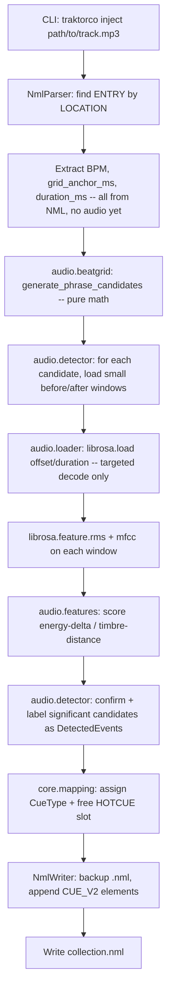

# Spec: Traktor Auto-Cue Automation

Status: Resolved v2 — ready for implementation
Source of truth: `.openspec/1-proposal.md`

This document is the binding technical specification for the project. Per
`CLAUDE.md`, no feature should be implemented unless it is explicitly
described here. If an edge case is discovered during implementation, this
file must be updated (via a proposed diff) before code changes proceed.
All open questions from the v1 draft were resolved in sections 6 and 7.

**Revision note (v2):** the audio analysis strategy was fundamentally
changed from blind whole-track novelty detection to **Grid-Guided Phrase
Analysis** (sections 4 and 6 below). Any prior implementation of
`audio/beatgrid.py::snap_to_grid` and a whole-track `audio/detector.py`
based on `librosa.util.peak_pick` over the full novelty curve is
**superseded** by this revision and must be replaced, not extended — see
the Migration Impact note at the end of section 6.

---

## 1. Scope

In scope (matches `1-proposal.md` requirements):

1. Parse `collection.nml` to locate a `<ENTRY>` for a given track and read
   its `BPM` (`<TEMPO>`) and grid anchor (`<CUE_V2 TYPE="4">`, a.k.a.
   `AutoGrid`).
2. **Calculate candidates first:** using only the `BPM` and grid anchor from
   step 1 (plus track duration, read directly from the NML's `<INFO>`
   element — see the `PLAYTIME_FLOAT`/`PLAYTIME` note in section 2.3),
   mathematically compute every phrase-boundary timestamp (every 16 and
   32 beats) across the track — *before* touching the audio file at all.
   See section 4.
3. **Targeted analysis only:** for each computed candidate, decode and
   analyze only a small `librosa` window immediately before/after that
   timestamp (RMS energy + MFCC timbre) — never the whole file. Compare
   the two windows and confirm a candidate as a real structural event
   (intro end, drop/energy peak, outro start — matching the three
   categories named in `1-proposal.md` exactly) only if the change is
   significant. See section 6.
4. Write the confirmed points back into the same `<ENTRY>` as new
   `<CUE_V2>` HotCue elements, without corrupting the rest of the file.
   Because every candidate was generated from Traktor's own beat math, no
   quantization/snapping step is needed at write time — the confirmed
   timestamps are already exact grid multiples.

Out of scope for v1 (do not implement without a spec update):

- Key detection / harmonic mixing.
- Loop (`TYPE="5"`) generation.
- Batch/parallel processing of an entire collection in one run (v1 processes
  one track at a time, callable in a loop by the CLI).
- Any GUI.

---

## 2. Architectural Layout

Modular Python package under `src/`, organized by responsibility so that XML
handling, audio analysis, and orchestration never live in the same module.

```
traktorco/
├── .openspec/
│   ├── 1-proposal.md
│   └── 2-spec.md
├── src/
│   └── traktorco/
│       ├── __init__.py
│       ├── cli.py                 # argparse entrypoint: `analyze`, `inject` commands
│       ├── config.py              # AppConfig dataclass: paths, thresholds, defaults
│       │
│       ├── nml/
│       │   ├── __init__.py
│       │   ├── constants.py       # CueType IntEnum, NML tag/attribute name constants
│       │   ├── models.py          # TempoInfo, CuePoint, TrackEntry dataclasses
│       │   ├── parser.py          # NmlParser: load file, locate ENTRY by LOCATION
│       │   └── writer.py          # NmlWriter: merge CuePoints into ENTRY, atomic write + backup
│       │
│       ├── audio/
│       │   ├── __init__.py
│       │   ├── loader.py          # load_window(path, offset_sec, duration_sec, sr) -> (y, sr); NEVER loads a whole track
│       │   ├── beatgrid.py        # beat_length_ms(), generate_phrase_candidates() math from section 4
│       │   ├── features.py        # pure math: energy_delta_db(), timbre_distance(), confidence_score() from section 6
│       │   └── detector.py        # PhraseAnalyzer: candidates -> targeted windowed features -> scored/confirmed DetectedEvent list
│       │
│       ├── core/
│       │   ├── __init__.py
│       │   ├── pipeline.py        # AutoCuePipeline: orchestrates nml + beatgrid + detector -> writer
│       │   └── mapping.py         # DetectedEvent.label -> CueType + HOTCUE slot assignment policy
│       │
│       └── utils/
│           ├── __init__.py
│           ├── xml_utils.py       # atomic write, .bak backup helpers
│           └── logging_utils.py   # module logger setup
│
└── tests/
    ├── fixtures/
    │   ├── sample_collection.nml
    │   └── sample_track.wav
    ├── nml/
    │   ├── test_parser.py
    │   └── test_writer.py
    ├── audio/
    │   ├── test_beatgrid.py
    │   ├── test_features.py
    │   └── test_detector.py
    └── core/
        └── test_pipeline.py
```

> **Note on `audio.loader`:** with Grid-Guided Phrase Analysis, the full
> waveform is never decoded. Track duration comes from the NML's `<INFO>`
> element (see section 2.3), not from `librosa`, so `loader.py` only
> ever needs to decode the small windows requested by `detector.py`
> around each candidate (via `librosa.load(path, offset=..., duration=...)`,
> which seeks rather than decoding the whole file for seekable formats).
> There is intentionally no whole-file `load_audio()` function

### 2.1 Module responsibilities

| Module | Responsibility | Must NOT do |
|---|---|---|
| `nml.parser` | Read-only XML parsing (`xml.etree.ElementTree`), locate `ENTRY` by matching `LOCATION` (`DIR`+`FILE`+`VOLUME`), extract `TempoInfo` and existing `CuePoint`s | Never mutate the tree |
| `nml.writer` | Insert/replace `<CUE_V2>` children on a given `ENTRY`, serialize the whole `NML` tree back to disk atomically with a `.bak` backup of the original file | Never re-parse or re-derive cue math |
| `audio.beatgrid` | Pure math: beat length + phrase-candidate generation (section 4) from BPM/grid anchor/duration alone | Never read files or decode audio |
| `audio.loader` | Decode only a small requested window of audio (`offset`/`duration`) to a mono waveform + sample rate | Never decode/load a whole track |
| `audio.features` | Pure math: energy-delta / timbre-distance / confidence scoring on precomputed RMS + MFCC values (section 6) | Never call `librosa` directly; never read files |
| `audio.detector` | Orchestrate: for each phrase candidate, call `audio.loader` for the before/after windows, run `librosa.feature.rms`/`mfcc` on them, score via `audio.features`, confirm + label `DetectedEvent`s | Never analyze anything outside a candidate's window; never touch XML |
| `core.mapping` | Decide `CueType` + `HOTCUE` slot per detected label | Never read/write files |
| `core.pipeline` | Wires the above together for one track: parse NML → generate phrase candidates → targeted detection → map → write | Should contain no XML- or DSP-specific logic itself |
| `cli` | Argument parsing, logging setup, calls `core.pipeline` | No business logic |

### 2.2 Configuration (`config.py`)

All tunable thresholds used by `audio.beatgrid`, `audio.detector`,
`audio.features`, and `core.pipeline` live in one `AppConfig` dataclass so
they are never hard-coded inside logic modules:

```python
from dataclasses import dataclass

@dataclass
class AppConfig:
    # audio.beatgrid: phrase-candidate generation (section 4)
    phrase_beats: int = 16               # base phrase granularity, in beats (4-bar block)
    major_phrase_multiple: int = 2       # every Nth candidate is also an 8-bar (32-beat) "major" boundary

    # audio.loader: decoding a small window around each candidate
    sample_rate: int | None = None       # None = keep native sample rate
    hop_length: int = 512                # frame hop used by librosa.feature.rms/mfcc within a window

    # audio.detector: sizing the before/after analysis window, scaled in beats (not seconds)
    # so it automatically adapts to the track's tempo.
    window_beats: float = 4.0            # 1 bar of context on each side of a candidate
    mfcc_count: int = 13

    # audio.features: significance thresholds for confirming a candidate as a real event
    energy_change_threshold_db: float = 3.0        # min |delta RMS| in dB to flag an energy change
    timbre_change_distance_threshold: float = 12.0  # min Euclidean MFCC distance to flag a timbre change

    # core.mapping: classification of confirmed candidates into labels
    intro_search_fraction: float = 0.25        # intro_end must fall within the first 25% of the track
    outro_search_fraction: float = 0.20        # outro_start must fall within the last 20% of the track
    max_drop_cues: int = 3                      # cap on how many "drop" cues are written per track
```

Note what is deliberately **absent**: there is no whole-track peak-picking
config (`peak_pre_max`, `peak_delta`, etc.) and no `min_cue_spacing_beats`.
Both are obsolete under Grid-Guided Phrase Analysis — candidates are, by
construction, always at least `phrase_beats` apart, so minimum-spacing
de-duplication is no longer needed (see section 4).

### 2.3 Data structures (`nml/models.py`)

```python
from dataclasses import dataclass, field
from src.traktorco.nml.constants import CueType

@dataclass
class TempoInfo:
    bpm: float
    bpm_quality: float = 100.0

@dataclass
class CuePoint:
    name: str
    type: CueType
    start_ms: float          # milliseconds, matches NML START units
    len_ms: float = 0.0
    repeats: int = -1
    hotcue: int = -1          # -1 = not bound to a Hotcue pad; 0-7 = pad slot
    displ_order: int = 0

@dataclass
class TrackEntry:
    title: str
    artist: str
    location_path: str        # resolved absolute path used to match the audio file
    tempo: TempoInfo
    cues: list[CuePoint] = field(default_factory=list)
    grid_anchor_ms: float = 0.0   # convenience: START of the TYPE=GRID cue
    duration_ms: float = 0.0      # from <INFO>; bounds candidate generation -- see PLAYTIME_FLOAT/PLAYTIME note below
```

**`duration_ms` extraction (`nml/parser.py`):** prefer `<INFO
PLAYTIME_FLOAT="...">` (fractional seconds) when present, converting to
milliseconds via `* 1000`. Fall back to the integer-seconds `<INFO
PLAYTIME="...">` (also `* 1000`) when `PLAYTIME_FLOAT` is absent. This
fallback is required in practice, not just defensive: Traktor Pro 4 (NML
`VERSION="20"`) has been observed to omit `PLAYTIME_FLOAT` entirely and
write only integer-seconds `PLAYTIME` (confirmed against
`tests/fixtures/sample_collection.nml`). If neither attribute is present,
`duration_ms` is `0.0` and candidate generation produces at most the
anchor candidate (spec section 4.4, item 3) — never a parse error.

`audio/beatgrid.py` produces (section 4):

```python
from dataclasses import dataclass

@dataclass
class PhraseCandidate:
    beat_index: int       # offset in beats from the grid anchor; always a multiple of phrase_beats
    time_ms: float         # G + beat_index * L; already an exact grid multiple, never needs snapping
    is_major_phrase: bool  # True every major_phrase_multiple-th candidate (default: every 32 beats)
```

`audio/detector.py` produces (section 6):

```python
from dataclasses import dataclass

@dataclass
class DetectedEvent:
    label: str            # one of: "intro_end", "drop", "outro_start" (see section 6)
    time_ms: float          # == the confirming PhraseCandidate.time_ms; already grid-exact, no snapping needed
    beat_index: int          # traceability back to the originating PhraseCandidate
    is_major_phrase: bool    # carried through from the originating PhraseCandidate
    confidence: float        # combined energy/timbre change score from audio.features, arbitrary positive scale
```

---

## 3. Traktor `<CUE_V2>` XML Structure

Traktor's `collection.nml` stores all cue points (including the automatic
beatgrid anchor) as `<CUE_V2>` children of an `<ENTRY>`. There is no bare
`<CUE>` tag in current Traktor versions — historical `CUE`/`CUE_V1` formats
predate `CUE_V2` and are not written by any supported Traktor release, so
this project targets `CUE_V2` exclusively.

### 3.1 Parent context

```xml
<ENTRY MODIFIED_DATE="2026/7/7" MODIFIED_TIME="50000" TITLE="Track Title" ARTIST="Artist Name">
  <LOCATION DIR="/:Users/:dj/:Music/:" FILE="track.mp3" VOLUME="Macintosh HD" VOLUMEID="Macintosh HD"/>
  <INFO BITRATE="320000" PLAYTIME="240" PLAYTIME_FLOAT="240.123000" IMPORT_DATE="2026/7/7" FLAGS="28" FILESIZE="9600"/>
  <TEMPO BPM="128.000000" BPM_QUALITY="100.000000"/>

  <!-- Existing grid anchor, always TYPE=4, usually HOTCUE=0 and unnamed/"AutoGrid" -->
  <CUE_V2 NAME="AutoGrid" DISPL_ORDER="0" TYPE="4" START="356.000000" LEN="0.000000" REPEATS="-1" HOTCUE="0"/>

  <!-- Cues this project adds, one per detected structural event -->
  <CUE_V2 NAME="Intro End" DISPL_ORDER="0" TYPE="0" START="16106.000000" LEN="0.000000" REPEATS="-1" HOTCUE="1"/>
  <CUE_V2 NAME="Drop"      DISPL_ORDER="0" TYPE="0" START="47950.000000" LEN="0.000000" REPEATS="-1" HOTCUE="2"/>
  <CUE_V2 NAME="Outro"     DISPL_ORDER="0" TYPE="0" START="210375.000000" LEN="0.000000" REPEATS="-1" HOTCUE="3"/>
</ENTRY>
```

### 3.2 Attribute reference

| Attribute | Type | Units / Notes |
|---|---|---|
| `NAME` | string | Free text label shown in Traktor's cue list. `"AutoGrid"` is reserved for the grid anchor. |
| `DISPL_ORDER` | int | Display ordering hint. Write `0` unless reordering is required. |
| `TYPE` | int (enum) | See `CueType` below. |
| `START` | float | **Milliseconds** from the start of the audio file. This is the value the phrase-candidate formula in section 4 produces directly — no separate snapping step. |
| `LEN` | float | Milliseconds. `0.0` for point cues (all cues this project writes are point cues, not loops). |
| `REPEATS` | int | `-1` for point cues. Only meaningful for `TYPE=5` (Loop). |
| `HOTCUE` | int | Hotcue pad index the cue is bound to, `0`–`7`. `-1` if not bound to a pad. Traktor supports 8 hotcue slots per deck. |

### 3.3 `CueType` enum (`nml/constants.py`)

Reverse-engineered and confirmed against Traktor's binary `TRAKTOR4` cue
metadata (identical enum is reused in the XML `TYPE` attribute):

```python
from enum import IntEnum

class CueType(IntEnum):
    CUE = 0        # Standard Cue Point / HotCue
    FADE_IN = 1
    FADE_OUT = 2
    LOAD = 3
    GRID = 4       # Beatgrid anchor, NAME="AutoGrid"
    LOOP = 5
```

This project only ever writes `CueType.CUE` (`0`). `CueType.GRID` is
read-only input (used to get `grid_anchor_ms`); it must never be created,
duplicated, or overwritten by the writer.

### 3.4 Writer constraints

- The `AutoGrid` (`TYPE=4`) cue must be preserved byte-for-byte; the writer
  only *appends* new `TYPE=0` `<CUE_V2>` elements to `ENTRY`, it never
  removes or reorders existing children.
- `HOTCUE` slots already in use (read from the existing `CUE_V2` list) must
  not be overwritten. `core.mapping` assigns the lowest free slot in
  `0..7`; if all 8 slots are taken, the event is skipped and logged as a
  warning — never dropped silently, never crashes the run.
- All numeric attributes are serialized with 6 decimal places
  (`f"{value:.6f}"`) to match Traktor's own formatting and avoid diffs that
  make the whole file appear changed under version control.
- Before writing, copy the original file to `<name>.nml.bak` if a backup
  for this run does not already exist.

---

## 4. Grid-Guided Phrase Candidate Generation

**This is the load-bearing change in v2.** Instead of detecting arbitrary
timestamps in the audio and then correcting ("snapping") them onto the
grid after the fact, this project now computes every plausible cue
location directly from Traktor's own BPM and grid data *before* touching
the audio file. Dance-music arrangement changes (drops, breaks,
intro/outro boundaries) overwhelmingly land on musical phrase boundaries —
4-bar (16-beat) or 8-bar (32-beat) blocks — so those are the only
timestamps ever considered. There is no free-running novelty search over
the whole track, and consequently **no quantization/snapping step is
needed**: every candidate is, by construction, an exact grid multiple.

### 4.1 Inputs

- `BPM`: from `<TEMPO BPM="...">` on the matched `ENTRY`.
- `G`: the grid anchor, in **milliseconds**, taken from the `START`
  attribute of the `<CUE_V2 TYPE="4">` (`AutoGrid`) element. This is the
  timestamp of beat 0 on Traktor's grid — it is typically a small offset
  near the top of the track, not necessarily `0`.
- `D`: the track duration, in **milliseconds**, taken from the `<INFO>`
  element per the `PLAYTIME_FLOAT`/`PLAYTIME` extraction rule in section
  2.3. This bounds candidate generation and is read directly from the
  NML — `librosa`/audio decoding is not needed to determine it.
- `P`: `AppConfig.phrase_beats` (default `16`) — the base phrase
  granularity, in beats.
- `M`: `AppConfig.major_phrase_multiple` (default `2`) — every `M`-th
  candidate is additionally tagged as a "major" (8-bar / 32-beat) phrase
  boundary.

### 4.2 Beat length

Traktor's grid is a fixed-tempo grid anchored at `G`. The duration of one
beat in milliseconds is:

```
L = 60000 / BPM
```

### 4.3 Candidate generation formula

Enumerate every phrase boundary from the anchor to the end of the track,
in beat-index steps of `P`:

```
for n = 0, 1, 2, ...:
    beat_index = n * P
    t_ms        = G + beat_index * L

    if t_ms > D:
        stop                                   # past the end of the track

    is_major_phrase = (n % M == 0)             # every M-th candidate is also a 32-beat boundary

    emit PhraseCandidate(beat_index, t_ms, is_major_phrase)
```

Equivalently, as a closed-form expression for the `n`-th candidate:

```
t_ms(n) = G + n * P * L,   for n = 0, 1, 2, ... while t_ms(n) <= D
```

With the defaults (`P=16`, `M=2`), this produces a candidate every 16
beats (4 bars), with every other one (`n` even) additionally marking a
32-beat (8-bar) boundary — the two granularities named in the brief are
both covered by a single generator, since 32 is a multiple of 16.

Because every `t_ms(n)` is already `G + k*L` for an integer `k`, it is
trivially and exactly grid-aligned — this is the same form as a snapped
timestamp would have taken in v1, but produced generatively instead of
correctively.

### 4.4 Post-conditions / edge cases

1. **Pre-anchor region:** candidate generation starts at `n = 0`
   (`t_ms = G`), so there are never negative-time candidates — unlike v1's
   corrective snapping, there is nothing before the anchor to consider.
2. **Zero/undefined BPM:** if `BPM <= 0` or is missing, candidate
   generation must be skipped entirely for that track (no candidates, no
   division by zero), and a warning logged. `core.pipeline` must treat
   this the same as "zero confirmed events" — it is not a fatal error.
3. **Duration missing/zero:** if `D <= 0` (e.g. malformed or entirely
   absent `PLAYTIME_FLOAT`/`PLAYTIME` — see the extraction rule in section
   2.3), generation stops immediately after `n = 0`, producing at most one
   candidate (the anchor itself). Log a warning; do not raise.
4. **No de-duplication needed:** any two candidates are at least `P` beats
   (`P * L` ms) apart by construction. This structurally satisfies what
   v1's `min_cue_spacing_beats` post-hoc de-duplication pass existed to
   guarantee, so that pass has been removed (see section 2.2).

### 4.5 Reference implementation shape (`audio/beatgrid.py`)

```python
from dataclasses import dataclass


def beat_length_ms(bpm: float) -> float:
    if bpm <= 0:
        raise ValueError("BPM must be positive")
    return 60000.0 / bpm


@dataclass
class PhraseCandidate:
    beat_index: int
    time_ms: float
    is_major_phrase: bool


def generate_phrase_candidates(
    bpm: float,
    grid_anchor_ms: float,
    duration_ms: float,
    phrase_beats: int = 16,
    major_phrase_multiple: int = 2,
) -> list[PhraseCandidate]:
    if bpm <= 0 or duration_ms <= 0:
        return []

    length_ms = beat_length_ms(bpm)
    candidates = []
    n = 0
    while True:
        beat_index = n * phrase_beats
        t_ms = grid_anchor_ms + beat_index * length_ms
        if t_ms > duration_ms:
            break
        candidates.append(
            PhraseCandidate(
                beat_index=beat_index,
                time_ms=t_ms,
                is_major_phrase=(n % major_phrase_multiple == 0),
            )
        )
        n += 1
    return candidates
```

`audio.detector` (section 6) consumes this list directly; `core.pipeline`
no longer performs any post-hoc snapping or spacing de-duplication, since
both are now structural guarantees of this generator.

---

## 5. Pipeline Flow



---

## 6. Grid-Guided Phrase Analysis (`audio/detector.py`, `audio/features.py`)

**Decision:** replace whole-track novelty-curve peak-picking (v1) with
**targeted, phrase-boundary-only analysis**: `librosa` is never run across
the full waveform. It only ever inspects a handful of short windows, one
per `PhraseCandidate` produced by section 4.

**Rationale:**

- **DJ-centric accuracy:** arrangement changes in club-oriented electronic
  music are overwhelmingly aligned to 4-bar/8-bar phrases. A loudness or
  timbre change that does *not* land on a phrase boundary is very unlikely
  to be an intentional structural cue point, so searching for it anywhere
  else in the track is wasted work and a source of false positives.
- **CPU efficiency:** v1's approach ran `onset_strength` and `rms` across
  every frame of the entire track (`O(track_length)`). v2 only decodes and
  analyzes `2 * len(candidates)` short windows of `window_beats` each —
  for a 4-minute track at 128 BPM that's roughly 60 candidates × 2 windows
  × ~1.9s, versus decoding and processing the full 240s waveform. This is
  a substantial reduction in both I/O (via seek-based partial decode) and
  DSP compute.
- **No quantization needed:** every candidate's timestamp already came
  from section 4's grid math, so a confirmed `DetectedEvent` is written
  with that exact timestamp — there is nothing left to snap.

### 6.1 Algorithm

1. **Get candidates:** call
   `audio.beatgrid.generate_phrase_candidates(bpm, grid_anchor_ms, duration_ms, config.phrase_beats, config.major_phrase_multiple)`
   (section 4). This requires no audio decoding at all.
2. **Size the analysis window:** compute `window_ms = config.window_beats * beat_length_ms(bpm)`
   (default 4 beats — one bar — so the window automatically scales with
   tempo instead of using a fixed number of seconds).
3. **For each candidate**, decode exactly two short windows via
   `audio.loader.load_window`:
   - `before = load_window(path, offset_sec=(candidate.time_ms - window_ms) / 1000, duration_sec=window_ms / 1000, sr=config.sample_rate)`
   - `after  = load_window(path, offset_sec=candidate.time_ms / 1000, duration_sec=window_ms / 1000, sr=config.sample_rate)`
   - If `before`'s offset would be negative (candidate is within the first
     `window_ms` of the track, i.e. `n = 0`), skip the `before` window
     entirely and treat this candidate as intro-only (see step 5); do not
     clamp the offset to `0`, which would shrink and bias the window.
   - If `after`'s window would run past `duration_ms`, truncate its
     `duration_sec` to what remains, rather than skipping it.
4. **Extract features** on each decoded window with `librosa`:
   - `rms = librosa.feature.rms(y=window, hop_length=config.hop_length)[0].mean()`
   - `mfcc = librosa.feature.mfcc(y=window, sr=sr, n_mfcc=config.mfcc_count).mean(axis=1)`
5. **Score the candidate** using `audio.features` (pure math, no `librosa`
   dependency, so it is independently unit-testable):
   - `energy_delta_db = 20 * log10(max(rms_after, eps) / max(rms_before, eps))`
   - `timbre_distance = euclidean(mfcc_after, mfcc_before)`
   - `confidence = abs(energy_delta_db) / config.energy_change_threshold_db + timbre_distance / config.timbre_change_distance_threshold`
   - `is_significant = abs(energy_delta_db) >= config.energy_change_threshold_db or timbre_distance >= config.timbre_change_distance_threshold`
   - When a candidate has no `before` window (`n = 0`), it cannot be scored
     this way; it is automatically eligible as the `intro_end` candidate
     of last resort in step 6 instead (see below), never as a `drop`.
6. **Label assignment** (position-based labels take priority over `drop`
   when a candidate qualifies for both; only `is_significant` candidates
   are considered, except where noted):
   - `intro_end`: among significant candidates whose `time_ms` falls
     within the first `config.intro_search_fraction` of `duration_ms`,
     keep the single earliest one. If none are significant, fall back to
     the earliest candidate in that window regardless of significance (a
     track's first phrase boundary is still a musically reasonable
     intro-end guess even if the energy/timbre change was subtle). If
     there are no candidates at all in that window, no `intro_end` cue is
     produced — a valid, silent outcome, not an error.
   - `outro_start`: symmetric with `intro_end`, using
     `config.outro_search_fraction` and the last matching candidate.
   - `drop`: among the remaining significant candidates (excluding
     whichever were consumed by `intro_end`/`outro_start`) with
     `energy_delta_db > 0` (rising energy), keep the top
     `config.max_drop_cues` ranked by `confidence` descending, breaking
     ties in favor of `is_major_phrase` candidates.
7. **Output:** the flat list of `DetectedEvent`, each carrying
   `time_ms = candidate.time_ms` verbatim, in chronological order.
   `core.pipeline` passes this straight to `core.mapping` — there is no
   snapping or de-duplication pass after this point.

This keeps `audio.detector` an orchestrator over `audio.loader` +
`librosa.feature.*` + `audio.features`, and keeps `audio.features` a pure
function of scalar/vector inputs (`(rms_before, rms_after, mfcc_before,
mfcc_after, config) -> (energy_delta_db, timbre_distance, confidence,
is_significant)`) with no `librosa` or file-I/O dependency, consistent
with the module boundaries in section 2.1.

### 6.2 Migration impact on existing code

`src/traktorco/audio/beatgrid.py` currently implements v1's
`snap_to_grid(t_raw_sec, bpm, grid_anchor_ms)` and its test suite
(`tests/audio/test_beatgrid.py`). Under this revision:

- `beat_length_ms` is unchanged and must be kept.
- `snap_to_grid` is **obsolete** and must be **removed**, replaced by
  `generate_phrase_candidates` and the `PhraseCandidate` dataclass from
  section 4.5.
- The existing `test_beatgrid.py` tests for `snap_to_grid` must be removed
  and replaced with tests for `generate_phrase_candidates` (candidate
  count/spacing, `is_major_phrase` tagging, zero/negative BPM and
  zero-duration edge cases from section 4.4).
- `audio/detector.py` and `audio/features.py` do not exist yet, so no
  migration is needed for them — they should be implemented directly
  against section 6 as written here.

---

## 7. NML `LOCATION` Matching & Path Normalization (`nml/parser.py`)

### 7.1 How Traktor stores `LOCATION`

```xml
<LOCATION DIR="/:Users/:dj/:Music/:" FILE="track.mp3" VOLUME="C:" VOLUMEID="..."/>
```

- `DIR`: path segments joined by the literal two-character separator `/:`,
  with a leading and trailing `/:`. Never contains a drive letter or
  volume name — that lives in `VOLUME`.
- `VOLUME`: on Windows this is a drive letter with colon, e.g. `"C:"`
  (confirmed against Native Instruments' own documented default paths,
  e.g. `C: > Users > ... > Documents > Native Instruments`). On macOS it
  is a mounted volume name, e.g. `"Macintosh HD"`. `VOLUMEID` is an
  internal Traktor volume identifier and is not needed for path
  reconstruction.
- `FILE`: bare filename, no path separators.

### 7.2 Normalization function

`nml/parser.py` implements a one-directional converter, since this project
only ever reads existing `LOCATION`s (it never creates new `ENTRY`
elements):

```python
import re
from pathlib import PureWindowsPath, PurePosixPath

_WINDOWS_VOLUME_RE = re.compile(r"^[A-Za-z]:$")

def nml_location_to_path(volume: str, dir_: str, file_: str) -> str:
    """Reconstruct a normalized, comparable path string from a LOCATION.

    Returns a string with forward slashes and normalized casing (via
    os.path.normcase equivalent), NOT a resolved filesystem path — the
    referenced volume may not be mounted on the machine running this tool.
    """
    segments = [s for s in dir_.split("/:") if s]
    if _WINDOWS_VOLUME_RE.match(volume):
        raw = str(PureWindowsPath(volume + "\\", *segments, file_))
    else:
        # macOS-style volume name; best-effort only, not required to
        # resolve on a Windows machine running this tool.
        raw = str(PurePosixPath("/Volumes", volume, *segments, file_))
    return raw.replace("\\", "/").casefold()
```

### 7.3 Matching strategy (`NmlParser.find_entry`)

1. Take the user-supplied audio file path from the CLI, resolve it to an
   absolute path with `pathlib.Path(user_path).resolve()`.
2. Normalize that resolved path the same way as `nml_location_to_path`'s
   output (forward slashes, `casefold()`) so the two sides are comparable
   without requiring the NML-referenced file to exist on this machine's
   currently mounted volumes.
3. For every `ENTRY` in the collection, compute
   `nml_location_to_path(entry.VOLUME, entry.DIR, entry.FILE)` and compare
   it to the normalized user path.
4. **Zero matches:** raise `TrackNotFoundError`, including the normalized
   path that was searched for, so a volume-letter/name mismatch (e.g. the
   collection was cataloged on a different drive letter) is easy to
   diagnose.
5. **Exactly one match:** proceed with that `ENTRY`.
6. **More than one match** (duplicate `LOCATION`s in the collection, which
   Traktor itself normally prevents but can occur in edited/merged
   collections): raise `AmbiguousTrackError`. Resolving ambiguity via
   `--title`/`--artist` CLI filters is required behavior for `cli.py`, not
   new scope — it directly serves requirement 1 in `1-proposal.md`
   ("read `collection.nml` to fetch the BPM and Grid Marker" implies
   finding exactly one matching entry).

This strategy deliberately avoids resolving the NML-derived path against
the filesystem (step 2 only resolves the *user-supplied* path). The NML
path is used purely as a normalized string key for comparison.
