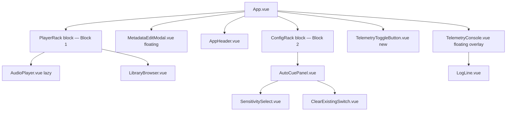
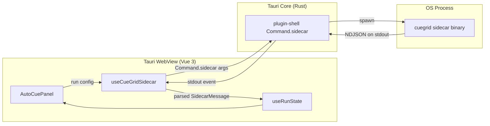
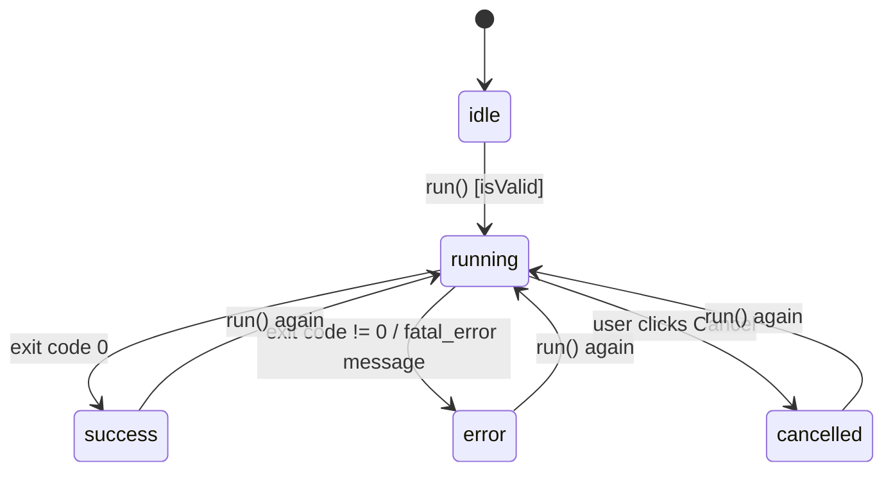

# Spec: CueGrid GUI (Phase 2 — Tauri + Vue 3)

Status: Current implementation synchronized 2026-07-22 (Vue/Tauri shell, Peaks.js player, library browser, modal Auto Cue flow, and Python sidecar flow). Smart Playlist architecture added 2026-07-21.

### Manual collection path fallback

The GUI persists an optional `customNmlPath` in `localStorage` through the shared configuration state. At startup, a persisted non-empty path is the active collection path; otherwise the GUI attempts standard discovery. The header renders one collection-status button. For a standard Traktor path, its label is derived from the parent directory as **Traktor <version> NML** (for example, **Traktor 4.5 NML**); its tooltip exposes the complete path. When no collection is active, it reads **No collection found**. Clicking this same button opens the native Tauri dialog with an `.nml`-only filter and stores the selected path as `customNmlPath`.

All core invocations pass the optional path as `nmlPath` to the Tauri bridge. `call_cuegrid_core` and streamed analysis append `--nml <path>` in Rust when it is present, so paths containing spaces remain a single process argument. The legacy `nmlPathOverride` config field remains the internal compatibility name for this persisted path.

Changing collections is guarded by the same native unsaved-changes dialog used by a window-close request. If changes are pending, **Save Changes** must complete successfully before the file picker opens, **Discard** clears the pending frontend state before it opens, and **Cancel** leaves both the collection and file picker unchanged.

While Auto Cue analysis is running, global view navigation and the collection-status selector are disabled. The UI must block pointer and keyboard activation, and their handlers must not switch views or open a file picker until the run state has left `running`.

Historical revision notes below are retained only where they describe still-visible UI behavior; they do not indicate pending implementation. The core sidecar contract is defined by `2-core-spec.md`. Active analysis is master-track HPSS analysis and has no Stem/source-selection mode; NML `FLAGS` may still be displayed as UI metadata.
(v1.7 adds the single-track context-menu interaction, conditional player teardown, and reactive analysis status messages; v1.5 adds dynamic Stem availability badges in the track list and
retains the mandatory post-operation synchronization loop between Vue
state, Wavesurfer regions, and disk-backed NML metadata, plus the
`AudioPlayer.vue` state-sanitization contract; v1.4 adds the
three-dimensional Sensitivity preset contract, binding
energy, timbre, and relative-confidence thresholds through `--mode`; v1.3
adds the user-configurable Max Cues control, reactive `maxCues`
configuration state, and the `--max-cues` sidecar argument; v1.2
cross-references the unified HotCue-pad and keyboard transport
contract defined in `3-player-spec.md` §3.9–§3.12: the 8 virtual
HotCue pads, momentary cue behavior, global keyboard shortcuts, and
relative beat-jump mechanics all live in `AudioPlayer.vue`, whose
component contract is owned by `3-player-spec.md`. This document's
§4 UI Layout diagram is updated to reflect the pad row's placement
in the transport cluster; all prior v1.1 infrastructure — the
dark-theme color tokens, the two-block resizable rack, the
floating TelemetryConsole overlay, the module-scoped composable
state pattern, and the Tauri sidecar plumbing — is preserved
unchanged.)

## Current implementation synchronization

### Traktor process safety interlock

CueGrid MUST actively monitor the host operating system for Traktor before
allowing any collection-management interaction. The Rust Tauri backend polls
the process list every two seconds using `sysinfo`, matching `Traktor.exe`
case-insensitively on Windows and `Traktor` case-insensitively on macOS and
Linux. It emits a `traktor-status` Tauri event containing a boolean payload on
each poll. It also exposes the current boolean status for the frontend's
initial bootstrap read, so Traktor detected at application startup is blocked
without waiting for the first polling event.

`App.vue` registers the event listener during its lifecycle and composes a
global `TraktorSafetyOverlay`. When the status is true, the overlay MUST cover
the entire application viewport at the highest application z-index, blur and
block the UI beneath it, and provide no dismiss, close, or escape route. Its
warning text MUST read: **"Traktor is currently running. Please close Traktor
to safely manage your collection and prevent data loss."** The overlay MUST
disappear automatically as soon as a later backend status reports that Traktor
has closed. This interlock applies at startup and throughout the application's
runtime to prevent Traktor from overwriting CueGrid's `collection.nml` writes
on exit.

The checked-out GUI is no longer the create-tauri-app scaffold described by
the historical sections below. The current source of truth is:

- `App.vue` owns a strict `h-screen w-screen overflow-hidden` dark root. The
  HTML/body/#app ancestor chain is also overflow-hidden. Its inner rack is a
  bounded `flex-1 min-h-0 flex flex-col overflow-hidden` stack containing a
  fixed-height `AudioPlayer` card and a flexible `LibraryBrowser` card. There
  is no persistent **AUTO CUE** card, bottom bar, or mounted `AutoCuePanel`.
  `LibraryBrowser` consumes all remaining height above the fixed workspace
  footer, so its table extends to the bottom of the window.
- Scrolling is delegated to internal containers. `LibraryBrowser.vue` keeps a
  three-zone playlist sidebar: fixed **NAVIGATE** / **All Tracks** / **PLAYLISTS**
  headers, a separate `min-h-0 overflow-y-auto scrollbar-amber` playlist-list
  container, and a fixed footer containing **Create Smart Playlist**. The
  track table has its own scroll container; `AudioPlayer.vue` owns its own
  vertical overflow. No page-level scrolling is permitted.
- `gui/tailwind.config.js` defines the semantic Amber/Ochre roles
  `primary`, `secondary`, `accent`, and `warning`, alongside dark `base`,
  `panel`, `elevated`, and `console` surfaces. Blue/green stage colors and
  teal as the brand accent are legacy terminology, not current visual rules.
- `AudioPlayer.vue` uses Peaks.js, a local `TrackData`/`cueState`
  model, custom grid/cue markers, eight computed pad slots, custom wheel
  handling, and BPM adjustment state. Persistence dirtiness is global and
  owned by `useSaveStore`; `CueContextMenu.vue` owns the cue deletion menu
  shell and emits only `close` and `delete` events.
- The sidecar name is `binaries/cuegrid-core`. `useCueGridSidecar.ts` builds
  playlist or selected-track Auto Cue arguments, includes the in-memory
  `nmlPathOverride` when applicable, parses NDJSON for analysis, and exposes
  `batchSave` and `discoverAndSetDefaultNml`. `batchSave` is invoked only by
  `useSaveStore.saveAll()` and calls Core's `--batch-save` endpoint. Metadata
  and playlist queries remain one-shot JSON sidecar reads; no component-level
  track persistence method exists.
- Batch metadata editing is a library-level operation. `MetadataEditModal.vue`
  owns the edit form, mutates loaded library state in memory, and marks each
  affected track dirty. It makes no sidecar write when the modal applies.
- Smart Playlist creation is a library-level operation. `LibraryBrowser.vue`
  renders a fixed, full-width **Create Smart Playlist** button in the playlist
  sidebar footer and opens `SmartPlaylistModal.vue`; the modal delegates
  compilation to the Python sidecar and reloads the library only after a
  successful NML mutation.

### Session-history playlist import revision

The Session History view is read-only except for its explicit **Import as
Playlist** command, whose detailed interaction and parsing contract is in
`5-history-spec.md` sections 9–14. It follows the Smart Playlist persistence
pattern: `SessionHistoryView.vue` calls a dedicated sidecar mutation, waits for
the NML write to succeed, then reloads the library. It must not create a
provisional `useLibraryState` leaf, mark a playlist dirty, or use
`useSaveStore.saveAll()`. A failure leaves both library and global dirty state
unchanged and preserves the import-modal draft for correction/retry.

### Batch-saving architecture

All GUI track edits—metadata, cues, grid anchor, and BPM—are in-memory changes
until the user explicitly saves them. The GUI must not submit a persistence
request for an individual track edit. On an explicit save it submits one batch
to the core, which atomically persists the final set of modified tracks as
defined by `2-core-spec.md`. Discarding unsaved work or closing without saving
clears only the GUI batch and makes no NML mutation. Smart Playlist compilation
is a distinct playlist operation and remains outside the track batch payload.

`gui/src/stores/useSaveStore.ts` is the global Pinia state boundary for this
workflow. Its state is `isSaving: boolean`, `modifiedTracks: Set<string>`,
`modifiedPlaylists: Set<string>`, and `writeMetadataToFiles: boolean` (default
`false`). `isDirty` is true when either modified-entity set is non-empty.
`markTrackDirty(path)` and `markPlaylistDirty(id)` record a changed entity;
`setWriteMetadataToFiles(value)` controls the next track batch's optional
physical-file write; and `clearDirtyState()` clears both sets and resets the
option. `saveAll()` is the sole trigger for a track write: it serializes the
current final in-memory state of every modified track as the `--batch-save`
payload, awaits the sidecar result, then clears dirty state only after the NML
transaction succeeds.

`main.ts` installs Pinia before mounting the app. `App.vue` renders the global
**Save Changes** control in the app chrome only when `isDirty` is true. The
button invokes `saveAll()`, is disabled while a save is in progress, and reads
**Saving...** during that operation. It has an accessible name and a visible
keyboard focus state.

`App.vue` also registers the Tauri current-window close-request listener. A
clean window closes normally. When dirty, the listener prevents the default
close, shows the native warning **You have unsaved changes. Do you want to save
them before exiting?**, and handles three outcomes: save waits for `saveAll()`
then force-closes the window; discard force-closes the window; cancel leaves
the window open. The listener is removed when the app shell unmounts.

Any older section that prescribes a three-block resizable rack, a mounted
`AutoCuePanel`, or Auto Cue controls/status embedded in a persistent layout
region is historical and is
superseded by this synchronization section and the more detailed current
contracts in `3-player-spec.md` and `4-library-spec.md`.

### Current component and visual contract

```text
App.vue (h-screen w-screen overflow-hidden)
├── AppHeader
├── AudioPlayer card (fixed 320px region)
├── LibraryBrowser card (flexible region; minimum 280px / four visible rows;
│   extends to the workspace footer)
└── fixed 48px footer: Export button + TelemetryToggleButton / TelemetryConsole overlay
```

The semantic color roles are:

| Role | Current value/meaning |
|---|---|
| `primary` | Main amber action and enabled pad surface (`#edb40b`) |
| `secondary` | Pale ochre supporting borders/highlights (`#F7D15F`) |
| `accent` | Dark ochre hover/active marker emphasis (`#AA8208`) |
| `warning` | Warning/dirty-state emphasis (`#f43f5e`) |

The root layout must preserve `min-h-0` through every flex ancestor. A child
that owns a list or waveform may scroll inside its own bounded box, but the
document, body, and application shell must remain fixed to the viewport.
`LibraryBrowser` has a hard 280px minimum, sufficient for its header, table
header, and at least four 40px track rows. `WorkspaceFooter` is a
non-shrinking 48px block and may not be compressed or clipped by flexbox
shrinking. `AudioPlayer` remains a fixed 320px block. The Tauri window
defaults to 1120×970 client pixels and enforces a 970px minimum client height
so the player, library, and footer are all visible without compressing any
region.

### Auto Cue selection and execution

`useLibraryState()` owns `selectedLibraryPaths: string[]`, containing the
`location_path` values of the rows selected for Auto Cue. This selection is
entirely independent of `useConfigState().selectedTrackPath`, which remains
the Audio Player preview target only.

### Current library metadata contract

At application boot, the Library Browser receives the relational
`--get-library` payload specified in `2-core-spec.md` section 7.3. Its
`CollectionTrack` model must preserve the complete editable metadata dictionary
without optional properties:

```ts
export interface CollectionTrack {
  title: string;
  artist: string;
  album: string;
  remixer: string;
  producer: string;
  genre: string;
  label: string;
  comment: string;
  comment2: string;
  lyrics: string;
  mix: string;
  rating: number;
  location_path: string;
  bpm: number | null;
  grid_anchor_ms: number | null;
  key: string | null;
  duration_ms: number | null;
  is_flex_grid: boolean;
  existing_cues: ExistingCue[];
  collection_index: number;
}
```

The string metadata properties use `""` for an absent NML value and `rating`
uses `0` for an absent or invalid NML value. The GUI must install this complete
dictionary from the single boot-time response before rendering track rows; it
must not issue per-track requests to fill metadata cells.

In the track table, a standard click replaces the Auto Cue selection, Ctrl/Cmd
click toggles a row, and Shift-click selects the contiguous visible range. A
double-click alone calls `selectTrackForPreview`; it must not alter the Auto
Cue target. Changing library context clears `selectedLibraryPaths` but does not
unload the player preview.

### Auto Cue modal architecture (current)

`AutoCueModal.vue` is the sole Auto Cue configuration and execution surface.
It is mounted by `LibraryBrowser.vue`, rather than by `App.vue`, and is shown
only while `LibraryBrowser`'s local reactive `isAutoCueModalOpen` state is
true. Closing the modal, including **Cancel**, sets that state to `false` and
does not mutate configuration or start analysis.

`LibraryBrowser.vue` remains the feature-composition owner. It must render a
primary **Auto Cue (X)** button next to **Edit Metadata** in the top-right
library header, where `X` is the current `selectedLibraryPaths.length`. This
button opens the modal. The enabled/disabled target guard is unchanged: Auto
Cue is available only when one or more tracks are selected or an active
playlist provides a valid target; it is unavailable while analysis is active.

The existing **Auto Cue Selected** track-context action and **Auto Cue
Playlist** playlist-context action must no longer invoke the sidecar directly.
Each sets the appropriate existing library target/selection context, then opens
the same modal. This preserves the target semantics while giving every entry
point one explicit configuration-and-confirmation step.

`AutoCueModal.vue` binds directly to the existing global `useConfigState()`;
it does not own a duplicate draft or a second configuration store. It renders
exactly these analysis settings:

- Toggle: **Clear current cues**, bound to the existing clear-cues setting.
- Button group: **Sensitivity** — **Granular**, **Balanced**, and **Strict**.
- Button group: **Max Cues** — integer choices **1** through **8**.

Its actions are **Cancel** and primary **Run Analysis**. **Run Analysis**
resolves the current selection/playlist target from `useLibraryState()`, closes
the modal, then invokes `useCueGridSidecar().runSelectedTracks(tracks)` for
the resolved tracks. It must not construct a second argument path or duplicate
sidecar validation. The sidecar's global blocking behavior, cancellation,
NDJSON telemetry, progress text (for example, **1 of 3 analyzing**),
completion behavior, and post-analysis synchronization remain unchanged and
continue to be owned by `useCueGridSidecar` and its existing run state.

The modal contract is props/events-based for visibility only: `LibraryBrowser`
provides the open state and receives a close event (or uses an equivalent typed
`v-model` contract). Configuration remains global in `useConfigState`, and
execution remains delegated to the sidecar composable. This keeps the modal
presentationally focused and avoids copying shared state into the library view.

`AutoCuePanel.vue` is removed from the active component tree. Any older
`AutoCuePanel` references concerning layout, execution, progress display,
cancellation, or telemetry export are superseded by this section. Existing
global run-state UI and the fixed footer's telemetry/export affordances remain
unchanged; this revision moves only Auto Cue configuration and execution
initiation into the modal.

The Auto Cue modal closes immediately when **Run Analysis** is activated,
before awaiting sidecar execution. While global run state is `running`,
`WorkspaceFooter.vue` renders a **Cancel** control next to the progress
indicator. It calls `useCueGridSidecar().cancel()` and is absent for every
non-running state.

### Smart Playlist creation

The Collection View's playlist sidebar must render one fixed, full-width
**Create Smart Playlist** button below the independently scrollable playlist
list. Clicking it opens `SmartPlaylistModal.vue`; it does not create or mutate
a playlist until the user submits a valid modal form.

The modal contains all of the following controls:

- **Playlist Name**: a required trimmed non-empty text input.
- **Match ALL rules** / **Match ANY rule**: a mutually exclusive global
  toggle, represented in the request as `match: "all"` or `match: "any"`.
- **Rule rows**: one initially visible row and a dynamic list of rows, each
  with `[Field] [Operator] [Value]` controls. The operator selector and value
  input must change to the selected field's contract.
- Per-row `-` button and an `+ Add rule` button. The modal must not allow the
  final remaining rule row to be removed.
- Cancel and **Create Smart Playlist** actions. Cancel, Escape, and backdrop
  dismissal discard the draft without invoking the sidecar.

The GUI supports exactly these rule-builder options and must serialize their
canonical field/operator identifiers unchanged to the core contract in
`2-core-spec.md` section 7.5:

| Field label | `field` | Allowed operator labels / identifiers | Value control |
|---|---|---|---|
| BPM | `bpm` | Equals / `equals`; Greater Than / `greater_than`; Less Than / `less_than`; Between / `between` | number, or min/max numbers for Between |
| Playcount | `playcount` | Equals / `equals`; Greater Than / `greater_than`; Less Than / `less_than`; Between / `between` | non-negative integer, or min/max integers |
| Genre | `genre` | Contains / `contains`; Is Exactly / `is_exactly`; Does Not Contain / `does_not_contain` | text |
| Label | `label` | Contains / `contains`; Is Exactly / `is_exactly`; Does Not Contain / `does_not_contain` | text |
| Comment | `comment` | Contains / `contains`; Is Exactly / `is_exactly`; Does Not Contain / `does_not_contain` | text |
| Key | `key` | Exact Match / `is_exactly` | key text, for example `8A` |
| Import Date | `import_date` | In the last X days / `in_last_days`; Before date / `before`; After date / `after` | positive integer days, or calendar date |
| Last Played | `last_played` | In the last X days / `in_last_days`; Before date / `before`; After date / `after` | positive integer days, or calendar date |
| Track Format | `track_format` | Is Exactly / `is_exactly` | fixed select option: Stem |
| Rating | `rating` | Greater than or equal / `greater_than_or_equal`; Less than or equal / `less_than_or_equal`; Equals / `equals` | integer star rating 1–5 |

`SmartPlaylistModal.vue` receives the current playlist names as an
`existingPlaylists: string[]` prop from the Collection View's playlist owner.
It must derive `isNameTaken` in real time by comparing the trimmed playlist
name case-insensitively with that array. When the name is taken, the modal must
show the warning **A playlist with this name already exists.** immediately
below the name input and must not permit submission.

The submit action is disabled while any row is incomplete or invalid, when the
playlist name is empty or already taken, or while the Smart Playlist mutation
is in flight. The frontend must not translate star ratings to NML ranking
values: it submits the selected integer 1–5 and the core performs the required
conversion. On a successful response, the GUI closes the modal, reloads the
on-disk library, and selects or reveals the compiled playlist by name. On
failure, including a zero-match response, it preserves the draft, shows the
returned error, and does not optimistically alter the playlist list.

## 1. Scope

This spec covers the desktop GUI shell described in `1-proposal.md` Phase 2:
a single-page, dark-mode Tauri application wrapping the existing Python
`cuegrid` core (Phase 1, specified in `2-core-spec.md`) as a subprocess.

In scope:
- Vue 3 (Composition API + `<script setup lang="ts">`) component structure
  and layout for the Config Panel, Action Area, and Telemetry Console.
- State management for configuration options and run/telemetry state.
- The architectural plan for Tauri Sidecar integration: packaging the
  Python core as a sidecar binary, invoking it with the right arguments,
  and parsing its stdout as structured JSON.

Out of scope (deferred to a future spec revision):
- The actual Vue/TS implementation (components, stores, Rust command
  handlers). This document is a technical specification only.
- Exposing the "Grid-Guided Phrase Analysis tuning (advanced)" CLI flags
  (`--phrase-beats`, `--energy-threshold`, etc., `2-core-spec.md` §2.2) in
  the UI. The Configuration Panel exposes Target, Sensitivity, Max Cues,
  and Clear Existing; advanced tuning stays CLI-only
  until a future proposal revision asks for it.
- CSV export (`--export-csv`), multi-window support, and auto-update.
- Any change to the Python core itself. Section 6 identifies one core
  change this spec *requires* (a machine-readable output mode) and flags
  it explicitly as a dependency to raise against `2-core-spec.md`, per
  `CLAUDE.md`'s "ask to update the spec first" rule — no core code should
  be touched from this document.

## 2. Current State of the `gui/` Scaffold

The `gui/` directory is the unmodified `create-tauri-app` Vue-TS template.
Relevant facts this spec builds on:

- `gui/package.json`: Vue 3.5, `@tauri-apps/api` v2, `@tauri-apps/plugin-opener`.
  No state management library, no Tauri shell/dialog/store plugins yet.
- `gui/src-tauri/tauri.conf.json`: no `bundle.externalBin` entry — no
  sidecar is registered yet.
- `gui/src-tauri/Cargo.toml`: only `tauri-plugin-opener`; no
  `tauri-plugin-shell`.
- `gui/src-tauri/capabilities/default.json`: only `core:default` and
  `opener:default` permissions — no shell/sidecar execution permission.
- `gui/src/App.vue`: template `greet` demo. To be replaced entirely.

Section 5 and 7 enumerate the exact additions required to each of these
files (dependencies, capabilities, config) without yet writing the
Rust/TS implementation.

## 3. Component Architecture

### 3.1 Component tree



This supersedes every prior incremental diagram in this document, in
`3-player-spec.md` section 3.1, and in `4-library-spec.md` section 3.2 —
those documents' diagrams are historical snapshots of the tree *as it
grew*; this diagram is the current, final shape after the layout
restructure and telemetry refactor mandated below. Two structural
changes from the prior tree:

1. `LibraryBrowser.vue` is now a child of the **PlayerRack** block
   (Block 1), stacked directly underneath `AudioPlayer.vue`, not a
   sibling of `AutoCuePanel.vue` inside the Config block. It no longer
   shares a scroll/resize region with `AutoCuePanel.vue`
   at all.
2. `TelemetryConsole.vue` is no longer a fixed rack block. It renders
   as a floating overlay, toggled by a new sibling component,
   `TelemetryToggleButton.vue` — see section 4 for the exact
   positioning and interaction contract.

### 3.2 Navigation architecture

CueGrid uses a horizontal, two-tab navigation system to preserve the full
workspace width for audio analysis. Sidebars are explicitly out of scope.

- `AppHeader.vue` remains the fixed top header and contains the CueGrid title,
  branding, and `collection.nml` indicator.
- Immediately below the header, `App.vue` renders a Tab Navigation Bar with
  exactly two tabs: **Collection** and **Session History**.
- `App.vue` owns the minimal local navigation state (`activeTab`), initially
  `"collection"`, and selects the active view component from that state.
- **Collection** renders `CollectionView.vue`, which owns the existing player,
  library, configuration, summary, and telemetry workspace unchanged.
- **Session Histori** renders `SessionHistoryView.vue`. Its initial scope
  is an empty-state scaffold only; the four-deck timeline is intentionally not
  implemented until its detailed interaction specification exists.
- The tab bar uses semantic `role="tablist"` / `role="tab"` controls, a
  visible keyboard focus state, and the existing dark amber theme. The active
  tab has the accent indicator; inactive tabs expose a muted hover state.

### 3.3 File layout (`gui/src/`)

```
src/
  App.vue                       # root layout shell only — no business logic
  main.ts                       # createApp bootstrap
  components/
    AppHeader.vue                # title/branding, NML path indicator
    AutoCuePanel.vue             # config controls + Auto Cue actions/status
    TargetSelector.vue           # Track / Track Title / Playlist + text input(s)
    SensitivitySelect.vue        # soft | medium | hard
    ClearExistingSwitch.vue      # boolean toggle
    TrackContextMenu.vue           # native-looking single-track "Analyze track" menu
    MetadataEditModal.vue          # batch metadata form; shown over the library workspace
    SmartPlaylistModal.vue         # Smart Playlist rule builder; shown over the library workspace
    TelemetryConsole.vue          # scrolling log viewer
    LogLine.vue                   # single telemetry row (level-colored)
  composables/
    useConfigState.ts             # §4 configuration state
    useRunState.ts                # §4 run/telemetry state
    useCueGridSidecar.ts           # §5 sidecar lifecycle + JSON parsing
  types/
    config.ts                     # CueGridConfig, TargetType, Sensitivity
    sidecar.ts                    # SidecarMessage discriminated union (§6)
  styles/
    theme.css                     # dark-mode design tokens (§4 of layout below)
```

Rationale for this split: `App.vue` stays a thin layout container (per
Vue SFC best practice of keeping root components free of business logic);
all config/run state lives in composables (§4) rather than component
`data`, so any component can read/mutate shared state without prop
drilling, and so `useCueGridSidecar.ts` can be unit-tested independently
of any component.

### 3.3 Component responsibilities

| Component | Responsibility | Reads | Emits / Calls |
|---|---|---|---|
| `App.vue` | Layout grid (header / config / action / console) | — | — |
| `AudioPlayer.vue` | Waveform player + transport (Play/Stop) + 8 virtual HotCue pads + global keyboard shortcuts. **The pad row, snapped empty-pad creation, momentary cue behavior, local deletion, keyboard shortcut mapping, beat-jump mechanics, and explicit-save synchronization are specified in full in `3-player-spec.md` §3.9–§3.13 and §3.4/§4.2–§4.4** — that document owns the binding and lifecycle contract for this component's transport layer; this table lists it only for architectural placement. | `useConfigState()` (trackPath/targetType), `useRunState()` (post-operation sync), `usePlayerState()` (§3.7 concurrency lock, shared with `LibraryBrowser.vue`) | calls `wavesurfer` play/pause/setTime and `resetPlayerState()`; emits nothing (state is private to `usePlayerState`) |
| `TargetSelector.vue` | Radio group for target type + the matching text input(s) (path / title / playlist), each with an `artist` disambiguator field mirroring `cli.py`'s mutually-exclusive group | `useConfigState()` | updates `targetType`, `trackPath`, `trackTitle`, `playlistName`, `artist` |
| `SensitivitySelect.vue` | 3-way segmented control; selects the complete core sensitivity preset | `sensitivity` | updates `sensitivity` |
| `MaxCuesSelect.vue` | Compact integer selector with values 1–8 | `maxCues` | updates `maxCues` |
| `ClearExistingSwitch.vue` | Boolean switch with a short warning tooltip ("removes existing HotCues before writing") | `clearExisting` | updates `clearExisting` |
| `AutoCuePanel.vue` | Owns tuning controls, validation, Auto Cue execution, cancellation, the live analysis progress indicator, and the final prominent summary display | `useConfigState()`, `useLibraryState()`, `useRunState()` | mutates configuration and calls `useCueGridSidecar().run()` / `.runSelectedTracks()` / `.cancel()` |
| `TrackContextMenu.vue` | Native-looking track-row context menu. It provides the single-track `Analyze track` action and the selection-aware `Edit Metadata` entry point defined in §5.9. | selected row, `useLibraryState().selectedLibraryPaths`, and `useRunState().status` | calls the single-track analysis action or opens the metadata modal; never converts metadata selection into a batch analysis request |
| `MetadataEditModal.vue` | Centered floating batch metadata editor. Derives field display state from selected library rows and applies explicit field changes to their in-memory `CollectionTrack` objects. | `useLibraryState().selectedLibraryPaths`, loaded `CollectionTrack` metadata, `useSaveStore()` | mutates only the captured tracks in memory and calls `markTrackDirty(path)` for each; never calls the sidecar |
| `SmartPlaylistModal.vue` | Centered floating Smart Playlist creator with a validated rule builder. | local draft, `useRunState().status`, mutation state | calls `useCueGridSidecar().compileSmartPlaylist()` and requests a library reload after success |
| `TelemetryConsole.vue` | Auto-scrolling, monospace log viewer; virtualizes if log count is large | `useRunState().logs` | "Clear" / "Copy" toolbar actions |
| `LogLine.vue` | Renders one `SidecarMessage`, color-coded by level/type | prop: single log entry | — |

### 3.4 Props/emits convention

Every leaf control component follows the
same minimal contract to keep them presentational and reusable:

```ts
// generic shape shared by all segmented-control style components
interface SegmentedControlProps<T extends string> {
  modelValue: T
  options: { value: T; label: string }[]
  disabled?: boolean   // true while a run is in progress
}
defineEmits<{ (e: "update:modelValue", value: T): void }>()
```

`disabled` is driven by `useRunState().status === "running"` — the
entire `AutoCuePanel` is locked while a sidecar run is active, since the
CLI's `AppConfig` (per `2-core-spec.md` §2.2) is immutable for the
duration of one process invocation.

### 3.5 Track-list context menu and Stem availability badge

Right-clicking a track row in `LibraryBrowser.vue` must open a native-looking
context menu for that row. Its first action is **Select All Songs**, which
selects every track in the active library context. It also contains **Analyze track** and the metadata
action defined in §5.9. **Analyze track** remains strictly single-track: the
selected row must provide one absolute filesystem `path`, no multi-selection
state may be accepted or converted into a batch analysis request, and the
action must invoke the single-track sidecar contract in `2-core-spec.md`
§8.6.

For rows whose playlist-query payload has `is_flex_grid: true`, this action is
unavailable. The row follows the disabled lock/warning and tooltip contract in
`4-library-spec.md` section 3.3.1; it must not open an enabled analysis menu
or produce a single-track request.

The menu closes after invocation, on click-away, or on `Escape`. It must not
change the active player track merely because the menu was opened. The
conditional player lifecycle for the invoked analysis is defined in §5.6.

`LibraryBrowser.vue` (and its playlist/track-row rendering path) must
consume the parsed `flags` property on each entry item. For every row, it
must evaluate the bitmask condition:

```ts
const hasAvailableStems = (entry.flags & 0x40) === 0x40
```

When `hasAvailableStems` is true, the row must dynamically render a
distinctive, compact indicator in its own narrow, unnamed, sortable Stem
column, such as a multi-layer, stacked-waveform, or equivalent Stem icon. The indicator means
that Traktor reports native Stems availability; it must not imply that the
current run is configured to include Stems. The `--get-library` collection
payload always supplies `flags` as a number, defaulting to `0` when the NML
attribute is missing or malformed; rows without bit `0x40` render no Stem
badge. The icon must have an accessible label/tooltip (for example, `Stems
available`) and must not replace or alter the track title text. The otherwise
unnamed column's sort control must retain an accessible Stem label.

## 4. UI Layout

The window starts with `AppHeader.vue`, followed immediately by the horizontal
Tab Navigation Bar. The navigation bar is outside the active workspace and
does not consume a lateral column: selecting **Collection** shows the existing
analysis workspace, while selecting **Session History** shows the
session-history view. This preserves the full horizontal span for both the
waveform/grid workspace and the future multi-track timeline.

Single-page, single-window (per `tauri.conf.json`'s existing one-window
config), vertically stacked, fixed dark theme (proposal explicitly calls
for dark-mode; no light-mode toggle in scope). The layout is
restructured from three resizable rack blocks down to **two**, plus a
floating overlay that is no longer part of the resizable stack at all:

```
┌──────────────────────────────────────────────────────────┐
│  CueGrid                              collection.nml: ●  │  ← AppHeader
├──────────────────────────────────────────────────────────┤
│  Player                                                   │
│  ┌──────────────────────────────────────────────────────┐ │
│  │  [waveform + transport + BPM/remaining-time header]  │ │  ← AudioPlayer.vue
│  │   [▶][⏹] [1][2][3][4][5][6][7][8]   ← pad row (§3.9)  │ │    (transport: Play/Stop + 8 HotCue pads)
│  └──────────────────────────────────────────────────────┘ │
│  ┌──────────────────────────────────────────────────────┐ │
│  │  Playlists │ Artist / Title tracklist                │ │  ← LibraryBrowser.vue
│  │  (1/3)     │ (2/3, scrolls independently)             │ │    (Block 1 filler)
│  └──────────────────────────────────────────────────────┘ │
├──────────────────────────────────────────────────────────┤  ← Splitter (only one left)
│  Sensitivity    ( Soft ) ( Medium ) ( Hard )               │  ← AutoCuePanel
│  Max Cues       [ 1 ][ 2 ][ 3 ] ... [ 8 ]                 │
│  Clear Existing  [ ⏻ off ]                                │    (Block 2, min-height enforced)
│               ┌──────────────────────────┐                │
│               │   ▶  Analyze & Inject     │                │
│               └──────────────────────────┘                │
├──────────────────────────────────────────────────────────┤
  [⧉]  ← TelemetryToggleButton.vue, fixed bottom-left,
         opens TelemetryConsole.vue as a floating overlay
         (not part of the flow above; drawn on top of it)
```

Layout notes:
- `App.vue`'s root is still a flex column chassis (`AppHeader` pinned
  at the top). Below it sits a `flex-1 min-h-0 flex
  flex-col` rack of exactly **two** blocks — the **PlayerRack** (Block
  1: `AudioPlayer.vue` stacked above `LibraryBrowser.vue`) and the
  **ConfigRack** (Block 2: `AutoCuePanel.vue`) —
  separated by a single horizontal splitter handle. `TelemetryConsole`
  is removed from this rack entirely; it is no longer a third block.
- **Block 1 (PlayerRack) internal composition:** `AudioPlayer.vue`
  keeps a fixed-height sub-region at the top of Block 1 (unchanged
  `playerHeight`-style sizing, no independent splitter against
  `LibraryBrowser.vue` — introducing a second draggable handle inside
  Block 1 is explicitly avoided, matching the existing
  "don't overcomplicate the rack" precedent set when `LibraryBrowser`
  was first added). `LibraryBrowser.vue` is Block 1's `flex-1 min-h-0
  overflow-y-auto` filler, occupying all of Block 1's remaining height
  underneath the player. Block 1 as a whole is the layout's flexible
  region — it absorbs whatever vertical space Block 2 does not claim.
- **Block 2 (ConfigRack) sizing and the anti-clip mandate:** Block 2
  owns a reactive pixel height (`configHeight`, a `ref` bound via
  `:style="{ height: ... + 'px' }"`), resized by the single splitter
  between Block 1 and Block 2. Its minimum (`CONFIG_MIN`) is a
  **hard, non-negotiable floor** — large enough that `AutoCuePanel.vue`'s
  primary CTA button and its status line are *always* fully visible
  and unclipped, even when the splitter is dragged as aggressively as
  possible toward Block 1. This supersedes every prior `CONFIG_MIN`
  value in this document and in `4-library-spec.md` section 3.4 (that
  value existed for a different reason — keeping the tracklist
  visible — which no longer applies now that `LibraryBrowser` has
  moved out of this block); the exact new pixel floor is an
  implementation-time tuning decision, but it must be measured against
  `AutoCuePanel.vue`'s actual rendered height at the
  smallest supported window size, not an arbitrary round number.
- Only **one** splitter handle remains (`h-1 cursor-ns-resize`,
  highlighting `bg-teal-500/60` on hover), between Block 1 and Block
  2. Dragging it grows/shrinks both blocks inversely, exactly as the
  prior splitter-drag mechanics worked, clamped so Block 2 never drops
  below `CONFIG_MIN` (the anti-clip floor above) and Block 1 never
  drops below a minimum sufficient to keep the player's transport
  controls visible.
- **Telemetry overlay (new):** `TelemetryConsole.vue` is rendered
  outside the resizable rack, as a `fixed`/`absolute`-positioned panel
  (e.g. a bottom-anchored or centered floating panel with a
  `backdrop-blur`/scrim behind it) that is either mounted-but-hidden or
  conditionally rendered based on a local `telemetryOpen` boolean ref
  owned by `App.vue` (matching the existing convention of keeping
  drag/UI-chrome state local to `App.vue` rather than promoting every
  toggle into a composable). It is layered above all other content
  with a high `z-index`, closable via a visible close control, a
  backdrop click, and `Escape`.
- **`TelemetryToggleButton.vue` (new component):** a small,
  unobtrusive, fixed-position button anchored to the **bottom-left**
  corner of the main app view (`fixed bottom-3 left-3`-style
  positioning, outside the flex flow entirely, sitting on top of the
  rack). It toggles `telemetryOpen`. It should
  visually recede when idle (e.g. a small icon-only button at reduced
  opacity, `text-muted`, brightening on hover) and may show a subtle
  indicator (e.g. a dot or count badge) when new log lines have
  arrived while the console is closed, so a running/finished job is
  never silently invisible. Exact icon/badge treatment is an
  implementation-time design decision, not fixed by this spec.
- `AutoCuePanel`'s button remains the visually most prominent element in
  Block 2 (per proposal): full-width or large centered button, accent
  color, with a spinner + elapsed-time counter replacing the icon
  while `status === "running"`, and a secondary "Cancel" text button
  beside it in that state.
- Color tokens (dark, DJ-software aesthetic — near-black background,
  single accent color, monospace console), unchanged from the prior
  revision of this section:
  - `--bg-base: #121212`, `--bg-panel: #1c1c1e`, `--bg-elevated: #232326`
  - `--accent: #4fd1c5` (teal, evokes waveform/cue-point coloring; final
    hex is a design decision, not fixed by this spec)
  - `--text-primary: #f2f2f2`, `--text-muted: #8a8a8e`
  - `--success: #4caf50`, `--warn: #e0a72e`, `--error: #e05c5c`
  - Console font: a monospace stack (`ui-monospace, "Cascadia Code",
    "Fira Code", monospace`) at a smaller size than the rest of the UI.
- These tokens live in `styles/theme.css` as CSS custom properties on
  `:root`, replacing the template's `prefers-color-scheme` media query
  entirely (the app is always dark, not OS-dependent).

## 5. State Management

### 5.1 Approach: module-scoped composables plus the global save store

Given the proposal's "lightweight" requirement and that this is a single
route/single window app with exactly two logical state slices
(configuration, run/telemetry), this spec recommends **plain Vue
Composition API state** — module-level `reactive()`/`ref()` objects
exported from composables — rather than adding Pinia or Vuex.

```ts
// composables/useConfigState.ts (shape, not implementation)
const state = reactive<CueGridConfig>({ ...defaults })

export function useConfigState() {
  return {
    ...toRefs(state),
    isValid: computed(() => validate(state)),
    reset: () => Object.assign(state, defaults),
  }
}
```

The former prohibition on an external store library is superseded for this
revision. Configuration and run/telemetry remain module-scoped composables,
but the shared persistence boundary uses the Pinia `useSaveStore` described in
the batch-saving architecture above.

Because the object is created once at module scope and every importer
gets the same reactive proxy, this behaves like a minimal singleton
store without a dependency. If a future revision adds multi-window
support, routed views, or many more state slices, revisit this decision
and introduce Pinia at that point — noted here as the explicit upgrade
path rather than adopting it preemptively.

### 5.2 `CueGridConfig` (configuration state shape)

```ts
// types/config.ts
export type TargetType = "track" | "title" | "playlist"
export type Sensitivity = "soft" | "medium" | "hard"

export interface CueGridConfig {
  targetType: TargetType
  trackPath: string | null      // used when targetType === "track"
  trackTitle: string | null     // used when targetType === "title"
  playlistName: string | null   // used when targetType === "playlist"
  artist: string | null         // optional disambiguator, any target type
  title: string | null          // optional disambiguator, "track" mode only
  sensitivity: Sensitivity
  maxCues: number              // integer, 1–8; maximum cues per track
  clearExisting: boolean
  nmlPathOverride: string | null  // advanced/optional; null = auto-discover
}

export const defaultConfig: CueGridConfig = {
  targetType: "track",
  trackPath: null,
  trackTitle: null,
  playlistName: null,
  artist: null,
  title: null,
  sensitivity: "medium",
  maxCues: 8,
  clearExisting: false,
  nmlPathOverride: null,
}
```

This maps 1:1 onto `cli.py`'s mutually-exclusive selection group and its
`--mode`/`--max-cues`/`--clear-existing`/`--artist`/`--title`/`--nml` flags,
so the argument-building step in §6.4 is a direct translation. Analysis
source selection is not a GUI configuration concern: every run analyzes the
selected Master-track audio unconditionally, as specified in
`2-core-spec.md` §9.

`SensitivitySelect` must present the following core-owned preset matrix;
selecting a sensitivity always selects all three threshold values together:

| Sensitivity | Energy threshold | Timbre threshold | Relative confidence threshold |
|---|---:|---:|---:|
| Soft | 2.0 | 8.0 | 0.15 |
| Medium (default) | 4.0 | 18.0 | 0.30 |
| Hard | 7.0 | 30.0 | 0.50 |

The GUI does not expose these advanced threshold fields independently. It
passes only the selected `--mode` value, leaving the core to resolve the
complete row and ensuring the three modes remain behaviorally distinct.

### 5.3 Validation rules

`isValid` (computed) is `true` only when:
- Exactly one of `trackPath` / `trackTitle` / `playlistName` is
  non-empty, matching the field selected by `targetType` (mirrors the
  CLI's `argparse` mutually-exclusive group, which enforces this at the
  process boundary — the GUI should never let a malformed invocation
  reach the sidecar).
- `title` is only settable (and only sent) when `targetType === "track"`
  (mirrors `cli.py`'s `main()` check at lines 386–393 that rejects
  `--title` outside single-track mode).
- `maxCues` must always be an integer in the inclusive range 1–8. The
  default is 8; values outside this range are invalid and must not be sent
  to the sidecar.
- The Auto Cue button (`AutoCuePanel.vue`) is disabled whenever `!isValid`
  or `useRunState().status === "running"`.

### 5.4 `useRunState.ts` (run/telemetry state shape)

```ts
// composables/useRunState.ts (shape, not implementation)
export type RunStatus = "idle" | "running" | "success" | "error" | "cancelled"

interface RunState {
  status: RunStatus
  analysisStatus: string | null // reactive status text; null means render no status label
  logs: SidecarMessage[]     // append-only for the current run
  startedAt: number | null
  summary: RunSummary | null // set once a "summary" message arrives
  currentPid: number | null  // for cancellation (§6.6)
}

export interface RunSummary {
  total: number
  succeeded: number
  skipped: number
}
```

`analysisStatus` is the reactive status text rendered below or beside the main
execution control for transient running and error feedback. The former static
`status: idle` label is permanently removed; the idle state renders no static
status label. On successful sidecar resolution, `AutoCuePanel.vue` hides this
field and renders its prominent completion summary as the sole completion
feedback.

`logs` is cleared at the start of each run (not across runs), so the
console always reflects the most recent invocation. `AutoCuePanel.vue`
uses `summary` for its prominent completion display.

### 5.5 Persistence

The last-used configuration (everything in `CueGridConfig` except
transient path/title/playlist text, which are per-run) should survive
app restarts for convenience. Recommended for this phase: serialize
`CueGridConfig` to `window.localStorage` on every change (debounced),
restored on `useConfigState()`'s module init. This avoids adding the
`tauri-plugin-store` dependency for v1; revisit if the GUI later needs
config data accessible from Rust-side code too.

### 5.6 Player State Lifecycle and Post-Operation Synchronization

The GUI must treat Vue's reactive state, Wavesurfer's internal Regions
state, and the on-disk `collection.nml` as separate state stores. No one
store is authoritative for all three. `AudioPlayer.vue` owns a mandatory
`resetPlayerState()` utility, defined in `3-player-spec.md` §3.4, and all
track reloads and NML-mutating operation completions must use it.

Any asynchronous backend operation that modifies the `.nml`—including a
completed analysis run or a successful `useSaveStore.saveAll()` batch—MUST
trigger this strict, sequential three-step chain:

1. **TEARDOWN:** call `resetPlayerState()`. It must use the Wavesurfer
   plugin API's `clearRegions()` to remove every active region and reset
   the global UI HotCue-pad state to unmapped/disabled. It must also
   invalidate stale listeners, callbacks, metadata, and region IDs.
2. **FORCE READ:** query the current track metadata again and parse the
   track's metadata element directly from the updated disk `.nml` file.
   This read bypasses any in-memory Vue/composable metadata cache; logs,
   optimistic state, and Wavesurfer's cache are not valid substitutes.
3. **REBUILD:** populate the reactive player state from the fresh disk
   result, derive the pad bindings from that result, and perform a clean
   Wavesurfer marker repaint from scratch.

`AudioPlayer.vue` treats cues, grid anchor, and BPM as in-memory edits. Every
such edit mutates the loaded `CollectionTrack`/player model and calls
`useSaveStore().markTrackDirty(path)`. When `saveAll()` succeeds, it runs the
chain above only for loaded tracks included in the committed batch. A cue-only
edit, grid-only edit, BPM-only edit, or combined edit is serialized together
in that track's one `--batch-save` entry.

The sidecar's successful exit code only permits this chain to begin; it
is not permission to skip the force-read step. The chain must be awaited
in order so a Vue repaint cannot race the backend write or resurrect stale
regions/pads. Failed operations may report an error and use the existing
rollback path, but a successful NML mutation is never finalized by an
optimistic UI update alone.

For analysis started from the track-row context menu, the start lifecycle
adds the following conditional rule before the sidecar is spawned:

1. Read `target_track.path` and `player.currentTrack.path` as absolute,
   normalized filesystem paths.
2. If `target_track.path === player.currentTrack.path`, trigger the full
   player unmount and teardown sequence before analysis: wipe the waveform
   canvas, clear all Wavesurfer regions, invalidate stale player listeners
   and metadata, and reset every HotCue pad to its unmapped/disabled state.
   The player is rebuilt only through the post-operation synchronization
   chain above.
3. If the paths are not equal, do **not** unmount or tear down the player.
   The active song, playback position, waveform, regions, and pads continue
   uninterrupted while the sidecar analyzes the background track.

Playlist-based analysis launched from the main panel is the safety fallback:
it always forces the full player unmount and teardown sequence before the
batch sidecar starts, regardless of which track is currently loaded. A
single-track context-menu request must never be wrapped as a one-item
playlist merely to obtain this fallback behavior.

### 5.7 Dynamic analysis status messages

The main execution control must not render a permanent static `status: idle`
label. `useRunState().analysisStatus` supplies transient running, error, and
cancellation copy. Successful completion is rendered only by the prominent
summary in `AutoCuePanel.vue`; a failed or cancelled run may set an appropriate
error/cancellation message, but must not restore the removed idle label.

## 5.8 Phase 1 GUI Audio Player Contract

The first GUI Audio Player phase is defined by `3-player-spec.md` §Phase 1
GUI Audio Player Architecture. This section records the shell-level
obligations and prevents later component work from weakening that contract:

- `AudioPlayer.vue` must use **Peaks.js** with a precise `zoomview` and an
  `overview` minimap. `peaks.destroy()` is mandatory on component unmount.
- Grid bars and beats are custom non-draggable markers (`editable: false`);
  bars occur at every fourth beat and use a more prominent line than the
  subtle standard beat line.
- Hotcues use bottom-anchored custom HTML markers. Valid cues are brand-color
  and draggable; gray off-grid cues are locked. Valid cue drags snap to the
  nearest one-beat interval derived from BPM and grid anchor.
- Cue movement is local GUI state, not a live Rust/backend disk write. Each
  create, move, or delete operation updates the matching in-memory
  `CollectionTrack`, calls `useSaveStore().markTrackDirty(trackPath)`, and
  never invokes a sidecar method. The global **Save Changes** action invokes
  `useSaveStore.saveAll()`; only its successful `--batch-save` transaction
  clears the dirty state.
- Grid correction is an explicit local **Grid Edit Mode** governed by
  `3-player-spec.md` §0.5.1/§3.14: its draggable Grid Anchor, 30%-opacity
  HotCues, **Grid Only** versus **Grid + Cues** shift modes, non-negative
  clamp, playhead action, titles/tooltips, and `hasUnsavedChanges` behavior
  are binding there. This shell contract must not replace those explicit
  controls with an implicit drag or modifier-key behavior.
- The frontend is a renderer, not an audio-analysis engine. It consumes the
  Python/librosa frequency map defined in `2-core-spec.md` §2.3.1 and must
  not run real-time FFT or heavy frequency analysis in JavaScript.

### 5.9 Batch Metadata Editing (authoritative)

This section defines the GUI contract for batch metadata editing. It
supersedes the “exactly one action” limitation in §3.5, but does not change
the single-track-only scope of **Analyze track**.

#### 5.9.1 Entry point and selection

- `LibraryBrowser.vue` must expose an **Edit Metadata** action in the track-row
  right-click context menu.
- The action is enabled only when one or more library rows are selected and
  visibly shaded (`useLibraryState().selectedLibraryPaths`). It is disabled
  when the selection is empty.
- Invoking the action opens `MetadataEditModal.vue` for the current shaded-row
  selection. Opening the row menu must not silently replace, add, or remove
  that selection.
- The edit target is the selected `location_path` list captured when the modal
  opens. The modal must not submit a different set of tracks if table
  selection changes underneath it; a selection change requires closing and
  reopening the modal.

#### 5.9.2 `MetadataEditModal.vue` presentation and controls

`MetadataEditModal.vue` is a floating, centered modal rendered above the
application workspace. While open, it must provide a dark backdrop that
visually separates the form from the UI beneath it and prevents interaction
with the underlying library. `Escape`, Cancel, and the close affordance dismiss
the modal without invoking a metadata mutation.

The form must visibly provide inputs for all of the following editable fields:

| UI label | Metadata payload key | Loaded-library source key | Input kind |
|---|---|---|---|
| Title | `title` | `title` | text |
| Release (Album) | `release` | `album` | text |
| Artist | `artist` | `artist` | text |
| Remixer | `remixer` | `remixer` | text |
| Producer | `producer` | `producer` | text |
| Genre | `genre` | `genre` | text |
| Label | `label` | `label` | text |
| Comment | `comment` | `comment` | text |
| Comment 2 | `comment2` | `comment2` | text |
| Lyrics | `lyrics` | `lyrics` | multi-line text |
| Mix | `mix` | `mix` | text |
| Rating | `rating` | `rating` | bounded rating control (0–5) |

The modal must also contain a visible boolean toggle labeled exactly **Write
changes to physical audio files**. It defaults to off. When on, it authorizes
the optional `--write-to-files` argument for the next global `saveAll()` batch;
it does not alter which NML fields are patched or invoke a write from the
modal.

#### 5.9.3 Initial values and explicit-edit tracking

On every modal open, the frontend must evaluate each listed metadata field
across the loaded `CollectionTrack` objects whose `location_path` is in the
captured selection:

1. If every selected track has the same value for a field, render that value
   in the corresponding input/control.
2. If one or more selected values differ, render the placeholder
   `(multiple values)` for that input/control. This is display-only and must
   never be submitted as a literal metadata value.
3. A field is included in the mutation only after the user explicitly changes
   that field. Fields left untouched, including fields showing a common value
   or `(multiple values)`, must be omitted.
4. Clearing an input is an explicit change and must be represented according
   to the core metadata contract (an empty string remains an intentional
   value; an explicit clear-to-null control, if provided, sends `null`).
5. For Rating, equal values render the shared numeric rating; differing values
   render the same `(multiple values)` placeholder/state. Selecting a rating
   is an explicit change and applies that single 0–5 value to every target.

The **Apply** control is disabled until at least one field has been explicitly
modified and no entered value violates the field constraints. Cancel remains
available while the operation is not running. While Apply is running, the
modal must prevent duplicate submissions.

#### 5.9.4 Apply in-memory metadata changes

On **Apply**, `MetadataEditModal.vue` MUST mutate only the captured selected
`CollectionTrack` objects. For every explicitly edited field it assigns the
new value locally (mapping `release` to the track's `album` field), preserves
all untouched fields, and calls `useSaveStore().markTrackDirty(locationPath)`
for each changed track. It closes after those in-memory updates; it MUST NOT
call `useCueGridSidecar`, reload the library, invoke Mutagen, or write NML.

The **Write changes to physical audio files** choice becomes a pending batch
option. `useSaveStore.saveAll()` includes `--write-to-files` only when that
option is active and the serialized batch includes metadata. It is consumed by
the one global batch save, not by this modal.

The authoritative payload is the per-track `--batch-save` object in
`2-core-spec.md` section 7.4. No legacy metadata payload or direct sidecar
invocation remains part of the GUI contract.

#### 5.9.5 Batch-save synchronization

After `saveAll()` receives a successful `--batch-save` completion, it must
issue one fresh `--get-library` read and replace the library's in-memory
collection before treating the save as complete. The metadata modal itself
does not read or write disk; its optimistic in-memory edits remain pending
until this successful batch boundary.

If the track currently loaded by `AudioPlayer.vue` is among the committed
batch tracks, the frontend must additionally await the existing player lifecycle:

```text
resetPlayerState() -> Force Read -> Rebuild
```

The fresh library read and this player chain must finish before the operation
is presented as synchronized. A non-zero exit must leave the current loaded
library/player data intact, surface the failure, and keep the modal available
for correction or cancellation.

## 6. Tauri Core Resource Architecture

### Resource-bridge architecture amendment (authoritative)

This amendment supersedes all `@tauri-apps/plugin-shell`, `Command.sidecar`,
`externalBin`, and `--onefile` wording elsewhere in this section and in older
GUI specifications. The Core is a packaged Tauri **resource**, not a Tauri
sidecar. `@tauri-apps/plugin-shell` is not a GUI or Rust dependency, is not
registered by `lib.rs`, and no shell capability is granted.

The PyInstaller build uses **`--onedir`**. The complete output directory is
copied to `gui/src-tauri/resources/cuegrid-core/`; Tauri bundles it with the
resource glob `resources/cuegrid-core/**/*`. At runtime Rust resolves:

```text
app.path().resource_dir()/resources/cuegrid-core/cuegrid-core.exe
```

and launches that executable with `std::process::Command`. This avoids the
per-launch extraction performed by PyInstaller `--onefile`, materially
reducing Core cold-start latency.

Rust exposes `call_cuegrid_core(args)` for one-shot Core operations. It runs
the resource, collects stdout through process completion, validates a
successful exit, and returns the complete UTF-8 stdout string to Vue. Stage 1
therefore uses:

```ts
invoke<string>("call_cuegrid_core", {
  args: ["--get-track-metadata", trackPath],
})
```

`useTrackMetadata.ts` then trims and parses one JSON value; it never spawns a
browser-owned process, assembles stdout chunks, or manages a sidecar child.
Long-running analysis remains a separate Rust streaming command
(`start_analysis_stream`) that forwards NDJSON lines as Tauri events and is
cancelled through the Rust-owned process handle. Both one-shot and streaming
paths resolve the executable only through the packaged resource directory.


### 6.1 Process boundary overview



The Python core is never imported into the Rust process nor run via a
system-installed `python3` — it is packaged as a **standalone
sidecar executable** (see §6.2) so end users don't need a Python
environment installed.

### 6.2 Packaging the Python core as a sidecar binary

1. Build `core/` into a single-file executable with PyInstaller (new
   build step, not yet present in `core/pyproject.toml`):
   ```
   pyinstaller --onefile --name cuegrid src/cuegrid/cli.py
   ```
2. Tauri's sidecar convention requires the binary be named with the
   Rust target triple suffix and placed where `tauri.conf.json` points,
   e.g. `gui/src-tauri/binaries/cuegrid-x86_64-pc-windows-msvc.exe`.
   `gui/src-tauri/tauri.conf.json` needs a new `bundle.externalBin`
   entry:
   ```jsonc
   {
     "bundle": {
       "externalBin": ["binaries/cuegrid"]
     }
   }
   ```
3. A build script (documented here, not yet written) copies/renames the
   PyInstaller output into `binaries/cuegrid-<target-triple><ext>` before
   `tauri build`/`tauri dev`, analogous to Tauri's documented sidecar
   workflow. This is a `core/` → `gui/` packaging step that should live
   in a top-level script (e.g. `scripts/build-sidecar.*`) once
   implemented — out of scope to write here.

### 6.3 Required dependency/permission additions (not yet present)

| File | Change |
|---|---|
| `gui/src-tauri/Cargo.toml` | add `tauri-plugin-shell = "2"` |
| `gui/package.json` | add `"@tauri-apps/plugin-shell": "^2"` |
| `gui/src-tauri/src/lib.rs` | register `.plugin(tauri_plugin_shell::init())` |
| `gui/src-tauri/capabilities/default.json` | add a scoped shell permission, e.g. `"shell:allow-execute"` restricted to the `cuegrid` sidecar (Tauri v2 capabilities support scoping `Command.sidecar` calls to a named binary; exact permission identifier to confirm against the installed `tauri-plugin-shell` version's schema at implementation time) |

No other Rust command handlers are required for the sidecar flow itself
— the frontend can invoke `Command.sidecar(...)` directly via
`@tauri-apps/plugin-shell` without a bespoke `#[tauri::command]`. (The
existing `greet` command in `lib.rs` is unrelated demo code, to be
removed when `App.vue` is replaced.)

### 6.4 Argument construction (`CueGridConfig` → argv)

`useCueGridSidecar.run()` reads the reactive configuration returned by
`useConfigState()` (including `maxCues`) and builds the
argv array directly from `CueGridConfig`, mirroring `cli.py`'s parser 1:1.
`maxCues` must be an integer from 1 through 8 and is always appended as the
`--max-cues` option and its value. The argument builder has no
source-selection or Stems flag. Every analysis invocation uses
the unified Master-track pipeline defined in `2-core-spec.md` §9.

The current implementation uses `selectedPlaylist` for the main batch run
and `selectedTrackPath` for the single-track row action. It invokes the
packaged binary as `binaries/cuegrid-core` and adds `--nml` whenever the
discovered/overridden `nmlPathOverride` is available. Track editing has a
separate unified argv shape, built exclusively by `useSaveStore.saveAll()`:
`["--batch-save", JSON.stringify({ tracks }), "--nml", nmlPath]`, with
`--write-to-files` included only for the pending physical-metadata option.
`tracks` is derived from the current final in-memory `CollectionTrack`/player
models for every path in `modifiedTracks`. Creation, deletion, cue movement,
grid, BPM, and metadata edits never invoke the sidecar; they mutate memory and
call `markTrackDirty(path)`. The global save resolves completion from the batch
process exit code.

```ts
async function saveAll(): Promise<{ ok: boolean; error?: string }> {
  const tracks = buildBatchSaveTracks(modifiedTracks)
  const args = ["--batch-save", JSON.stringify({ tracks })]
  if (writeMetadataToFiles.value) args.push("--write-to-files")
  if (nmlPathOverride.value) args.push("--nml", nmlPathOverride.value)
  return invoke("call_cuegrid_core", { args })
    .then(() => ({ ok: true }))
    .catch((error) => ({ ok: false, error: String(error) }))
}

function buildArgs(cfg: CueGridConfig): string[] {
  const args: string[] = []
  if (cfg.targetType === "track") args.push(cfg.trackPath!)
  if (cfg.targetType === "title") args.push("--track-title", cfg.trackTitle!)
  if (cfg.targetType === "playlist") args.push("--playlist", cfg.playlistName!)
  if (cfg.artist) args.push("--artist", cfg.artist)
  if (cfg.targetType === "track" && cfg.title) args.push("--title", cfg.title)
  if (cfg.nmlPathOverride) args.push("--nml", cfg.nmlPathOverride)
  // --mode selects the bound energy/timbre/relative-confidence preset;
  // the GUI must not emit separate overrides for those thresholds.
  args.push("--mode", cfg.sensitivity)
  args.push("--max-cues", String(cfg.maxCues))
  if (cfg.clearExisting) args.push("--clear-existing")
  args.push("--json")   // new flag — see §6.5
  return args
}
```

### 6.5 Implemented core-side machine-readable output mode

The current `cli.py` implements `--json` and emits newline-delimited JSON
(NDJSON: one JSON object per line, flushed eagerly) for the analysis sidecar.
This is an implemented interface, not a pending dependency. Playlist and
discovery operations retain their own JSON contracts. All track persistence
uses `--batch-save --json`, so the Telemetry Console can display one NML
transaction and optional physical-file-write progress.

Per `CLAUDE.md`, this should be raised as an addition to
`2-core-spec.md` before implementation — it is called out here only to
define the *contract* the GUI is built against. Proposed message
schema (derived directly from existing core data structures —
`DetectedEvent`, `CuePoint`, `BatchTrackResult`, `BatchResult` in
`2-core-spec.md` §2.3 and §8.3):

```ts
// types/sidecar.ts
export type SidecarMessage =
  | { type: "log"; level: "info" | "warning" | "error"; message: string }
  | { type: "nml_resolved"; path: string }
  | { type: "track_start"; index: number; total: number; artist: string; title: string }
  | { type: "event_detected"; label: string; time_ms: number; confidence: number; is_major_phrase: boolean }
  | { type: "cue_written"; hotcue: number; name: string; start_ms: number }
  | { type: "track_complete"; artist: string; title: string; event_count: number; cue_count: number; error: string | null }
  | { type: "summary"; total: number; succeeded: number; skipped: number }
  | { type: "batch_save_validated"; requested: number }
  | { type: "batch_save_nml_committed"; requested: number }
  | { type: "batch_save_track_complete"; path: string; nml_updated: true }
  | { type: "batch_save_physical_status"; path: string; success: boolean; error: string | null }
  | { type: "batch_save_summary"; requested: number; nml_updated: number; physical_file_updated: number; errors: number }
  | { type: "smart_playlist_compiled"; name: string; matched: number; uuid: string }
  | { type: "fatal_error"; message: string }
```

Every message carries only primitive/serializable fields already
present on the core's existing dataclasses, so the eventual core-side
`--json` implementation is a straight `json.dumps(asdict(...))`-style
serialization, not a new data model.

`--batch-save --json` uses this same event stream. `LogLine.vue` renders
`batch_save_validated`, `batch_save_nml_committed`,
`batch_save_track_complete`, `batch_save_physical_status`, and
`batch_save_summary`. `useSaveStore.saveAll()` must use the streaming resource
command so physical-file errors are displayed before the process exits.

### 6.6 Frontend consumption: spawning, buffering, and parsing

```ts
// composables/useCueGridSidecar.ts (shape, not implementation)
import { Command } from "@tauri-apps/plugin-shell"

async function run(config: CueGridConfig) {
  runState.status = "running"
  runState.logs = []
  const command = Command.sidecar("binaries/cuegrid", buildArgs(config))
  let buffer = ""

  command.stdout.on("data", (chunk: string) => {
    buffer += chunk
    const lines = buffer.split("\n")
    buffer = lines.pop() ?? ""     // keep any partial trailing line
    for (const line of lines) {
      if (!line.trim()) continue
      try {
        const msg: SidecarMessage = JSON.parse(line)
        handleMessage(msg)          // pushes to runState.logs, updates summary, etc.
      } catch {
        // Non-JSON line (e.g. a stray traceback) — surface as a raw "log" entry
        // rather than dropping it silently.
        handleMessage({ type: "log", level: "error", message: line })
      }
    }
  })

  command.stderr.on("data", (chunk: string) =>
    handleMessage({ type: "log", level: "error", message: chunk })
  )

  const child = await command.spawn()
  runState.currentPid = child.pid

  command.on("close", async (data: { code: number | null }) => {
    runState.status = data.code === 0 ? "success" : "error"
    runState.currentPid = null
    // On a successful NML mutation, AudioPlayer.vue must await
    // resetPlayerState() → force disk metadata read → clean rebuild.
    // The player owns this chain; run completion is not a cue source.
    if (data.code === 0) {
      await playerStateLifecycle.syncAfterNmlMutation()
    }
  })
}
```

Key points enforced by the current implementation:
- **Line buffering is required**: `stdout.on("data", ...)` delivers
  chunks, not lines; NDJSON parsing must buffer and split on `\n`,
  carrying over any partial final line to the next chunk.
- **Non-JSON stdout is not fatal**: any line that fails `JSON.parse`
  (stray `print()`, a Python traceback that bypassed `--json` mode, a
  third-party library's warning) is surfaced as an `error`-level log
  line instead of crashing the parser or being silently dropped —
  important since a subprocess boundary is inherently less trustworthy
  than an in-process call.
- **`stderr` is treated as `log`/`error`**, separate from `stdout`'s
  structured stream, since Python tracebacks and low-level warnings
  naturally go to stderr regardless of `--json` mode.
- **Exit code is the final source of truth** for `success` vs. `error`,
  not the presence/absence of a `summary` message, so a crash after
  partial output still resolves to a terminal state rather than hanging
  in `"running"` forever.
- **Cancellation**: `child.pid` is retained in `runState` specifically
  so `AutoCuePanel.vue`'s "Cancel" button can call `child.kill()`
  (`@tauri-apps/plugin-shell`'s `Child.kill()`), transitioning `status`
  to `"cancelled"`. Since `run_batch_pipeline` writes each track's cues
  immediately after that track succeeds (`2-core-spec.md` §8.3),
  cancelling mid-batch is safe — already-written tracks stay written,
  matching the core's own documented semantics.
- **Post-operation synchronization is mandatory**: when a successful
  sidecar operation may have changed the NML, `AudioPlayer.vue` must
  await the §5.6 chain (TEARDOWN → FORCE READ → REBUILD). `cue_written`
  messages remain telemetry and must never be used as the final reactive
  or marker state.

### 6.7 State machine



## 7. Telemetry Export (v1.8)

### 7.1 Export control

`AutoCuePanel.vue` must render a secondary action button labeled exactly
**Export telemetry** (sentence case) next to the dynamic `analysisStatus`
message display. This control is subordinate to the primary analysis action
and must remain hidden or disabled whenever `analysisStatus` is `null`. It
may be enabled only when a non-null analysis status indicates that telemetry
from an execution is available.

### 7.2 Native save-dialog workflow

The frontend must integrate with Tauri's native file-dialog API and use its
`save` operation for export. When the user activates **Export telemetry**:

1. The frontend requests a destination from the operating system by calling
   Tauri's `save` dialog API, optionally supplying a CSV file filter and a
   default filename.
2. If the user cancels the dialog, the export ends without writing a file or
   changing run state.
3. If the user chooses a system path, the frontend extracts the contents of
   the sidecar's internal `last_run_telemetry.csv` cache from the
   application's local data directory and saves those CSV bytes to the
   selected path.
4. The export must copy the cached last-run data as-is, including its stable
   header and all rows from the most recent execution. It must not generate a
   new analysis run or mutate the internal cache.

The chosen destination is user-controlled and is distinct from the fixed
internal cache path defined by `2-core-spec.md` §14. The frontend must
surface a native/API error if cache extraction or writing the selected file
fails; a cancelled dialog is not an error.

## 8. Open Items / Follow-ups

1. **Core spec dependency (blocking real sidecar wiring):** add a
   `--json` NDJSON output mode to `cli.py`/`main()`, per §6.5. This
   should be proposed as an addition to `2-core-spec.md` before any
   Rust/TS sidecar code is written, per this project's `CLAUDE.md` rule.
2. **PyInstaller packaging script**: `core/pyproject.toml` has no build
   step for a standalone executable yet; a `scripts/build-sidecar.*`
   (or equivalent) needs to be added alongside the `gui/` sidecar wiring
   in §6.2–6.3.
3. **Exact `tauri-plugin-shell` v2 capability identifier** for scoping
   `Command.sidecar` to a single named binary should be confirmed against
   the plugin version pinned at implementation time (§6.3).
4. **Track file picking UX**: the proposal only specifies a "Target"
   input; whether the "track" target type gets a native file-picker
   (`@tauri-apps/plugin-dialog`) or a plain text path field is left as
   an implementation-time UX decision, not fixed by this spec.
