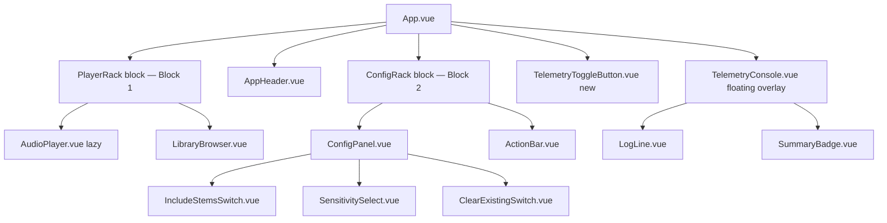
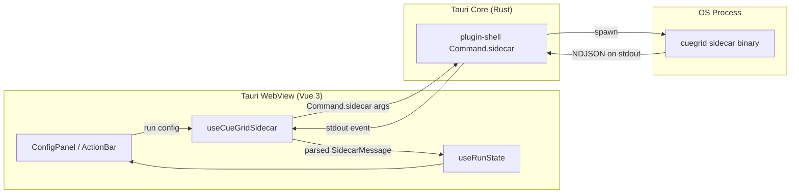
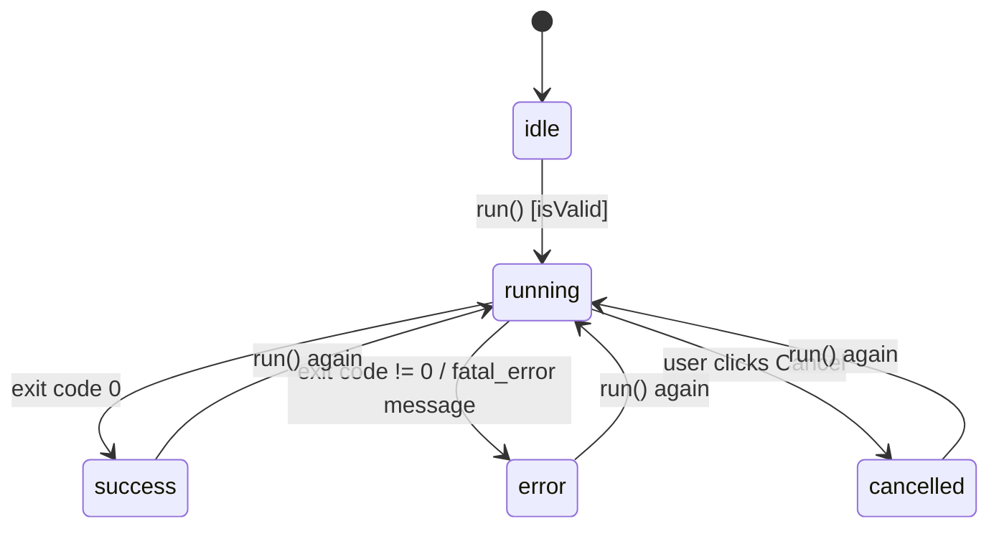

# Spec: CueGrid GUI (Phase 2 — Tauri + Vue 3)

Status: Proposed v1.7 (single-track context menu and status lifecycle) — architecture only, not yet implemented
(v1.7 adds the single-track context-menu interaction, conditional player teardown, and reactive analysis status messages; v1.5 adds the Include Stems binary switch, removes the Fast/Smart verify
selector, adds dynamic Stem availability badges in the track list, and
retains the mandatory post-operation synchronization loop between Vue
state, Wavesurfer regions, and disk-backed NML metadata, plus the
`AudioPlayer.vue` state-sanitization contract; v1.4 adds the
three-dimensional Sensitivity preset contract, binding
energy, timbre, and relative-confidence thresholds through `--mode`; v1.3
adds the user-configurable Max Cues control, reactive `maxCues`
configuration state, and the `--max-cues` sidecar argument; v1.2
cross-references the unified HotCue-pad and keyboard transport
contract defined in `3-player-spec.md` §3.9–§3.12: the 8 virtual
HotCue pads, momentary cue behavior, global keyboard shortcuts, and
relative beat-jump mechanics all live in `AudioPlayer.vue`, whose
component contract is owned by `3-player-spec.md`. This document's
§4 UI Layout diagram is updated to reflect the pad row's placement
in the transport cluster; all prior v1.1 infrastructure — the
dark-theme color tokens, the two-block resizable rack, the
floating TelemetryConsole overlay, the module-scoped composable
state pattern, and the Tauri sidecar plumbing — is preserved
unchanged.)

## 1. Scope

This spec covers the desktop GUI shell described in `1-proposal.md` Phase 2:
a single-page, dark-mode Tauri application wrapping the existing Python
`cuegrid` core (Phase 1, specified in `2-core-spec.md`) as a subprocess.

In scope:
- Vue 3 (Composition API + `<script setup lang="ts">`) component structure
  and layout for the Config Panel, Action Area, and Telemetry Console.
- State management for configuration options and run/telemetry state.
- The architectural plan for Tauri Sidecar integration: packaging the
  Python core as a sidecar binary, invoking it with the right arguments,
  and parsing its stdout as structured JSON.

Out of scope (deferred to a future spec revision):
- The actual Vue/TS implementation (components, stores, Rust command
  handlers). This document is a technical specification only.
- Exposing the "Grid-Guided Phrase Analysis tuning (advanced)" CLI flags
  (`--phrase-beats`, `--energy-threshold`, etc., `2-core-spec.md` §2.2) in
  the UI. The Configuration Panel exposes Target, Include Stems,
  Sensitivity, Max Cues, and Clear Existing; advanced tuning stays CLI-only
  until a future proposal revision asks for it.
- CSV export (`--export-csv`), multi-window support, and auto-update.
- Any change to the Python core itself. Section 6 identifies one core
  change this spec *requires* (a machine-readable output mode) and flags
  it explicitly as a dependency to raise against `2-core-spec.md`, per
  `CLAUDE.md`'s "ask to update the spec first" rule — no core code should
  be touched from this document.

## 2. Current State of the `gui/` Scaffold

The `gui/` directory is the unmodified `create-tauri-app` Vue-TS template.
Relevant facts this spec builds on:

- `gui/package.json`: Vue 3.5, `@tauri-apps/api` v2, `@tauri-apps/plugin-opener`.
  No state management library, no Tauri shell/dialog/store plugins yet.
- `gui/src-tauri/tauri.conf.json`: no `bundle.externalBin` entry — no
  sidecar is registered yet.
- `gui/src-tauri/Cargo.toml`: only `tauri-plugin-opener`; no
  `tauri-plugin-shell`.
- `gui/src-tauri/capabilities/default.json`: only `core:default` and
  `opener:default` permissions — no shell/sidecar execution permission.
- `gui/src/App.vue`: template `greet` demo. To be replaced entirely.

Section 5 and 7 enumerate the exact additions required to each of these
files (dependencies, capabilities, config) without yet writing the
Rust/TS implementation.

## 3. Component Architecture

### 3.1 Component tree



This supersedes every prior incremental diagram in this document, in
`3-player-spec.md` section 3.1, and in `4-library-spec.md` section 3.2 —
those documents' diagrams are historical snapshots of the tree *as it
grew*; this diagram is the current, final shape after the layout
restructure and telemetry refactor mandated below. Two structural
changes from the prior tree:

1. `LibraryBrowser.vue` is now a child of the **PlayerRack** block
   (Block 1), stacked directly underneath `AudioPlayer.vue`, not a
   sibling of `ConfigPanel.vue` inside the Config block. It no longer
   shares a scroll/resize region with `ConfigPanel.vue`/`ActionBar.vue`
   at all.
2. `TelemetryConsole.vue` is no longer a fixed rack block. It renders
   as a floating overlay, toggled by a new sibling component,
   `TelemetryToggleButton.vue` — see section 4 for the exact
   positioning and interaction contract.

### 3.2 File layout (`gui/src/`)

```
src/
  App.vue                       # root layout shell only — no business logic
  main.ts                       # createApp bootstrap
  components/
    AppHeader.vue                # title/branding, NML path indicator
    ConfigPanel.vue              # composes the five config controls
    TargetSelector.vue           # Track / Track Title / Playlist + text input(s)
    IncludeStemsSwitch.vue       # boolean Include Stems / Analizar Stems toggle
    SensitivitySelect.vue        # soft | medium | hard
    ClearExistingSwitch.vue      # boolean toggle
    ActionBar.vue                 # "Analyze & Inject" button + reactive analysis status
    TrackContextMenu.vue           # native-looking single-track "Analyze track" menu
    TelemetryConsole.vue          # scrolling log viewer
    LogLine.vue                   # single telemetry row (level-colored)
    SummaryBadge.vue               # final tally chip (e.g. "4/5 tracks, 12 cues")
  composables/
    useConfigState.ts             # §4 configuration state
    useRunState.ts                # §4 run/telemetry state
    useCueGridSidecar.ts           # §5 sidecar lifecycle + JSON parsing
  types/
    config.ts                     # CueGridConfig, TargetType, Sensitivity
    sidecar.ts                    # SidecarMessage discriminated union (§6)
  styles/
    theme.css                     # dark-mode design tokens (§4 of layout below)
```

Rationale for this split: `App.vue` stays a thin layout container (per
Vue SFC best practice of keeping root components free of business logic);
all config/run state lives in composables (§4) rather than component
`data`, so any component can read/mutate shared state without prop
drilling, and so `useCueGridSidecar.ts` can be unit-tested independently
of any component.

### 3.3 Component responsibilities

| Component | Responsibility | Reads | Emits / Calls |
|---|---|---|---|
| `App.vue` | Layout grid (header / config / action / console) | — | — |
| `AudioPlayer.vue` | Waveform player + transport (Play/Stop) + 8 virtual HotCue pads + global keyboard shortcuts. **The pad row, momentary cue behavior, keyboard shortcut mapping, beat-jump mechanics, and mandatory post-operation cleanup are specified in full in `3-player-spec.md` §3.9–§3.12 and §3.4/§4.2–§4.4** — that document owns the binding and lifecycle contract for this component's transport layer; this table lists it only for architectural placement. | `useConfigState()` (trackPath/targetType), `useRunState()` (post-operation sync), `usePlayerState()` (§3.7 concurrency lock, shared with `LibraryBrowser.vue`) | calls `wavesurfer` play/pause/setTime and `resetPlayerState()`; emits nothing (state is private to `usePlayerState`) |
| `ConfigPanel.vue` | Groups the 5 config controls, shows validation state | `useConfigState()` | mutates config state directly (v-model into composable refs) |
| `TargetSelector.vue` | Radio group for target type + the matching text input(s) (path / title / playlist), each with an `artist` disambiguator field mirroring `cli.py`'s mutually-exclusive group | `useConfigState()` | updates `targetType`, `trackPath`, `trackTitle`, `playlistName`, `artist` |
| `IncludeStemsSwitch.vue` | Binary switch labeled **Include Stems** (or **Analizar Stems**) | `includeStems` | updates `includeStems`; ON leaves standard sidecar parameters unchanged, OFF requests `--no-stems` |
| `SensitivitySelect.vue` | 3-way segmented control; selects the complete core sensitivity preset | `sensitivity` | updates `sensitivity` |
| `MaxCuesSelect.vue` | Compact integer selector with values 1–8 | `maxCues` | updates `maxCues` |
| `ClearExistingSwitch.vue` | Boolean switch with a short warning tooltip ("removes existing HotCues before writing") | `clearExisting` | updates `clearExisting` |
| `ActionBar.vue` | Primary CTA button; shows running (spinner + "Cancel") / success / error states and the reactive `analysisStatus` text | `useRunState().analysisStatus`, `useRunState().status`, `useConfigState()` validity | calls `useCueGridSidecar().run()` / `.cancel()` |
| `TrackContextMenu.vue` | Native-looking context menu for exactly one track row; exposes only `Analyze track` and passes that row's absolute `path` to the single-track sidecar flow | selected row and `useRunState().status` | calls the single-track analysis action; never accepts a multi-selection |
| `TelemetryConsole.vue` | Auto-scrolling, monospace log viewer; virtualizes if log count is large | `useRunState().logs` | "Clear" / "Copy" toolbar actions |
| `LogLine.vue` | Renders one `SidecarMessage`, color-coded by level/type | prop: single log entry | — |
| `SummaryBadge.vue` | Final "N/M tracks, K cues written" chip once status is `success`/`error` | `useRunState().summary` | — |

### 3.4 Props/emits convention

Every leaf control component (`IncludeStemsSwitch.vue`, etc.) follows the
same minimal contract to keep them presentational and reusable:

```ts
// generic shape shared by all segmented-control style components
interface SegmentedControlProps<T extends string> {
  modelValue: T
  options: { value: T; label: string }[]
  disabled?: boolean   // true while a run is in progress
}
defineEmits<{ (e: "update:modelValue", value: T): void }>()
```

`disabled` is driven by `useRunState().status === "running"` — the
entire `ConfigPanel` is locked while a sidecar run is active, since the
CLI's `AppConfig` (per `2-core-spec.md` §2.2) is immutable for the
duration of one process invocation.

### 3.5 Track-list context menu and Stem availability badge

Right-clicking a track row in `LibraryBrowser.vue` must open a native-looking
context menu for that row. The menu contains exactly one action:
**Analyze track**. The interaction is strictly single-track: the selected row
must provide one absolute filesystem `path`, no multi-selection state may be
accepted or converted into a batch request, and the action must invoke the
single-track sidecar contract in `2-core-spec.md` §8.6.

The menu closes after invocation, on click-away, or on `Escape`. It must not
change the active player track merely because the menu was opened. The
conditional player lifecycle for the invoked analysis is defined in §5.6.

`LibraryBrowser.vue` (and its playlist/track-row rendering path) must
consume the parsed `flags` property on each entry item. For every row, it
must evaluate the bitmask condition:

```ts
const hasAvailableStems = (entry.flags & 0x40) === 0x40
```

When `hasAvailableStems` is true, the row must dynamically render a
distinctive, compact indicator next to the track title, such as a
multi-layer, stacked-waveform, or equivalent Stem icon. The indicator means
that Traktor reports native Stems availability; it must not imply that the
current run is configured to include Stems. Rows whose `flags` are missing,
null, or do not contain bit `0x40` render no Stem badge. The icon must have
an accessible label/tooltip (for example, `Stems available`) and must not
replace or alter the track title text.

## 4. UI Layout

Single-page, single-window (per `tauri.conf.json`'s existing one-window
config), vertically stacked, fixed dark theme (proposal explicitly calls
for dark-mode; no light-mode toggle in scope). The layout is
restructured from three resizable rack blocks down to **two**, plus a
floating overlay that is no longer part of the resizable stack at all:

```
┌──────────────────────────────────────────────────────────┐
│  CueGrid                              collection.nml: ●  │  ← AppHeader
├──────────────────────────────────────────────────────────┤
│  Player                                                   │
│  ┌──────────────────────────────────────────────────────┐ │
│  │  [waveform + transport + BPM/remaining-time header]  │ │  ← AudioPlayer.vue
│  │   [▶][⏹] [1][2][3][4][5][6][7][8]   ← pad row (§3.9)  │ │    (transport: Play/Stop + 8 HotCue pads)
│  └──────────────────────────────────────────────────────┘ │
│  ┌──────────────────────────────────────────────────────┐ │
│  │  Playlists │ Artist / Title tracklist                │ │  ← LibraryBrowser.vue
│  │  (1/3)     │ (2/3, scrolls independently)             │ │    (Block 1 filler)
│  └──────────────────────────────────────────────────────┘ │
├──────────────────────────────────────────────────────────┤  ← Splitter (only one left)
│  Include Stems  [ ● on ]                                  │
│  Sensitivity    ( Soft ) ( Medium ) ( Hard )               │  ← ConfigPanel + ActionBar
│  Max Cues       [ 1 ][ 2 ][ 3 ] ... [ 8 ]                 │
│  Clear Existing  [ ⏻ off ]                                │    (Block 2, min-height enforced)
│               ┌──────────────────────────┐                │
│               │   ▶  Analyze & Inject     │                │
│               └──────────────────────────┘                │
├──────────────────────────────────────────────────────────┤
│  4/4 tracks · 12 cues written                    [success] │  ← SummaryBadge
└──────────────────────────────────────────────────────────┘
  [⧉]  ← TelemetryToggleButton.vue, fixed bottom-left,
         opens TelemetryConsole.vue as a floating overlay
         (not part of the flow above; drawn on top of it)
```

Layout notes:
- `App.vue`'s root is still a flex column chassis (`AppHeader` pinned
  at the top, `SummaryBadge` pinned at the bottom, both outside the
  resizable stack). Between them now sits a `flex-1 min-h-0 flex
  flex-col` rack of exactly **two** blocks — the **PlayerRack** (Block
  1: `AudioPlayer.vue` stacked above `LibraryBrowser.vue`) and the
  **ConfigRack** (Block 2: `ConfigPanel.vue` + `ActionBar.vue`) —
  separated by a single horizontal splitter handle. `TelemetryConsole`
  is removed from this rack entirely; it is no longer a third block.
- **Block 1 (PlayerRack) internal composition:** `AudioPlayer.vue`
  keeps a fixed-height sub-region at the top of Block 1 (unchanged
  `playerHeight`-style sizing, no independent splitter against
  `LibraryBrowser.vue` — introducing a second draggable handle inside
  Block 1 is explicitly avoided, matching the existing
  "don't overcomplicate the rack" precedent set when `LibraryBrowser`
  was first added). `LibraryBrowser.vue` is Block 1's `flex-1 min-h-0
  overflow-y-auto` filler, occupying all of Block 1's remaining height
  underneath the player. Block 1 as a whole is the layout's flexible
  region — it absorbs whatever vertical space Block 2 does not claim.
- **Block 2 (ConfigRack) sizing and the anti-clip mandate:** Block 2
  owns a reactive pixel height (`configHeight`, a `ref` bound via
  `:style="{ height: ... + 'px' }"`), resized by the single splitter
  between Block 1 and Block 2. Its minimum (`CONFIG_MIN`) is a
  **hard, non-negotiable floor** — large enough that `ActionBar.vue`'s
  primary CTA button and its status line are *always* fully visible
  and unclipped, even when the splitter is dragged as aggressively as
  possible toward Block 1. This supersedes every prior `CONFIG_MIN`
  value in this document and in `4-library-spec.md` section 3.4 (that
  value existed for a different reason — keeping the tracklist
  visible — which no longer applies now that `LibraryBrowser` has
  moved out of this block); the exact new pixel floor is an
  implementation-time tuning decision, but it must be measured against
  `ConfigPanel.vue` + `ActionBar.vue`'s actual rendered height at the
  smallest supported window size, not an arbitrary round number.
- Only **one** splitter handle remains (`h-1 cursor-ns-resize`,
  highlighting `bg-teal-500/60` on hover), between Block 1 and Block
  2. Dragging it grows/shrinks both blocks inversely, exactly as the
  prior splitter-drag mechanics worked, clamped so Block 2 never drops
  below `CONFIG_MIN` (the anti-clip floor above) and Block 1 never
  drops below a minimum sufficient to keep the player's transport
  controls visible.
- **Telemetry overlay (new):** `TelemetryConsole.vue` is rendered
  outside the resizable rack, as a `fixed`/`absolute`-positioned panel
  (e.g. a bottom-anchored or centered floating panel with a
  `backdrop-blur`/scrim behind it) that is either mounted-but-hidden or
  conditionally rendered based on a local `telemetryOpen` boolean ref
  owned by `App.vue` (matching the existing convention of keeping
  drag/UI-chrome state local to `App.vue` rather than promoting every
  toggle into a composable). It is layered above all other content
  with a high `z-index`, closable via a visible close control, a
  backdrop click, and `Escape`.
- **`TelemetryToggleButton.vue` (new component):** a small,
  unobtrusive, fixed-position button anchored to the **bottom-left**
  corner of the main app view (`fixed bottom-3 left-3`-style
  positioning, outside the flex flow entirely, sitting on top of
  `SummaryBadge`/the rack). It toggles `telemetryOpen`. It should
  visually recede when idle (e.g. a small icon-only button at reduced
  opacity, `text-muted`, brightening on hover) and may show a subtle
  indicator (e.g. a dot or count badge) when new log lines have
  arrived while the console is closed, so a running/finished job is
  never silently invisible. Exact icon/badge treatment is an
  implementation-time design decision, not fixed by this spec.
- `ActionBar`'s button remains the visually most prominent element in
  Block 2 (per proposal): full-width or large centered button, accent
  color, with a spinner + elapsed-time counter replacing the icon
  while `status === "running"`, and a secondary "Cancel" text button
  beside it in that state.
- Color tokens (dark, DJ-software aesthetic — near-black background,
  single accent color, monospace console), unchanged from the prior
  revision of this section:
  - `--bg-base: #121212`, `--bg-panel: #1c1c1e`, `--bg-elevated: #232326`
  - `--accent: #4fd1c5` (teal, evokes waveform/cue-point coloring; final
    hex is a design decision, not fixed by this spec)
  - `--text-primary: #f2f2f2`, `--text-muted: #8a8a8e`
  - `--success: #4caf50`, `--warn: #e0a72e`, `--error: #e05c5c`
  - Console font: a monospace stack (`ui-monospace, "Cascadia Code",
    "Fira Code", monospace`) at a smaller size than the rest of the UI.
- These tokens live in `styles/theme.css` as CSS custom properties on
  `:root`, replacing the template's `prefers-color-scheme` media query
  entirely (the app is always dark, not OS-dependent).

## 5. State Management

### 5.1 Approach: module-scoped composables, no external store library

Given the proposal's "lightweight" requirement and that this is a single
route/single window app with exactly two logical state slices
(configuration, run/telemetry), this spec recommends **plain Vue
Composition API state** — module-level `reactive()`/`ref()` objects
exported from composables — rather than adding Pinia or Vuex.

```ts
// composables/useConfigState.ts (shape, not implementation)
const state = reactive<CueGridConfig>({ ...defaults })

export function useConfigState() {
  return {
    ...toRefs(state),
    isValid: computed(() => validate(state)),
    reset: () => Object.assign(state, defaults),
  }
}
```

Because the object is created once at module scope and every importer
gets the same reactive proxy, this behaves like a minimal singleton
store without a dependency. If a future revision adds multi-window
support, routed views, or many more state slices, revisit this decision
and introduce Pinia at that point — noted here as the explicit upgrade
path rather than adopting it preemptively.

### 5.2 `CueGridConfig` (configuration state shape)

```ts
// types/config.ts
export type TargetType = "track" | "title" | "playlist"
export type Sensitivity = "soft" | "medium" | "hard"

export interface CueGridConfig {
  targetType: TargetType
  trackPath: string | null      // used when targetType === "track"
  trackTitle: string | null     // used when targetType === "title"
  playlistName: string | null   // used when targetType === "playlist"
  artist: string | null         // optional disambiguator, any target type
  title: string | null          // optional disambiguator, "track" mode only
  includeStems: boolean
  sensitivity: Sensitivity
  maxCues: number              // integer, 1–8; maximum cues per track
  clearExisting: boolean
  nmlPathOverride: string | null  // advanced/optional; null = auto-discover
}

export const defaultConfig: CueGridConfig = {
  targetType: "track",
  trackPath: null,
  trackTitle: null,
  playlistName: null,
  artist: null,
  title: null,
  includeStems: true,
  sensitivity: "medium",
  maxCues: 8,
  clearExisting: false,
  nmlPathOverride: null,
}
```

This maps 1:1 onto `cli.py`'s mutually-exclusive selection group and its
`--mode`/`--max-cues`/`--clear-existing`/`--artist`/`--title`/`--nml` flags,
plus the v1.5 `--no-stems` override (`build_parser`), so the
argument-building step in §6.4 is a direct translation with no hidden
Stems default living in two places. `includeStems` defaults to `true`.
When it is `false`, the sidecar argument builder appends `--no-stems`.

`SensitivitySelect` must present the following core-owned preset matrix;
selecting a sensitivity always selects all three threshold values together:

| Sensitivity | Energy threshold | Timbre threshold | Relative confidence threshold |
|---|---:|---:|---:|
| Soft | 2.0 | 8.0 | 0.15 |
| Medium (default) | 4.0 | 18.0 | 0.30 |
| Hard | 7.0 | 30.0 | 0.50 |

The GUI does not expose these advanced threshold fields independently. It
passes only the selected `--mode` value, leaving the core to resolve the
complete row and ensuring the three modes remain behaviorally distinct.

### 5.3 Validation rules

`isValid` (computed) is `true` only when:
- Exactly one of `trackPath` / `trackTitle` / `playlistName` is
  non-empty, matching the field selected by `targetType` (mirrors the
  CLI's `argparse` mutually-exclusive group, which enforces this at the
  process boundary — the GUI should never let a malformed invocation
  reach the sidecar).
- `title` is only settable (and only sent) when `targetType === "track"`
  (mirrors `cli.py`'s `main()` check at lines 386–393 that rejects
  `--title` outside single-track mode).
- `maxCues` must always be an integer in the inclusive range 1–8. The
  default is 8; values outside this range are invalid and must not be sent
  to the sidecar.
- The Action button (`ActionBar.vue`) is disabled whenever `!isValid`
  or `useRunState().status === "running"`.

### 5.4 `useRunState.ts` (run/telemetry state shape)

```ts
// composables/useRunState.ts (shape, not implementation)
export type RunStatus = "idle" | "running" | "success" | "error" | "cancelled"

interface RunState {
  status: RunStatus
  analysisStatus: string | null // reactive status text; null means render no status label
  logs: SidecarMessage[]     // append-only for the current run
  startedAt: number | null
  summary: RunSummary | null // set once a "summary" message arrives
  currentPid: number | null  // for cancellation (§6.6)
}

export interface RunSummary {
  total: number
  succeeded: number
  skipped: number
}
```

`analysisStatus` is the only status text rendered below or beside the main
execution control. The former static `status: idle` label is permanently
removed; the idle state renders no static status label. The field is reactive
and may show transient running/error text, but on successful sidecar
resolution it must use exactly these English typography strings:

- Single track: `[Track Title] analyzed successfully`
- Playlist batch: `[Playlist Name] analyzed successfully`

`[Track Title]` is the resolved track title, and `[Playlist Name]` is the
requested playlist name. The strings are case-sensitive and must not be
replaced with synonyms, prefixes, or the old `status: idle` label.

`logs` is cleared at the start of each run (not across runs), so the
console always reflects the most recent invocation; `SummaryBadge.vue`
reads `summary` and disappears (or is replaced by a "no summary yet"
placeholder) until a run completes.

### 5.5 Persistence

The last-used configuration (everything in `CueGridConfig` except
transient path/title/playlist text, which are per-run) should survive
app restarts for convenience. Recommended for this phase: serialize
`CueGridConfig` to `window.localStorage` on every change (debounced),
restored on `useConfigState()`'s module init. This avoids adding the
`tauri-plugin-store` dependency for v1; revisit if the GUI later needs
config data accessible from Rust-side code too.

### 5.6 Player State Lifecycle and Post-Operation Synchronization

The GUI must treat Vue's reactive state, Wavesurfer's internal Regions
state, and the on-disk `collection.nml` as separate state stores. No one
store is authoritative for all three. `AudioPlayer.vue` owns a mandatory
`resetPlayerState()` utility, defined in `3-player-spec.md` §3.4, and all
track reloads and NML-mutating operation completions must use it.

Any asynchronous backend operation that modifies the `.nml` — including a
completed analysis run or a successful manual deletion sidecar call —
MUST trigger this strict, sequential three-step chain:

1. **TEARDOWN:** call `resetPlayerState()`. It must use the Wavesurfer
   plugin API's `clearRegions()` to remove every active region and reset
   the global UI HotCue-pad state to unmapped/disabled. It must also
   invalidate stale listeners, callbacks, metadata, and region IDs.
2. **FORCE READ:** query the current track metadata again and parse the
   track's metadata element directly from the updated disk `.nml` file.
   This read bypasses any in-memory Vue/composable metadata cache; logs,
   optimistic state, and Wavesurfer's cache are not valid substitutes.
3. **REBUILD:** populate the reactive player state from the fresh disk
   result, derive the pad bindings from that result, and perform a clean
   Wavesurfer marker repaint from scratch.

The sidecar's successful exit code only permits this chain to begin; it
is not permission to skip the force-read step. The chain must be awaited
in order so a Vue repaint cannot race the backend write or resurrect stale
regions/pads. Failed operations may report an error and use the existing
rollback path, but a successful NML mutation is never finalized by an
optimistic UI update alone.

For analysis started from the track-row context menu, the start lifecycle
adds the following conditional rule before the sidecar is spawned:

1. Read `target_track.path` and `player.currentTrack.path` as absolute,
   normalized filesystem paths.
2. If `target_track.path === player.currentTrack.path`, trigger the full
   player unmount and teardown sequence before analysis: wipe the waveform
   canvas, clear all Wavesurfer regions, invalidate stale player listeners
   and metadata, and reset every HotCue pad to its unmapped/disabled state.
   The player is rebuilt only through the post-operation synchronization
   chain above.
3. If the paths are not equal, do **not** unmount or tear down the player.
   The active song, playback position, waveform, regions, and pads continue
   uninterrupted while the sidecar analyzes the background track.

Playlist-based analysis launched from the main panel is the safety fallback:
it always forces the full player unmount and teardown sequence before the
batch sidecar starts, regardless of which track is currently loaded. A
single-track context-menu request must never be wrapped as a one-item
playlist merely to obtain this fallback behavior.

### 5.7 Dynamic analysis status messages

The main execution control must not render a permanent static `status: idle`
label. `useRunState().analysisStatus` is the reactive text field replacing
that idle state and is the sole source for the ActionBar's analysis status
copy. On sidecar resolution, set it to exactly `[Track Title] analyzed
successfully` for a single-track run or exactly `[Playlist Name] analyzed
successfully` for a playlist batch run, as defined in §5.4. A failed or
cancelled run may set an appropriate error/cancellation message, but must not
restore the removed idle label.

## 6. Tauri Sidecar Architecture

### 6.1 Process boundary overview



The Python core is never imported into the Rust process nor run via a
system-installed `python3` — it is packaged as a **standalone
sidecar executable** (see §6.2) so end users don't need a Python
environment installed.

### 6.2 Packaging the Python core as a sidecar binary

1. Build `core/` into a single-file executable with PyInstaller (new
   build step, not yet present in `core/pyproject.toml`):
   ```
   pyinstaller --onefile --name cuegrid src/cuegrid/cli.py
   ```
2. Tauri's sidecar convention requires the binary be named with the
   Rust target triple suffix and placed where `tauri.conf.json` points,
   e.g. `gui/src-tauri/binaries/cuegrid-x86_64-pc-windows-msvc.exe`.
   `gui/src-tauri/tauri.conf.json` needs a new `bundle.externalBin`
   entry:
   ```jsonc
   {
     "bundle": {
       "externalBin": ["binaries/cuegrid"]
     }
   }
   ```
3. A build script (documented here, not yet written) copies/renames the
   PyInstaller output into `binaries/cuegrid-<target-triple><ext>` before
   `tauri build`/`tauri dev`, analogous to Tauri's documented sidecar
   workflow. This is a `core/` → `gui/` packaging step that should live
   in a top-level script (e.g. `scripts/build-sidecar.*`) once
   implemented — out of scope to write here.

### 6.3 Required dependency/permission additions (not yet present)

| File | Change |
|---|---|
| `gui/src-tauri/Cargo.toml` | add `tauri-plugin-shell = "2"` |
| `gui/package.json` | add `"@tauri-apps/plugin-shell": "^2"` |
| `gui/src-tauri/src/lib.rs` | register `.plugin(tauri_plugin_shell::init())` |
| `gui/src-tauri/capabilities/default.json` | add a scoped shell permission, e.g. `"shell:allow-execute"` restricted to the `cuegrid` sidecar (Tauri v2 capabilities support scoping `Command.sidecar` calls to a named binary; exact permission identifier to confirm against the installed `tauri-plugin-shell` version's schema at implementation time) |

No other Rust command handlers are required for the sidecar flow itself
— the frontend can invoke `Command.sidecar(...)` directly via
`@tauri-apps/plugin-shell` without a bespoke `#[tauri::command]`. (The
existing `greet` command in `lib.rs` is unrelated demo code, to be
removed when `App.vue` is replaced.)

### 6.4 Argument construction (`CueGridConfig` → argv)

`useCueGridSidecar.run()` reads the reactive configuration returned by
`useConfigState()` (including `maxCues` and `includeStems`) and builds the
argv array directly from `CueGridConfig`, mirroring `cli.py`'s parser 1:1.
`maxCues` must be an integer from 1 through 8 and is always appended as the
`--max-cues` option and its value. The Include Stems switch is binary:

- **ON:** pass the standard target, sensitivity, cue-limit, output, and
  other configured parameters; do not append `--no-stems`.
- **OFF:** append exactly one `--no-stems` flag to force regular analysis of
  the original Master audio, even if the selected entry advertises Stems
  and a `.stem.mp4` is present.

The old Fast/Smart verify-mode selector is not part of the configuration
state or argument payload.

```ts
function buildArgs(cfg: CueGridConfig): string[] {
  const args: string[] = []
  if (cfg.targetType === "track") args.push(cfg.trackPath!)
  if (cfg.targetType === "title") args.push("--track-title", cfg.trackTitle!)
  if (cfg.targetType === "playlist") args.push("--playlist", cfg.playlistName!)
  if (cfg.artist) args.push("--artist", cfg.artist)
  if (cfg.targetType === "track" && cfg.title) args.push("--title", cfg.title)
  if (cfg.nmlPathOverride) args.push("--nml", cfg.nmlPathOverride)
  // Stems are included by default; disabling them is an explicit core override.
  if (!cfg.includeStems) args.push("--no-stems")
  // --mode selects the bound energy/timbre/relative-confidence preset;
  // the GUI must not emit separate overrides for those thresholds.
  args.push("--mode", cfg.sensitivity)
  args.push("--max-cues", String(cfg.maxCues))
  if (cfg.clearExisting) args.push("--clear-existing")
  args.push("--json")   // new flag — see §6.5
  return args
}
```

### 6.5 Required core-side change: a machine-readable output mode

**This is a dependency this spec introduces on `2-core-spec.md`, not an
implementation this document performs.** `cli.py`'s `main()` currently
prints human-readable text (`print(f"{result.entry.artist} - ...")`,
etc. — see lines 430–497) with no structured mode. For the proposal's
requirement that "the Python engine ... communicat[es] with the
frontend via structured JSON over stdout" to be satisfiable, the core
needs a new `--json` flag that switches `main()`'s output to newline-
delimited JSON (NDJSON: one JSON object per line, flushed eagerly so the
GUI can stream progress rather than wait for EOF).

Per `CLAUDE.md`, this should be raised as an addition to
`2-core-spec.md` before implementation — it is called out here only to
define the *contract* the GUI is built against. Proposed message
schema (derived directly from existing core data structures —
`DetectedEvent`, `CuePoint`, `BatchTrackResult`, `BatchResult` in
`2-core-spec.md` §2.3 and §8.3):

```ts
// types/sidecar.ts
export type SidecarMessage =
  | { type: "log"; level: "info" | "warning" | "error"; message: string }
  | { type: "nml_resolved"; path: string }
  | { type: "track_start"; index: number; total: number; artist: string; title: string }
  | { type: "event_detected"; label: string; time_ms: number; confidence: number; is_major_phrase: boolean }
  | { type: "cue_written"; hotcue: number; name: string; start_ms: number }
  | { type: "track_complete"; artist: string; title: string; event_count: number; cue_count: number; error: string | null }
  | { type: "summary"; total: number; succeeded: number; skipped: number }
  | { type: "fatal_error"; message: string }
```

Every message carries only primitive/serializable fields already
present on the core's existing dataclasses, so the eventual core-side
`--json` implementation is a straight `json.dumps(asdict(...))`-style
serialization, not a new data model.

### 6.6 Frontend consumption: spawning, buffering, and parsing

```ts
// composables/useCueGridSidecar.ts (shape, not implementation)
import { Command } from "@tauri-apps/plugin-shell"

async function run(config: CueGridConfig) {
  runState.status = "running"
  runState.logs = []
  const command = Command.sidecar("binaries/cuegrid", buildArgs(config))
  let buffer = ""

  command.stdout.on("data", (chunk: string) => {
    buffer += chunk
    const lines = buffer.split("\n")
    buffer = lines.pop() ?? ""     // keep any partial trailing line
    for (const line of lines) {
      if (!line.trim()) continue
      try {
        const msg: SidecarMessage = JSON.parse(line)
        handleMessage(msg)          // pushes to runState.logs, updates summary, etc.
      } catch {
        // Non-JSON line (e.g. a stray traceback) — surface as a raw "log" entry
        // rather than dropping it silently.
        handleMessage({ type: "log", level: "error", message: line })
      }
    }
  })

  command.stderr.on("data", (chunk: string) =>
    handleMessage({ type: "log", level: "error", message: chunk })
  )

  const child = await command.spawn()
  runState.currentPid = child.pid

  command.on("close", async (data: { code: number | null }) => {
    runState.status = data.code === 0 ? "success" : "error"
    runState.currentPid = null
    // On a successful NML mutation, AudioPlayer.vue must await
    // resetPlayerState() → force disk metadata read → clean rebuild.
    // The player owns this chain; run completion is not a cue source.
    if (data.code === 0) {
      await playerStateLifecycle.syncAfterNmlMutation()
    }
  })
}
```

Key points this section fixes as the plan (not yet implemented):
- **Line buffering is required**: `stdout.on("data", ...)` delivers
  chunks, not lines; NDJSON parsing must buffer and split on `\n`,
  carrying over any partial final line to the next chunk.
- **Non-JSON stdout is not fatal**: any line that fails `JSON.parse`
  (stray `print()`, a Python traceback that bypassed `--json` mode, a
  third-party library's warning) is surfaced as an `error`-level log
  line instead of crashing the parser or being silently dropped —
  important since a subprocess boundary is inherently less trustworthy
  than an in-process call.
- **`stderr` is treated as `log`/`error`**, separate from `stdout`'s
  structured stream, since Python tracebacks and low-level warnings
  naturally go to stderr regardless of `--json` mode.
- **Exit code is the final source of truth** for `success` vs. `error`,
  not the presence/absence of a `summary` message, so a crash after
  partial output still resolves to a terminal state rather than hanging
  in `"running"` forever.
- **Cancellation**: `child.pid` is retained in `runState` specifically
  so `ActionBar.vue`'s "Cancel" button can call `child.kill()`
  (`@tauri-apps/plugin-shell`'s `Child.kill()`), transitioning `status`
  to `"cancelled"`. Since `run_batch_pipeline` writes each track's cues
  immediately after that track succeeds (`2-core-spec.md` §8.3),
  cancelling mid-batch is safe — already-written tracks stay written,
  matching the core's own documented semantics.
- **Post-operation synchronization is mandatory**: when a successful
  sidecar operation may have changed the NML, `AudioPlayer.vue` must
  await the §5.6 chain (TEARDOWN → FORCE READ → REBUILD). `cue_written`
  messages remain telemetry and must never be used as the final reactive
  or marker state.

### 6.7 State machine



## 7. Telemetry Export (v1.8)

### 7.1 Export control

`ActionBar.vue` must render a secondary action button labeled exactly
**Export telemetry** (sentence case) next to the dynamic `analysisStatus`
message display. This control is subordinate to the primary analysis action
and must remain hidden or disabled whenever `analysisStatus` is `null`. It
may be enabled only when a non-null analysis status indicates that telemetry
from an execution is available.

### 7.2 Native save-dialog workflow

The frontend must integrate with Tauri's native file-dialog API and use its
`save` operation for export. When the user activates **Export telemetry**:

1. The frontend requests a destination from the operating system by calling
   Tauri's `save` dialog API, optionally supplying a CSV file filter and a
   default filename.
2. If the user cancels the dialog, the export ends without writing a file or
   changing run state.
3. If the user chooses a system path, the frontend extracts the contents of
   the sidecar's internal `last_run_telemetry.csv` cache from the
   application's local data directory and saves those CSV bytes to the
   selected path.
4. The export must copy the cached last-run data as-is, including its stable
   header and all rows from the most recent execution. It must not generate a
   new analysis run or mutate the internal cache.

The chosen destination is user-controlled and is distinct from the fixed
internal cache path defined by `2-core-spec.md` §14. The frontend must
surface a native/API error if cache extraction or writing the selected file
fails; a cancelled dialog is not an error.

## 8. Open Items / Follow-ups

1. **Core spec dependency (blocking real sidecar wiring):** add a
   `--json` NDJSON output mode to `cli.py`/`main()`, per §6.5. This
   should be proposed as an addition to `2-core-spec.md` before any
   Rust/TS sidecar code is written, per this project's `CLAUDE.md` rule.
2. **PyInstaller packaging script**: `core/pyproject.toml` has no build
   step for a standalone executable yet; a `scripts/build-sidecar.*`
   (or equivalent) needs to be added alongside the `gui/` sidecar wiring
   in §6.2–6.3.
3. **Exact `tauri-plugin-shell` v2 capability identifier** for scoping
   `Command.sidecar` to a single named binary should be confirmed against
   the plugin version pinned at implementation time (§6.3).
4. **Track file picking UX**: the proposal only specifies a "Target"
   input; whether the "track" target type gets a native file-picker
   (`@tauri-apps/plugin-dialog`) or a plain text path field is left as
   an implementation-time UX decision, not fixed by this spec.
