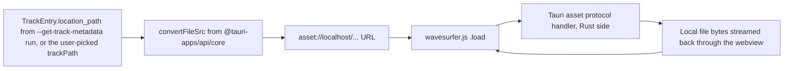
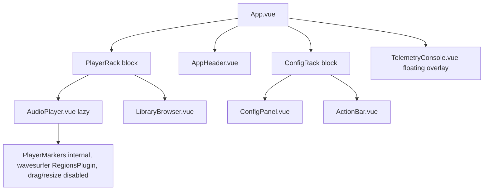
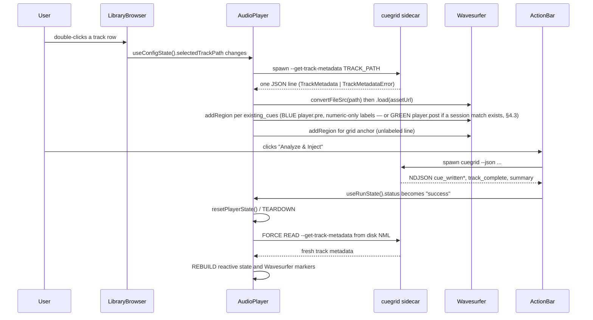
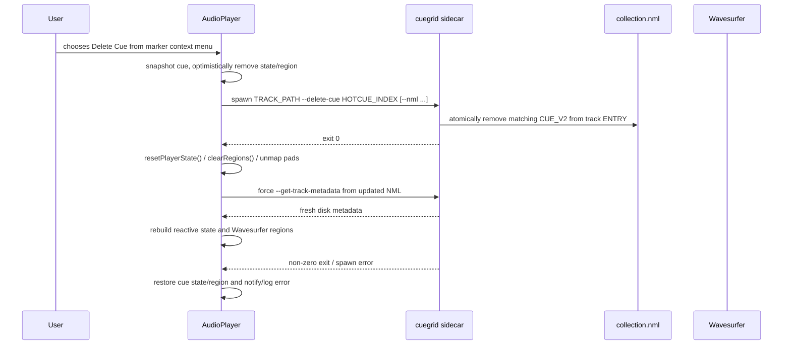

# Spec: Integrated Waveform Player & Grid Visualizer (Phase 3)

Status: Proposed v1.5 — architecture only, not yet implemented
(v1.5 adds the mandatory post-operation synchronization loop and
`resetPlayerState()` sanitization contract for every asynchronous NML
mutation; v1.3 adds §3.13's Delete Cue context-menu action with persistent
sidecar deletion, optimistic state/UI updates, and rollback; v1.2's
§3.9's 8 virtual HotCue pads, §3.10's momentary cue behavior for
pad/keyboard triggers, §3.11's global keyboard shortcut mapping, and
§3.12's relative beat-jump mechanics; v1.1's
`isLoadingTrack` concurrency lock, §3.8's placeholder waveform state,
§4.3's session-scoped stage persistence, §5.4's marker-label
collision mitigation, and §5.1's two fixed stage colors — BLUE for
Stage 1 and GREEN for Stage 2 — are all preserved unchanged)
Source of truth: `1-proposal.md` (Phase 2 GUI), `2-core-spec.md` (core
pipeline/CLI contract), `3-gui-spec.md` (existing Tauri + Vue 3
component architecture and sidecar plumbing, whose v1.2 revision
cross-references the unified pad/keyboard transport contract defined
here in §3.9–§3.12)

This document is the binding technical specification for Phase 3: a
waveform player and beatgrid visualizer embedded in the existing CueGrid
GUI, giving the user a visual preview of a track's existing HotCues
*before* running analysis, a live repaint of the newly injected HotCues
immediately *after* a successful "Analyze & Inject" run, and a
persistent Delete Cue action for removing one existing HotCue from the
underlying NML. Per `CLAUDE.md`, no implementation should begin until this
contract is reviewed and this Status line is updated to "Resolved".

This spec **extends, but does not modify**, `2-core-spec.md` and
`3-gui-spec.md`. Section 1 below defines one new core-side CLI
capability (`--get-track-metadata`) as a proposed addition to
`2-core-spec.md` (candidate section 13); everything else is new,
additive GUI architecture layered on top of `3-gui-spec.md` section 3's
existing component tree. No existing message schema, `AppConfig`
field, `CueGridConfig` field, or NML read/write behavior changes.

---

## 0. Scope

In scope:
1. A new standalone core CLI flag, `--get-track-metadata`, that returns
   pre-analysis metadata (tempo, grid anchor, existing cues) as a single
   JSON object without running any audio analysis (section 1).
2. The Tauri "asset bridge" data flow required for `wavesurfer.js`,
   running inside the webview, to decode a local audio file selected via
   an absolute filesystem path (section 2).
3. The `AudioPlayer.vue` component contract: placement, lifecycle,
   props/emits, and the read-only rendering boundary (section 3).
4. The two-stage synchronization flow between the GUI's existing
   config/run state (`3-gui-spec.md` section 5) and the player's marker
   overlay, before and after an analysis run (section 4).
5. Visual design tokens and marker-label/color rules consistent with the
  existing dark theme (`3-gui-spec.md` section 4) (section 5).
6. A horizontal row of 8 virtual HotCue pads inside `AudioPlayer.vue`,
   with per-pad enabled/disabled state keyed off the loaded track's
   bound cues, placed immediately right of the Play/Stop transport
   buttons (section 3.9).
7. Momentary cue-auditioning behavior for both mouse and keyboard
   triggers of the §3.9 pads, matching native Traktor hardware
   ergonomics: press to seek-and-play, release to pause (section 3.10).
8. A global keyboard shortcut layer mapping keys `1`–`8` to the pads,
   `Space` to Play/Pause toggle, and `Enter` to Stop (return-to-zero),
   active only when the user is not focused on input elements
   (section 3.11).
9. Relative ±8-beat jump navigation via `ArrowLeft`/`ArrowRight`,
   computed dynamically from the loaded track's BPM, with mandatory
   boundary clamping and no-op safety (section 3.12).

Out of scope (deferred to a future spec revision):
- Manual hotcue creation or drag-and-drop repositioning on the waveform
  canvas. The canvas remains **read-only** for editing; the explicitly
  permitted Delete Cue context-menu action is specified in §3.13 and is
  not a canvas-drag or creation interaction. (Momentary cue
  *auditioning* via pads/keyboard in §3.9–§3.12 is a playback transport
  action, not a canvas edit.)
- Zooming/scrubbing UX polish, or playback transport beyond the
  explicitly specified pads/keyboard contract in sections 3.9–3.12
  (left fully to implementation time as long as section 3's contract
  is respected).
- Multi-track "preview queue" scrubbing during a batch/playlist run —
  the player only ever displays the single track currently selected in
  `TargetSelector.vue`'s `"track"` mode (see section 4's scoping note).
- Any change to `core.pipeline`, audio analysis, or the existing
  `CUE_V2` analysis-write contract (`2-core-spec.md` sections 3–8).
  Delete Cue is the separately specified single-cue mutation in
  `2-core-spec.md` section 13.

---

## 1. Core Extension: Pre-Analysis Metadata Sync

### 1.1 `--get-track-metadata <TRACK_PATH>` CLI flag

A new standalone, top-level `cli.py` flag, architecturally identical in
spirit to `--list-playlists` (`2-core-spec.md` section 12): a
lightweight, read-only metadata query that bypasses the entire audio
pipeline. Added to `build_parser()` **outside** the mutually-exclusive
track-selection group (section 8.4), since it is not itself a
processing-target selector:

```python
parser.add_argument(
    "--get-track-metadata",
    type=str,
    default=None,
    dest="get_track_metadata",
    metavar="TRACK_PATH",
    help=(
        "Skip audio analysis and Librosa entirely: parse the NML, "
        "locate the entry matching TRACK_PATH, and print a single JSON "
        "object with its artist/title/bpm/grid anchor and existing "
        "HotCues, then exit. Intended for the GUI's waveform player to "
        "sync markers before any analysis runs."
    ),
)
```

Compatible with `--nml` (explicit collection path, resolved via the
existing `_resolve_nml_path`, section 7.1) and with `--artist`/`--title`
as pure disambiguators passed straight through to
`NmlParser.find_entry(track_path, title=..., artist=...)` — identical
semantics to single-track mode's own disambiguation (section 7.3, step
6). It ignores every tuning flag (`AppConfig`, section 2.2), `--verify`,
`--mode`, `--clear-existing`, and `--json` (section 11) — this flag has
its own dedicated one-shot JSON output, described below, never NDJSON.

### 1.2 `cli.py` interception in `main()`

`args.get_track_metadata` is checked immediately after the
`--list-playlists` interception (section 12.3) and before
`logging.basicConfig(...)`/the mutually-exclusive selector validation —
this mode never emits log records and never validates the normal
selector group:

1. Resolve the NML path exactly as `--list-playlists` does
   (`_resolve_nml_path`). If resolution fails, print the same plain-text
   error to stderr and return `1` (unchanged from today's behavior —
   this failure mode predates any track lookup, so it is not itself
   modeled by the JSON error schema in 1.4).
2. Construct `NmlParser(nml_path)` and call
   `find_entry(args.get_track_metadata, title=args.title, artist=args.artist)`.
3. On success, build and print the success schema (1.3) as a single
   line to **stdout**, then `sys.exit(0)`.
4. On `TrackNotFoundError`/`AmbiguousTrackError`, catch the exception,
   print the corresponding error schema (1.4) as a single line to
   **stdout** (not stderr — see the rationale below), then
   `sys.exit(1)`.

No `AppConfig`, `core.pipeline`, `audio.*`, or `nml.writer` code runs in
this path, matching `--list-playlists`'s own non-goals (section 12.4).

**Why stdout for the error case, not stderr:** every other consumer of
this flag (section 4's `useTrackMetadata.ts`) already buffers stdout
and parses exactly one JSON line on process close, exactly like
`TargetSelector.vue`'s existing `--list-playlists` consumption (see
`3-gui-spec.md`'s pattern, mirrored in `gui/src/components/TargetSelector.vue`).
Routing the error through the same channel as success means the GUI
never needs a second, stderr-specific code path for this flag — the
exit code (`0` vs `1`) disambiguates success/error, matching the
existing "exit code is the final source of truth" rule
(`2-core-spec.md` section 11.6), while the JSON body itself stays
uniformly on stdout instead of leaking a raw Python traceback that
would otherwise land on stderr un-structured.

### 1.3 Success schema

All fields required, single line, no NDJSON envelope (this is a
one-shot value, matching `--list-playlists`'s own framing choice,
section 12.3, step 4 — not section 11's message-type framing):

```json
{
  "artist": "Carbon Based Lifeforms",
  "title": "Central Plains",
  "bpm": 128.0,
  "grid_anchor_ms": 356.0,
  "existing_cues": [
    {"hotcue": 1, "name": "Intro End", "start_ms": 16106.0, "type": "CUE"},
    {"hotcue": 2, "name": "Drop", "start_ms": 47950.0, "type": "CUE"},
    {"hotcue": 3, "name": "Outro", "start_ms": 210375.0, "type": "CUE"}
  ]
}
```

| Field | Source | Notes |
|---|---|---|
| `artist` | `TrackEntry.artist` | verbatim |
| `title` | `TrackEntry.title` | verbatim |
| `bpm` | `TrackEntry.tempo.bpm` | verbatim, float |
| `grid_anchor_ms` | `TrackEntry.grid_anchor_ms` | verbatim; the `START` of the `TYPE=4` (`GRID`) cue, section 3 |
| `existing_cues` | `TrackEntry.cues` | filtered + shaped, see below |

**`existing_cues` shaping rules:**
- Excludes any `CuePoint` with `type == CueType.GRID` (`4`). The grid
  anchor is already surfaced once, unambiguously, via the top-level
  `grid_anchor_ms` field; re-emitting it inside `existing_cues` would
  force every consumer to special-case/de-duplicate it before
  rendering (section 5's marker rules deliberately treat the grid
  anchor as a distinct visual element, never a hotcue marker).
- Sorted ascending by `start_ms`, matching Traktor's own on-screen cue
  ordering.
- `type` is the `CueType` enum member's **name** (`"CUE"`, `"FADE_IN"`,
  `"FADE_OUT"`, `"LOAD"`, `"LOOP"`), not its integer value — this is a
  presentation-only serialization choice specific to this flag (unlike
  section 11's `cue_written`, which never needs to carry `type` at all,
  since the core only ever *writes* `CueType.CUE`). String names let
  the frontend's color-mapping table (section 5.2) key directly off a
  human-readable name with no core-side enum import.
- `hotcue`, `name`, `start_ms` are `CuePoint.hotcue`, `CuePoint.name`,
  `CuePoint.start_ms` verbatim (`hotcue` may be `-1` for a cue not bound
  to a pad — the frontend renders these without a `[N]` bracket label,
  section 5.2).

### 1.4 Error schema

```json
{"error": "not_found", "message": "No entry found matching 'C:\\Music\\track.mp3'."}
```

```json
{"error": "ambiguous", "message": "Multiple tracks share this LOCATION. Narrow it down with --title and/or --artist."}
```

| `error` value | Raised from | `message` |
|---|---|---|
| `"not_found"` | `TrackNotFoundError` | `str(exc)`, unchanged wording from the exception |
| `"ambiguous"` | `AmbiguousTrackError` | `str(exc)` plus the same disambiguation hint text already used elsewhere in `cli.py` (e.g. lines around 602–608) |

Both shapes are a flat two-key object — deliberately not a variant of
the success schema (no `artist`/`title`/etc. keys at all) — so a
consumer can distinguish success from error with a single
`"error" in obj` check before touching any other field.

### 1.5 Non-goals

- No NDJSON, no progress messages — this is always exactly one line on
  stdout, exactly like `--list-playlists`.
- No new `AppConfig` field, no change to `find_entry`'s signature or
  matching behavior (section 7.3) — this flag only adds a new
  `cli.py`-side rendering of already-existing `TrackEntry`/`CuePoint`
  data.
- No batch form (no `--get-track-metadata` equivalent for
  `--playlist`/`--track-title`) — Phase 3's player only ever previews
  one track at a time (section 0), so a batch variant has no consumer
  yet and is deliberately not speculatively added.

---

## 2. Tauri Asset Bridge

### 2.1 The problem

`wavesurfer.js` runs inside the Tauri webview and decodes audio via a
standard `fetch()`/`<audio>` URL. It cannot be pointed directly at an
absolute local filesystem path (e.g. `C:\Users\dj\Music\track.flac` or
`/Users/dj/Music/track.flac`) — webviews block `file://` fetches for
security reasons, and even where they don't, Tauri's own IPC/asset
sandboxing does not implicitly expose the raw filesystem to arbitrary
JS `fetch()` calls. The player must therefore go through Tauri's
**asset protocol**, not a raw path string.

### 2.2 Mandated data flow



1. The absolute path used to load the waveform is the same
   `location_path`-equivalent string the player already has: either
   `useConfigState().trackPath` (the path the user picked/typed in
   `TargetSelector.vue`'s `"track"` mode) or, once available, the
   resolved path echoed back by a future core enhancement — for this
   phase, `trackPath` is authoritative, since `--get-track-metadata`'s
   success schema (section 1.3) does not itself echo the path back
   (deliberately kept minimal; adding it would be a trivial future
   addition, not required for Phase 3).
2. **Mandatory:** the frontend must call
   `convertFileSrc(trackPath)` (imported from `@tauri-apps/api/core`)
   to transform that absolute path into a secure, webview-fetchable
   URL of the form `asset://localhost/<percent-encoded-path>` (or the
   platform-equivalent `https://asset.localhost/...` origin, depending
   on the installed `@tauri-apps/api` version's convention — confirm
   against the pinned version at implementation time; both are produced
   by the same `convertFileSrc` call, so no call-site branching is
   needed).
3. That URL, and *only* that URL, is passed to
   `wavesurfer.value.load(assetUrl)`. Raw paths must never be passed to
   `wavesurfer.load()` directly.

### 2.3 Required `tauri.conf.json`/capability additions (not yet present)

| File | Change | Why |
|---|---|---|
| `gui/src-tauri/tauri.conf.json` | add `app.security.assetProtocol.enable: true` | The asset protocol handler is disabled by default; without this, `asset://` URLs 404 inside the webview. |
| `gui/src-tauri/tauri.conf.json` | add `app.security.assetProtocol.scope` covering the directories audio files may live in | The asset protocol enforces an explicit allow-list of readable paths/globs, separate from `dialog:allow-open`'s own scope. Since Traktor libraries commonly span multiple drives/removable media, this phase scopes broadly (e.g. `["**"]`) rather than guessing a fixed root — no narrower than the risk already accepted by `dialog:default` (section 6.3 of `3-gui-spec.md`), which already lets the user pick an arbitrary file from anywhere on disk. |
| `gui/package.json` | add `"wavesurfer.js": "^7"` | New runtime dependency; not present today (confirmed via `grep` — no existing reference in `gui/`). |

No new `tauri-plugin-shell`-style Rust command or capability
`permissions` entry is required for `convertFileSrc`/the asset
protocol itself — unlike `Command.sidecar` (which needs the
`shell:allow-spawn` scoping already present, `3-gui-spec.md` section
6.3), the asset protocol is a built-in webview URL scheme gated purely
by the `app.security.assetProtocol` config block above, not by the
`capabilities/*.json` permission model.

### 2.4 Non-goals

- No change to how the sidecar (`Command.sidecar`) is invoked — the
  asset bridge is unrelated to, and does not replace, the NDJSON
  stdout pipe described in `3-gui-spec.md` section 6.
- No thumbnail/waveform pre-rendering on the Rust side. Decoding is
  entirely client-side, inside `wavesurfer.js`, from the bytes streamed
  through the asset protocol.

---

## 3. Frontend Architecture: `AudioPlayer.vue` Component Contract

### 3.1 Placement in the existing component tree

`AudioPlayer.vue` is a new, isolated, **lazily-loaded** component. Per
`3-gui-spec.md` section 4's revised layout, it is placed at the top of
the **PlayerRack** block (Block 1), with `LibraryBrowser.vue` stacked
directly beneath it inside the same block (not above `ConfigPanel.vue`
in a flat list — the two-block rack structure, not a flat sequence, is
now the source of truth for placement):



**The `wavesurfer.js` `TimelinePlugin` node is removed from this tree
and from the component entirely** (see section 4.1, revised, and
section 5.2, revised) — the player renders only the waveform surface
and its point-region marker overlay; there is no bottom time-ruler
track. `PlayerTimeline` as an internal sub-node no longer exists.

`AudioPlayer.vue` remains **lazily-loaded** (`defineAsyncComponent`, or
a dynamic `import()` at the `App.vue` call site) for the same reason
as before — `wavesurfer.js`'s Web Audio decoding machinery has no
reason to be part of the initial bundle/paint, so the config panel and
telemetry toggle are immediately interactive while the player chunk
loads in the background.

### 3.2 File layout additions (`gui/src/`)

```
src/
  components/
    AudioPlayer.vue                 # §3 — this component
  composables/
    usePlayerState.ts               # §4/§3.7 — loaded-track + marker state + isLoadingTrack (mirrors useRunState.ts's shape)
    useTrackMetadata.ts             # §1 — spawns --get-track-metadata, parses the one-shot JSON result
    useAnalysisSession.ts           # §4.3 — session-scoped cue_written map, cleared on every new run
    types/
      trackMetadata.ts                # §1.3/§1.4 — TrackMetadata / TrackMetadataError / ExistingCue
```

### 3.3 Props / emits

`AudioPlayer.vue` is self-contained: it reads `useConfigState()` (for
`trackPath`/`targetType`) and `useRunState()` (for Stage 2 sync, section
4.2) directly, exactly as `TargetSelector.vue` and `ConfigPanel.vue`
already do (`3-gui-spec.md` section 3.3's "Reads" column) — no props
are required for its core data flow. It accepts exactly one prop,
matching the disabling convention used by every other top-level panel:

```ts
interface AudioPlayerProps {
  disabled?: boolean; // true while a run is in progress (mirrors ConfigPanel's `locked`)
}
```

It emits nothing. All state it produces (currently-loaded metadata,
marker list) is private to the component's own composable
(`usePlayerState.ts`), not broadcast upward — no other component reads
the player's internal state in this phase.

### 3.4 Lifecycle rules

`AudioPlayer.vue` must implement a `resetPlayerState()` utility as the
single teardown/sanitization entry point for track reloads and analysis
cycles. It must clear all active Wavesurfer regions through the Regions
plugin API (`clearRegions()`), reset the global UI HotCue-pad projection
to unmapped/disabled, clear the loaded metadata and marker collections,
and detach or invalidate component-owned event listeners and pending
callbacks. The utility must leave no ghost event-listeners, stale region
IDs, or stale cue-to-pad bindings that can survive into the next load.
It is called before every track reload and as step 1 of the mandatory
post-operation synchronization loop in §4.2/§4.4.

- **On mount:** if `useConfigState().trackPath` is already non-null
  (e.g. restored from persisted config, section 5.5 of
  `3-gui-spec.md`), immediately kick off Stage 1 (section 4.1).
- **On `trackPath` change** (a `watch` on
  `useConfigState().trackPath`, active only while `targetType ===
  "track"`): tear down the current waveform/markers and re-run Stage 1
  for the newly selected path. Debounced (e.g. 400ms) if the input is a
  free-text field rather than the file-picker button, so keystroke-by-
  keystroke edits don't spawn a sidecar process per character.
- **On unmount:** `wavesurfer.value.destroy()` **must run
  unconditionally**, in a plain `onUnmounted` hook, with no guard other
  than a null-check on the ref itself:

  ```ts
  onUnmounted(() => {
    wavesurfer.value?.destroy();
    wavesurfer.value = null;
  });
  ```

  This is a hard requirement, not a nice-to-have: `wavesurfer.js`
  allocates a `AudioContext` (and, depending on backend, a
  `MediaElementSourceNode`) that is never garbage-collected by the
  browser/webview on its own. Because `AudioPlayer.vue` reacts to
  `trackPath` changes by tearing down and recreating the instance
  (previous bullet), *every* track switch is itself a mini
  mount/unmount cycle from the waveform's perspective even though the
  Vue component itself stays mounted — so the same unconditional
  `destroy()` call must also run at the top of the "track changed"
  handler, not only in `onUnmounted`. Skipping this is the single
  most likely source of a slow `AudioContext` leak that degrades a
  long-running desktop session, which is exactly the failure mode this
  rule exists to prevent.

**`isLoadingTrack` boundary (new in v1.1 — full contract in §3.7):**
the shared `isLoadingTrack` flag (`usePlayerState()`, §6) is set to
`true` at the very first line of the track-change handler /
`onMounted` Stage 1 kickoff — strictly before `destroyWaveform()` runs
— and is set back to `false` only once one of these terminal events
fires: the `wavesurfer` `"ready"` event (success), a
`TrackMetadataError` result (§1.4), or a `wavesurfer` `"error"` event
(decode failure). This window is wider than the existing `isDecoding`
local ref (which only covers the `wavesurfer.load()` call itself) —
`isLoadingTrack` also covers the `--get-track-metadata` sidecar
round-trip that happens *before* `wavesurfer.load()` is even called,
since that round-trip is exactly the multi-second delay the
concurrency lock in §3.7 and `4-library-spec.md` §4.4 exists to guard
against.

### 3.5 Read-only rendering boundary

This phase renders markers via `wavesurfer.js`'s Regions plugin
configured **read-only**:

- Every region/marker added by `AudioPlayer.vue` is a **point region**
  (`start === end`) created with `drag: false` and `resize: false`.
- No `region-updated`/`region-created`/click-to-add-region handlers are
  ever wired up. The canvas is purely a visualization surface.
- No double-click-to-add-cue, no keyboard shortcut for inserting a
  marker, and no drag/resize editing. A custom context menu is permitted
  only for the explicitly specified **Delete Cue** action in §3.13; it
  must not turn the waveform canvas into a generally editable surface.

### 3.6 Header time indicators

The player's header row (`AudioPlayer.vue`'s existing track-identity /
BPM row, currently rendering `trackHeader` and `bpmLabel`) gains one
new element: a **Remaining Time** indicator, placed immediately to the
**left** of the BPM indicator, in the same `flex items-center gap-3
text-xs text-muted font-mono` cluster.

- Format: `-MM:SS`, always prefixed with a literal `-` (e.g. `-02:14`
  for 2 minutes 14 seconds remaining). No hours segment — tracks in
  scope for this tool are well under an hour.
- Computed as `duration - currentTime`, both sourced from
  `wavesurfer`'s own playback state (`wavesurfer.getDuration()` and the
  `"timeupdate"`/`"ready"` events, or the currently-tracked
  `currentTime` ref if one already exists at implementation time) —
  **not** derived from any NML/`TrackMetadata` field. This is local,
  transient playback UI state, not part of the shared `usePlayerState`
  singleton (section 6): it resets naturally whenever the loaded track
  changes, exactly like the existing `isPlaying`/`isDecoding` local
  refs.
- Hidden entirely (rendered as nothing, not as `-00:00`) whenever
  `!hasTrack` — i.e. before a waveform has finished decoding — mirroring
  how `bpmLabel`'s own `v-if="bpmLabel"` guard already behaves.
- Display order in the header cluster, left to right: **Remaining
  Time → BPM → stage → cues**, i.e. the new indicator is inserted
  immediately before the existing `bpmLabel` span, not appended after
  it.

### 3.7 Loading Feedback & Concurrency Lock (`isLoadingTrack`)

**Problem this section fixes:** `--get-track-metadata`'s sidecar
round-trip plus `wavesurfer`'s own audio decode together take multiple
seconds on a cold start, during which the prior implementation gave no
feedback at all — and nothing stopped the user from clicking a second
track mid-load, racing the first request.

- **State lives in the shared singleton, not a local ref.** `usePlayerState()`
  (§6) gains a new field, `isLoadingTrack: boolean`, alongside
  `markers`/`markerStage`/etc. It must be shared (not a private ref
  inside `AudioPlayer.vue`) specifically so `LibraryBrowser.vue` can
  read it too — the concurrency lock is a cross-component contract,
  detailed from the Library Browser's side in `4-library-spec.md` §4.4.
- **Transition boundary:** exactly as defined in §3.4's new paragraph
  above — set `true` before teardown begins, set `false` on the first
  terminal event (ready / metadata error / decode error).
- **Mandatory visual indicator:** while `isLoadingTrack` is `true`,
  `AudioPlayer.vue` renders a clear, unmistakable loading affordance
  (a spinner, or pulsing/animated text such as "Loading…") **absolutely
  positioned over the entire waveform area** — the same fixed-size box
  described in §3.8, regardless of whether that box currently holds a
  real waveform, a stale previous waveform mid-teardown, or the
  placeholder pattern. This supersedes/broadens the existing
  `isDecoding`-driven "decoding audio…" overlay: implementers may keep
  `isDecoding` as a narrower internal signal that feeds into
  `isLoadingTrack`, but the *outward*, spec-mandated contract is the
  wider `isLoadingTrack` window, and the overlay must remain visible for
  that entire window — including the metadata-fetch phase that happens
  before `wavesurfer.load()` is ever called, not just the decode
  sub-phase.
- **No competing overlays:** only one loading indicator is ever shown
  at a time for a given load; the overlay is keyed purely off
  `isLoadingTrack`, not off `isDecoding` and `isLoadingTrack`
  independently, to avoid two overlapping "loading" messages flickering
  during the same operation.

### 3.8 Placeholder Waveform (Empty State)

**Problem this section fixes:** the "No track selected" empty state
previously rendered no waveform box at all, so the player's overall
height collapsed whenever no track was loaded (on first boot, and any
time `selectedTrackPath` is cleared) — every panel beneath the player
(the Library Browser, per `4-library-spec.md` §3.4) visibly jumped up
and down as tracks were loaded and cleared.

- **The waveform canvas region is a fixed-height slot, always
  rendered.** The container div `AudioPlayer.vue` already sizes for a
  loaded waveform (the `containerRef` element, currently instantiated
  with `height: 96` at the `wavesurfer.create()` call) must render at
  that same fixed height/width footprint **unconditionally** — never
  behind a `v-if` on `hasTrack`. Only the *contents* of that box switch
  between three mutually-exclusive states; the box itself never
  resizes or disappears:
  1. **Real waveform** — `hasTrack && !isLoadingTrack`: wavesurfer's own
     canvas, exactly as today.
  2. **Loading overlay** — `isLoadingTrack` (§3.7): drawn on top of
     whichever of states 1/3 is currently underneath.
  3. **Placeholder pattern** — `!hasTrack && !isLoadingTrack`: a static,
     muted visual standing in for "no audio decoded yet" — e.g. a
     repeating CSS bar pattern that echoes wavesurfer's own bar-style
     rendering, a faint SVG texture, or a plain muted box using the
     existing `bg-zinc-800`/`border-border` tones already used for the
     container's own chrome. The exact visual is an implementation
     choice — this spec mandates only that it **occupies the identical
     box** (same `w-full`, same fixed height token) as state 1, with no
     conditional height/margin/padding difference between any of the
     three states.
- **No layout shift, by construction.** Because the outer box is
  unconditionally rendered at a fixed size, clearing or loading a track
  never changes the vertical position of anything below the player —
  this is the whole point of the mandate, not an incidental side
  effect.
- **Interaction with wavesurfer's own DOM ownership:** `wavesurfer.js`
  writes its canvas directly into the container element on
  `create()`/`load()`. While no track is loaded, the container's
  children are the placeholder markup instead; `destroyWaveform()`
  (§3.4) already unconditionally tears down the previous `wavesurfer`
  instance before the placeholder would ever need to reappear on a
  clear, so there is no DOM ownership conflict between the two.

### 3.9 Virtual HotCue Pads (UI Layout)

**Problem this section fixes:** the prior revision's transport row
exposed only Play/Stop buttons, giving the user no way to audition a
specific cue's position without scrubbing the canvas — a regression
versus native Traktor hardware, where 8 physical pads give instant
access to the bound hotcues. This section adds the on-screen equivalent
of those pads, and §3.10–§3.12 wire them (and the keyboard) to
momentary cue-audition behavior.

- **Layout:** `AudioPlayer.vue`'s transport row gains a horizontal row
  of **8 small, numbered pad buttons**, labeled `1` through `8`, placed
  **immediately to the right of the Play/Stop buttons** (i.e. the
  existing Play/Stop cluster stays leftmost; the pad row is appended
  after it in the same flex row, not on a new line). The pads use the
  same `font-mono`/`text-xs`/dark-panel chrome tokens as the rest of
  the transport row (§5.3), so they read as a natural extension of the
  existing controls, not a visually distinct widget.
- **1-indexed user label, 0-indexed NML binding:** pad button `N`
  (1-indexed, as printed on its label) corresponds to the NML
  `HOTCUE` attribute value `N - 1` (0-indexed), exactly matching the
  `N = hotcue + 1` convention already used for point-region labels in
  §5.2. This is the same mapping native Traktor hardware uses: pressing
  physical pad 1 fires the cue stored at `HOTCUE="0"`.
- **Per-pad enabled state — strict contract:** a pad button is **active
  and clickable if and only if** the loaded track has a valid, bound
  HotCue for that pad index in `usePlayerState().metadata.existing_cues`
  (§6) — i.e. there exists an `ExistingCue` whose `hotcue === padIndex -
  1` (where `padIndex` is the 1-indexed pad number). Unmapped pads must
  render in a **disabled, translucent, non-clickable** state (`disabled`
  attribute, reduced opacity, `cursor-not-allowed`, no pointer event
  handlers firing). This is a hard contract, not a styling suggestion:
  an unmapped pad must never trigger §3.10's momentary behavior under
  any mouse or keyboard input.
- **Source of truth for the bound-cue lookup:** the same
  `usePlayerState().metadata.existing_cues` array that §4.1/§4.2 already
  build the canvas markers from. The pad row is therefore a second
  projection of the *same* cue data — it never carries its own
  independent copy of the cue list, and it re-renders automatically
  whenever the Stage 1 → Stage 2 transition (§4.2) replaces the cue
  array. No new state slice is introduced for pad enabled/disabled
  state; it is always derived.
- **Visual mapping to canvas markers:** when a pad is enabled, its
  number visually corresponds to the same-numbered point-region label
  on the waveform canvas (§5.2's bare-`N` label). This is intentional:
  the pad row and the canvas markers are two views of one cue set, and
  a user looking at pad 3 and the canvas label `3` should understand
  them as the same hotcue. The pad does **not** render the cue's
  `name` (e.g. `"Drop"`) on its face — only its number — matching the
  canvas's own bare-number minimalism.
- **Interaction with `isLoadingTrack` (§3.7):** while
  `isLoadingTrack` is `true`, **all 8 pads** render disabled regardless
  of bound-cue state, since no track is reliably loaded to seek within.
  This is consistent with the broader concurrency lock: the transport
  row as a whole is non-interactive during a load.

### 3.10 Momentary Cue Behavior (Pads Interaction)

**Traktor-style momentary cueing** is the mandated interaction model
for both mouse and keyboard triggers of the §3.9 pads. This is the
same ergonomics native Traktor hardware uses: holding a pad down
auditions the cue's position in real time, and releasing it stops
playback — the cue is *not* a "jump and continue playing" action.

- **On Press (`mousedown` / `keydown`):** instantly seek the
  `wavesurfer` playhead to the cue's exact `start_ms` position and
  trigger immediate playback:
  ```ts
  wavesurfer.setTime(cue.start_ms / 1000);
  wavesurfer.play();
  ```
  The seek must happen *before* `play()` so playback begins from the
  cue point, not from wherever the playhead happened to be. The
  `start_ms` value is the same field already stored on the
  corresponding `PlayerMarker` (§6) / `ExistingCue` (§1.3) — no new
  time field is introduced.
- **On Release (`mouseup` / `mouseleave` / `keyup`):** instantly pause
  playback:
  ```ts
  wavesurfer.pause();
  ```
  `mouseleave` is included alongside `mouseup` so that dragging the
  pointer off the pad while held still releases the cue (matching
  native hardware's "lift your finger" semantics); without it, a
  `mousedown` on a pad followed by a drag away would leave playback
  running indefinitely.
- **Keyboard repeat guard (hard requirement):** the `keydown` listener
  for pad keys must strictly guard against native browser key-repeat
  events, so that holding down a pad key does not spam restart
  commands:
  ```ts
  function onPadKeyDown(event: KeyboardEvent, padIndex: number) {
    if (event.repeat) return;   // hard guard — do not remove
    // ... seek + play ...
  }
  ```
  Without this guard, the browser's auto-repeat (which fires
  `keydown` repeatedly while a key is held) would re-seek-and-restart
  playback on every repeat tick, producing a stuttering restart loop
  instead of a single clean audition from the cue point. The `keyup`
  listener needs no such guard (a key release fires exactly once per
  physical release).
- **Mouse ↔ keyboard parity:** the same momentary seek-and-play /
  pause-on-release logic must run for both input paths. Implementations
  are encouraged to route both through a single `pressPad(padIndex)` /
  `releasePad(padIndex)` pair so the two paths cannot drift; the spec
  mandates only that the *observable behavior* is identical, not the
  internal factoring.
- **Disabled-pad safety:** if a pad is disabled per §3.9's contract
  (no bound cue, or `isLoadingTrack` is true), neither the mouse nor
  the keyboard trigger may fire §3.10's seek/play logic. The keyboard
  handler must re-check the pad's enabled state at `keydown` time
  (not assume the listener was only bound when enabled), since the
  global keyboard layer (§3.11) is registered once and dispatches by
  key, not per-pad.

### 3.11 Global Keyboard Shortcuts Mapping

A **global keyboard shortcut layer** is registered on `window` (not
on the pad elements themselves), so the §3.9 pads are operable without
focus, matching native Traktor hardware's always-on pad behavior.

- **Input-focus guard (hard requirement):** the listeners are **active
  only when the user is not focused on an input element.** Before
  dispatching any shortcut, the handler must check
  `document.activeElement` and bail out (return early, no-op) when the
  focused element is one of: `input`, `textarea`, `select`, or any
  element with `isContentEditable === true`. Without this guard, typing
  a literal `1`–`8` into `TargetSelector.vue`'s path field or
  `ConfigPanel.vue`'s artist/title disambiguator fields would
  misfire as a pad press, and `Space`/`Enter` would collide with the
  browser's default text-input/submit behavior. The guard runs *before*
  the `event.repeat` check (§3.10) and before any pad-enabled-state
  lookup, so input typing never even reaches pad logic.
- **Mappings (exact contract):**
  - **Keys `1` through `8`** → map to HotCue Pads 1 to 8, with the
    **exact same momentary press/release playback behavior** defined in
    §3.10. `keydown` fires `pressPad(N)` (guarded by `event.repeat`);
    `keyup` fires `releasePad(N)`. The `event.key` string is matched
    against `"1"`..`"8"` (not `event.code`'s `Digit1`..`Digit8`), so
    the mapping is layout-agnostic for top-row digit keys on common
    layouts; numpad digits are intentionally *not* mapped (they would
    collide with existing accessibility/numeric-entry expectations).
  - **Key `Space`** → toggles standard Play/Pause playback state
    (i.e. `wavesurfer.isPlaying() ? wavesurfer.pause() :
    wavesurfer.play()`). This is a **toggle**, not momentary: pressing
    Space starts playback if paused and pauses if playing, with no
    seek. `event.preventDefault()` must be called to suppress the
    browser's default space-scrolls-page behavior. Only `keydown` is
    handled for Space; `keyup` is a no-op (no repeat guard needed for
    a toggle, but `event.repeat` should still be ignored to avoid
    double-toggling on held-key auto-repeat).
  - **Key `Enter`** → triggers **Stop**: pauses playback and instantly
    returns the playhead to the very beginning of the track (`0.0`):
    ```ts
    wavesurfer.pause();
    wavesurfer.setTime(0);
    ```
    This is distinct from Space's toggle: Enter always pauses *and*
    rewinds, regardless of current play state. Only `keydown` is
    handled; `keyup` is a no-op.
- **Listener lifecycle:** the global `keydown`/`keyup` listeners are
  registered in `AudioPlayer.vue`'s `onMounted` and removed in its
  `onUnmounted` (alongside the existing `wavesurfer.destroy()` teardown
  from §3.4). They are **not** registered on `window` at module scope,
  because the player is lazily loaded (§3.1) and a module-scope
  listener would outlive the component and fire on pages where no
  player exists.
- **No-op safety:** every mapping must safely no-op when no track is
  loaded (`!hasTrack`) or while `isLoadingTrack` is true (§3.7),
  exactly as the §3.9 pad row does. The input-focus guard and the
  no-track guard together ensure the keyboard layer never triggers
  `wavesurfer` calls against a null/unready instance.

### 3.13 Delete Cue Context-Menu Action

The player exposes a custom context menu for an existing cue marker. The
menu contains **Delete Cue** only when the marker represents a deletable
standard HotCue (`ExistingCue.hotcue >= 0`, corresponding to an NML
`TYPE="0"` cue). Grid anchors and other non-standard cue types have no
Delete Cue action.

When the user clicks **Delete Cue**, the frontend must:

1. Capture the complete `ExistingCue` object and its Wavesurfer region
   reference before changing anything. The cue's `hotcue` value is the
   NML zero-based index and is passed unchanged.
2. Immediately remove that cue from `metadata.value.existing_cues` and
   remove the corresponding point region from Wavesurfer. The pad
   enabled/disabled projection must update from that same array, so the
   deleted pad becomes disabled immediately.
3. Invoke `useCueGridSidecar` (or a dedicated delete-sidecar composable)
   with the deletion operation and the loaded track identifier, using
   the core contract exactly:
   ```ts
   Command.sidecar(SIDECAR_NAME, [
     trackPath,
     "--delete-cue",
     String(cue.hotcue),
     ...(nmlPath ? ["--nml", nmlPath] : []),
     ...(artist ? ["--artist", artist] : []),
     ...(title ? ["--title", title] : []),
   ])
   ```
   The implementation may use an equivalent argument order, but it must
   pass `TRACK_PATH` and `--delete-cue HOTCUE_INDEX`; it must not invoke a
   visual-only hide or mutate only a local marker collection.
4. Treat process exit code `0` as committed. On success, keep the cue
   removed and update the shared metadata/state and marker list as the
   current NML truth.
5. If the sidecar exits with any non-zero code, rejects, or cannot be
   spawned, restore the captured cue at its original array position and
   restore/recreate its Wavesurfer region with its original stage color,
   label, and metadata. The rollback must also restore the pad's enabled
   state.
6. On failure, show a user-visible error notification and append an
   actionable error to the existing run/telemetry log. The error must
   identify that NML deletion failed; a silent rollback is not compliant.

The delete request is single-flight per cue: disable its menu action while
pending, ignore duplicate clicks, and associate the response with the
captured track/token so a late response cannot restore a cue on a
subsequently loaded track. A successful deletion must not trigger a full
waveform reload; the marker overlay and shared metadata are sufficient.

### 3.12 Relative Beat-Jump Mechanics

**Relative ±8-beat jump navigation** via `ArrowLeft`/`ArrowRight`,
computed dynamically from the loaded track's BPM — the same kind of
beat-relative seek native Traktor hardware exposes on its jog wheel.

- **Mappings:**
  - **`ArrowLeft`** → jump **backward** 8 beats from the current
    playback position.
  - **`ArrowRight`** → jump **forward** 8 beats from the current
    playback position.
- **Math (exact contract):** one beat length in seconds is calculated
  dynamically from the loaded track's BPM:
  ```ts
  const beat_duration_sec = 60.0 / metadata.bpm;
  const jump_duration_sec = 8.0 * (60.0 / metadata.bpm);
  ```
  The `60.0` numerator is the literal constant (seconds per minute);
  the `8.0` multiplier is the fixed 8-beat jump size mandated by this
  section (not a tunable). `metadata.bpm` is the same field already
  populated by `--get-track-metadata` (§1.3) and stored on
  `usePlayerState().metadata` (§6) — no new BPM source is introduced.
- **Boundary clamping (hard requirement):** the jump must never seek
  below `0` or above the track's duration. The exact mandated
  expressions are:
  ```ts
  // ArrowLeft
  wavesurfer.setTime(Math.max(0, current_time - jump_duration_sec));
  // ArrowRight
  wavesurfer.setTime(Math.min(duration, current_time + jump_duration_sec));
  ```
  where `current_time` is `wavesurfer.getCurrentTime()` and `duration`
  is `wavesurfer.getDuration()`, both read at the moment the key fires
  (not cached from a stale ref). The `Math.max(0, ...)` /
  `Math.min(duration, ...)` clamps are mandatory: an unclamped
  `setTime(negative)` or `setTime(beyond_duration)` has undefined
  behavior in `wavesurfer.js` and must not be relied on.
- **No-op safety (hard requirement):** this feature must safely no-op
  if **any** of the following hold:
  - No track is loaded (`!hasTrack`).
  - `metadata` is `null` (metadata fetch has not completed / failed).
  - `metadata.bpm` is missing, `undefined`, `null`, `NaN`, or `<= 0`
    (a non-positive BPM would divide by zero or produce a nonsensical
    negative/`Infinity` jump duration). The guard is:
    ```ts
    if (!metadata || !metadata.bpm || metadata.bpm <= 0) return;
    ```
  This guard runs *before* the `beat_duration_sec` computation, so a
  bad BPM never reaches the division.
- **Playback state is preserved:** a beat-jump does **not** toggle
  play/pause — if the track was playing before the jump, it continues
  playing from the new position; if it was paused, it stays paused at
  the new position. `wavesurfer.setTime()` preserves the playing state
  on its own; the handler must not call `play()` or `pause()`.
- **Keyboard repeat:** unlike §3.10's momentary pads, beat-jump on
  `ArrowLeft`/`ArrowRight` **does** fire on `event.repeat` — holding
  the arrow key repeats the 8-beat jump, which is the expected
  ergonomics (hold to scrub through the track in 8-beat increments).
  The input-focus guard from §3.11 still applies: arrow keys pressed
  while focused on an input element must not trigger a jump (they
  should move the text cursor as normal).

---

## 4. The Two-Stage Synchronization Flow

The player has exactly two synchronization triggers, both scoped to
`useConfigState().targetType === "track"` (section 0's scoping note —
title/playlist batch modes never drive the player, since there is no
single track to visually anchor it to until one is resolved).



*(Note: this also updates the participant name from `TargetSelector`
to `LibraryBrowser`, reflecting `4-library-spec.md`'s supersession of
`TargetSelector.vue`, and removes the `instantiate TimelinePlugin`
step.)*

### 4.1 Stage 1: On Selection

Triggered by the lifecycle rules in section 3.4. Steps, in order:

1. `useTrackMetadata.ts` spawns the sidecar with
   `Command.sidecar(SIDECAR_NAME, ["--get-track-metadata", trackPath])`
   — the same one-shot spawn-buffer-parse-on-close pattern already used
   by `TargetSelector.vue`'s `--list-playlists` call (`3-gui-spec.md`
   section 3.3 / current `TargetSelector.vue` implementation), not the
   NDJSON streaming pattern of `useCueGridSidecar.ts`.
2. On process close: `JSON.parse` the single buffered line.
   - If it matches `TrackMetadataError` (section 1.4's shape — i.e. has
     an `"error"` key), surface it as a non-fatal inline message inside
     `AudioPlayer.vue` (e.g. "Track not found in collection.nml") and
     stop — no waveform is loaded, no crash.
   - Otherwise, treat it as `TrackMetadata` (section 1.3) and proceed.
3. Call `convertFileSrc(trackPath)` (section 2.2) and
   `wavesurfer.value.load(assetUrl)`.
4. Once `wavesurfer`'s `"ready"` event fires (audio decoded, duration
   known), the player does **not** instantiate a Timeline plugin or
   render any bottom time-ruler track — that plugin and its bar-line
   ticks are removed entirely from this phase (superseding the prior
   revision of this section, which specified `beatLengthSec`-derived
   `TimelinePlugin` gridlines). The only grid-related visual is the
   single, unlabeled grid-anchor line described in section 5.2, drawn
   via the Regions plugin exactly like every other marker, phase-set
   directly from `grid_anchor_ms` (no beat-length math is needed to
   place it, since it is a single point, not a repeating ruler).
4. For each entry in `existing_cues` (section 1.3), add a point region
   (section 3.5) labeled per section 5.2's rules, colored `player.pre`
   (BLUE) by default — **unless** §4.3's session lookup finds a match
   for this track, in which case the session's cues are painted
   instead, colored `player.post` (GREEN), per §4.3 step 4.

### 4.2 Stage 2: Post-Analysis Sync

Triggered when `useRunState().status` transitions to `"success"` and the
completed run may have modified the NML for the currently loaded track.
The synchronization source is always the disk-backed metadata query, not
`useRunState().logs` or an optimistic Vue collection. Any asynchronous
backend operation that modifies the `.nml` — including analysis completion
and a successful manual deletion sidecar call — **MUST** execute the
following three steps sequentially, with the next step starting only after
the previous step completes:

1. **TEARDOWN:** call `resetPlayerState()` (§3.4). This must completely
   clear all active Wavesurfer regions through the Regions plugin API
   (`clearRegions()`) and reset the global UI HotCue-pad state to
   unmapped/disabled before any fresh metadata is applied.
2. **FORCE READ:** invoke the standalone `--get-track-metadata` query for
   the current track and force a fresh parse of that track's metadata
   element directly from the updated disk `collection.nml`. This read must
   bypass any in-memory Vue metadata/composable cache and must not use
   `cue_written` messages as the authoritative cue set.
3. **REBUILD:** replace the reactive player metadata and cue collections
   with the fresh disk result, derive the pad bindings from that result,
   and repaint all Wavesurfer markers from scratch. The rebuilt regions
   use the normal stage/color rules in §5 and the clean state must be the
   only rendered overlay.

For analysis, `AudioPlayer.vue` watches the terminal success transition,
then awaits this chain. It must not repaint directly from the NDJSON log;
those messages are telemetry only. A playlist/batch run still applies the
chain to each loaded track only when that track's metadata was modified and
is the current player target. If the run transitions to `"error"` or
`"cancelled"`, no disk mutation is assumed and the existing display may
remain in place.

The chain is deliberately sequential: no reactive rebuild may race the
sidecar's disk write, and no stale Wavesurfer region or pad binding may be
allowed to survive the forced read.

### 4.3 Session-Scoped Persistence Across Track Previews

This subsection formalizes the color-semantics and session-lifecycle
rules mandated by the UX review. It supersedes §5.1's prior "cycle the
active palette by `hotcue % 3`" rationale (§5.1 is revised in lockstep)
and is extended by `4-library-spec.md` §4.3's batch-aware trigger
mechanics — read both together.

1. **Two fixed stage colors, not a cycling palette.** Every marker is
   colored purely by *which stage produced it*, never by hotcue slot:
   - Stage 1 (pre-existing cue, from `--get-track-metadata`'s
     `existing_cues`) → `player.pre` (BLUE, §5.1 revised).
   - Stage 2 (newly injected cue, from an NDJSON `cue_written` message,
     live or session-replayed) → `player.post` (GREEN, §5.1 revised).
2. **`useAnalysisSession.ts`** (new composable, §3.2's file layout) is
   a module-scoped singleton, structurally mirroring `useRunState.ts`,
   holding exactly one field: a map from `` `${artist}::${title}` ``
   to that track's `cue_written` entries from the most recently
   *completed* run:
   ```ts
   // composables/useAnalysisSession.ts (shape)
   interface AnalysisSessionState {
     tracks: Map<string, ExistingCue[]>; // key: `${artist}::${title}`
   }
   ```
   - `clearSession()`: empties the map. Called unconditionally at the
     very top of `useCueGridSidecar.ts`'s `run()`
     (`4-library-spec.md`/`3-gui-spec.md` §6.6), *before* `startRun()`
     — i.e. before any NDJSON message from the new run can possibly
     arrive. This is the **"Session State Clear on New Run"** mandate:
     every click of "Analyze & Inject" discards whatever the previous
     run's session tracking held, unconditionally, regardless of what
     is currently previewed in the player.
   - `captureRun(logs)`: called exactly once, only on the
     `"running" → "success"` edge (never on `"error"`/`"cancelled"`,
     matching §4.2's existing "nothing new was actually written to
     disk" gating), scanning the just-finished run's full NDJSON log in
     order and grouping every `cue_written` message under its
     enclosing `track_start`/`track_complete` pair's `artist`/`title`
     key (the grouping algorithm `4-library-spec.md` §4.3 specifies)
     into the map, replacing it wholesale — a completed run's capture
     is always a full, fresh snapshot of that run's own writes, not a
     merge on top of whatever `clearSession()` already emptied it to.
3. **Decoupled from the Telemetry Console.** `useAnalysisSession`'s map
   is intentionally a separate singleton from `useRunState().logs` —
   clicking `TelemetryConsole.vue`'s "Clear" toolbar action
   (`clearLogs()`, `3-gui-spec.md` §3.3) empties the visible console
   but must **not** empty the session map. Without this separation,
   clearing the console would silently downgrade every
   already-analyzed track back to Stage 1/BLUE the next time it's
   previewed, even though its cues are still sitting in
   `collection.nml` exactly as the run wrote them.
4. **Stage resolution on every track preview (Stage 1, revised):**
   `runStage1(path)` (§4.1), after a successful `--get-track-metadata`
   fetch, resolves the marker set as follows instead of unconditionally
   painting `existing_cues`:
   - Look up `` `${metadata.artist}::${metadata.title}` `` in
     `useAnalysisSession()`'s map.
   - **Match found** → this track was part of the latest completed
     run. Paint its cues from the session map using `player.post`
     (GREEN), and set `markerStage = "post-analysis"` — the header
     reads `stage: post-analysis`, exactly as if Stage 2 had just run
     live, even though the user is previewing it fresh via the Library
     Browser well after the run finished.
   - **No match** → falls back to today's Stage 1 behavior unchanged:
     paint `existing_cues` with `player.pre` (BLUE),
     `markerStage = "pre-analysis"`.
   - The grid anchor line (`player.grid`) is unaffected by this branch
     either way — always drawn once from `metadata.grid_anchor_ms`,
     never re-colored (§5.2, unchanged).
5. **Live Stage 2** (the `"running" → "success"` edge while a track is
   already previewed, §4.2) is unchanged in mechanics but now benefits
   from step 2's `captureRun()` call happening at the same moment — so
   a track previewed *during* a run and a track previewed *after* the
   fact converge on the exact same code path and the exact same
   GREEN/`post-analysis` result, instead of risking visual drift
   between a live-repaint path and a fresh-preview path.

This closes the loop the mandate calls **"Persistent Stage 2 within a
Session"**: any track touched by the latest "Analyze & Inject" run
renders GREEN/`post-analysis` no matter when or how many times it is
subsequently reloaded into the player, until the *next* run starts and
`clearSession()` wipes the slate.

---

### 4.4 Delete Cue Synchronization and Rollback

Delete Cue is a third, user-initiated synchronization path in addition to
Stage 1 metadata loading and Stage 2 post-analysis repaint. It applies
only to the currently loaded single track (`targetType === "track"`).
The canonical flow is:



The sidecar's non-zero exit code is authoritative. The frontend must not
interpret the absence of a thrown process error, a partial stdout line, or
the optimistic visual state as proof of persistence. On a zero exit code,
the frontend must not simply keep the optimistic removal: it must execute
the mandatory three-step post-operation synchronization loop in §4.2
(TEARDOWN → FORCE READ from disk → REBUILD). The freshly reread metadata is
the authority, and the deleted cue must then be absent from the reactive
metadata, Wavesurfer Regions overlay, and enabled-pad projection. If a
track switch occurs while deletion is pending, the response is stale and
must be ignored for the new track; the new track's Stage 1 metadata load is
authoritative. A failed deletion may use the existing snapshot rollback,
but that rollback is never a substitute for the successful-mutation
synchronization loop.

---

## 5. Visual Rules

### 5.1 Marker color palette (revised in v1.1 — two fixed stage colors)

Extends `3-gui-spec.md` section 4's existing Tailwind dark-theme design
tokens (`--bg-base`, `--accent`, etc., already defined in
`gui/tailwind.config.js`) with a small, dedicated marker palette rather
than introducing an unrelated color system:

| Purpose | Token (new, `tailwind.config.js` `theme.extend.colors.player`) | Tailwind-equivalent hue | Used by |
|---|---|---|---|
| Stage 1 marker — pre-existing cue, any `CueType`, no session match | `player.pre` | `blue-400` (`#60a5fa`) | §4.1/§4.3, `existing_cues` |
| Stage 2 marker — newly injected cue (live repaint or session-matched preview) | `player.post` | matches existing `--success` (`#4caf50`) | §4.2/§4.3, `cue_written` |
| Grid anchor line | `player.grid` | `border-strong` (`#3a3a3e`) | section 4.1/4.2, drawn once, never re-colored |

**Two fixed stage colors, not a hotcue-keyed cycle (revised in v1.1):**
the prior revision of this table cycled the *active* (Stage 2) palette
through three hues (`teal`/`green`/`blue`) by `hotcue % 3`, on the
theory that adjacent pads should look visually distinct. The UX review
reversed this decision: a marker's color must communicate **which
stage produced it** — "is this a cue Traktor already had, or one this
tool just wrote?" — not which hotcue pad it happens to be bound to.
`player.pre` (BLUE) always means Stage 1/pre-existing; `player.post`
(GREEN) always means Stage 2/newly-injected, full stop, regardless of
`hotcue` value. §4.3 formalizes exactly when each stage applies,
including the session-persistence rule that lets a track keep
rendering GREEN/`post-analysis` even when it's reloaded well after the
run that produced its cues finished.

Stage 1's BLUE markers, by contrast, **can** span every `CueType` (a
track may already have manually-placed `LOAD`/`FADE_IN`/`LOOP` cues
from prior Traktor use) — §4.1/§4.3 intentionally render *all* of them
in the single `player.pre` tone regardless of type, per the same
"a single, consistent tone communicates a shared stage" logic that now
also governs `player.post` — a single stage color is the only
distinction Stage 1 needs to make between an old manual `LOAD` cue and
an old manual `CUE` hotcue.

### 5.2 Marker labels

Point-region labels are stripped to bare minimalism — no bracket
punctuation, no cue names, no ruler text:

- A cue with `hotcue >= 0` is labeled with **only its raw pad number**,
  `N = hotcue + 1` (Traktor numbers its 8 hotcue pads 1–8 on-screen;
  the NML's `HOTCUE` attribute is 0-indexed, section 3.2 of
  `2-core-spec.md`). E.g. `HOTCUE="1"` → label `"2"`. This supersedes
  the prior `"[N]"` bracketed form **and** the current implementation's
  `` `${label} ${name}`.trim() `` concatenation (`AudioPlayer.vue`'s
  `addPointRegion` call site) — the cue's `name` (e.g. `"Drop"`,
  `"Intro End"`) is no longer rendered on the canvas at all, for any
  bound cue. It remains available in `usePlayerState()`'s
  `PlayerMarker.name` field for any future tooltip/inspector UI, but
  the point-region's visible `content` is the bare number only.
- A cue with `hotcue == -1` (not bound to a pad) has no pad number to
  show. It is labeled with just its `name` (unchanged from the prior
  revision) — this is the one case where a text label still renders,
  since there is no numeric substitute.
- The grid anchor (`grid_anchor_ms`) is rendered as a distinct vertical
  line using `player.grid`, exactly as before, but it **no longer
  carries the `"grid"` text label** — its `content` is empty. It is a
  purely visual line with no caption, distinguishable from hotcue
  markers by color and by having no text at all.

### 5.3 Design constraints

- No new color system: every token in section 5.1 is defined as a
  Tailwind `theme.extend.colors` entry, consistent with how `accent`,
  `success`, `warn`, `error` are already declared in
  `gui/tailwind.config.js` — no inline hex codes in component
  `<style>` blocks or scattered CSS variables outside that one file.
- The player's own chrome (background, transport controls) uses the
  existing `bg-panel`/`text-muted`/`text-primary` tokens already used
  by `ConfigPanel.vue`/`TelemetryConsole.vue` — it must look like a
  natural extension of the existing panel stack, not a visually
  distinct "widget" bolted on top.
- **The header row's numeric indicators — Remaining Time and BPM —
  use the existing `font-mono` stack** (`gui/tailwind.config.js`'s
  `fontFamily.mono`), matching `TelemetryConsole.vue`'s own monospace
  convention for numeric/telemetry content. (This replaces the prior
  bullet about the Timeline plugin's ruler-label typography, which no
  longer applies now that the Timeline plugin is removed.)

### 5.4 Marker label collision mitigation (new in v1.1)

**Problem:** the Regions plugin's default HTML label rendering stacks
overlapping labels downward when two point-regions land close together
in time, producing an increasingly tall, awkward staircase of text as
more markers cluster (e.g. a fast intro with a `LOAD` cue, a
`FADE_IN` cue, and hotcue 1 all within a second of each other).

**Mandate: a two-row stagger**, applied purely via CSS, keyed off
marker index parity — not a `wavesurfer.js`-version-specific API, so it
survives a future minor-version bump:

- Every point region's label element receives an ordinal CSS class
  (e.g. `marker-even` / `marker-odd`) set by `addPointRegion` at
  creation time, cycling `0, 1, 0, 1, ...` in **the order markers are
  painted** (ascending `start_ms`, since both §4.1 and §4.2 already
  build their marker arrays sorted by time).
- A scoped `<style>` rule in `AudioPlayer.vue` offsets the two classes
  vertically, e.g.:
  ```css
  :deep(.marker-even) { top: 2px; }
  :deep(.marker-odd)  { top: 16px; }
  ```
  (exact pixel values are an implementation detail; the requirement is
  a **visible, non-zero vertical offset** between the two classes,
  large enough that two labels whose regions are less than one
  label-width apart in time never overlap each other's text — only
  their vertical connector lines may sit close together.)
- This is a **local, two-row stagger**, not a full "move every label
  into a dedicated top ruler lane" redesign — each marker's vertical
  line/tick still renders at its true horizontal position on the
  waveform; only the *text* is nudged into one of two fixed vertical
  bands immediately above the waveform, alternating band per marker in
  time order. A future revision may replace this with a dedicated
  ruler lane if the two-row stagger proves insufficient for very dense
  cue clusters (4+ markers within a second), but that is **not
  required by this spec** — two rows is the mandated baseline.
- This rule applies identically to Stage 1 (BLUE) and Stage 2 (GREEN)
  markers — the stagger is purely about label position, orthogonal to
  §5.1's color rules.

---

## 6. Data Structures (TypeScript)

```ts
// types/trackMetadata.ts — mirrors §1.3/§1.4 exactly, no derived fields.
export type CueTypeName = "CUE" | "FADE_IN" | "FADE_OUT" | "LOAD" | "LOOP";

export interface ExistingCue {
  hotcue: number;       // -1 = unbound
  name: string;
  start_ms: number;
  type: CueTypeName;
}

export interface TrackMetadata {
  artist: string;
  title: string;
  bpm: number;
  grid_anchor_ms: number;
  existing_cues: ExistingCue[];
}

export interface TrackMetadataError {
  error: "not_found" | "ambiguous";
  message: string;
}

export type TrackMetadataResult = TrackMetadata | TrackMetadataError;

export function isTrackMetadataError(
  r: TrackMetadataResult,
): r is TrackMetadataError {
  return "error" in r;
}
```

```ts
// composables/usePlayerState.ts (shape, not implementation) — mirrors
// useRunState.ts's module-scoped-singleton pattern (§5.1 of 3-gui-spec.md).
export type MarkerStage = "pre-analysis" | "post-analysis";

interface PlayerMarker {
  hotcueLabel: string | null; // "[N]" or null (unbound cue, name-only label)
  name: string;
  startMs: number;
  colorToken: string;         // "player.pre" (BLUE) or "player.post" (GREEN), §5.1 revised
}

interface PlayerState {
  loadedTrackPath: string | null;
  metadata: TrackMetadata | null;
  metadataError: TrackMetadataError | null;
  markers: PlayerMarker[];
  markerStage: MarkerStage | null;
  isLoadingTrack: boolean; // §3.7 — shared concurrency lock, read by LibraryBrowser.vue too
}
```

```ts
// composables/useAnalysisSession.ts (shape, not implementation) — §4.3.
// Module-scoped singleton, structurally mirroring useRunState.ts. Tracks
// which artist/title pairs were touched by the *latest completed* run,
// decoupled from useRunState().logs (which the Telemetry Console's
// "Clear" action may wipe independently, §4.3 point 3).
export interface AnalysisSessionState {
  tracks: Map<string, ExistingCue[]>; // key: `${artist}::${title}`
}
```

---

## 7. Non-Goals (this document)

- No PyInstaller/sidecar packaging changes beyond what
  `3-gui-spec.md` section 6.2 already specifies — `--get-track-metadata`
  ships in the same `cuegrid` sidecar binary as every other flag.
- No schema versioning on `TrackMetadata`/`TrackMetadataError` (matches
  `2-core-spec.md` section 11.7's own stance on NDJSON messages) — a
  future breaking change adds a version field then, not speculatively
  now.
- No offline/cached waveform storage. Every track selection re-decodes
  audio via `wavesurfer.load()`; no waveform peak-cache file is written
  to disk in this phase.
- No visual-only cue hiding: Delete Cue is not complete unless the
  sidecar returns exit code `0` after physically updating `collection.nml`.
- No accessibility (screen-reader) treatment of the canvas beyond
  whatever `wavesurfer.js`/`RegionsPlugin` provide out of the box —
  flagged here as a known gap, not silently ignored, but out of scope
  for Phase 3.

## 8. Open Items / Follow-ups

1. ~~Confirm `wavesurfer.js` v7 Timeline plugin's anchor/offset API...~~
   **Removed** — the Timeline plugin is no longer part of this
   component (section 3.1/4.1, revised); there is nothing to confirm
   against a plugin version that is no longer instantiated.
2. **Confirm the exact `asset://`/`https://asset.localhost` URL form**
   produced by the installed `@tauri-apps/api` version's
   `convertFileSrc` (section 2.2) — both forms exist across Tauri v2
   minor versions; `wavesurfer.load()` accepts either as a plain URL
   string, so no spec-level ambiguity results, but implementers should
   not hardcode an assumed scheme in tests/fixtures.
3. **The core-side deletion contract is defined in
   `2-core-spec.md` section 13**; implementation remains blocked until
   both this document and that core section are reviewed and their Status
   lines are updated to "Resolved".
4. **Confirm the exact CSS class/selector names `wavesurfer.js`'s
   Regions plugin generates for a region's label element** (§5.4) at
   the pinned `wavesurfer.js` v7 minor version — the `:deep(.marker-even)`/
   `:deep(.marker-odd)` selectors in §5.4 assume the label is reachable
   via a class added at creation time (via the `content` option's
   returned/assigned element), not a guessed built-in class name.
5. **`isLoadingTrack`'s small race window** (§3.7, documented further
   in `4-library-spec.md` §4.4's "known limitation") between a click
   firing and the flag actually flipping `true` is accepted as-is for
   this revision, absorbed by the pre-existing `stage1Token` staleness
   guard (§4.1) rather than closed at the input level.
