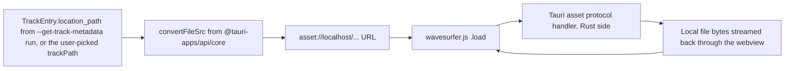
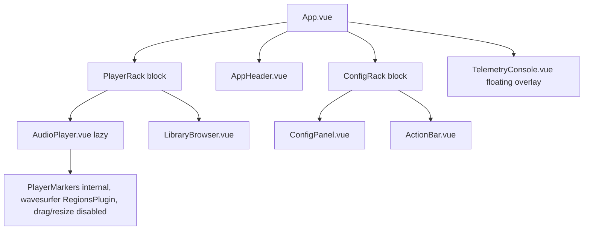
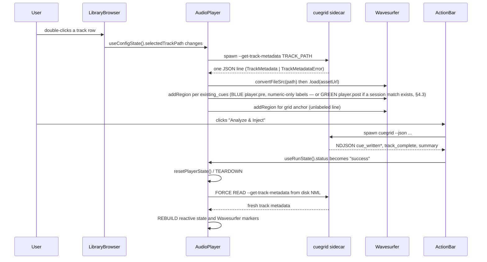

# Spec: Integrated Waveform Player & Grid Visualizer (Phase 3)

**Current status override (2026-07-13):** implemented in the checked-out
`AudioPlayer.vue`; the historical proposal status immediately below is no
longer authoritative.

Status: Current implementation contract, synchronized 2026-07-16.
(v1.7 adds manual snapped HotCue creation and local deletion through §3.9,
§3.11, and §3.13; v1.6 adds §0.5.1/§3.14's explicit Grid Edit Mode, safe grid-anchor
editing, linked cue-shift option, playhead action, and required tooltips;
v1.5 adds the mandatory post-operation synchronization loop and
`resetPlayerState()` sanitization contract for every asynchronous NML
mutation; v1.3 adds §3.13's Delete Cue context-menu action (whose immediate
sidecar-deletion behavior is superseded by v1.7); v1.2's
§3.9's 8 virtual HotCue pads, §3.10's momentary cue behavior for
pad/keyboard triggers, §3.11's global keyboard shortcut mapping, and
§3.12's relative beat-jump mechanics; v1.1's
`isLoadingTrack` concurrency lock, §3.8's placeholder waveform state,
§4.3's session-scoped stage persistence, §5.4's marker-label
collision mitigation, and §5.1's two fixed stage colors — BLUE for
Stage 1 and GREEN for Stage 2 — are all preserved unchanged)
Source of truth: `1-proposal.md` (GUI), `2-core-spec.md` (core
pipeline/CLI contract), `3-gui-spec.md` (existing Tauri + Vue 3
component architecture and sidecar plumbing, whose v1.2 revision
cross-references the unified pad/keyboard transport contract defined
here in §3.9–§3.12)

> **Phase 1 architecture amendment:** The requirements in the following
> section are binding for the first GUI Audio Player implementation and
> supersede any conflicting legacy Wavesurfer/Regions-plugin wording in this
> document. The player library is definitively **Peaks.js**.

## Current implementation synchronization (2026-07-15)

The checked-out `AudioPlayer.vue` implementation supersedes legacy wording in
this document that refers to Wavesurfer, Regions, blue/green stage colors,
remaining-time indicators, or a shared player store as the player's actual
rendering state.

- Peaks.js owns one `zoomview` and one `overview` view. `AudioPlayer.vue`
  stores the live instance in a `shallowRef`, maintains local `TrackData` and
  `cueState`, and destroys the Peaks instance, audio element, resize observer,
  and Web Audio context during teardown.
- Track selection calls `--get-track-metadata` through the native
  `call_cuegrid_core` resource bridge. The response supplies BPM, grid anchor,
  optional duration, existing cues, int8 waveform peaks, and HPSS color data.
  After a successful analysis run, the player reconciles cue-written log
  entries for the current track; manual drag and BPM changes remain local until
  **Save Changes** calls `--update-cues`.
- The CSS-mask color layer is synchronized by `syncZoomGradientLoop()` while
  Peaks.js supplies the white waveform silhouette. The same loop performs
  fractal grid LOD; Konva marker destruction removes retained line references
  to keep viewport culling stable.
- The visual palette is semantic Amber/Ochre: primary/secondary/accent roles
  are used for enabled pads, markers, borders, and hover states; warning is
  used for dirty/save feedback. The marker implementation also uses explicit
  amber/ochre hex values for Peaks/Konva drawing.
- The eight virtual pads are derived by `padSlots`, a computed array of
  exactly eight positions. Array index `N - 1` is always NML `HOTCUE` id
  `N - 1`; an empty slot remains an explicit `null` hole and never causes
  later cues to shift left. Empty slots are create targets; populated slots
  are momentary-preview targets.
- `activePad` is reactive hardware-feedback state. Pressing a valid pad sets
  it, the active class uses a bright accent, scale/inner-shadow treatment,
  and release clears it. `endCuePreview` returns early unless the releasing
  pad is the currently active pad, preventing mouse-leave panic behavior.
- Global keyboard handlers bail out through `isFocusedOnInput()` before
  handling Space, Enter, or digit keys `1`-`8`; digit keydown also ignores
  `event.repeat`. An unmodified digit previews a populated slot or creates
  its empty slot, while `Shift + digit` deletes a populated slot. This prevents
  search and text fields from triggering player shortcuts.
- The cue deletion menu is a separate `CueContextMenu.vue` component with
  `x`, `y`, and `visible` props and `close`/`delete` emits. Pad mouse events
  use `.left` and `.prevent` modifiers, while the context-menu event uses
  `@contextmenu.prevent`, keeping playback and menu event paths separate.
  The current handler removes the selected cue from local `cueState`, marks
  the player dirty, re-renders the Konva markers, and closes the menu. The
  complete edited cue list is persisted only through **Save Changes**.

### Modular player architecture contract (2026-07-14, authoritative)

The player is no longer permitted to be a monolithic implementation. The
following module boundaries are mandatory and supersede conflicting legacy
file-layout and self-contained-component wording in §3.2 and §3.3.
`components/AudioPlayer.vue` remains the orchestrator: it owns track loading,
Peaks initialization/destruction, player-event wiring, drag persistence,
sidecar calls, dirty state, and the module-scoped `usePlayerState()` loading
lock in §3.7. It must not reintroduce marker rendering, RAF math, global
keyboard listener lifecycle, or presentational section markup.

```
gui/src/
  components/
    AudioPlayer.vue          # orchestration and persistence boundary
    PlayerHeader.vue         # metadata/countdown/cue counters
    PlayerTransport.vue      # transport controls and eight cue pads
    PlayerGridControls.vue   # grid-edit mode, shift-mode, anchor controls
    PlayerWaveform.vue       # Peaks DOM shell, mask, resize ownership
  composables/
    useGridMath.ts           # pure, framework-free beat-grid math
    usePeaksMarkers.ts       # Konva/Peaks marker construction and tracking
    useWaveformSync.ts       # spectral CSS mask plus the one RAF loop
    usePlayerKeyboard.ts     # input-safe global keyboard lifecycle
```

#### Pure composable APIs

`useGridMath.ts` has **no Vue, DOM, Peaks, or Konva imports**. It exports the
following deterministic functions and types; `buildGrid()` produces ascending
time order and keeps negative offsets so §0.2 bar math is correct on both
sides of the anchor.

```ts
interface GridTrackData { bpm: number; grid_anchor_ms: number; duration_ms: number; }
interface GridPoint { timeMs: number; isBar: boolean; offset: number; }
function beatMs(bpm: number): number;
function snapToGrid(positionMs: number, bpm: number, anchorMs: number): number;
function buildGrid(data: GridTrackData): GridPoint[];
```

`usePeaksMarkers.ts` exclusively owns custom Konva point-marker painting. Its
`gridLines` array is private, is reset before `points.removeAll()`, and each
zoomview grid marker removes its reference in `destroy()`.

```ts
interface PlayerCue { id: number; position_ms: number; is_valid: boolean; }
interface GridLineReference { line: Konva.Line; offset: number; }
function usePeaksMarkers(): {
  markerHeight(options: unknown, group: Konva.Group): number;
  createPointMarker(options: unknown): unknown;
  paintAllMarkers(instance: Peaks.Instance, track: GridTrackData, cues: readonly PlayerCue[]): void;
  getGridLines(): readonly GridLineReference[];
};
```

`useWaveformSync.ts` owns the §0.7 clipping-mask width/left arithmetic,
three-band low/mid/high HEX interpolation, and the sole 60 FPS
`syncZoomGradientLoop`. It exposes `trackCssGradient`, `startSyncLoop()`, and
`stopSyncLoop()`. The loop must preserve §0.8's three-decimal opacity rounding
and hard-disable invisible Konva nodes with `line.visible(opacity > 0)`. A
second RAF loop is prohibited. The gradient consumes only precomputed
`color_map`; browser frequency analysis remains prohibited by §0.6.

`usePlayerKeyboard.ts` exports `isFocusedOnInput()` and accepts transport
callbacks (`togglePlay`, `stop`, `getPad`, `previewStart`, `previewEnd`,
`createCue`, `deleteCue`). `getPad(N)` returns the current `PlayerCue | null`
for the 1-indexed pad. On a non-repeating digit keydown, the composable must
dispatch `deleteCue(N - 1)` for `Shift + N` when populated, `previewStart(N)`
for an unmodified populated pad, or `createCue(N)` for an unmodified empty
pad; it must retain preview-start state so keyup calls `previewEnd(N)` only
for a preview it started. It binds `window` `keydown`/`keyup` in `onMounted`
and unbinds the same functions in `onBeforeUnmount`, retaining the input-safe
behavior in §3.11.

#### Presentational component contracts

All child components use typed props-down/events-up communication. They may
not import the player singleton, sidecar, Peaks initialization, or persistence
composables.

```ts
// PlayerHeader.vue
interface PlayerHeaderProps {
  hasTrack: boolean; trackHeaderLabel: string; bpmLabel: string;
  remainingLabel: string; cueCount: number; validCueCount: number;
}

// PlayerTransport.vue
interface PlayerTransportProps {
  hasTrack: boolean; isPlaying: boolean;
  padSlots: readonly (PlayerCue | null)[]; activePad: number | null;
}
type PlayerTransportEmits = {
  play: []; stop: []; jump: [padIndex: number];
  previewStart: [padIndex: number]; previewEnd: [padIndex: number];
  create: [padIndex: number];
  // Required only to preserve the local delete UI in §3.13.
  contextMenu: [event: MouseEvent, cue: PlayerCue];
};

// PlayerWaveform.vue
interface PlayerWaveformProps {
  hasTrack: boolean; isLoading: boolean; isSaving: boolean;
  trackCssGradient: string;
}
type PlayerWaveformEmits = {
  resize: []; wheel: [event: WheelEvent]; zoomIn: []; zoomOut: [];
};

// PlayerGridControls.vue
type GridEditShiftMode = "grid-only" | "grid-and-cues";
interface PlayerGridControlsProps {
  hasTrack: boolean; isGridEditMode: boolean;
  shiftMode: GridEditShiftMode;
}
type PlayerGridControlsEmits = {
  toggleGridEdit: []; setShiftMode: [mode: GridEditShiftMode];
  nudge: [deltaMs: number]; setToPlayhead: [];
};
```

`PlayerHeader.vue` renders only the already-derived metadata, BPM, remaining
time, and counters from §3.6. `PlayerTransport.vue` emits `play`, `stop`,
`jump`, `preview-start`, `preview-end`, and `create` to the orchestrator and
owns no playback state. It emits `create` only for a primary activation of an
empty slot; populated slots retain the preview emits. Its narrowly scoped
`context-menu` emit is the sole exception needed for the existing §3.13 local
cue-delete command. `PlayerWaveform.vue`
contains the raw overview/zoomview divs and absolute clipping-mask/gradient
shell. It owns its `ResizeObserver` and window `resize` binding, debounces the
`resize` emit by 100 ms, and exposes only the four element handles needed to
initialize Peaks and the §0.7 synchronizer; it must not create Peaks itself.

`PlayerGridControls.vue` is the sole presentational owner of the Grid Edit
controls specified in §3.14. It emits intent only; `AudioPlayer.vue` owns the
grid-anchor/cue mutation, clamping, dirty-state transition, and marker
repaint. It must use native `<button>` controls for the mode toggle, both
shift-mode choices, each nudge, and **Set Grid to Playhead**. Each of those
buttons/toggles must have the descriptive `title` text required by §3.14.5.

The shared `usePlayerState().isLoadingTrack` concurrency lock remains the
single source of truth required by §3.7. Refactoring may not replace it with a
component-local loading ref; `AudioPlayer.vue` sets it before teardown and
clears it at the same terminal boundary as before.

### Peaks.js wheel navigation contract

The zoomview binds `@wheel.prevent="handleZoomWheel"` and has
`overflow: hidden`; native scrolling is completely blocked in every wheel
case. `ZOOM_LEVELS` must include the restored `128` level.

`handleZoomWheel` controls the complete zoom/pan interaction. It calculates a
new zoom level and calls `setZoom`, then calculates the corresponding
`setStartTime` around the pointer position. Horizontal panning converts wheel
movement to time using the current visible duration and container width.
Every resulting start time is bounded with
`Math.max(0, Math.min(nextStartTime, duration_ms - visibleDuration))`; visible
duration/zoom values are likewise bounded with `Math.min`/`Math.max` between
the smallest supported window and `duration_ms`. These bounds are mandatory:
wheel input must never scroll the player before time zero or after the end of
the track. `Shift + wheel` pans, `Ctrl + wheel`/`Meta + wheel` zooms around the
pointer, and unmodified wheel input remains consumed without native page
scrolling.

This document is the binding technical specification for the GUI Audio Player:
waveform player and beatgrid visualizer embedded in the existing CueGrid
GUI, giving the user a visual preview of a track's existing HotCues
*before* running analysis, a live repaint of the newly injected HotCues
immediately *after* a successful "Analyze & Inject" run, and local manual
HotCue creation/deletion that is persisted only through **Save Changes**.
Per `CLAUDE.md`, no implementation should begin until this
contract is reviewed and this Status line is updated to "Resolved".

This spec **extends, but does not modify**, `2-core-spec.md` and
`3-gui-spec.md`. Section 1 below defines one new core-side CLI
capability (`--get-track-metadata`) as a proposed addition to
`2-core-spec.md` (candidate section 13); everything else is new,
additive GUI architecture layered on top of `3-gui-spec.md` section 3's
existing component tree. No existing message schema, `AppConfig`
field, `CueGridConfig` field, or NML read/write behavior changes.

---

## Phase 1 GUI Audio Player Architecture

### 0.1 Rendering library and dual-view layout

- **Peaks.js** is the mandated audio waveform rendering library. New player
  work must not introduce Wavesurfer.js or another waveform library.
- `AudioPlayer.vue` owns one Peaks.js instance with both required views:
  - `zoomview` for precise waveform inspection, cue editing, and snapping.
  - `overview` as the minimap/navigation view for whole-track movement.
- The two views represent the same loaded track and share the same marker
  state; navigation in the overview must not create a second independent
  source of truth.
- **Lifecycle invariant:** `peaks.destroy()` must always be called when
  `AudioPlayer.vue` unmounts. The call is mandatory even when the component
  is being removed during a track change or analysis transition, and exists
  to release Peaks.js event handlers, views, and audio resources.

### 0.2 Grid representation

- The beatgrid is rendered as custom, non-draggable markers with
  `editable: false`.
- Every mathematical beat is represented by a subtle vertical **Beat** line.
- Every fourth beat (for example beat indices 0, 4, 8, …) is represented by
  a thicker, more prominent vertical **Bar** line.
- Grid markers are visual projections of the track BPM and grid anchor; they
  are not Hotcue objects and must not be persisted as Hotcues.

### 0.3 Hotcue representation and editability

- Each Hotcue is rendered as a custom HTML marker consisting of a vertical
  line and a numbered label box anchored strictly to the **bottom** of the
  waveform. The bottom anchor keeps labels and marker chrome out of the
  waveform's main visual area.
- A valid, on-grid cue uses the GUI brand color (for example teal) and is
  draggable with `editable: true`.
- An off-grid/out-of-phase cue is rendered in gray and is strictly locked
  with `editable: false`; it must not be made draggable by a UI affordance.
- Marker editability is determined from the cue's grid validity, not from
  whether the cue happens to have a Hotcue pad number.
- A manually created HotCue is always bound to one of the eight fixed NML
  `HOTCUE` ids (`0`–`7`) and is represented in `cueState` as a valid `PlayerCue`.
  It is rendered through the same Konva marker path as an existing cue; no
  second marker collection is permitted for manually created cues.

### 0.4 Snap-to-grid drag logic

- A valid cue may not be dropped at an arbitrary millisecond position.
- On every valid-cue drag completion, the GUI computes the nearest one-beat
  position using the track BPM and grid anchor:

  `beat_ms = 60_000 / bpm`

  `snapped_ms = grid_anchor_ms + round((dropped_ms - grid_anchor_ms) / beat_ms) * beat_ms`

- The marker and reactive cue state must use `snapped_ms`, subject to track
  duration bounds. The drop position must never be treated as the final cue
  position before this quantization step.
- Off-grid cues are locked and therefore have no drag or snap path.

### 0.4.1 Snap-to-grid manual cue creation

Manual cue creation uses the exact same beat-grid math as a valid cue drag;
it must never use the unsnapped playhead position as a stored cue position.

- Let `playhead_ms` be the current playhead time in milliseconds, `bpm` the
  loaded track BPM, and `grid_anchor_ms` the loaded track grid anchor. The
  player must calculate:

  `beat_ms = 60_000 / bpm`

  `snapped_ms = grid_anchor_ms + round((playhead_ms - grid_anchor_ms) / beat_ms) * beat_ms`

- `snapToGrid(playhead_ms, bpm, grid_anchor_ms)` from `useGridMath.ts` is the
  required shared implementation of this equation. Creation is rejected when
  BPM, grid anchor, playhead, or the calculated value is non-finite, when BPM
  is not greater than zero, or when `snapped_ms` falls outside the loaded
  track duration. The implementation must not repair an out-of-range result
  by clamping it to an arbitrary non-grid millisecond value.
- On success, the created cue's `position_ms` is exactly `snapped_ms` and its
  `is_valid` value is `true`. The cue is therefore mathematically on the
  current beat grid from the instant it enters state.

### 0.5 Dirty state and persistence boundary

- Repositioning, creating, or deleting a Hotcue updates GUI state only. None
  of these actions may trigger a live disk write to Traktor's
  `collection.nml` through the Rust backend.
- The player state must expose a boolean `hasUnsavedChanges`. It becomes
  `true` after a successful local cue reposition, creation, or deletion and
  remains true until an explicit save succeeds or the user discards/reloads
  the edits.
- While `hasUnsavedChanges` is true, the GUI must show a prominent
  **Save Changes** button. Save is an explicit user action and is the only
  path in this phase that may request persistence through the Rust/Tauri
  boundary.
- A failed save must preserve the dirty state and the locally edited cue
  positions so the user can retry; a successful save clears the flag only
  after the backend confirms completion.
- The save payload always contains the current local HotCue positions. If the
  editing session changed `grid_anchor_ms`, it must also pass that finite,
  non-negative value as the optional `gridAnchorMs` argument to
  `useCueGridSidecar().updateTrackCues()`. The bridge serializes it as
  `--grid-anchor <ms>` alongside `--update-cues`; the core persists the cues
  and the single NML Grid marker in one atomic operation. A cue-only session
  omits `gridAnchorMs` and must not alter the stored Grid marker.

### 0.5.2 BPM adjustment and persistence boundary

`AudioPlayer.vue` exposes two local BPM actions for the loaded track: halve
the BPM (`/2`) and double the BPM (`x2`). Let `current_bpm` be the local BPM
and let `MIN_BPM = 50` and `MAX_BPM = 200`. An action is permitted only when
its result satisfies the inclusive constraint:

```text
MIN_BPM <= next_bpm <= MAX_BPM
```

The frontend state must reject an action whose result is outside `[50, 200]`
before mutating `TrackData.bpm`, setting dirty state, or invoking the Tauri
bridge. The state must also reject non-finite BPM values. A blocked action is
a no-op and must not repaint the waveform.

On every successful track load or force-read, `AudioPlayer.vue` sets
`savedBpm` to the BPM returned by the metadata response and initializes the
local current BPM from the same value. `hasBpmChanges` is computed from the
local current BPM and `savedBpm`; it is `false` immediately after load and
after a successful save. Changing the local BPM sets `hasBpmChanges = true`
and contributes to `hasUnsavedChanges = true`. Reverting to `savedBpm` clears
only the BPM portion of the dirty state; `hasUnsavedChanges` remains true when
cue or grid edits are still pending.

After an accepted `/2` or `x2` action, the player must repaint the Peaks.js
grid projection immediately. The repaint must rebuild the beat and bar lines
from the new local BPM and existing grid anchor so the visible spacing and
grid-line positions reflect the edited tempo. The audio file and cue
timestamps are not rewritten by the local action; persistence occurs only on
explicit **Save Changes**.

When saving, `AudioPlayer.vue` passes the current BPM as the optional
`newBpm` argument to `useCueGridSidecar().updateTrackCues()` only when
`hasBpmChanges` is true. A failed save preserves `savedBpm`, the edited local
BPM, `hasBpmChanges`, and `hasUnsavedChanges` for retry. After the successful
post-save force read, the returned BPM becomes the new `savedBpm`.

The component-local state has this minimum shape:

```ts
const savedBpm = ref<number | null>(null)
const hasBpmChanges = computed(
  () => savedBpm.value !== null && trackData.value.bpm !== savedBpm.value,
)
```

The track-load handler assigns `savedBpm.value = metadata.bpm` before the
first grid paint. `hasUnsavedChanges` must include `hasBpmChanges` together
with pending cue and grid edits; it must not be derived from the metadata
object after that object has been loaded.

### 0.5.1 Grid Edit Mode, linked shifting, and safety boundary

Grid correction is a deliberate editing workflow, separate from normal cue
editing. Its state belongs to the local player editing session and is never
inferred from a drag gesture.

- `isGridEditMode: boolean` defaults to `false` when a track is loaded,
  reloaded, or player state is reset (§3.4/§4.1). The UI provides an explicit
  toggle for this state.
- When `isGridEditMode === false`, the beat-grid projection remains
  non-draggable (§0.2), the normal grid-anchor line remains non-draggable,
  and standard HotCue rendering/editability follows §0.3–§0.4 unchanged.
- When `isGridEditMode === true`, the player renders one distinct **Grid
  Anchor** marker at the current `grid_anchor_ms`. This marker is draggable;
  it is not a HotCue, has no HotCue id/label, and must never be passed to a
  HotCue create/delete path (§1.3, §3.13, §5.2). Standard HotCue markers are
  visually subdued to exactly **30% opacity**. Their data and physical
  locations are otherwise unchanged by entering or leaving the mode.
- The Grid Edit UI has one explicit, mutually exclusive shift-mode choice.
  `"grid-only"` is the required default on every entry into Grid Edit Mode;
  `"grid-and-cues"` is selected only by a direct user toggle. The selected
  state must be visually unambiguous; it must not be hidden behind a modifier
  key or chosen automatically from the size/direction of an edit.
- A Grid Anchor drag, a nudge control, and **Set Grid to Playhead** (§3.14)
  all call the same anchor-shift operation. That operation uses the resulting
  requested anchor time to calculate one millisecond delta, applies the
  §3.14.3 clamp, then repaints the grid/anchor and affected cue markers from
  the resulting state. It must not accumulate independently rounded deltas.
- **Grid Only:** the applied delta changes only `grid_anchor_ms`; every
  existing cue retains its exact `position_ms`. This is the default and is
  intended for macro/downbeat correction.
- **Grid + Cues:** the applied delta changes `grid_anchor_ms` and every
  existing cue's `position_ms` by that same exact millisecond delta. This
  linked behavior is intended for micro/phase correction. It applies to all
  existing cues, including unbound and currently non-draggable cues (§0.3),
  because it is a coordinate translation rather than a HotCue drag.
- A successful local grid-anchor adjustment, including an adjustment that
  also translates cues, sets `hasUnsavedChanges = true` and follows the same
  explicit Save Changes, failure-retention, discard/reload rules in §0.5.
  Entering Grid Edit Mode, changing its shift-mode selection, or issuing an
  action whose clamped applied delta is `0` must not mark the player dirty.

### 0.6 Cross-boundary spectrum rendering (“God Mode”)

- The Vue/Tauri frontend **must not** compute real-time FFTs or perform
  heavy frequency analysis in JavaScript to colorize the waveform.
- The Python core, using `librosa`, owns preprocessing and frequency-band
  detection (for example low/bass versus high/treble). It exports a
  lightweight frequency visualization map/data payload for the GUI.
- Peaks.js is a deliberately **dumb silhouette renderer** for this data: it
  receives pre-calculated peaks but paints only white on Zinc-950. The CSS-mask
  layer in section 0.7 consumes the color map and paints waveform color. No
  browser code may recompute frequency features during zoom, pan, playback,
  or marker interaction.
- The payload contract and ownership boundary are defined in
  `2-core-spec.md` §2.3.1. This preserves browser memory and keeps zoom
  performance predictable.

### 0.7 CSS-mask waveform color renderer (authoritative)

Native Canvas/Konva gradients and Peaks.js segments are prohibited for
waveform colorization: they caused unacceptable rendering and performance
behavior. The player instead uses the following layered CSS-mask composition:

1. A waveform-color container sits **behind** the Peaks canvas and receives
   `trackCssGradient`, a CSS `linear-gradient` generated reactively from the
   current `color_map`.
2. Peaks.js paints the waveform itself in `#ffffff` and its canvas background
   in Zinc-950 `#09090b`. Its canvas has `mix-blend-mode: darken`.
3. Under darken blending, the white waveform acts as the mask/reveal for the
   colored layer, while the near-black canvas background hides that layer.
   Peaks is therefore responsible only for the silhouette; CSS owns all
   waveform color.
4. Grid and cue markers remain in the higher Konva layer. They must not be
   descendants of, or painted into, the blended Peaks canvas, so their
   established HEX colors remain completely unaffected.

`trackCssGradient` maps chronological HPSS buckets without static
classification thresholds or `if`/`else` color bands. It defines one harmony /
silence endpoint (`HEX_START`) and one percussion endpoint (`HEX_END`) and
performs pure linear RGB interpolation between them. For bucket `i`, let
`totalEnergy = p_i + h_i` and `rhythmRatio = p_i / totalEnergy` when the
denominator is non-zero. The interpolation factor is `rhythmRatio`; the stop
position is `i / (bucketCount - 1)`. This preserves a continuous musical
transition rather than inventing a discrete palette.

Noise is excluded before interpolation with a dynamic track-relative floor:
`noiseFloor = 0.05 * max(totalEnergy across color_map)`. A bucket at or below
that floor renders the neutral background rather than a spectral color. The
fallback for zero total energy is also the neutral background. The gradient is
therefore deterministic for one `color_map`, preserves chronological bucket
order, and adapts to quiet and loud tracks without fixed absolute thresholds.

The colored layer is synchronized with the visible Peaks zoom window by a
single `requestAnimationFrame` loop while the player is mounted. On every
frame (target 60 FPS), it reads the current `startTime`, `endTime`, and
`duration_ms`, then adjusts the gradient container's `width` and `left` so its
stops remain aligned with the waveform during zoom and pan. The loop is
cancelled during teardown; event handlers must not start duplicate loops.

### 0.8 Dynamic grid LOD and marker lifecycle

`syncZoomGradientLoop()` is also the authoritative grid level-of-detail (LOD)
controller. On each animation frame it derives `visibleBeats` from the current
zoomview duration and `60 / bpm`, then selects a fractal visibility multiplier
from `1`, `4`, `16`, `32`, and `64` beats. A grid marker is visible only when
its beat offset is divisible by the selected multiplier. The choice is updated
only when the multiplier changes; the Konva layer then performs one batched
redraw. This keeps close zooms musically precise and broad overview zooms free
of unusable line density.

Each Konva grid/cue marker is created with its correct initial visibility and
stores a reference in the player's internal marker arrays only for as long as
it exists. Its `destroy()` implementation must remove that reference before
the Konva node is discarded. This explicit garbage collection is required to
avoid stale nodes, visual Z-fighting, and disagreement with Peaks.js's own
viewport culling while panning.

Zoomview markers use the documented tuned `strokeWidth` and opacity values for
legibility. Overview/minimap cues use a solid opaque HEX stroke—never an
alpha-bearing color—because overview opacity composition is otherwise handled
inconsistently by the rendering layers. Grid and cue markers remain outside
the CSS blend layer described in §0.7.

## 0. Scope

In scope:
1. A standalone core CLI flag, `--get-track-metadata`, that returns a
   Stage 1 Super JSON: pre-analysis metadata plus Python-generated waveform
   peaks and HPSS color-map data (section 1).
2. The Tauri "asset bridge" data flow required for `wavesurfer.js`,
   running inside the webview, to decode a local audio file selected via
   an absolute filesystem path (section 2).
3. The `AudioPlayer.vue` component contract: placement, lifecycle,
   props/emits, and the read-only rendering boundary (section 3).
4. The two-stage synchronization flow between the GUI's existing
   config/run state (`3-gui-spec.md` section 5) and the player's marker
   overlay, before and after an analysis run (section 4).
5. Visual design tokens and marker-label/color rules consistent with the
  existing dark theme (`3-gui-spec.md` section 4) (section 5).
6. A horizontal row of 8 virtual HotCue pads inside `AudioPlayer.vue`,
   with per-pad enabled/disabled state keyed off the loaded track's
   bound cues, placed immediately right of the Play/Stop transport
   buttons (section 3.9).
7. Momentary cue-auditioning behavior for both mouse and keyboard
   triggers of the §3.9 pads, matching native Traktor hardware
   ergonomics: press to seek-and-play, release to pause (section 3.10).
8. A global keyboard shortcut layer mapping keys `1`–`8` to the pads,
   `Space` to Play/Pause toggle, and `Enter` to Stop (return-to-zero),
   active only when the user is not focused on input elements
   (section 3.11).
9. Relative ±8-beat jump navigation via `ArrowLeft`/`ArrowRight`,
   computed dynamically from the loaded track's BPM, with mandatory
   boundary clamping and no-op safety (section 3.12).

Out of scope (deferred to a future spec revision):
- Arbitrary waveform-surface cue creation remains out of scope. Manual
  HotCue creation is limited to empty pads and their `1`–`8` keyboard
  equivalents (§3.10.1/§3.11), and must use the grid snap in §0.4.1.
  Valid existing HotCues may be repositioned by the constrained drag-and-snap
  interaction in the Phase 1 amendment (§0.3–§0.5); off-grid cues remain
  locked. The permitted context-menu and keyboard delete actions are specified
  in §3.13/§3.11.
- Zooming/scrubbing UX polish, or playback transport beyond the
  explicitly specified pads/keyboard contract in sections 3.9–3.12
  (left fully to implementation time as long as section 3's contract
  is respected).
- Multi-track "preview queue" scrubbing during a batch/playlist run —
  the player only ever displays the single track currently selected in
  `TargetSelector.vue`'s `"track"` mode (see section 4's scoping note).
- Any change to `core.pipeline`, audio analysis, or the existing
  `CUE_V2` analysis-write contract (`2-core-spec.md` sections 3–8), except
  for the Phase 1 frequency-visualization export defined in
  `2-core-spec.md` §2.3.1. The core may expose its separately specified
  single-cue deletion capability, but this player's manual edit path persists
  its complete cue set through `--update-cues` on explicit Save Changes.

---

## 1. Core Extension: Pre-Analysis Metadata Sync

### 1.1 `--get-track-metadata <TRACK_PATH>` CLI flag

A standalone, top-level `cli.py` flag, architecturally identical in spirit to
`--list-playlists` (`2-core-spec.md` section 12) in its one-shot JSON framing,
but not in its work: it is a read-only metadata-and-preview query. It resolves
the NML entry and then performs the low-rate preview decode/peak/HPSS work
defined in `2-core-spec.md` section 15. Added to `build_parser()` **outside** the mutually-exclusive
track-selection group (section 8.4), since it is not itself a
processing-target selector:

```python
parser.add_argument(
    "--get-track-metadata",
    type=str,
    default=None,
    dest="get_track_metadata",
    metavar="TRACK_PATH",
    help=(
        "Parse the NML, locate TRACK_PATH, generate low-rate preview "
        "peaks and HPSS colors, and print one Super JSON object for the "
        "GUI waveform player."
    ),
)
```

Compatible with `--nml` (explicit collection path, resolved via the
existing `_resolve_nml_path`, section 7.1) and with `--artist`/`--title`
as pure disambiguators passed straight through to
`NmlParser.find_entry(track_path, title=..., artist=...)` — identical
semantics to single-track mode's own disambiguation (section 7.3, step
6). It ignores every tuning flag (`AppConfig`, section 2.2), `--verify`,
`--mode`, `--clear-existing`, and `--json` (section 11) — this flag has
its own dedicated one-shot JSON output, described below, never NDJSON.

### 1.2 `cli.py` interception in `main()`

`args.get_track_metadata` is checked immediately after the
`--list-playlists` interception (section 12.3) and before
`logging.basicConfig(...)`/the mutually-exclusive selector validation —
this mode never emits log records and never validates the normal
selector group:

1. Resolve the NML path exactly as `--list-playlists` does
   (`_resolve_nml_path`). If resolution fails, print the same plain-text
   error to stderr and return `1` (unchanged from today's behavior —
   this failure mode predates any track lookup, so it is not itself
   modeled by the JSON error schema in 1.4).
2. Construct `NmlParser(nml_path)` and call
   `find_entry(args.get_track_metadata, title=args.title, artist=args.artist)`.
3. On success, build and print the success schema (1.3) as a single
   line to **stdout**, then `sys.exit(0)`.
4. On `TrackNotFoundError`/`AmbiguousTrackError`, catch the exception,
   print the corresponding error schema (1.4) as a single line to
   **stdout** (not stderr — see the rationale below), then
   `sys.exit(1)`.

No `AppConfig`, `core.pipeline`, cue detector, or `nml.writer` code runs in
this path. The only audio work is the dedicated Stage 1 preview decode and
HPSS generation defined in `2-core-spec.md` section 15; it is not part of
analysis or any NML mutation path.

**Why stdout for the error case, not stderr:** every other consumer of
this flag (section 4's `useTrackMetadata.ts`) already buffers stdout
and parses exactly one JSON line on process close, exactly like
`TargetSelector.vue`'s existing `--list-playlists` consumption (see
`3-gui-spec.md`'s pattern, mirrored in `gui/src/components/TargetSelector.vue`).
Routing the error through the same channel as success means the GUI
never needs a second, stderr-specific code path for this flag — the
exit code (`0` vs `1`) disambiguates success/error, matching the
existing "exit code is the final source of truth" rule
(`2-core-spec.md` section 11.6), while the JSON body itself stays
uniformly on stdout instead of leaking a raw Python traceback that
would otherwise land on stderr un-structured.

### 1.3 Success schema

All fields required, single line, no NDJSON envelope (this is a
one-shot value, matching `--list-playlists`'s own framing choice,
section 12.3, step 4 — not section 11's message-type framing):

```json
{
  "artist": "Carbon Based Lifeforms",
  "title": "Central Plains",
  "bpm": 128.0,
  "grid_anchor_ms": 356.0,
  "duration_ms": 240123.0,
  "existing_cues": [
    {"hotcue": 1, "name": "Intro End", "start_ms": 16106.0, "type": "CUE"},
    {"hotcue": 2, "name": "Drop", "start_ms": 47950.0, "type": "CUE"},
    {"hotcue": 3, "name": "Outro", "start_ms": 210375.0, "type": "CUE"}
  ],
  "waveform_peaks": [-15, 23, -28, 35],
  "color_map": [{"p": 0.81, "h": 0.24}, {"p": 0.36, "h": 0.68}]
}
```

| Field | Source | Notes |
|---|---|---|
| `artist` | `TrackEntry.artist` | verbatim |
| `title` | `TrackEntry.title` | verbatim |
| `bpm` | `TrackEntry.tempo.bpm` | verbatim, float |
| `grid_anchor_ms` | `TrackEntry.grid_anchor_ms` | verbatim; the `START` of the `TYPE=4` (`GRID`) cue, section 3 |
| `duration_ms` | Core preview metadata, when available | Optional finite total duration in milliseconds; Peaks.js decoded duration is the required fallback (§3.6). |
| `existing_cues` | `TrackEntry.cues` | filtered + shaped, see below |
| `waveform_peaks` | Python preview decoder | Interleaved signed 8-bit min/max values from 128-sample `reshape(-1, 128)` windows at `sr=11025`; see `2-core-spec.md` section 15. |
| `color_map` | Python HPSS preview analysis | Chronological 500 ms normalized RMS buckets `{p, h}` from `n_fft=512`; `p` is percussive and `h` is harmonic. |

**`existing_cues` shaping rules:**
- Excludes any `CuePoint` with `type == CueType.GRID` (`4`). The grid
  anchor is already surfaced once, unambiguously, via the top-level
  `grid_anchor_ms` field; re-emitting it inside `existing_cues` would
  force every consumer to special-case/de-duplicate it before
  rendering (section 5's marker rules deliberately treat the grid
  anchor as a distinct visual element, never a hotcue marker).
- Sorted ascending by `start_ms`, matching Traktor's own on-screen cue
  ordering.
- `type` is the `CueType` enum member's **name** (`"CUE"`, `"FADE_IN"`,
  `"FADE_OUT"`, `"LOAD"`, `"LOOP"`), not its integer value — this is a
  presentation-only serialization choice specific to this flag (unlike
  section 11's `cue_written`, which never needs to carry `type` at all,
  since the core only ever *writes* `CueType.CUE`). String names let
  the frontend's color-mapping table (section 5.2) key directly off a
  human-readable name with no core-side enum import.
- `hotcue`, `name`, `start_ms` are `CuePoint.hotcue`, `CuePoint.name`,
  `CuePoint.start_ms` verbatim (`hotcue` may be `-1` for a cue not bound
  to a pad — the frontend renders these without a `[N]` bracket label,
  section 5.2).

### 1.4 Error schema

```json
{"error": "not_found", "message": "No entry found matching 'C:\\Music\\track.mp3'."}
```

```json
{"error": "ambiguous", "message": "Multiple tracks share this LOCATION. Narrow it down with --title and/or --artist."}
```

| `error` value | Raised from | `message` |
|---|---|---|
| `"not_found"` | `TrackNotFoundError` | `str(exc)`, unchanged wording from the exception |
| `"ambiguous"` | `AmbiguousTrackError` | `str(exc)` plus the same disambiguation hint text already used elsewhere in `cli.py` (e.g. lines around 602–608) |

Both shapes are a flat two-key object — deliberately not a variant of
the success schema (no `artist`/`title`/etc. keys at all) — so a
consumer can distinguish success from error with a single
`"error" in obj` check before touching any other field.

### 1.5 Non-goals

- No NDJSON, no progress messages — this is always exactly one line on
  stdout, exactly like `--list-playlists`.
- No new `AppConfig` field and no change to `find_entry`'s signature or
  matching behavior (section 7.3). The only new audio work is the dedicated
  Stage 1 preview decode/peak/HPSS contract in `2-core-spec.md` section 15;
  it does not enter the cue-analysis pipeline.
- No batch form (no `--get-track-metadata` equivalent for
  `--playlist`/`--track-title`) — Phase 3's player only ever previews
  one track at a time (section 0), so a batch variant has no consumer
  yet and is deliberately not speculatively added.

---

## 2. Tauri Asset Bridge

### 2.1 The problem

`wavesurfer.js` runs inside the Tauri webview and decodes audio via a
standard `fetch()`/`<audio>` URL. It cannot be pointed directly at an
absolute local filesystem path (e.g. `C:\Users\dj\Music\track.flac` or
`/Users/dj/Music/track.flac`) — webviews block `file://` fetches for
security reasons, and even where they don't, Tauri's own IPC/asset
sandboxing does not implicitly expose the raw filesystem to arbitrary
JS `fetch()` calls. The player must therefore go through Tauri's
**asset protocol**, not a raw path string.

### 2.2 Mandated data flow



1. The absolute path used to load the waveform is the same
   `location_path`-equivalent string the player already has: either
   `useConfigState().trackPath` (the path the user picked/typed in
   `TargetSelector.vue`'s `"track"` mode) or, once available, the
   resolved path echoed back by a future core enhancement — for this
   phase, `trackPath` is authoritative, since `--get-track-metadata`'s
   success schema (section 1.3) does not itself echo the path back
   (deliberately kept minimal; adding it would be a trivial future
   addition, not required for Phase 3).
2. **Mandatory:** the frontend must call
   `convertFileSrc(trackPath)` (imported from `@tauri-apps/api/core`)
   to transform that absolute path into a secure, webview-fetchable
   URL of the form `asset://localhost/<percent-encoded-path>` (or the
   platform-equivalent `https://asset.localhost/...` origin, depending
   on the installed `@tauri-apps/api` version's convention — confirm
   against the pinned version at implementation time; both are produced
   by the same `convertFileSrc` call, so no call-site branching is
   needed).
3. That URL, and *only* that URL, is passed to
   `wavesurfer.value.load(assetUrl)`. Raw paths must never be passed to
   `wavesurfer.load()` directly.

### 2.3 Required `tauri.conf.json`/capability additions (not yet present)

| File | Change | Why |
|---|---|---|
| `gui/src-tauri/tauri.conf.json` | add `app.security.assetProtocol.enable: true` | The asset protocol handler is disabled by default; without this, `asset://` URLs 404 inside the webview. |
| `gui/src-tauri/tauri.conf.json` | add `app.security.assetProtocol.scope` covering the directories audio files may live in | The asset protocol enforces an explicit allow-list of readable paths/globs, separate from `dialog:allow-open`'s own scope. Since Traktor libraries commonly span multiple drives/removable media, this phase scopes broadly (e.g. `["**"]`) rather than guessing a fixed root — no narrower than the risk already accepted by `dialog:default` (section 6.3 of `3-gui-spec.md`), which already lets the user pick an arbitrary file from anywhere on disk. |
| `gui/package.json` | add `"wavesurfer.js": "^7"` | New runtime dependency; not present today (confirmed via `grep` — no existing reference in `gui/`). |

No new `tauri-plugin-shell`-style Rust command or capability
`permissions` entry is required for `convertFileSrc`/the asset
protocol itself — unlike `Command.sidecar` (which needs the
`shell:allow-spawn` scoping already present, `3-gui-spec.md` section
6.3), the asset protocol is a built-in webview URL scheme gated purely
by the `app.security.assetProtocol` config block above, not by the
`capabilities/*.json` permission model.

### 2.4 Non-goals

- The asset bridge is unrelated to Core invocation. All Core operations use
  the Rust resource bridge in `3-gui-spec.md` §6; it does not expose a
  `Command.sidecar` process to Vue.
- No thumbnail/waveform pre-rendering on the Rust side. Decoding is
  entirely client-side, inside `wavesurfer.js`, from the bytes streamed
  through the asset protocol.

---

## 3. Frontend Architecture: `AudioPlayer.vue` Component Contract

### 3.1 Placement in the existing component tree

`AudioPlayer.vue` is a new, isolated, **lazily-loaded** component. Per
`3-gui-spec.md` section 4's revised layout, it is placed at the top of
the **PlayerRack** block (Block 1), with `LibraryBrowser.vue` stacked
directly beneath it inside the same block (not above `ConfigPanel.vue`
in a flat list — the two-block rack structure, not a flat sequence, is
now the source of truth for placement):



**The `wavesurfer.js` `TimelinePlugin` node is removed from this tree
and from the component entirely** (see section 4.1, revised, and
section 5.2, revised) — the player renders only the waveform surface
and its point-region marker overlay; there is no bottom time-ruler
track. `PlayerTimeline` as an internal sub-node no longer exists.

`AudioPlayer.vue` remains **lazily-loaded** (`defineAsyncComponent`, or
a dynamic `import()` at the `App.vue` call site) for the same reason
as before — `wavesurfer.js`'s Web Audio decoding machinery has no
reason to be part of the initial bundle/paint, so the config panel and
telemetry toggle are immediately interactive while the player chunk
loads in the background.

### 3.2 File layout additions (`gui/src/`)

```
src/
  components/
    AudioPlayer.vue                 # §3 — this component
  composables/
    usePlayerState.ts               # §4/§3.7 — loaded-track + marker state + isLoadingTrack (mirrors useRunState.ts's shape)
    useTrackMetadata.ts             # §1 — spawns --get-track-metadata, parses the one-shot JSON result
    useAnalysisSession.ts           # §4.3 — session-scoped cue_written map, cleared on every new run
    types/
      trackMetadata.ts                # §1.3/§1.4 — TrackMetadata / TrackMetadataError / ExistingCue
```

### 3.3 Props / emits

`AudioPlayer.vue` is self-contained: it reads `useConfigState()` (for
`trackPath`/`targetType`) and `useRunState()` (for Stage 2 sync, section
4.2) directly, exactly as `TargetSelector.vue` and `ConfigPanel.vue`
already do (`3-gui-spec.md` section 3.3's "Reads" column) — no props
are required for its core data flow. It accepts exactly one prop,
matching the disabling convention used by every other top-level panel:

```ts
interface AudioPlayerProps {
  disabled?: boolean; // true while a run is in progress (mirrors ConfigPanel's `locked`)
}
```

It emits nothing. All state it produces (currently-loaded metadata,
marker list) is private to the component's own composable
(`usePlayerState.ts`), not broadcast upward — no other component reads
the player's internal state in this phase.

### 3.4 Lifecycle rules

**Stage 1 preview-data lifecycle amendment (authoritative):**
`usePlayerState.ts` owns a module-scoped, in-memory
`Map<string, SuperJSON>` named `previewCache`, keyed by the exact
absolute `trackPath`. It caches only complete successful Super JSON values;
it has no disk persistence and is cleared when the application process ends.
The cache is deliberately RAM-only so a previously previewed track reloads in
about **0.05 seconds** without another sidecar spawn, audio decode, or HPSS
pass, while a new application session always reflects the current files.

Before a new track is rendered, the lifecycle must obtain a Super JSON using
the cache-first sequence in section 4.1. `resetPlayerState()` still tears down
the prior visual instance and invalidates stale callbacks, but it must not
clear `previewCache`: a track reload is precisely the operation that should
benefit from the cached preview data. Any successful NML mutation or explicit
force read that makes cue metadata stale must replace that path's cache entry
with the freshly returned complete Super JSON.

`AudioPlayer.vue` must implement a `resetPlayerState()` utility as the
single teardown/sanitization entry point for track reloads and analysis
cycles. It must clear all active Wavesurfer regions through the Regions
plugin API (`clearRegions()`), reset the global UI HotCue-pad projection
to unmapped/disabled, clear the loaded metadata and marker collections,
and detach or invalidate component-owned event listeners and pending
callbacks. The utility must leave no ghost event-listeners, stale region
IDs, or stale cue-to-pad bindings that can survive into the next load.
It is called before every track reload and as step 1 of the mandatory
post-operation synchronization loop in §4.2/§4.4.

- **On mount:** if `useConfigState().trackPath` is already non-null
  (e.g. restored from persisted config, section 5.5 of
  `3-gui-spec.md`), immediately kick off Stage 1 (section 4.1).
- **On `trackPath` change** (a `watch` on
  `useConfigState().trackPath`, active only while `targetType ===
  "track"`): tear down the current waveform/markers and re-run Stage 1
  for the newly selected path. Debounced (e.g. 400ms) if the input is a
  free-text field rather than the file-picker button, so keystroke-by-
  keystroke edits don't spawn a sidecar process per character.
- **On unmount:** `wavesurfer.value.destroy()` **must run
  unconditionally**, in a plain `onUnmounted` hook, with no guard other
  than a null-check on the ref itself:

  ```ts
  onUnmounted(() => {
    wavesurfer.value?.destroy();
    wavesurfer.value = null;
  });
  ```

  This is a hard requirement, not a nice-to-have: `wavesurfer.js`
  allocates a `AudioContext` (and, depending on backend, a
  `MediaElementSourceNode`) that is never garbage-collected by the
  browser/webview on its own. Because `AudioPlayer.vue` reacts to
  `trackPath` changes by tearing down and recreating the instance
  (previous bullet), *every* track switch is itself a mini
  mount/unmount cycle from the waveform's perspective even though the
  Vue component itself stays mounted — so the same unconditional
  `destroy()` call must also run at the top of the "track changed"
  handler, not only in `onUnmounted`. Skipping this is the single
  most likely source of a slow `AudioContext` leak that degrades a
  long-running desktop session, which is exactly the failure mode this
  rule exists to prevent.

**`isLoadingTrack` boundary (new in v1.1 — full contract in §3.7):**
the shared `isLoadingTrack` flag (`usePlayerState()`, §6) is set to
`true` at the very first line of the track-change handler /
`onMounted` Stage 1 kickoff — strictly before `destroyWaveform()` runs
— and is set back to `false` only once one of these terminal events
fires: the `wavesurfer` `"ready"` event (success), a
`TrackMetadataError` result (§1.4), or a `wavesurfer` `"error"` event
(decode failure). This window is wider than the existing `isDecoding`
local ref (which only covers the `wavesurfer.load()` call itself) —
`isLoadingTrack` also covers the `--get-track-metadata` sidecar
round-trip that happens *before* `wavesurfer.load()` is even called,
since that round-trip is exactly the multi-second delay the
concurrency lock in §3.7 and `4-library-spec.md` §4.4 exists to guard
against.

### 3.5 Read-only rendering boundary

This phase renders markers via `wavesurfer.js`'s Regions plugin
configured **read-only**:

- Every region/marker added by `AudioPlayer.vue` is a **point region**
  (`start === end`) created with `drag: false` and `resize: false`.
- No `region-updated`/`region-created`/click-to-add-region handlers are
  ever wired up. The canvas is purely a visualization surface.
- No double-click-to-add-cue, no waveform-canvas keyboard shortcut for
  inserting a marker, and no drag/resize editing. The pad/keyboard creation
  commands specified in §3.10.1/§3.11 are the sole exception. A custom
  context menu is permitted only for the explicitly specified **Delete Cue**
  action in §3.13; it must not turn the waveform canvas into a generally
  editable surface.

### 3.6 Header time indicators

The player's header row (`AudioPlayer.vue`'s existing track-identity /
BPM row, currently rendering `trackHeader` and `bpmLabel`) gains one
new element: a **Remaining Time** indicator, placed immediately to the
**left** of the BPM indicator, in the same `flex items-center gap-3
text-xs text-muted font-mono` cluster.

- Format: `-MM:SS`, always prefixed with a literal `-` (e.g. `-02:14`
  for 2 minutes 14 seconds remaining). No hours segment — tracks in
  scope for this tool are well under an hour.
- Computed as `duration - currentTime`. `currentTime` is updated from the
  native Peaks.js `player.timeupdate` event; this event is the authoritative
  playback-clock source. `duration` first uses `metadata.duration_ms` when it
  is finite and positive. If the Core omits duration or supplies zero, the
  player must immediately fall back to `peaks.player.getDuration() * 1000`
  after audio decoding. This fallback is mandatory for the countdown and for
  §0.7's gradient/viewport math: neither may divide by zero or collapse while
  a valid decoded duration exists.
- Hidden entirely (rendered as nothing, not as `-00:00`) whenever
  `!hasTrack` — i.e. before a waveform has finished decoding — mirroring
  how `bpmLabel`'s own `v-if="bpmLabel"` guard already behaves.
- Display order in the header cluster, left to right: **Remaining
  Time → BPM → stage → cues**, i.e. the new indicator is inserted
  immediately before the existing `bpmLabel` span, not appended after
  it.

### 3.7 Loading Feedback & Concurrency Lock (`isLoadingTrack`)

**Problem this section fixes:** `--get-track-metadata`'s sidecar
round-trip plus `wavesurfer`'s own audio decode together take multiple
seconds on a cold start, during which the prior implementation gave no
feedback at all — and nothing stopped the user from clicking a second
track mid-load, racing the first request.

- **State lives in the shared singleton, not a local ref.** `usePlayerState()`
  (§6) gains a new field, `isLoadingTrack: boolean`, alongside
  `markers`/`markerStage`/etc. It must be shared (not a private ref
  inside `AudioPlayer.vue`) specifically so `LibraryBrowser.vue` can
  read it too — the concurrency lock is a cross-component contract,
  detailed from the Library Browser's side in `4-library-spec.md` §4.4.
- **Transition boundary:** exactly as defined in §3.4's new paragraph
  above — set `true` before teardown begins, set `false` on the first
  terminal event (ready / metadata error / decode error).
- **Mandatory visual indicator:** while `isLoadingTrack` is `true`,
  `AudioPlayer.vue` renders a clear, unmistakable loading affordance
  (a spinner, or pulsing/animated text such as "Loading…") **absolutely
  positioned over the entire waveform area** — the same fixed-size box
  described in §3.8, regardless of whether that box currently holds a
  real waveform, a stale previous waveform mid-teardown, or the
  placeholder pattern. This supersedes/broadens the existing
  `isDecoding`-driven "decoding audio…" overlay: implementers may keep
  `isDecoding` as a narrower internal signal that feeds into
  `isLoadingTrack`, but the *outward*, spec-mandated contract is the
  wider `isLoadingTrack` window, and the overlay must remain visible for
  that entire window — including the metadata-fetch phase that happens
  before `wavesurfer.load()` is ever called, not just the decode
  sub-phase.
- **No competing overlays:** only one loading indicator is ever shown
  at a time for a given load; the overlay is keyed purely off
  `isLoadingTrack`, not off `isDecoding` and `isLoadingTrack`
  independently, to avoid two overlapping "loading" messages flickering
  during the same operation.

### 3.8 Placeholder Waveform (Empty State)

**Problem this section fixes:** the "No track selected" empty state
previously rendered no waveform box at all, so the player's overall
height collapsed whenever no track was loaded (on first boot, and any
time `selectedTrackPath` is cleared) — every panel beneath the player
(the Library Browser, per `4-library-spec.md` §3.4) visibly jumped up
and down as tracks were loaded and cleared.

- **The waveform canvas region is a fixed-height slot, always
  rendered.** The container div `AudioPlayer.vue` already sizes for a
  loaded waveform (the `containerRef` element, currently instantiated
  with `height: 96` at the `wavesurfer.create()` call) must render at
  that same fixed height/width footprint **unconditionally** — never
  behind a `v-if` on `hasTrack`. Only the *contents* of that box switch
  between three mutually-exclusive states; the box itself never
  resizes or disappears:
  1. **Real waveform** — `hasTrack && !isLoadingTrack`: wavesurfer's own
     canvas, exactly as today.
  2. **Loading overlay** — `isLoadingTrack` (§3.7): drawn on top of
     whichever of states 1/3 is currently underneath.
  3. **Placeholder pattern** — `!hasTrack && !isLoadingTrack`: a static,
     muted visual standing in for "no audio decoded yet" — e.g. a
     repeating CSS bar pattern that echoes wavesurfer's own bar-style
     rendering, a faint SVG texture, or a plain muted box using the
     existing `bg-zinc-800`/`border-border` tones already used for the
     container's own chrome. The exact visual is an implementation
     choice — this spec mandates only that it **occupies the identical
     box** (same `w-full`, same fixed height token) as state 1, with no
     conditional height/margin/padding difference between any of the
     three states.
- **No layout shift, by construction.** Because the outer box is
  unconditionally rendered at a fixed size, clearing or loading a track
  never changes the vertical position of anything below the player —
  this is the whole point of the mandate, not an incidental side
  effect.
- **Interaction with wavesurfer's own DOM ownership:** `wavesurfer.js`
  writes its canvas directly into the container element on
  `create()`/`load()`. While no track is loaded, the container's
  children are the placeholder markup instead; `destroyWaveform()`
  (§3.4) already unconditionally tears down the previous `wavesurfer`
  instance before the placeholder would ever need to reappear on a
  clear, so there is no DOM ownership conflict between the two.

### 3.9 Virtual HotCue Pads (UI Layout)

**Problem this section fixes:** the prior revision's transport row
exposed only Play/Stop buttons, giving the user no way to audition a
specific cue's position without scrubbing the canvas — a regression
versus native Traktor hardware, where 8 physical pads give instant
access to the bound hotcues. This section adds the on-screen equivalent
of those pads, and §3.10–§3.12 wire them (and the keyboard) to
momentary cue-audition behavior.

- **Layout:** `AudioPlayer.vue`'s transport row gains a horizontal row
  of **8 small, numbered pad buttons**, labeled `1` through `8`, placed
  **immediately to the right of the Play/Stop buttons** (i.e. the
  existing Play/Stop cluster stays leftmost; the pad row is appended
  after it in the same flex row, not on a new line). The pads use the
  same `font-mono`/`text-xs`/dark-panel chrome tokens as the rest of
  the transport row (§5.3), so they read as a natural extension of the
  existing controls, not a visually distinct widget.
- **1-indexed user label, 0-indexed NML binding:** pad button `N`
  (1-indexed, as printed on its label) corresponds to the NML
  `HOTCUE` attribute value `N - 1` (0-indexed), exactly matching the
  `N = hotcue + 1` convention already used for point-region labels in
  §5.2. This is the same mapping native Traktor hardware uses: pressing
  physical pad 1 fires the cue stored at `HOTCUE="0"`.
- **Per-pad state — strict contract:** a pad button is enabled whenever a
  track is loaded and `isLoadingTrack` is false. Its state is derived only
  from `padSlots`: a populated slot (`PlayerCue` at `padSlots[N - 1]`) is a
  momentary-preview target; an empty slot (`null`) is a create target. Empty
  pads must remain visibly distinguishable from populated pads, but they are
  not disabled and must accept the primary-click creation action in §3.10.1.
- **Source of truth for the bound-cue lookup:** `cueState`, projected through
  `padSlots`, is the only source for pad state and Konva cue markers during an
  editing session. Metadata is used to initialize/rebuild `cueState` on a
  fresh track load (§4.1/§4.2), but the template must not derive pad state
  directly from `metadata.existing_cues`, because local create/delete edits
  must appear before Save Changes. No independent per-pad state is permitted.
- **Visual mapping to canvas markers:** when a pad is enabled, its
  number visually corresponds to the same-numbered point-region label
  on the waveform canvas (§5.2's bare-`N` label). This is intentional:
  the pad row and the canvas markers are two views of one cue set, and
  a user looking at pad 3 and the canvas label `3` should understand
  them as the same hotcue. The pad does **not** render the cue's
  `name` (e.g. `"Drop"`) on its face — only its number — matching the
  canvas's own bare-number minimalism.
- **Interaction with `isLoadingTrack` (§3.7):** while `isLoadingTrack` is
  `true`, or when no track is loaded, **all 8 pads** render disabled. This is
  the only disabled-pad state; once a track is ready, empty and populated slots
  are both actionable according to their respective contracts.

### 3.10 Momentary Cue Behavior (Pads Interaction)

**Traktor-style momentary cueing** is the mandated interaction model
for mouse and keyboard triggers of populated §3.9 pads. This is the
same ergonomics native Traktor hardware uses: holding a pad down
auditions the cue's position in real time, and releasing it stops
playback — the cue is *not* a "jump and continue playing" action.

- **On Press (`mousedown` / `keydown`):** instantly seek the
  `wavesurfer` playhead to the cue's exact `start_ms` position and
  trigger immediate playback:
  ```ts
  wavesurfer.setTime(cue.start_ms / 1000);
  wavesurfer.play();
  ```
  The seek must happen *before* `play()` so playback begins from the
  cue point, not from wherever the playhead happened to be. The
  `start_ms` value is the same field already stored on the
  corresponding `PlayerMarker` (§6) / `ExistingCue` (§1.3) — no new
  time field is introduced.
- **On Release (`mouseup` / `mouseleave` / `keyup`):** instantly pause
  playback:
  ```ts
  wavesurfer.pause();
  ```
  `mouseleave` is included alongside `mouseup` so that dragging the
  pointer off the pad while held still releases the cue (matching
  native hardware's "lift your finger" semantics); without it, a
  `mousedown` on a pad followed by a drag away would leave playback
  running indefinitely.
- **Keyboard repeat guard (hard requirement):** the `keydown` listener
  for pad keys must strictly guard against native browser key-repeat
  events, so that holding down a pad key does not spam restart
  commands:
  ```ts
  function onPadKeyDown(event: KeyboardEvent, padIndex: number) {
    if (event.repeat) return;   // hard guard — do not remove
    // ... seek + play ...
  }
  ```
  Without this guard, the browser's auto-repeat (which fires
  `keydown` repeatedly while a key is held) would re-seek-and-restart
  playback on every repeat tick, producing a stuttering restart loop
  instead of a single clean audition from the cue point. The `keyup`
  listener needs no such guard (a key release fires exactly once per
  physical release).
- **Mouse ↔ keyboard parity:** the same momentary seek-and-play /
  pause-on-release logic must run for both input paths. Implementations
  are encouraged to route both through a single `pressPad(padIndex)` /
  `releasePad(padIndex)` pair so the two paths cannot drift; the spec
  mandates only that the *observable behavior* is identical, not the
  internal factoring.
- **Disabled-pad safety:** if a pad is disabled per §3.9's contract
  (no loaded track or `isLoadingTrack` is true), neither the mouse nor
  the keyboard trigger may fire §3.10's seek/play logic. The keyboard
  handler must re-check the pad state at `keydown` time (not assume the
  listener was only bound when enabled), since the global keyboard layer
  (§3.11) is registered once and dispatches by key, not per-pad.

### 3.10.1 Empty-pad creation interaction

Primary-clicking an empty pad creates its cue; it does not start momentary
playback. A populated pad retains the §3.10 press/release behavior unchanged.

1. Resolve the clicked 1-indexed pad `N` to `id = N - 1`. If `padSlots[N - 1]`
   is populated, route the event exclusively to §3.10's preview path.
2. If the slot is empty, read the current playhead, calculate `snapped_ms`
   with §0.4.1, and append exactly `{ id, position_ms: snapped_ms,
   is_valid: true }` to `cueState`. A slot that became populated between event
   dispatch and commit must not be overwritten; treat that race as a no-op.
3. After a successful append, set `hasUnsavedChanges = true` and invoke the
   canonical Konva marker rebuild/render path. The `padSlots` computed
   projection must then show the newly populated pad immediately.
4. A failed validation or snap is a no-op: it must not add a cue, dirty the
   player, or render a marker. The UI may report the reason, but must not
   create an off-grid fallback cue.

### 3.11 Global Keyboard Shortcuts Mapping

#### Current handler details

The current handler checks `isFocusedOnInput()` from `document.activeElement`
before any shortcut logic and returns for `event.repeat` on keydown. It maps
Space to `togglePlay`, Enter to `stop`, and top-row digit keys `1`-`8` by
slot state: preview a populated slot, create an empty slot, or (with Shift)
delete a populated slot. The current implementation does not use the obsolete
`targetType` fields; the loaded track comes from the selected library path or
the optional `trackPath` prop.

A **global keyboard shortcut layer** is registered on `window` (not
on the pad elements themselves), so the §3.9 pads are operable without
focus, matching native Traktor hardware's always-on pad behavior.

- **Input-focus guard (hard requirement):** the listeners are **active
  only when the user is not focused on an input element.** Before
  dispatching any shortcut, the handler must check
  `document.activeElement` and bail out (return early, no-op) when the
  focused element is one of: `input`, `textarea`, `select`, or any
  element with `isContentEditable === true`. Without this guard, typing
  a literal `1`–`8` into `TargetSelector.vue`'s path field or
  `ConfigPanel.vue`'s artist/title disambiguator fields would
  misfire as a pad press, and `Space`/`Enter` would collide with the
  browser's default text-input/submit behavior. The guard runs *before*
  the `event.repeat` check (§3.10) and before any pad-enabled-state
  lookup, so input typing never even reaches pad logic.
- **Mappings (exact contract):**
  - **Keys `1` through `8`** → map to HotCue Pads 1 to 8. On an
    unmodified, non-repeating `keydown`, resolve `N` through `padSlots`:
    populated means `pressPad(N)` and the §3.10 momentary preview; empty means
    `createCue(N)` and the §3.10.1 snapped creation flow. On `keyup`, call
    `releasePad(N)` only if that keydown started a preview; creating a cue has
    no release action and must not pause playback.
  - **`Shift + [1–8]`** → delete the cue bound to the corresponding slot. On
    the non-repeating `keydown`, resolve `N` through `padSlots`; populated
    means `deleteCue(N - 1)`, empty means no-op. This path must not seek, play,
    or pause, and `keyup` has no action. It uses the same local deletion
    operation as the context menu (§3.13), so it updates `cueState`, marks the
    player dirty, and re-renders Konva markers identically.
  - The `event.key` string is matched against `"1"`..`"8"` (not
    `event.code`'s `Digit1`..`Digit8`), so the mapping is layout-agnostic for
    top-row digit keys on common layouts; numpad digits are intentionally not
    mapped (they would collide with existing accessibility/numeric-entry
    expectations).
  - **Key `Space`** → toggles standard Play/Pause playback state
    (i.e. `wavesurfer.isPlaying() ? wavesurfer.pause() :
    wavesurfer.play()`). This is a **toggle**, not momentary: pressing
    Space starts playback if paused and pauses if playing, with no
    seek. `event.preventDefault()` must be called to suppress the
    browser's default space-scrolls-page behavior. Only `keydown` is
    handled for Space; `keyup` is a no-op (no repeat guard needed for
    a toggle, but `event.repeat` should still be ignored to avoid
    double-toggling on held-key auto-repeat).
  - **Key `Enter`** → triggers **Stop**: pauses playback and instantly
    returns the playhead to the very beginning of the track (`0.0`):
    ```ts
    wavesurfer.pause();
    wavesurfer.setTime(0);
    ```
    This is distinct from Space's toggle: Enter always pauses *and*
    rewinds, regardless of current play state. Only `keydown` is
    handled; `keyup` is a no-op.
- **Listener lifecycle:** the global `keydown`/`keyup` listeners are
  registered in `AudioPlayer.vue`'s `onMounted` and removed in its
  `onUnmounted` (alongside the existing `wavesurfer.destroy()` teardown
  from §3.4). They are **not** registered on `window` at module scope,
  because the player is lazily loaded (§3.1) and a module-scope
  listener would outlive the component and fire on pages where no
  player exists.
- **No-op safety:** every mapping must safely no-op when no track is
  loaded (`!hasTrack`) or while `isLoadingTrack` is true (§3.7),
  exactly as the §3.9 pad row does. The input-focus guard and the
  no-track guard together ensure the keyboard layer never triggers
  `wavesurfer` calls against a null/unready instance.

### 3.13 Delete Cue Context-Menu Action

The implemented menu boundary is `../gui/src/components/collection/CueContextMenu.vue`.
It renders only while `visible` is true, positions itself from `x`/`y`, adds
a full-screen close backdrop, closes on Escape, and emits `close` or `delete`
without owning cue state. `AudioPlayer.vue` owns the selected cue and the
delete handler. This separation is mandatory because playback mouse events
must remain left-button-only (`.left`) and must use `.prevent` where the
player starts a momentary preview; context-menu handling must not share that
playback path or create an `AbortError` race.

The player exposes a custom context menu for a cue marker. The menu contains
**Delete Cue** only when the marker represents a bound standard HotCue
(`PlayerCue.id` in `0`–`7`, corresponding to an NML `TYPE="0"` cue). This
includes manually created cues. Grid anchors and other non-standard cue types
have no Delete Cue action.

Both the context-menu action and `Shift + [1–8]` (§3.11) invoke the same
local `deleteCue(id)` operation. It is an editing action, not an immediate
NML mutation.

1. Resolve the selected cue's zero-based `id`. If `cueState` does not contain
   that id, the request is a no-op.
2. Remove the cue from `cueState`, set `hasUnsavedChanges = true`, and invoke
   the canonical Konva marker rebuild/render path. `padSlots` must
   immediately expose `null` at that id, so the pad becomes an empty creation
   target rather than a disabled control.
3. Do not invoke `--delete-cue` or any other sidecar write from deletion.
   The user must explicitly choose **Save Changes**; that operation persists
   the full current `cueState` through `updateTrackCues` (§0.5).
4. If the action is invoked from the context menu, close the menu after the
   local state transition. The menu remains available for mouse users; the
   keyboard shortcut is an additional path, not a replacement.

The operation is idempotent within an editing session. Track reload, discard,
or failed Save Changes follows §0.5's existing state-retention/rebuild rules;
a local deletion is not rolled back merely because it has not yet been saved.

### 3.12 Relative Beat-Jump Mechanics

**Relative ±8-beat jump navigation** via `ArrowLeft`/`ArrowRight`,
computed dynamically from the loaded track's BPM — the same kind of
beat-relative seek native Traktor hardware exposes on its jog wheel.

- **Mappings:**
  - **`ArrowLeft`** → jump **backward** 8 beats from the current
    playback position.
  - **`ArrowRight`** → jump **forward** 8 beats from the current
    playback position.
- **Math (exact contract):** one beat length in seconds is calculated
  dynamically from the loaded track's BPM:
  ```ts
  const beat_duration_sec = 60.0 / metadata.bpm;
  const jump_duration_sec = 8.0 * (60.0 / metadata.bpm);
  ```
  The `60.0` numerator is the literal constant (seconds per minute);
  the `8.0` multiplier is the fixed 8-beat jump size mandated by this
  section (not a tunable). `metadata.bpm` is the same field already
  populated by `--get-track-metadata` (§1.3) and stored on
  `usePlayerState().metadata` (§6) — no new BPM source is introduced.
- **Boundary clamping (hard requirement):** the jump must never seek
  below `0` or above the track's duration. The exact mandated
  expressions are:
  ```ts
  // ArrowLeft
  wavesurfer.setTime(Math.max(0, current_time - jump_duration_sec));
  // ArrowRight
  wavesurfer.setTime(Math.min(duration, current_time + jump_duration_sec));
  ```
  where `current_time` is `wavesurfer.getCurrentTime()` and `duration`
  is `wavesurfer.getDuration()`, both read at the moment the key fires
  (not cached from a stale ref). The `Math.max(0, ...)` /
  `Math.min(duration, ...)` clamps are mandatory: an unclamped
  `setTime(negative)` or `setTime(beyond_duration)` has undefined
  behavior in `wavesurfer.js` and must not be relied on.
- **No-op safety (hard requirement):** this feature must safely no-op
  if **any** of the following hold:
  - No track is loaded (`!hasTrack`).
  - `metadata` is `null` (metadata fetch has not completed / failed).
  - `metadata.bpm` is missing, `undefined`, `null`, `NaN`, or `<= 0`
    (a non-positive BPM would divide by zero or produce a nonsensical
    negative/`Infinity` jump duration). The guard is:
    ```ts
    if (!metadata || !metadata.bpm || metadata.bpm <= 0) return;
    ```
  This guard runs *before* the `beat_duration_sec` computation, so a
  bad BPM never reaches the division.
- **Playback state is preserved:** a beat-jump does **not** toggle
  play/pause — if the track was playing before the jump, it continues
  playing from the new position; if it was paused, it stays paused at
  the new position. `wavesurfer.setTime()` preserves the playing state
  on its own; the handler must not call `play()` or `pause()`.
- **Keyboard repeat:** unlike §3.10's momentary pads, beat-jump on
  `ArrowLeft`/`ArrowRight` **does** fire on `event.repeat` — holding
  the arrow key repeats the 8-beat jump, which is the expected
  ergonomics (hold to scrub through the track in 8-beat increments).
  The input-focus guard from §3.11 still applies: arrow keys pressed
  while focused on an input element must not trigger a jump (they
  should move the text cursor as normal).

### 3.14 Grid Edit Controls and Anchor-Shift Algorithm

This section implements the Grid Edit behavior defined by §0.5.1. It is a
local editing interaction; it does not perform a disk write as part of drag,
nudge, or playhead actions (§0.5).

#### 3.14.1 Required controls and availability

For a loaded track, the player must expose:

1. A clearly labeled **Grid Edit Mode** toggle for `isGridEditMode`.
2. While Grid Edit Mode is active, a clearly visible, explicit two-choice
   toggle: **Grid Only** and **Grid + Cues**. **Grid Only** is selected by
   default each time Grid Edit Mode is entered (§0.5.1).
3. Grid-anchor nudge controls, if nudging is provided by the player UI.
4. A **Set Grid to Playhead** action that requests the current playback time
   as the new anchor time. It is available only when a track is loaded and
   Grid Edit Mode is active; it must not silently move the grid from an
   ordinary playback/transport action.

The Grid Anchor marker is draggable only while Grid Edit Mode is active.
Dragging it when inactive is prohibited rather than treated as an implicit
mode switch.

#### 3.14.2 Single anchor-shift operation

Let `A` be the current `grid_anchor_ms`, `R` the requested anchor time, and
`requestedDelta = R - A`. For a drag, `R` is the drag-end time; for a nudge,
`R = A + nudgeDelta`; for **Set Grid to Playhead**, `R` is the current
playhead time in milliseconds. The operation computes `appliedDelta` using
§3.14.3, then commits exactly:

```ts
nextAnchorMs = A + appliedDelta;
nextCueMs = cue.position_ms + appliedDelta; // only in "grid-and-cues" mode
```

The player must use `appliedDelta`, not `requestedDelta`, for both the anchor
and linked cue translation. Thus a safety clamp never separates a cue from
the grid by applying a different delta to each. Normal cue drag snapping
remains governed by §0.4 and is not repurposed for grid-anchor correction.

#### 3.14.3 Non-negative-time clamp

`grid_anchor_ms` must never be less than `0`. In `"grid-only"` mode, the
minimum permitted delta is `-A`. In `"grid-and-cues"` mode, it is the more
restrictive lower bound needed to preserve the anchor and every cue:

```ts
const minimumDelta = Math.max(
  -A,
  ...cues.map((cue) => -cue.position_ms),
);
const appliedDelta = Math.max(requestedDelta, minimumDelta);
```

For an empty cue set, `minimumDelta` is simply `-A`. This clamp is applied
before any reactive state or marker update. It ensures `nextAnchorMs >= 0`
and, in `"grid-and-cues"` mode, `nextCueMs >= 0` for every existing cue. A
request that is clamped to the existing state is a no-op and does not set
`hasUnsavedChanges` (§0.5.1). The clamp applies equally to leftward drags,
negative nudges, and playhead actions.

#### 3.14.4 Set Grid to Playhead semantics

**Set Grid to Playhead** uses the exact current playback position at action
time, converted to milliseconds, as `R` in §3.14.2. It is not a beat snap and
must not quantize the playhead before the shift operation. Consequently,
**Grid Only** moves only the anchor to the safely clamped playhead request,
whereas **Grid + Cues** translates the anchor and every existing cue by the
same safely clamped delta.

#### 3.14.5 Tooltip/accessibility contract

Every grid-related button or toggle implements a descriptive native `title`
attribute. At minimum, the title text must communicate these semantics:

| Control | Required `title` meaning |
|---|---|
| Grid Edit Mode | Enables or disables editing the Grid Anchor. |
| Grid Only | Moves only the Grid Anchor; existing cues stay in place. |
| Grid + Cues | Moves the Grid Anchor and every existing cue together. |
| Nudge earlier/later | Moves the Grid Anchor by the displayed nudge amount and states whether cues move according to the selected shift mode. |
| Set Grid to Playhead | Sets the Grid Anchor to the current playhead using the selected shift mode. |

Titles may be localized, but they must preserve the stated behavioral
distinction; generic text such as `"Grid"`, `"Edit"`, or `"Nudge"` alone is
insufficient. Tooltips do not replace the visible labels and selected-state
indication required by §3.14.1.

---

## 4. The Two-Stage Synchronization Flow

The player has exactly two synchronization triggers, both scoped to
`useConfigState().targetType === "track"` (section 0's scoping note —
title/playlist batch modes never drive the player, since there is no
single track to visually anchor it to until one is resolved).



*(Note: this also updates the participant name from `TargetSelector`
to `LibraryBrowser`, reflecting `4-library-spec.md`'s supersession of
`TargetSelector.vue`, and removes the `instantiate TimelinePlugin`
step.)*

### 4.1 Stage 1: On Selection

The following Stage 1 flow supersedes the older Wavesurfer/Web-Audio loading
steps in this section:

1. Increment a selection token and set `isLoadingTrack` before teardown.
   Responses belonging to an earlier token are stale and must be discarded.
2. Look up `trackPath` in `usePlayerState().previewCache`.
   - **Cache hit:** use that complete `SuperJSON` immediately. No sidecar
     process, browser audio decode, peak extraction, or HPSS work runs.
   - **Cache miss:** call Tauri's native resource bridge with
     `invoke("call_cuegrid_core", { args: ["--get-track-metadata", trackPath] })`.
     Rust resolves and runs the packaged Core resource, collects stdout once,
     and returns the complete string to `useTrackMetadata.ts`. The composable
     trims and parses that single JSON value, applies the modeled
     `TrackMetadataError` handling, and stores a successful complete
     `SuperJSON` in `previewCache` before rendering. Failed, malformed, or
     stale responses must never be cached. Vue never owns a process handle or
     a manual stdout-line buffer.
3. Create Peaks.js with `webAudio: false`. Provide its waveform data from
   `superJson.waveform_peaks`; Peaks.js must not decode the audio or derive
   waveform peaks in the webview. Configure its waveform paint as pure white
   (`#ffffff`) and its canvas background as Zinc-950 (`#09090b`). The
   sidecar-generated int8 peaks are the sole waveform source for both the
   zoomview and overview.
4. Render color through the CSS-mask architecture in section 0.7, not through
   Canvas/Konva gradients, Peaks.js segments, or `waveformColor` gradients.
   Vue creates the reactive CSS gradient from `superJson.color_map` and places
   it behind the Peaks canvas. The canvas uses `mix-blend-mode: darken`: white
   waveform pixels reveal the gradient and the Zinc-950 background hides it.
   Vue performs only presentation mapping; it must not calculate HPSS, RMS,
   FFTs, or any replacement audio feature.
5. Paint the grid and cue markers from the same Super JSON, including the
   existing session-stage resolution rules in section 4.3, then clear
   `isLoadingTrack` when the Peaks views are ready.

**Rationale:** browser Web Audio decoding is the CPU-spike bottleneck this
architecture removes. Python performs low-rate decode, peak grouping, and
HPSS once per cache miss; Vue retains the returned Super JSON in RAM, making
repeat previews effectively instantaneous (target: ~0.05 s) while keeping
Peaks.js a renderer rather than an audio-analysis engine.

The legacy Wavesurfer/`Command.sidecar` sequence below is retained only as
historical context and is superseded by the cache-first Peaks.js/resource-bridge
flow above and by `3-gui-spec.md` §6. It is not an implementation contract.

Triggered by the lifecycle rules in section 3.4. Historical steps were:

1. `useTrackMetadata.ts` spawns the sidecar with
   `Command.sidecar(SIDECAR_NAME, ["--get-track-metadata", trackPath])`
   — the same one-shot spawn-buffer-parse-on-close pattern already used
   by `TargetSelector.vue`'s `--list-playlists` call (`3-gui-spec.md`
   section 3.3 / current `TargetSelector.vue` implementation), not the
   NDJSON streaming pattern of `useCueGridSidecar.ts`.
2. On process close: `JSON.parse` the single buffered line.
   - If it matches `TrackMetadataError` (section 1.4's shape — i.e. has
     an `"error"` key), surface it as a non-fatal inline message inside
     `AudioPlayer.vue` (e.g. "Track not found in collection.nml") and
     stop — no waveform is loaded, no crash.
   - Otherwise, treat it as `TrackMetadata` (section 1.3) and proceed.
3. Call `convertFileSrc(trackPath)` (section 2.2) and
   `wavesurfer.value.load(assetUrl)`.
4. Once `wavesurfer`'s `"ready"` event fires (audio decoded, duration
   known), the player does **not** instantiate a Timeline plugin or
   render any bottom time-ruler track — that plugin and its bar-line
   ticks are removed entirely from this phase (superseding the prior
   revision of this section, which specified `beatLengthSec`-derived
   `TimelinePlugin` gridlines). The only grid-related visual is the
   single, unlabeled grid-anchor line described in section 5.2, drawn
   via the Regions plugin exactly like every other marker, phase-set
   directly from `grid_anchor_ms` (no beat-length math is needed to
   place it, since it is a single point, not a repeating ruler).
4. For each entry in `existing_cues` (section 1.3), add a point region
   (section 3.5) labeled per section 5.2's rules, colored `player.pre`
   (BLUE) by default — **unless** §4.3's session lookup finds a match
   for this track, in which case the session's cues are painted
   instead, colored `player.post` (GREEN), per §4.3 step 4.

### 4.2 Stage 2: Post-Analysis Sync

Triggered when `useRunState().status` transitions to `"success"` and the
completed run may have modified the NML for the currently loaded track.
The synchronization source is always the disk-backed metadata query, not
`useRunState().logs` or an optimistic Vue collection. Any asynchronous
backend operation that modifies the `.nml` — including analysis completion
and a successful explicit manual-cue save — **MUST** execute the
following three steps sequentially, with the next step starting only after
the previous step completes:

1. **TEARDOWN:** call `resetPlayerState()` (§3.4). This must completely
   clear all active Wavesurfer regions through the Regions plugin API
   (`clearRegions()`) and reset the global UI HotCue-pad state to
   unmapped/disabled before any fresh metadata is applied.
2. **FORCE READ:** invoke the standalone `--get-track-metadata` query for
   the current track and force a fresh parse of that track's metadata
   element directly from the updated disk `collection.nml`. This read must
   bypass any in-memory Vue metadata/composable cache and must not use
   `cue_written` messages as the authoritative cue set.
3. **REBUILD:** replace the reactive player metadata and cue collections
   with the fresh disk result, derive the pad bindings from that result,
   and repaint all Wavesurfer markers from scratch. The rebuilt regions
   use the normal stage/color rules in §5 and the clean state must be the
   only rendered overlay.

For analysis, `AudioPlayer.vue` watches the terminal success transition,
then awaits this chain. It must not repaint directly from the NDJSON log;
those messages are telemetry only. A playlist/batch run still applies the
chain to each loaded track only when that track's metadata was modified and
is the current player target. If the run transitions to `"error"` or
`"cancelled"`, no disk mutation is assumed and the existing display may
remain in place.

The chain is deliberately sequential: no reactive rebuild may race the
sidecar's disk write, and no stale Wavesurfer region or pad binding may be
allowed to survive the forced read.

### 4.3 Session-Scoped Persistence Across Track Previews

This subsection formalizes the color-semantics and session-lifecycle
rules mandated by the UX review. It supersedes §5.1's prior "cycle the
active palette by `hotcue % 3`" rationale (§5.1 is revised in lockstep)
and is extended by `4-library-spec.md` §4.3's batch-aware trigger
mechanics — read both together.

1. **Two fixed stage colors, not a cycling palette.** Every marker is
   colored purely by *which stage produced it*, never by hotcue slot:
   - Stage 1 (pre-existing cue, from `--get-track-metadata`'s
     `existing_cues`) → `player.pre` (BLUE, §5.1 revised).
   - Stage 2 (newly injected cue, from an NDJSON `cue_written` message,
     live or session-replayed) → `player.post` (GREEN, §5.1 revised).
2. **`useAnalysisSession.ts`** (new composable, §3.2's file layout) is
   a module-scoped singleton, structurally mirroring `useRunState.ts`,
   holding exactly one field: a map from `` `${artist}::${title}` ``
   to that track's `cue_written` entries from the most recently
   *completed* run:
   ```ts
   // composables/useAnalysisSession.ts (shape)
   interface AnalysisSessionState {
     tracks: Map<string, ExistingCue[]>; // key: `${artist}::${title}`
   }
   ```
   - `clearSession()`: empties the map. Called unconditionally at the
     very top of `useCueGridSidecar.ts`'s `run()`
     (`4-library-spec.md`/`3-gui-spec.md` §6.6), *before* `startRun()`
     — i.e. before any NDJSON message from the new run can possibly
     arrive. This is the **"Session State Clear on New Run"** mandate:
     every click of "Analyze & Inject" discards whatever the previous
     run's session tracking held, unconditionally, regardless of what
     is currently previewed in the player.
   - `captureRun(logs)`: called exactly once, only on the
     `"running" → "success"` edge (never on `"error"`/`"cancelled"`,
     matching §4.2's existing "nothing new was actually written to
     disk" gating), scanning the just-finished run's full NDJSON log in
     order and grouping every `cue_written` message under its
     enclosing `track_start`/`track_complete` pair's `artist`/`title`
     key (the grouping algorithm `4-library-spec.md` §4.3 specifies)
     into the map, replacing it wholesale — a completed run's capture
     is always a full, fresh snapshot of that run's own writes, not a
     merge on top of whatever `clearSession()` already emptied it to.
3. **Decoupled from the Telemetry Console.** `useAnalysisSession`'s map
   is intentionally a separate singleton from `useRunState().logs` —
   clicking `TelemetryConsole.vue`'s "Clear" toolbar action
   (`clearLogs()`, `3-gui-spec.md` §3.3) empties the visible console
   but must **not** empty the session map. Without this separation,
   clearing the console would silently downgrade every
   already-analyzed track back to Stage 1/BLUE the next time it's
   previewed, even though its cues are still sitting in
   `collection.nml` exactly as the run wrote them.
4. **Stage resolution on every track preview (Stage 1, revised):**
   `runStage1(path)` (§4.1), after a successful `--get-track-metadata`
   fetch, resolves the marker set as follows instead of unconditionally
   painting `existing_cues`:
   - Look up `` `${metadata.artist}::${metadata.title}` `` in
     `useAnalysisSession()`'s map.
   - **Match found** → this track was part of the latest completed
     run. Paint its cues from the session map using `player.post`
     (GREEN), and set `markerStage = "post-analysis"` — the header
     reads `stage: post-analysis`, exactly as if Stage 2 had just run
     live, even though the user is previewing it fresh via the Library
     Browser well after the run finished.
   - **No match** → falls back to today's Stage 1 behavior unchanged:
     paint `existing_cues` with `player.pre` (BLUE),
     `markerStage = "pre-analysis"`.
   - The grid anchor line (`player.grid`) is unaffected by this branch
     either way — always drawn once from `metadata.grid_anchor_ms`,
     never re-colored (§5.2, unchanged).
5. **Live Stage 2** (the `"running" → "success"` edge while a track is
   already previewed, §4.2) is unchanged in mechanics but now benefits
   from step 2's `captureRun()` call happening at the same moment — so
   a track previewed *during* a run and a track previewed *after* the
   fact converge on the exact same code path and the exact same
   GREEN/`post-analysis` result, instead of risking visual drift
   between a live-repaint path and a fresh-preview path.

This closes the loop the mandate calls **"Persistent Stage 2 within a
Session"**: any track touched by the latest "Analyze & Inject" run
renders GREEN/`post-analysis` no matter when or how many times it is
subsequently reloaded into the player, until the *next* run starts and
`clearSession()` wipes the slate.

---

### 4.4 Manual Cue Edit Synchronization

Manual cue creation, deletion, and BPM adjustment are local editing paths, not
a third immediate sidecar-mutation path. The canonical flow is:

```mermaid
sequenceDiagram
    participant User
    participant AudioPlayer
    participant Konva
    participant Sidecar as cuegrid sidecar
    participant NML as collection.nml

    User->>AudioPlayer: create/delete cue or adjust BPM
    AudioPlayer->>AudioPlayer: update local state and set hasUnsavedChanges = true
    AudioPlayer->>Konva: repaint cue and grid markers
    User->>AudioPlayer: Save Changes
    AudioPlayer->>Sidecar: updateTrackCues(current cueState, optional grid anchor, optional newBpm)
    Sidecar->>NML: atomically persist full current cue set, grid anchor, and BPM
    Sidecar-->>AudioPlayer: success or failure
    AudioPlayer->>AudioPlayer: clear dirty state only after success; retain local edits on failure
```

Until Save Changes succeeds, `cueState`, the local BPM, and the local grid
anchor are the authoritative editing-session view and the disk-backed metadata
remains the last saved view. A successful
save follows §0.5's normal completion handling; a failed save must preserve
the complete local cue set, the edited BPM, and the edited anchor, and retain
`hasUnsavedChanges = true` for retry or discard. Track reload/discard remains
the only path that may intentionally replace those local edits with metadata
from disk.

---

## 5. Visual Rules

### 5.1 Marker color palette (revised in v1.1 — two fixed stage colors)

Extends `3-gui-spec.md` section 4's existing Tailwind dark-theme design
tokens (`--bg-base`, `--accent`, etc., already defined in
`gui/tailwind.config.js`) with a small, dedicated marker palette rather
than introducing an unrelated color system:

| Purpose | Token (new, `tailwind.config.js` `theme.extend.colors.player`) | Tailwind-equivalent hue | Used by |
|---|---|---|---|
| Stage 1 marker — pre-existing cue, any `CueType`, no session match | `player.pre` | `blue-400` (`#60a5fa`) | §4.1/§4.3, `existing_cues` |
| Stage 2 marker — newly injected cue (live repaint or session-matched preview) | `player.post` | matches existing `--success` (`#4caf50`) | §4.2/§4.3, `cue_written` |
| Grid anchor line (normal mode) | `player.grid` | `border-strong` (`#3a3a3e`) | §4.1/§4.2, drawn once, never re-colored |
| Grid Anchor marker (Grid Edit Mode) | `player.grid` | `border-strong` (`#3a3a3e`) | §0.5.1/§3.14; distinct draggable anchor at `grid_anchor_ms` |

**Two fixed stage colors, not a hotcue-keyed cycle (revised in v1.1):**
the prior revision of this table cycled the *active* (Stage 2) palette
through three hues (`teal`/`green`/`blue`) by `hotcue % 3`, on the
theory that adjacent pads should look visually distinct. The UX review
reversed this decision: a marker's color must communicate **which
stage produced it** — "is this a cue Traktor already had, or one this
tool just wrote?" — not which hotcue pad it happens to be bound to.
`player.pre` (BLUE) always means Stage 1/pre-existing; `player.post`
(GREEN) always means Stage 2/newly-injected, full stop, regardless of
`hotcue` value. §4.3 formalizes exactly when each stage applies,
including the session-persistence rule that lets a track keep
rendering GREEN/`post-analysis` even when it's reloaded well after the
run that produced its cues finished.

Stage 1's BLUE markers, by contrast, **can** span every `CueType` (a
track may already have manually-placed `LOAD`/`FADE_IN`/`LOOP` cues
from prior Traktor use) — §4.1/§4.3 intentionally render *all* of them
in the single `player.pre` tone regardless of type, per the same
"a single, consistent tone communicates a shared stage" logic that now
also governs `player.post` — a single stage color is the only
distinction Stage 1 needs to make between an old manual `LOAD` cue and
an old manual `CUE` hotcue.

### 5.2 Marker labels

Point-region labels are stripped to bare minimalism — no bracket
punctuation, no cue names, no ruler text:

- A cue with `hotcue >= 0` is labeled with **only its raw pad number**,
  `N = hotcue + 1` (Traktor numbers its 8 hotcue pads 1–8 on-screen;
  the NML's `HOTCUE` attribute is 0-indexed, section 3.2 of
  `2-core-spec.md`). E.g. `HOTCUE="1"` → label `"2"`. This supersedes
  the prior `"[N]"` bracketed form **and** the current implementation's
  `` `${label} ${name}`.trim() `` concatenation (`AudioPlayer.vue`'s
  `addPointRegion` call site) — the cue's `name` (e.g. `"Drop"`,
  `"Intro End"`) is no longer rendered on the canvas at all, for any
  bound cue. It remains available in `usePlayerState()`'s
  `PlayerMarker.name` field for any future tooltip/inspector UI, but
  the point-region's visible `content` is the bare number only.
- A cue with `hotcue == -1` (not bound to a pad) has no pad number to
  show. It is labeled with just its `name` (unchanged from the prior
  revision) — this is the one case where a text label still renders,
  since there is no numeric substitute.
- The grid anchor (`grid_anchor_ms`) is rendered as a distinct vertical
  line using `player.grid`, exactly as before, but it **no longer
  carries the `"grid"` text label** — its `content` is empty. It is a
  purely visual line with no caption, distinguishable from hotcue
  markers by color and by having no text at all. In Grid Edit Mode, this
  becomes the distinct draggable Grid Anchor marker defined in §0.5.1 and
  §3.14; it remains unlabeled as a HotCue and is still not a cue object.
- While Grid Edit Mode is active, every standard HotCue marker is rendered at
  exactly 30% opacity (§0.5.1). The Grid Anchor remains fully legible and
  draggable so the edit target is unambiguous.

### 5.3 Design constraints

- No new color system: every token in section 5.1 is defined as a
  Tailwind `theme.extend.colors` entry, consistent with how `accent`,
  `success`, `warn`, `error` are already declared in
  `gui/tailwind.config.js` — no inline hex codes in component
  `<style>` blocks or scattered CSS variables outside that one file.
- The player's own chrome (background, transport controls) uses the
  existing `bg-panel`/`text-muted`/`text-primary` tokens already used
  by `ConfigPanel.vue`/`TelemetryConsole.vue` — it must look like a
  natural extension of the existing panel stack, not a visually
  distinct "widget" bolted on top.
- **The header row's numeric indicators — Remaining Time and BPM —
  use the existing `font-mono` stack** (`gui/tailwind.config.js`'s
  `fontFamily.mono`), matching `TelemetryConsole.vue`'s own monospace
  convention for numeric/telemetry content. (This replaces the prior
  bullet about the Timeline plugin's ruler-label typography, which no
  longer applies now that the Timeline plugin is removed.)

### 5.4 Marker label collision mitigation (new in v1.1)

**Problem:** the Regions plugin's default HTML label rendering stacks
overlapping labels downward when two point-regions land close together
in time, producing an increasingly tall, awkward staircase of text as
more markers cluster (e.g. a fast intro with a `LOAD` cue, a
`FADE_IN` cue, and hotcue 1 all within a second of each other).

**Mandate: a two-row stagger**, applied purely via CSS, keyed off
marker index parity — not a `wavesurfer.js`-version-specific API, so it
survives a future minor-version bump:

- Every point region's label element receives an ordinal CSS class
  (e.g. `marker-even` / `marker-odd`) set by `addPointRegion` at
  creation time, cycling `0, 1, 0, 1, ...` in **the order markers are
  painted** (ascending `start_ms`, since both §4.1 and §4.2 already
  build their marker arrays sorted by time).
- A scoped `<style>` rule in `AudioPlayer.vue` offsets the two classes
  vertically, e.g.:
  ```css
  :deep(.marker-even) { top: 2px; }
  :deep(.marker-odd)  { top: 16px; }
  ```
  (exact pixel values are an implementation detail; the requirement is
  a **visible, non-zero vertical offset** between the two classes,
  large enough that two labels whose regions are less than one
  label-width apart in time never overlap each other's text — only
  their vertical connector lines may sit close together.)
- This is a **local, two-row stagger**, not a full "move every label
  into a dedicated top ruler lane" redesign — each marker's vertical
  line/tick still renders at its true horizontal position on the
  waveform; only the *text* is nudged into one of two fixed vertical
  bands immediately above the waveform, alternating band per marker in
  time order. A future revision may replace this with a dedicated
  ruler lane if the two-row stagger proves insufficient for very dense
  cue clusters (4+ markers within a second), but that is **not
  required by this spec** — two rows is the mandated baseline.
- This rule applies identically to Stage 1 (BLUE) and Stage 2 (GREEN)
  markers — the stagger is purely about label position, orthogonal to
  §5.1's color rules.

---

## 6. Data Structures (TypeScript)

```ts
// types/trackMetadata.ts — mirrors §1.3/§1.4 exactly, no derived fields.
export type CueTypeName = "CUE" | "FADE_IN" | "FADE_OUT" | "LOAD" | "LOOP";

export interface ExistingCue {
  hotcue: number;       // -1 = unbound
  name: string;
  start_ms: number;
  type: CueTypeName;
}

export interface TrackMetadata {
  artist: string;
  title: string;
  bpm: number;
  grid_anchor_ms: number;
  is_flex_grid: boolean; // true when the core found more than one TYPE=4 marker
  duration_ms?: number; // optional Core duration; Peaks.js decoded duration is the §3.6 fallback
  existing_cues: ExistingCue[];
  waveform_peaks: number[]; // signed int8 min/max, Python-generated in 128-sample windows at sr=11025
  color_map: ColorMapBucket[];
}

export interface ColorMapBucket {
    l: number; // normalized Low frequency RMS, 500 ms bucket
    m: number; // normalized Mid frequency RMS, 500 ms bucket
    h: number; // normalized High frequency RMS, 500 ms bucket
}

// The complete success object is cached and rendered as an indivisible value.
export type SuperJSON = TrackMetadata;

export interface TrackMetadataError {
  error: "not_found" | "ambiguous";
  message: string;
}

export type TrackMetadataResult = TrackMetadata | TrackMetadataError;

export function isTrackMetadataError(
  r: TrackMetadataResult,
): r is TrackMetadataError {
  return "error" in r;
}
```

```ts
// composables/usePlayerState.ts (shape, not implementation) — mirrors
// useRunState.ts's module-scoped-singleton pattern (§5.1 of 3-gui-spec.md).
export type MarkerStage = "pre-analysis" | "post-analysis";
export type GridEditShiftMode = "grid-only" | "grid-and-cues";

interface PlayerMarker {
  hotcueLabel: string | null; // "[N]" or null (unbound cue, name-only label)
  name: string;
  startMs: number;
  colorToken: string;         // "player.pre" (BLUE) or "player.post" (GREEN), §5.1 revised
}

interface PlayerState {
  loadedTrackPath: string | null;
  metadata: TrackMetadata | null;
  metadataError: TrackMetadataError | null;
  markers: PlayerMarker[];
  markerStage: MarkerStage | null;
  isLoadingTrack: boolean; // §3.7 — shared concurrency lock, read by LibraryBrowser.vue too
  previewCache: Map<string, SuperJSON>; // exact absolute trackPath -> complete Stage 1 response
  savedBpm: number | null; // BPM from the last successful metadata read/save
  hasBpmChanges: boolean; // local current BPM differs from savedBpm
}
```

`previewCache` is module-scoped RAM state, not reactive persisted storage and
not a disk waveform cache. A cache entry is inserted only after a complete,
successful `--get-track-metadata` response has passed the success-schema
check. A cache hit is permitted to bypass the sidecar entirely; explicit
post-mutation force reads replace the entry for the current `trackPath`.

```ts
// composables/useAnalysisSession.ts (shape, not implementation) — §4.3.
// Module-scoped singleton, structurally mirroring useRunState.ts. Tracks
// which artist/title pairs were touched by the *latest completed* run,
// decoupled from useRunState().logs (which the Telemetry Console's
// "Clear" action may wipe independently, §4.3 point 3).
export interface AnalysisSessionState {
  tracks: Map<string, ExistingCue[]>; // key: `${artist}::${title}`
}
```

The implementation-specific local player contract is:

```ts
interface PlayerCue {
  id: number;          // NML HOTCUE, 0-7
  position_ms: number;
  is_valid: boolean;  // on the current beat grid; all manually created cues are true
}

interface TrackData {
  track_path: string;
  bpm: number;
  grid_anchor_ms: number;
  duration_ms: number;
  cues: PlayerCue[];
}

interface GridEditState {
  isGridEditMode: boolean; // false after load/reload/reset; §0.5.1
  shiftMode: GridEditShiftMode; // "grid-only" on each Grid Edit entry; §0.5.1
}

const padSlots = computed(() =>
  Array.from({ length: 8 }, (_, index) =>
    cueState.value.find(cue => cue.id === index) ?? null,
  ),
);
```

`padSlots` is the only pad projection used by the template. It intentionally
retains `null` holes so visual pad `N` always addresses NML id `N - 1` even
when an earlier slot is empty. A `null` hole is an empty creation target;
it is not a disabled pad while a track is ready.

---

## 7. Non-Goals (this document)

- No PyInstaller/sidecar packaging changes beyond what
  `3-gui-spec.md` section 6.2 already specifies — `--get-track-metadata`
  ships in the same `cuegrid` sidecar binary as every other flag.
- No schema versioning on `TrackMetadata`/`TrackMetadataError` (matches
  `2-core-spec.md` section 11.7's own stance on NDJSON messages) — a
  future breaking change adds a version field then, not speculatively
  now.
- No offline/cached waveform storage. `previewCache` is RAM-only and is lost
  when the application process ends; no waveform peak-cache file is written
  to disk in this phase. Repeated selections in one running session instead
  reuse the sidecar's complete Super JSON without browser-side decoding.
- No implicit persistence: creating or deleting a cue is not complete on disk
  until the user explicitly saves the current `cueState` through the existing
  Save Changes boundary.
- No accessibility (screen-reader) treatment of the canvas beyond
  whatever `wavesurfer.js`/`RegionsPlugin` provide out of the box —
  flagged here as a known gap, not silently ignored, but out of scope
  for Phase 3.

## 8. Open Items / Follow-ups

1. ~~Confirm `wavesurfer.js` v7 Timeline plugin's anchor/offset API...~~
   **Removed** — the Timeline plugin is no longer part of this
   component (section 3.1/4.1, revised); there is nothing to confirm
   against a plugin version that is no longer instantiated.
2. **Confirm the exact `asset://`/`https://asset.localhost` URL form**
   produced by the installed `@tauri-apps/api` version's
   `convertFileSrc` (section 2.2) — both forms exist across Tauri v2
   minor versions; `wavesurfer.load()` accepts either as a plain URL
   string, so no spec-level ambiguity results, but implementers should
   not hardcode an assumed scheme in tests/fixtures.
3. **The core-side deletion contract is defined in
   `2-core-spec.md` section 13**; implementation remains blocked until
   both this document and that core section are reviewed and their Status
   lines are updated to "Resolved".
4. **Confirm the exact CSS class/selector names `wavesurfer.js`'s
   Regions plugin generates for a region's label element** (§5.4) at
   the pinned `wavesurfer.js` v7 minor version — the `:deep(.marker-even)`/
   `:deep(.marker-odd)` selectors in §5.4 assume the label is reachable
   via a class added at creation time (via the `content` option's
   returned/assigned element), not a guessed built-in class name.
5. **`isLoadingTrack`'s small race window** (§3.7, documented further
   in `4-library-spec.md` §4.4's "known limitation") between a click
   firing and the flag actually flipping `true` is accepted as-is for
   this revision, absorbed by the pre-existing `stage1Token` staleness
   guard (§4.1) rather than closed at the input level.
