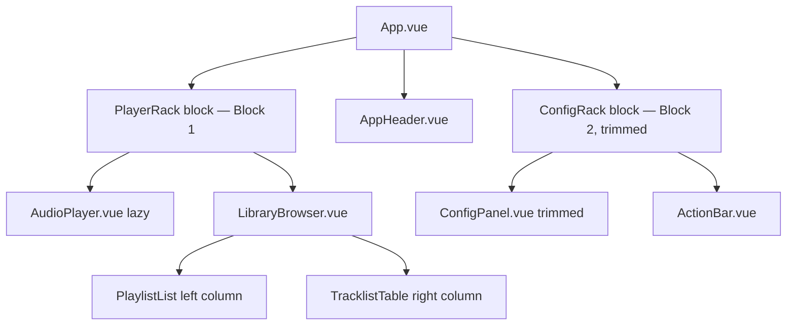
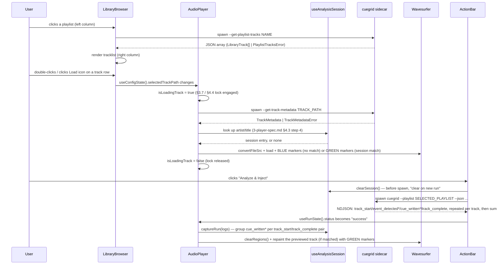

# Spec: Native Library Browser (Phase 4 — Two-Column Playlist/Tracklist UI)

**Current status override (2026-07-13):** implemented in the checked-out
`LibraryBrowser.vue`; the historical proposal status immediately below is no
longer authoritative.

Status: Current implementation contract, synchronized 2026-07-16. Historical revision notes follow; they do not indicate pending implementation. (v1.1
adds a tracklist Action/Load column, fixes the right-column
internal-scroll bug, adds the cross-component `isLoadingTrack`
concurrency lock in a new §4.4, and revises this document's own §4.3
to integrate `3-player-spec.md` §4.3's session-scoped Stage 2
persistence)
Source of truth: `1-proposal.md` (product goals), `2-core-spec.md` (core
pipeline/CLI contract), `3-gui-spec.md` (Tauri + Vue 3 component
architecture, state management, sidecar plumbing), `3-player-spec.md`
(waveform player, Tauri asset bridge, two-stage sync flow)

## Current implementation synchronization (2026-07-13)

`LibraryBrowser.vue` is implemented as a self-contained panel with one
optional `disabled` prop. It loads playlist names on mount, loads tracks after
a playlist click, and writes a selected track's `location_path` to the shared
configuration state for `AudioPlayer.vue` to watch. The right-hand table has
Load, Stems, Artist, and Title columns; row double-click and the Load icon use
the same preview action. A separate context menu exposes the current
track-level **Analyze track** action.

The current `App.vue` layout places the browser in its own flexible card
between the fixed-height player and configuration cards. The application root
and all ancestors are viewport-bounded and `overflow-hidden`. Only the
playlist list and track table wrappers scroll, each with `min-h-0
overflow-y-auto scrollbar-amber`; the browser root and document do not become
scroll containers. The browser footer owns playlist/current-track analysis
buttons and status text.

The Global Collection revision in section 9 supersedes the former two-call
library-loading path (`--list-playlists` at boot and
`--get-playlist-tracks NAME` per selection). The frontend instead loads one
relational `--get-library` payload and resolves playlist references against its
in-memory collection map. The frontend maintains the discovered NML path in the module-scoped
`nmlPathOverride` state and passes it to query/mutation calls where the current
implementation includes it. A selection token discards late playlist
responses so an older request cannot overwrite a newer selection.

The panel uses the semantic Amber/Ochre roles from `gui/tailwind.config.js`:
selected rows use `bg-elevated text-accent`, ordinary track text uses
`text-primary`, and hover/load affordances use the semantic primary/accent
roles. Blue/green/teal references in older layout examples are historical.

This document is the binding technical specification for Phase 4: **the
removal of the manual, free-text `TargetSelector.vue` target picker and
its replacement with a native, interactive, two-column Library Browser**
(playlist list on the left, tracklist table on the right — the
Traktor/Rekordbox convention). Per `CLAUDE.md`, no implementation should
begin until this contract is reviewed and this Status line is updated to
"Resolved."

This spec **extends `2-core-spec.md`** with one new read-only CLI query
(section 1) and **modifies `3-gui-spec.md` sections 3, 5, and 6, and
`3-player-spec.md` sections 3 and 4** — every modification is enumerated
exhaustively in section 6 (Supersession Table) so there is no ambiguity
about which prior contract text is now stale. No change to
`core.pipeline`, `nml.writer`, the `CUE_V2` write contract, or any
existing NDJSON message schema (`2-core-spec.md` section 11).

---

## 0. Scope

In scope:
1. A new standalone, read-only core CLI flag, `--get-playlist-tracks
   <PLAYLIST_NAME>`, architecturally identical to `--list-playlists`
   (section 1).
2. Deprecation of four `CueGridConfig` fields (`targetType`,
   `trackPath`, `trackTitle`, `playlistName`) and introduction of two
   replacements (`selectedPlaylist`, `selectedTrackPath`) (section 2).
3. A new `LibraryBrowser.vue` component with a mandated two-column
   (playlists / tracklist) layout, replacing `TargetSelector.vue`
   entirely (section 3).
4. The double-click bridge from the tracklist to `AudioPlayer.vue`'s
   existing Stage 1/Stage 2 synchronization flow, including the
   batch-aware scoping rule required because `AudioPlayer.vue` no
   longer has a `targetType === "track"` single-track mode to key off
   of (section 4).
5. Visual/overflow rules keeping the new panels inside the existing
   premium dark-zinc modular rack chassis (`3-gui-spec.md` section 4's
   splitter-based layout) (section 5).

Out of scope (deferred to a future spec revision):
- Nested playlist **folders** in the left column. `--list-playlists`
  (`2-core-spec.md` section 12) already flattens the whole
  `<PLAYLISTS>` tree into a single ordered list of names with no
  folder-path qualification (section 12.4's non-goal); this phase keeps
  that flat presentation as-is. A tree view is a candidate for a future
  revision, not this one.
- Playlist/track **management** actions (create, rename, delete,
  reorder, drag tracks between playlists). The browser is read-only,
  exactly like the read-only rendering boundary already mandated for
  `AudioPlayer.vue` (`3-player-spec.md` section 3.5) — this phase adds a
  second read-only surface, not a library editor.
- Multi-select (checkbox) batch preview or partial-playlist processing.
  "Analyze & Inject" always targets the **entire** currently-selected
  playlist (section 2.3) — there is no way to process a subset of a
  playlist's tracks from the GUI in this phase (CLI users retain
  `--track-title`/single-track invocation for that use case; only the
  GUI's target-selection surface is being replaced).
- Any change to `find_entries_by_playlist`'s signature, matching
  semantics, or error types (`2-core-spec.md` section 8.1) — section 1
  below is a pure `cli.py`-side rendering of its existing return shape.
- Column sorting/filtering/search in the tracklist table. Tracks render
  in playlist order, unmodified, matching `find_entries_by_playlist`'s
  own contract.

---

## 1. Core Extension: Playlist Track Discovery

### 1.1 `--get-playlist-tracks <PLAYLIST_NAME>` CLI flag

A new standalone, top-level `cli.py` flag, **architecturally identical
to `--list-playlists`** (`2-core-spec.md` section 12.1): a lightweight,
read-only metadata query that bypasses the entire audio pipeline
entirely. Added to `build_parser()` **outside** the mutually-exclusive
track-selection group (`2-core-spec.md` section 8.4), since it does not
itself select tracks *to process* — it only lists tracks *to display*:

```python
parser.add_argument(
    "--get-playlist-tracks",
    type=str,
    default=None,
    dest="get_playlist_tracks",
    metavar="PLAYLIST_NAME",
    help=(
        "Skip audio analysis entirely: parse the NML, locate the "
        "playlist matching PLAYLIST_NAME, and print a JSON array of "
        "{artist, title, location_path} objects, one per track in "
        "that playlist, in playlist order, then exit. Intended for "
        "the GUI Library Browser's right-hand tracklist column."
    ),
)
```

**No new `NmlParser` method is required.** This flag is a pure
`cli.py`-side rendering of the return shape `find_entries_by_playlist`
(`2-core-spec.md` section 8.1.4) already produces — the exact same
function `run_batch_pipeline` already calls for `--playlist` batch
runs. This mirrors how `--get-track-metadata` (`3-player-spec.md`
section 1) reused `find_entry` verbatim rather than introducing new
parser logic; the same "no new matching logic, only a new one-shot
serialization" discipline applies here.

### 1.2 `cli.py` interception in `main()`

`args.get_playlist_tracks` is checked in the same position pattern as
`--list-playlists` (`2-core-spec.md` section 12.3) and
`--get-track-metadata` (`3-player-spec.md` section 1.2) — immediately
after argument parsing, before `logging.basicConfig(...)` and before
the mutually-exclusive selector-group validation. All three one-shot
query flags are independent, mutually exclusive by construction (only
one `if args.<flag> is not None` block executes per invocation), and
short-circuit the rest of `main()` identically:

1. Resolve the NML path exactly as `--list-playlists`/
   `--get-track-metadata` do (`_resolve_nml_path`). If resolution fails,
   print the same plain-text error to stderr and return `1` (unchanged
   from today's behavior for the other two flags).
2. Construct `NmlParser(nml_path)` and call
   `find_entries_by_playlist(args.get_playlist_tracks)`.
3. On success, build and print the success schema (1.3) as a single
   line to **stdout**, then `sys.exit(0)`.
4. On `PlaylistNotFoundError`/`AmbiguousPlaylistError`, catch the
   exception, print the corresponding error schema (1.4) as a single
   line to **stdout** — not stderr, for the identical rationale
   `--get-track-metadata` already documents (`3-player-spec.md` section
   1.2's "Why stdout for the error case" callout: the frontend consumer
   buffers stdout and parses exactly one JSON line on process close, and
   the exit code alone disambiguates success/error) — then
   `sys.exit(1)`.

No `AppConfig`, `core.pipeline`, `audio.*`, or `nml.writer` code runs in
this path, matching `--list-playlists`'s and `--get-track-metadata`'s
own non-goals.

```python
if args.get_playlist_tracks is not None:
    nml_path = _resolve_nml_path(args.nml)
    if nml_path is None:
        print(
            "error: no collection.nml found under the standard Traktor "
            "install directories. Pass --nml PATH explicitly.",
            file=sys.stderr,
        )
        return 1
    try:
        refs = NmlParser(nml_path).find_entries_by_playlist(
            args.get_playlist_tracks
        )
    except PlaylistNotFoundError as exc:
        print(json.dumps({"error": "not_found", "message": str(exc)}))
        sys.exit(1)
    except AmbiguousPlaylistError as exc:
        print(
            json.dumps(
                {
                    "error": "ambiguous",
                    "message": (
                        f"{exc} Rename one of the playlists in Traktor "
                        "to disambiguate."
                    ),
                }
            )
        )
        sys.exit(1)
    tracks = [
        {
            "artist": ref.entry.artist,
            "title": ref.entry.title,
            "location_path": ref.entry.location_path,
            "is_flex_grid": ref.entry.is_flex_grid,
        }
        for ref in refs
    ]
    print(json.dumps(tracks))
    sys.exit(0)
```

### 1.3 Success schema

A single line, no NDJSON envelope — identical framing choice to
`--list-playlists` (section 12.3, step 4) and `--get-track-metadata`
(section 1.3): a one-shot value, not a progress stream.

```json
[
  {
    "artist": "Carbon Based Lifeforms",
    "title": "Central Plains",
    "location_path": "C:/Users/dj/Music/Tidal/Central Plains.flac",
    "is_flex_grid": false
  },
  {
    "artist": "Solar Fields",
    "title": "Reflective Frequencies",
    "location_path": "C:/Users/dj/Music/Tidal/Reflective Frequencies.flac"
  }
]
```

- A bare JSON **array** (not wrapped in an envelope object), matching
  `--list-playlists`'s own top-level-array framing exactly.
- **Empty playlist:** an empty array `[]`, printed and exited `0` —
  never an error. An empty playlist is a valid, real state the Library
  Browser must render as "0 tracks," not as a failure.
- **Ordering:** playlist order, verbatim from
  `find_entries_by_playlist`'s already-ordered return list — no
  client-side or server-side re-sorting.
- **Fields**, one object per resolved `BatchTrackRef`
  (`2-core-spec.md` section 8.1.4):

| Field | Source | Notes |
|---|---|---|
| `artist` | `BatchTrackRef.entry.artist` (`TrackEntry.artist`) | verbatim |
| `title` | `BatchTrackRef.entry.title` (`TrackEntry.title`) | verbatim |
| `location_path` | `BatchTrackRef.entry.location_path` | the same normalized, resolved path string documented in `2-core-spec.md` section 7.2 — **not** a Tauri asset URL; the frontend must still run it through `convertFileSrc` (`3-player-spec.md` section 2.2) before it ever reaches `wavesurfer.js` |

- `is_flex_grid` is a required boolean sourced from
  `BatchTrackRef.entry.is_flex_grid`. `true` means the entry has more than
  one `CUE_V2 TYPE="4"` marker and is unsupported for CueGrid analysis.

- **Stale playlist references and ambiguous per-track matches**
  (`2-core-spec.md` section 8.1.3, steps 4–5) are silently omitted from
  the array, exactly as `find_entries_by_playlist` already handles them
  for `--playlist` batch runs — this flag introduces no new handling,
  it inherits the existing "skip and continue" behavior verbatim. Note
  that `find_entries_by_playlist`'s internal `logger.warning(...)`
  calls for these cases may still reach the process's stderr via
  Python's `logging.lastResort` handler even though this path never
  calls `logging.basicConfig(...)` (Python's stdlib default behavior
  for unconfigured loggers) — this is expected, pre-existing behavior,
  not a defect introduced by this section, and the frontend already
  treats all stderr output as a non-fatal diagnostic (section 3.4).

### 1.4 Error schema

```json
{"error": "not_found", "message": "No playlist named 'Nonexistent' found in the collection."}
```

```json
{"error": "ambiguous", "message": "Multiple playlists named 'My Breaks' found. Rename one of the playlists in Traktor to disambiguate."}
```

| `error` value | Raised from | `message` |
|---|---|---|
| `"not_found"` | `PlaylistNotFoundError` (`2-core-spec.md` section 8.1.2, step 2) | `str(exc)`, unchanged wording from the exception |
| `"ambiguous"` | `AmbiguousPlaylistError` (`2-core-spec.md` section 8.1.2, step 3) | `str(exc)` plus the same disambiguation hint text pattern already used by `--get-track-metadata`'s `"ambiguous"` case (section 1.4 of `3-player-spec.md`) |

Both shapes are a flat two-key object, deliberately **not** a variant of
the success schema (which is a bare array, not an object at all) — a
consumer distinguishes success from error with `Array.isArray(parsed)`
before touching any other field. This is a slightly different
discriminator than `--get-track-metadata`'s `"error" in obj` check
(section 1.4 of `3-player-spec.md`), because that flag's success schema
is itself an object; `--get-playlist-tracks`'s success schema is an
array, so the array/object distinction is already sufficient and no
`"error" in obj` check is needed at all. Section 3.4 below fixes this as
the exact frontend-side check.

### 1.5 Non-goals

- No NDJSON, no progress messages — always exactly one line on stdout,
  exactly like `--list-playlists`/`--get-track-metadata`.
- No new `NmlParser` method, no change to `find_entries_by_playlist`'s
  signature, matching behavior, or ordering guarantees.
- No pagination or truncation of large playlists — the full array is
  always returned in one line; section 5.2 mandates client-side
  scrolling (`overflow-y-auto`) rather than server-side paging to keep
  this contract simple.

---

## 2. State Management & Deprecation Contract

### 2.1 Fields removed from `CueGridConfig` / `useConfigState`

The following `CueGridConfig` fields (`gui/src/types/config.ts`,
`3-gui-spec.md` section 5.2) are **deprecated and removed**:

| Field | Was used by |
|---|---|
| `targetType` | `TargetSelector.vue`'s radio group; `useCueGridSidecar.ts`'s `buildArgs`; `AudioPlayer.vue`'s lifecycle watchers |
| `trackPath` | `TargetSelector.vue`'s "track" mode input/file picker; `AudioPlayer.vue`'s Stage 1 trigger (`3-player-spec.md` section 3.4) |
| `trackTitle` | `TargetSelector.vue`'s "title" mode input |
| `playlistName` | `TargetSelector.vue`'s "playlist" mode combobox (backed by `--list-playlists`) |

Additionally, and as a **direct, necessary consequence** of removing
`targetType` (not an independently-motivated change, but flagged here
explicitly so no reviewer mistakes it for scope creep): the `artist` and
`title` disambiguator fields are **also removed**. Both fields existed
solely to support `TargetSelector.vue`'s per-mode disambiguation inputs
(`3-gui-spec.md` section 5.3); with `TargetSelector.vue` deleted
entirely (section 3.1) there is no remaining UI producer for either
field, and the core CLI already rejects `--title` outside single-track
mode (`2-core-spec.md` section 8.4's "`--title` is only valid in
single-track mode" check in `main()`) — a mode this GUI no longer
drives at all (section 2.3). Retaining dead, unreachable config fields
would violate this project's "no hidden defaults living in two places"
principle (`3-gui-spec.md` section 5.2's own stated rationale).

### 2.2 Fields added to `CueGridConfig` / `useConfigState`

```ts
// types/config.ts (revised)
export type VerifyMode = "fast" | "smart";
export type Sensitivity = "soft" | "medium" | "hard";

export interface CueGridConfig {
  selectedPlaylist: string | null;   // the playlist currently active in LibraryBrowser's left column
  selectedTrackPath: string | null;  // the location_path of the track double-clicked in the right column, for AudioPlayer preview only
  verifyMode: VerifyMode;
  sensitivity: Sensitivity;
  clearExisting: boolean;
  nmlPathOverride: string | null;    // advanced/optional; null = auto-discover — unchanged from §5.2
}

export const defaultConfig: CueGridConfig = {
  selectedPlaylist: null,
  selectedTrackPath: null,
  verifyMode: "fast",
  sensitivity: "medium",
  clearExisting: false,
  nmlPathOverride: null,
};
```

`TargetType` is deleted from `types/config.ts` entirely (no consumer
remains after section 3's component removal).

**Critical semantic distinction — these two fields serve different
purposes and must never be conflated:**

- `selectedPlaylist` is the **batch processing target**. It is the sole
  driver of what `--playlist` argument `useCueGridSidecar.ts` passes to
  the sidecar when "Analyze & Inject" runs (section 2.3).
- `selectedTrackPath` is the **preview target only**. It never appears
  in `useCueGridSidecar.ts`'s `buildArgs` output at all. It exists
  purely to tell `AudioPlayer.vue` which single track's waveform/cues to
  render (section 4). Double-clicking a track previews it; it does not
  select it for processing, and it does not need to belong to the same
  playlist that will actually be processed (a user may preview a track
  in one playlist, then switch to a different playlist and click
  "Analyze & Inject" — this is intentional, not a validation error, per
  section 2.4's clearing rule).

### 2.3 Validation rules (revised `isValid`)

`useConfigState().isValid` (computed) is `true` if and only if:

```ts
function validate(s: CueGridConfig): boolean {
  return s.selectedPlaylist != null && s.selectedPlaylist.trim().length > 0;
}
```

This fully replaces `3-gui-spec.md` section 5.3's three-way
mutual-exclusion validation (which no longer has any fields to validate
mutual exclusion between). `selectedTrackPath` is **never** part of
`isValid` — a track preview is entirely optional; a user may click
"Analyze & Inject" having never double-clicked any track at all, as
long as a playlist is selected.

### 2.4 Persistence (revised)

`3-gui-spec.md` section 5.5 already excludes "transient path/title/
playlist text" from `localStorage` persistence. That exclusion set is
now exactly `{selectedPlaylist, selectedTrackPath}` — both remain
per-session only, never restored on app restart. This is a slight
tightening from before: previously `playlistName` (the batch target)
*was* effectively re-enterable text a user might reasonably want
restored; under the new browser UX, forcing a fresh playlist pick on
every launch is the correct behavior, since the left column is always
freshly repopulated from `--list-playlists` on boot (section 3.3) and a
stale `selectedPlaylist` string with no corresponding highlighted row
would be a confusing, inconsistent UI state.

**Clearing rule:** selecting a *new* playlist in the left column (i.e.
`selectedPlaylist` changes to a different, non-null value) **must**
also clear `selectedTrackPath` back to `null`, tearing down whatever
`AudioPlayer.vue` was previewing (section 4.1, step 3). This prevents a
stale preview pointing at a `location_path` string that either doesn't
belong to the newly displayed tracklist, or — coincidentally — does
belong to it but no longer reflects deliberate user intent, which is a
confusing UX either way. This is enforced inside `useLibraryState.ts`'s
`selectPlaylist()` action (section 3.3), not left to `AudioPlayer.vue`
to infer.

### 2.5 Action Bar trigger rule (revised)

`ActionBar.vue`'s "Analyze & Inject" button (`3-gui-spec.md` section
3.3/4) **no longer supports single-track or title-batch invocation**.
Clicking it always runs the sidecar in **batch mode targeting
`selectedPlaylist`** — the exact equivalent of what the old
`targetType === "playlist"` branch of `useCueGridSidecar.ts`'s
`buildArgs` already did, now unconditional rather than one of three
branches:

```ts
// composables/useCueGridSidecar.ts — buildArgs (revised)
function buildArgs(cfg: CueGridConfig): string[] {
  const args: string[] = [];
  args.push("--playlist", cfg.selectedPlaylist!); // non-null: run() already checked isValid
  if (cfg.nmlPathOverride) args.push("--nml", cfg.nmlPathOverride);
  args.push("--verify", cfg.verifyMode);
  args.push("--mode", cfg.sensitivity);
  if (cfg.clearExisting) args.push("--clear-existing");
  args.push("--json");
  return args;
}
```

The `run()` function's early-return guard (`if (!isValid.value)
return;`) and its `cfg` object literal (`useCueGridSidecar.ts`) are
updated to read only the six surviving `CueGridConfig` fields (section
2.2) — `targetType`/`trackPath`/`trackTitle`/`playlistName`/`artist`/
`title` are deleted from that object literal along with their source
fields. No other part of `useCueGridSidecar.ts` (NDJSON line buffering,
`stderr` handling, `close`/`error` event wiring, cancellation via
`Child.kill()`) changes — this section is scoped entirely to argument
construction (`3-gui-spec.md` section 6.4/6.6 remain otherwise intact).

---

## 3. GUI Component Tree Restructure

### 3.1 `TargetSelector.vue`: complete deprecation

`gui/src/components/TargetSelector.vue` is deleted. Every reference to
it is removed:

- `ConfigPanel.vue` no longer imports or renders it (its `<template>`
  drops the `<TargetSelector :disabled="locked" />` line entirely,
  section 3.4 below).
- Its two runtime responsibilities are absorbed elsewhere:
  - The `--list-playlists` fetch-on-mount logic currently embedded in
    `TargetSelector.vue`'s `onMounted` hook (lines 167–210 of the
    current file) moves to `useLibraryState.ts` (section 3.3) — the
    Tauri `Command.sidecar(SIDECAR_NAME, ["--list-playlists"])`
    spawn-buffer-parse-on-close pattern is preserved verbatim, just
    relocated to a composable instead of living inside a component's
    `onMounted`.
  - The native file-picker ("Browse" button, `@tauri-apps/plugin-dialog`
    `open()` call) for manually specifying a single track path has
    **no replacement** — it is a deleted capability, not a relocated
    one. Track selection is now exclusively "browse a playlist, then
    double-click a row" (section 4); there is no remaining UI path for
    pointing the app at an arbitrary off-collection audio file. This is
    an intentional, in-scope narrowing of the previous "Track" target
    mode, consistent with the proposal's Traktor/Rekordbox-browser
    framing.

### 3.2 Revised component tree

This supersedes `3-gui-spec.md` section 3.1 and `3-player-spec.md`
section 3.1 — see `3-gui-spec.md` section 3.1's own updated diagram
for the current, canonical tree (which already folds this section's
change in). Locally, the two changes this document is responsible for
are:



1. `TargetSelector.vue` and its `C1` node are gone with no direct
   replacement under `ConfigPanel.vue` (unchanged from the prior
   revision of this section).
2. **`LibraryBrowser.vue` is a child of the PlayerRack block (Block
   1), stacked directly beneath `AudioPlayer.vue`** — this supersedes
   the prior revision of this section, which placed it as a sibling of
   `ConfigPanel.vue` inside the Config block (Block 2). It moved
   because the Config block's vertical space is now reserved,
   protected by a hard anti-clip minimum (`3-gui-spec.md` section 4),
   for `ConfigPanel.vue` + `ActionBar.vue` alone — a large, independently-
   scrolling browser no longer belongs in the same budget.

### 3.3 `LibraryBrowser.vue`: component contract

**File layout additions (`gui/src/`):**

```
src/
  components/
    LibraryBrowser.vue        # this component — §3 contract
  composables/
    useLibraryState.ts        # §3.3 — playlists list, selected playlist, tracklist, sidecar spawns
  types/
    library.ts                # §1.3/§1.4 — LibraryTrack / PlaylistTracksError
```

`types/library.ts`:

```ts
// types/library.ts — mirrors §1.3/§1.4 exactly, no derived fields.
export interface LibraryTrack {
  artist: string;
  title: string;
  location_path: string;
  is_flex_grid: boolean;
}

export interface PlaylistTracksError {
  error: "not_found" | "ambiguous";
  message: string;
}

export type PlaylistTracksResult = LibraryTrack[] | PlaylistTracksError;

/**
 * §1.4's discriminator: success is always a bare array, error is always
 * a flat object — Array.isArray() alone is sufficient and preferred
 * over an "error" in obj check (which would also be correct, but the
 * array/object distinction is the more direct fit for this flag's
 * schema, unlike --get-track-metadata's object/object schema).
 */
export function isPlaylistTracksError(
  r: PlaylistTracksResult,
): r is PlaylistTracksError {
  return !Array.isArray(r);
}
```

`useLibraryState.ts` (shape, mirrors `useTrackMetadata.ts`'s
module-scoped-singleton + exported-async-fetch-function split):

```ts
// composables/useLibraryState.ts (shape, not full implementation)
import { reactive, toRefs } from "vue";
import { Command } from "@tauri-apps/plugin-shell";
import { useConfigState } from "./useConfigState";
import type { LibraryTrack, PlaylistTracksResult } from "../types/library";

const SIDECAR_NAME = "binaries/cuegrid";

interface LibraryState {
  playlists: string[];
  playlistsLoading: boolean;
  tracks: LibraryTrack[];
  tracksLoading: boolean;
  tracksError: string | null; // human-readable, already unwrapped from PlaylistTracksError
}

const state = reactive<LibraryState>({
  playlists: [],
  playlistsLoading: false,
  tracks: [],
  tracksLoading: false,
  tracksError: null,
});

// Stale-response guard, matching AudioPlayer.vue's `stage1Token` pattern
// (3-player-spec.md's runStage1 implementation) — a rapid second click
// on a different playlist must not let the first click's late-arriving
// response clobber the second's once-correct result.
let selectionToken = 0;

export function useLibraryState() {
  const { update } = useConfigState();

  async function loadPlaylists(): Promise<void> {
    state.playlistsLoading = true;
    // Command.sidecar(SIDECAR_NAME, ["--list-playlists"]) — spawn-buffer-
    // parse-on-close, identical to the logic TargetSelector.vue's
    // onMounted previously owned (§3.1). Populates state.playlists.
  }

  async function selectPlaylist(name: string): Promise<void> {
    const myToken = ++selectionToken;
    update("selectedPlaylist", name);
    update("selectedTrackPath", null); // §2.4 clearing rule — unconditional
    state.tracksLoading = true;
    state.tracksError = null;
    // Command.sidecar(SIDECAR_NAME, ["--get-playlist-tracks", name]) —
    // spawn-buffer-parse-on-close, mirroring fetchTrackMetadata()'s shape
    // (useTrackMetadata.ts). On resolution:
    //   if (myToken !== selectionToken) return; // stale, discard
    //   if (isPlaylistTracksError(result)) { state.tracksError = result.message; state.tracks = []; }
    //   else { state.tracks = result; state.tracksError = null; }
    //   state.tracksLoading = false;
  }

  function selectTrackForPreview(track: LibraryTrack): void {
    update("selectedTrackPath", track.location_path); // §4.1 — double-click bridge
  }

  return { ...toRefs(state), loadPlaylists, selectPlaylist, selectTrackForPreview };
}
```

**Props/emits:** `LibraryBrowser.vue` is self-contained, following the
same convention as `AudioPlayer.vue` (`3-player-spec.md` section 3.3) —
it reads `useLibraryState()`/`useConfigState()` directly rather than
receiving props for its data, and accepts exactly one prop matching
every other top-level panel's disabling convention:

```ts
interface LibraryBrowserProps {
  disabled?: boolean; // true while a run is in progress (mirrors ConfigPanel's `locked`)
}
```

It emits nothing. All of its produced state (`selectedPlaylist`,
`selectedTrackPath`) is written into the shared `useConfigState()`
singleton via `useLibraryState()`'s actions, not via component emits —
this matches `TargetSelector.vue`'s own prior convention of mutating
shared composable state directly rather than emitting events up to
`ConfigPanel.vue`.

**Reads (v1.1 addition):** `LibraryBrowser.vue` also reads
`usePlayerState().isLoadingTrack` directly (the same shared singleton
`AudioPlayer.vue` writes to, `3-player-spec.md` §3.7) to drive the
concurrency lock described in §4.4 below — this is a read of an
existing shared composable, not a new prop threaded through `App.vue`,
consistent with this component's self-contained convention.

**On mount:** `LibraryBrowser.vue` calls `useLibraryState().loadPlaylists()`
in `onMounted`, exactly replacing `TargetSelector.vue`'s prior
`onMounted` behavior (section 3.1). If `useConfigState().selectedPlaylist`
is somehow already non-null on mount (it never will be in practice,
since section 2.4 excludes it from persistence — but defensively, in
case a future revision changes that), the component does **not**
auto-re-fetch that playlist's tracks; the left column still requires an
explicit click to populate the right column each session, keeping the
mount sequence simple and side-effect-free beyond the playlist-name
listing itself.

### 3.3.1 Flex Grid Protection presentation and interaction

For every `LibraryTrack` where `is_flex_grid === true`, `LibraryBrowser.vue`
must render the complete row in a visually disabled state. The title remains
legible, but muted/disabled styling and a visible lock or warning icon are
required. The icon or row must expose an accessible tooltip with this meaning:
**Variable BPM (Flex Grid) is unsupported; analysis is disabled.**

A Flex Grid row is not selectable for preview or per-track analysis:
double-click, keyboard activation, and the **Analyze track** context-menu
action must not enqueue it. A playlist-wide batch request may still include
the entry because the core reports it as a protected skip. Its context menu
may be omitted; if a menu shell is retained for layout consistency, its only
analysis action must be disabled and repeat the same tooltip. This client-side
guard improves UX but never replaces the core pipeline's mandatory skip guard in
`2-core-spec.md` sections 2.3 and 8.3.

### 3.4 Placement in `App.vue`

`LibraryBrowser.vue` is inserted **inside Block 1** of `App.vue`'s
resizable rack (`3-gui-spec.md` section 4's revised two-block layout)
— the **PlayerRack** block, directly beneath `AudioPlayer.vue`. This
supersedes the prior revision of this section, which placed it inside
Block 2 alongside `ConfigPanel`/`ActionBar`:

```html
<!-- App.vue — Block 1 (PlayerRack) body (revised in v1.1 — the stray
     `overflow-y-auto` on <LibraryBrowser>'s own tag is removed; see the
     explanation immediately below) -->
<section class="... " :style="{ height: playerRackHeight + 'px' }">
  <AudioPlayer :disabled="status === 'running'" />
  <LibraryBrowser :disabled="status === 'running'" class="flex-1 min-h-0" />
</section>

<!-- App.vue — Block 2 (ConfigRack) body (revised) -->
<section class="..." :style="{ height: configHeight + 'px' }">
  <ConfigPanel :locked="status === 'running'" />
  <ActionBar />
</section>
```

`LibraryBrowser.vue` becomes Block 1's `flex-1 min-h-0` filler,
occupying all vertical space `AudioPlayer.vue` doesn't claim. **The
`overflow-y-auto` the prior revision placed on this same tag is removed
in v1.1** — it was the root cause of the "tracklist fails to scroll"
bug: with both `LibraryBrowser.vue`'s own root *and* its inner
right-column `<div>` (§3.5) each independently declaring
`overflow-y-auto`, the outer element became the first scroll container
the browser's scroll-wheel/trackpad gesture hit, so the whole
playlist+tracklist pair scrolled (or, more often, failed to scroll at
all, since the outer element's content rarely overflows *vertically*
as a combined unit) instead of the inner tracklist's rows scrolling
independently as intended. `LibraryBrowser.vue`'s root only ever needs
`flex-1 min-h-0` to receive a bounded height from Block 1; the two
inner columns (§3.5) are the only elements that should ever declare
`overflow-y-auto` — no ancestor between them and Block 1's `<section>`
may add a second one.

No new splitter is introduced between `AudioPlayer.vue` and
`LibraryBrowser.vue` inside Block 1 — consistent with this document's
own prior precedent of avoiding a fourth top-level splitter, the same
reasoning now applies one level down: introducing independent drag
resizing between the player and the browser is unnecessary complexity
for a first pass.

`ConfigPanel.vue`'s trimming (dropping `<TargetSelector>`, its
validation hint text pointing at "the Library Browser above") is
**unchanged** from the prior revision of this section in substance,
except that "above" now means "in the PlayerRack block, above the
splitter" rather than "the preceding sibling in this same block" —
the hint text itself does not need to change wording, since the
Library Browser is still visually above the Config controls from the
user's point of view, just no longer in the same card:

```html
<!-- ConfigPanel.vue validation hint (unchanged wording) -->
<p v-if="!isValid" class="text-xs text-warn pt-1">
  Select a playlist in the Library Browser above to enable the run.
</p>
```

`configHeight`'s minimum (`CONFIG_MIN`) is **no longer driven by this
document's tracklist-visibility concern** — that concern moved away
with `LibraryBrowser.vue` itself. `3-gui-spec.md` section 4 now owns
`CONFIG_MIN` for a different, stricter reason (guaranteeing
`ActionBar.vue`'s button is never clipped); this document's prior
"`280`–`320`" guidance is superseded by that section's anti-clip floor.

### 3.5 Split-column layout

`LibraryBrowser.vue`'s template root is a Tailwind flex row splitting
roughly one-third/two-thirds, per the mandate:

```html
<template>
  <section class="flex flex-col min-h-0" :class="{ 'opacity-60 pointer-events-none': disabled }">
    <div class="flex items-center gap-2 px-4 py-2 border-b border-zinc-800/80 border-l-2 border-l-teal-500/30">
      <span class="text-xs uppercase tracking-widest text-muted">Library</span>
    </div>
    <div class="flex-1 min-h-0 flex">
      <!-- Left column: Playlists (~1/3 width) -->
      <div class="w-1/3 shrink-0 border-r border-zinc-800/80 min-h-0 overflow-y-auto">
        <ul>
          <li
            v-for="name in playlists"
            :key="name"
            class="px-3 py-1.5 text-sm cursor-pointer truncate"
            :class="name === selectedPlaylist ? 'bg-elevated text-accent' : 'text-muted hover:bg-zinc-800/60 hover:text-primary'"
            @click="selectPlaylist(name)"
          >
            {{ name }}
          </li>
        </ul>
      </div>

      <!-- Right column: Tracklist table (~2/3 width) -->
      <div class="w-2/3 min-h-0 overflow-y-auto">
        <table class="w-full text-sm table-fixed">
          <thead class="sticky top-0 bg-zinc-900">
            <tr>
              <th class="w-10 px-2 py-1.5"></th>
              <th class="text-left px-3 py-1.5 text-muted font-normal">Artist</th>
              <th class="text-left px-3 py-1.5 text-muted font-normal">Title</th>
            </tr>
          </thead>
          <tbody>
            <tr
              v-for="track in tracks"
              :key="track.location_path"
              class="cursor-pointer"
              :class="[
                track.location_path === selectedTrackPath ? 'bg-elevated' : 'hover:bg-zinc-800/60',
                isLoadingTrack ? 'opacity-50 pointer-events-none' : '',
              ]"
              @dblclick="!isLoadingTrack && selectTrackForPreview(track)"
            >
              <td class="px-2 py-1 text-center">
                <button
                  type="button"
                  class="text-muted hover:text-accent disabled:opacity-40 disabled:hover:text-muted"
                  :disabled="isLoadingTrack"
                  :aria-label="`Load ${track.artist} - ${track.title}`"
                  @click.stop="!isLoadingTrack && selectTrackForPreview(track)"
                >
                  ▶
                </button>
              </td>
              <td class="px-3 py-1 text-primary truncate">{{ track.artist }}</td>
              <td class="px-3 py-1 text-primary truncate">{{ track.title }}</td>
            </tr>
          </tbody>
        </table>
      </div>
    </div>
  </section>
</template>
```

**Left column (Playlists):**
- Populated on boot via `--list-playlists` (section 3.3's
  `loadPlaylists()`), rendered as a plain vertical `<ul>`, one `<li>`
  per playlist name, in the order `--list-playlists` returns them
  (`2-core-spec.md` section 12.2 — document order, duplicates included
  verbatim, no de-duplication).
- Single-clicking an item calls `selectPlaylist(name)` (section 3.3),
  which sets `selectedPlaylist` and spawns `--get-playlist-tracks name`.
- The currently-selected playlist is visually highlighted (`bg-elevated
  text-accent`), matching the existing selected-state convention already
  used elsewhere in the app (e.g. `TargetSelector.vue`'s previous
  target-type button highlighting).
- **Duplicate/ambiguous playlist names:** if the user clicks a name that
  resolves to `AmbiguousPlaylistError` (section 1.4), the right column
  renders the inline error message (below); the left column itself does
  not attempt any disambiguation UI (e.g. no folder-path breadcrumb) —
  matching this spec's section 0 non-goal on nested-folder support. The
  user must rename one of the playlists in Traktor, exactly as the core
  spec's own `AmbiguousPlaylistError` message already instructs.

**Right column (Tracklist):**
- A `<table>` with **three** columns (revised in v1.1): a narrow
  leading **Action** column (unlabeled header, `w-10`) containing a
  Load icon/button per row, followed by `Artist` and `Title`, sourced
  from `LibraryTrack.artist`/`LibraryTrack.title` (section 1.3)
  verbatim, in playlist order — no additional data columns (no BPM, no
  duration, no location path shown to the user — `location_path` is
  present in the data model purely to drive `AudioPlayer.vue`'s preview
  bridge, section 4, never rendered as a visible cell).
- **Action column / Load icon (new in v1.1):** clicking the icon calls
  `selectTrackForPreview(track)` — the exact same action a
  double-click on the row already triggers (§4.1) — giving users a
  discoverable, single-click alternative to the double-click gesture.
  The icon is disabled (`:disabled="isLoadingTrack"`) and its click
  handler short-circuits while a load is already in flight (§4.4); the
  exact glyph/asset (Unicode character, inline SVG, icon font) is an
  implementation detail left open by this spec (§8 Open Item).
- **`table-fixed` layout (new in v1.1):** the `<table>` element uses
  Tailwind's `table-fixed` utility (`table-layout: fixed` in plain
  CSS) so column widths stay stable as the row count grows past the
  visible area, instead of `table-layout: auto`'s per-frame width
  recalculation, which is a secondary contributor to perceived
  "broken" scrolling on some platforms alongside the double-overflow-
  container bug fixed in §3.4/§5.2.
- The scroll container remains the wrapper `<div class="w-2/3 min-h-0
  overflow-y-auto">` around the `<table>` (unchanged) — the `<table>`
  element itself never sets its own `overflow`/height; only its
  wrapper does, per §5.2's overflow-containment rule.
- While `tracksLoading` is `true`, render a lightweight loading
  indicator in place of the table body (implementation detail, not
  fixed by this spec — e.g. a centered spinner or a muted "Loading…"
  row).
- While `tracksError` is non-null (an `AmbiguousPlaylistError`/
  `PlaylistNotFoundError` response, section 1.4), render that message
  inline instead of the table, in the existing `text-warn` tone already
  used by `ConfigPanel.vue`'s validation hint and `AudioPlayer.vue`'s
  `metadataError` display (`3-player-spec.md`'s existing `text-warn`
  convention) — `"not_found"` is not expected to occur in practice
  here, since the name always comes from a just-fetched
  `--list-playlists` result, but is handled defensively rather than
  assumed impossible (a playlist could theoretically be deleted in
  Traktor between the two calls).
- Before any playlist has ever been selected (`selectedPlaylist ===
  null`), render an empty-state placeholder (e.g. "Select a playlist to
  view its tracks") rather than an empty table — this is the expected
  initial-boot state on every launch, given section 2.4's
  non-persistence rule.

---

## 4. Inter-Component Lifecycle Sync (Double-Click Trigger)

### 4.1 The bridge to `AudioPlayer.vue`

Double-clicking a track row, **or clicking its Action-column Load icon
(§3.5, new in v1.1)**, in the right column calls
`useLibraryState().selectTrackForPreview(track)` (section 3.3), which
sets `useConfigState().selectedTrackPath = track.location_path`.
`AudioPlayer.vue` reacts to this exactly as it previously reacted to
`trackPath` changes (`3-player-spec.md` section 3.4), with the
`targetType === "track"` guard removed entirely (there is no more
`targetType` to guard on — every `selectedTrackPath` value is, by
construction, a preview request, never a batch-processing selector):

```ts
// AudioPlayer.vue — revised lifecycle watch (supersedes 3-player-spec.md §3.4)
const { selectedTrackPath } = useConfigState();

onMounted(() => {
  // §2.4: selectedTrackPath is never persisted/restored, so this branch
  // is effectively always a no-op on a fresh launch — kept for symmetry
  // with the pre-existing mount-time check and defensive against a
  // future revision that changes the persistence rule.
  if (selectedTrackPath.value) {
    void runStage1(selectedTrackPath.value);
  }
});

let trackPathDebounce: ReturnType<typeof setTimeout> | null = null;
watch(
  () => selectedTrackPath.value,
  (newPath, oldPath) => {
    if (newPath === oldPath) return;
    if (trackPathDebounce) clearTimeout(trackPathDebounce);
    if (!newPath) {
      destroyWaveform();
      reset();
      loadFailed.value = null;
      return;
    }
    // No debounce delay is strictly required anymore (§2.4's clearing
    // rule + double-click-only triggering means this watch no longer
    // fires per-keystroke the way a free-text trackPath input did) —
    // retained at a much shorter window (e.g. 0-50ms, or removed
    // outright) purely to coalesce the rare case of two rapid
    // double-clicks on different rows; a full 400ms debounce is no
    // longer motivated by keystroke suppression and may be shortened
    // at implementation time.
    trackPathDebounce = setTimeout(() => {
      void runStage1(newPath);
    }, 50);
  },
);
```

The 400ms debounce rationale in `3-player-spec.md` section 3.4 (
"keystroke-by-keystroke edits don't spawn a sidecar process per
character") no longer applies, since `selectedTrackPath` is only ever
written by a discrete double-click, never by a text input's `input`
event. The debounce is retained at a much smaller value purely as a
double-click-storm coalescing guard, not eliminated outright, so a rapid
double-click on row A immediately followed by a double-click on row B
does not spawn two overlapping `--get-track-metadata` processes.

### 4.2 Stage 1 (unchanged mechanics, new trigger source; session/lock behavior layered on top in v1.1)

Section 4.1 of `3-player-spec.md` (spawn `--get-track-metadata`,
`convertFileSrc` + `wavesurfer.load`, Timeline plugin phase-alignment,
marker painting) is **structurally unchanged** by this spec — only the
*source* of the path fed into `runStage1(path)` changes, from
`useConfigState().trackPath` to `useConfigState().selectedTrackPath`.
Every mechanic downstream of that path string (the asset bridge,
`stage1Token` staleness guard) is identical. Two behaviors are layered
on top in v1.1, specified in the documents that own them rather than
duplicated here: the `isLoadingTrack` concurrency lock
(`3-player-spec.md` §3.7, this document's §4.4) brackets the whole
call, and the marker-painting step now branches on
`useAnalysisSession` before falling back to the BLUE `existing_cues`
rendering (`3-player-spec.md` §4.3 step 4) — so "marker painting" is
no longer byte-identical to v1.0's behavior, only the *path-sourcing*
and *lifecycle* mechanics are unchanged.

### 4.3 Stage 2 (session-scoped, batch-aware) — revised in v1.1

This is the one genuinely new piece of synchronization logic this spec
introduces, and it exists because of a structural change section 2.5
causes: **every completed run is now a batch/playlist run** (there is no
more single-track run mode), so a completed run's NDJSON log stream
(`useRunState().logs`) may contain **multiple** `track_start`/
`track_complete`/`cue_written*` groups (`2-core-spec.md` section 11.3),
not exactly one.

**v1.1 revision:** the v1.0 version of this section had `AudioPlayer.vue`
re-scan `useRunState().logs` directly, on every `"running" → "success"`
edge, filtering to the previewed track's own `track_start`/
`track_complete` pair. That mechanism is now owned by
`3-player-spec.md` §4.3's `useAnalysisSession.ts` composable instead —
this section describes how this document's batch/playlist run
integrates with that composable, not a competing algorithm:

1. `useCueGridSidecar.ts`'s `run()` (§2.5, invoked by `ActionBar.vue`)
   calls `useAnalysisSession().clearSession()` **before** `startRun()`
   — i.e. before the sidecar is even spawned. This is the **"Session
   State Clear on New Run"** mandate: every click of "Analyze &
   Inject" discards whatever the previous run's session tracking held,
   unconditionally, regardless of whether anything in the GUI is
   currently previewing a track from that previous run.
2. On the same `"running" → "success"` edge this section's v1.0 used
   (never on `"error"`/`"cancelled"`, unchanged),
   `useAnalysisSession().captureRun(logs)` is called once, grouping
   every `cue_written` message under its enclosing
   `track_start`/`track_complete` pair's `artist`/`title` key — the
   grouping algorithm below — and writing the result into the shared
   session map instead of directly repainting the canvas.
3. `AudioPlayer.vue` reacts to a captured session in **two** places,
   both delegating to `3-player-spec.md` §4.3's stage-resolution rule:
   - **Already-previewed track, live edge:** if `metadata.value`'s
     artist/title now has a session entry immediately after step 2,
     repaint with `player.post` (GREEN) / `markerStage =
     "post-analysis"` — the same visible behavior the v1.0 "Stage 2"
     repaint always had, just now expressed as a session lookup
     instead of a bespoke log re-scan.
   - **Freshly double-clicked/Load-icon-clicked track, any time later
     in the same session:** Stage 1 (§4.1/§4.2 of this document,
     mechanically unchanged) itself checks the session map as part of
     its own resolution (`3-player-spec.md` §4.3 step 4) — a track
     loaded five minutes after the run finished, or after the
     Telemetry Console was cleared, still resolves to GREEN/
     `post-analysis` as long as no *newer* run has started since (per
     step 1's clearing rule). This is the **"Persistent Stage 2 within
     a Session"** mandate.

**Grouping algorithm** (unchanged in substance from v1.0, now feeding
`captureRun` instead of the canvas directly):

1. Scan `logs` **in order** for each `track_start` message, recording
   its `artist`/`title` and index (`startIdx`).
2. From `startIdx + 1` onward, scan forward for the **first**
   `track_complete` message whose `artist`/`title` also match
   (`endIdx`).
3. Collect every `cue_written` message with an index strictly between
   `startIdx` and `endIdx` into that key's entry in the session map.
4. Repeat for every `track_start` in the log (a batch run has one pair
   per track processed) — v1.0's version of this algorithm only needed
   to resolve *one* track (the currently-previewed one); `captureRun`
   now resolves and stores **all** of them up front, since any of them
   might be previewed later in the same session.

**Duplicate-metadata edge case (documented, not blocking):** if a
playlist contains two distinct entries sharing byte-identical
`artist`+`title` (e.g. two different file-format rips of the same
release with untouched tags), the grouping algorithm's `Map` key
collides, and the **later** `track_start`/`track_complete` pair in log
order silently overwrites the earlier one's session entry (a `Map`
`set()` on a repeated key always keeps only the most recent write) —
this is a deliberate, narrow, and rare simplification, not an
unresolved ambiguity, matching v1.0's own stance on this same edge case
before session storage existed. Resolving it exactly would require a
`location_path` field on `track_start`/`track_complete`
(`2-core-spec.md` section 11.3), which section 0's non-goals already
rule out touching in this phase (see also §8 Open Item #2).



### 4.4 Concurrency Lock: `isLoadingTrack` (new in v1.1)

Complements `3-player-spec.md` §3.7's definition of the shared
`isLoadingTrack` flag (`usePlayerState()`) with the Library Browser's
half of the contract: while a track load is in flight, every *other*
way of triggering a new one must be inert, so a second click can never
race the first. §3.7's `stage1Token` staleness guard already handles
the *data* race (a stale response can't overwrite a newer one); this
section is about the *input* race — stopping the second click from
ever firing at all.

1. `LibraryBrowser.vue` reads `usePlayerState().isLoadingTrack`
   directly (the same shared singleton `AudioPlayer.vue` writes to),
   exactly as it already reads `useConfigState()`/`useLibraryState()`
   per §3.3's self-contained-component convention — no new prop is
   threaded through `App.vue`.
2. While `isLoadingTrack` is `true`:
   - Every tracklist row's `@dblclick` handler (§4.1) is a no-op
     (`!isLoadingTrack && selectTrackForPreview(track)`).
   - The row's Load icon (§3.5) renders `:disabled="isLoadingTrack"`
     and its own click handler is likewise a no-op.
   - Rows render at reduced opacity (`opacity-50 pointer-events-none`)
     as the visible affordance that the tracklist is temporarily
     locked — distinct from, and layered independently on top of, the
     existing `disabled` prop's `opacity-60 pointer-events-none` (a run
     in progress), since the two flags can independently be true or
     false in any combination (e.g. a run can be in progress while no
     track load is currently in flight, leaving the tracklist rows
     interactive for switching previews, subject only to the
     `disabled` prop's own run-in-progress lock).
   - The left column (playlist list) is **not** locked by
     `isLoadingTrack` — switching playlists never touches the player,
     so there is no race to prevent there; only the right column's
     row-level interactions are gated.
3. **Known limitation (documented, not blocking):**
   `selectTrackForPreview` (§3.3) does not set `isLoadingTrack`
   synchronously — it only writes `useConfigState().selectedTrackPath`,
   and `AudioPlayer.vue`'s watcher (§4.1's revised 0–50ms debounce) is
   what actually flips `isLoadingTrack` to `true`. A double-click
   landing inside that small window is not physically prevented by this
   section alone; it is, in practice, absorbed by `3-player-spec.md`
   §4.1's pre-existing `stage1Token` staleness guard (the second, later
   request always wins and the first's late response is discarded), so
   no visual corruption results — only, at most, one discarded
   in-flight `--get-track-metadata` spawn. Closing this window fully
   would require `LibraryBrowser.vue` to reach into `AudioPlayer.vue`'s
   private lifecycle bookkeeping, which §3.3's self-contained-component
   convention deliberately avoids; this is an accepted tradeoff, not an
   oversight.

---

## 5. Visual Integration & Anti-Clip

### 5.1 Rack integration

`LibraryBrowser.vue` renders as a natural, unstyled-at-the-root child
of **Block 1's** (`PlayerRack`) `bg-zinc-900` card (section 3.4), stacked
beneath `AudioPlayer.vue` — this supersedes the prior revision, which
described it as a child of Block 2. It still does **not** introduce its
own outer border/shadow/rounded-corner treatment, since that chrome
belongs to the enclosing `<section>` in `App.vue`. `LibraryBrowser.vue`'s
own root element still supplies only its internal header strip
(`border-l-2 border-l-teal-500/30`) and the two-column body — no
duplicate card frame, and no visual seam implying it's a separate block
from `AudioPlayer.vue` beyond a simple divider line.

### 5.2 Overflow containment (mandatory)

Unchanged in substance from the prior revision — both column
sub-panels **must** set `overflow-y-auto` with an explicit `min-h-0`
ancestor chain — except that the outer container whose height now
bounds `LibraryBrowser.vue`'s available space is **Block 1's**
remaining height after `AudioPlayer.vue`'s own fixed sub-region is
subtracted, not `configHeight` (Block 2). Concretely:

- The left column (playlists) and right column (tracklist) scroll
  independently of each other, exactly as before.
- The shared parent row still supplies `min-h-0` for the same reason
  as before (a flex child's `overflow-y-auto` silently no-ops without
  it).
- **`LibraryBrowser.vue`'s own root element must not set
  `overflow-y-auto`** (§3.4's v1.1 fix) — only the two inner columns
  do. A second `overflow-y-auto` on any ancestor between the columns
  and Block 1's `<section>` intercepts the scroll gesture before it
  reaches the intended inner column, which was the exact root cause of
  the "tracklist doesn't scroll" bug this revision fixes.
- The right column's `<table>` uses `table-layout: fixed`
  (Tailwind's `table-fixed` utility, §3.5) so column widths stay
  stable as row count grows — an unstable `table-layout: auto`
  recalculation on every scroll-frame is a secondary contributor to
  perceived "broken" scrolling on some platforms, alongside the
  double-overflow-container bug above.
- Neither column ever sets a fixed pixel height of its own; both size
  purely from Block 1's height minus `AudioPlayer.vue`'s height, which
  itself derives from the PlayerRack's resizable pixel height
  (`playerRackHeight`, bound to the single remaining splitter,
  `3-gui-spec.md` section 4) — not from `configHeight` as the prior
  revision specified.

### 5.3 Design constraints

- Row hover/selected states (`hover:bg-zinc-800/60`, selected
  `bg-elevated`) reuse the exact same Tailwind tokens
  `TargetSelector.vue`'s former playlist combobox already used
  (`gui/tailwind.config.js`'s `elevated`/existing zinc scale) — no new
  color tokens are introduced by this spec.
  the existing dark theme design tokens, exactly like
  `3-player-spec.md` section 5.3's own constraint for `AudioPlayer.vue`.
- Table typography uses the default UI font (`font-ui`), **not**
  `font-mono` — artist/title text is prose, not the numeric/telemetry
  content `font-mono` is reserved for elsewhere in the app
  (`TelemetryConsole.vue`, path inputs). This is a deliberate
  distinction from the former `TargetSelector.vue` inputs, which used
  `font-mono` because they held raw filesystem paths/exact-match query
  strings, not display prose.
- Long artist/title strings truncate (`truncate` class) rather than
  wrap, keeping row height uniform and predictable for a table that may
  render hundreds of rows.

---

### 5.4 Current DOM sizing and scroll contract

The current template uses this structural contract:

```html
<section class="flex h-full min-h-0 flex-1 flex-col overflow-hidden">
  <div class="flex-1 min-h-0 flex">
    <div class="flex w-[min(22rem,34%)] min-h-0 shrink-0 flex-col">
      <div class="flex-1 min-h-0 overflow-y-auto scrollbar-amber">...</div>
    </div>
    <div class="flex min-w-0 flex-1 min-h-0 flex-col">
      <div class="flex-1 min-h-0 overflow-y-auto scrollbar-amber">...</div>
    </div>
  </div>
  <div class="shrink-0 ... p-2">analysis actions and status</div>
</section>
```

The left column is approximately 34% wide, capped at 22rem; the right column
receives the remaining width. The header and footer are shrink-0. Loading,
error, empty, and table states are constrained by the same flex/min-h-0 chain.
The `table-fixed` table stays inside the right scroll wrapper, and sticky
headers belong to that wrapper rather than to the page.

## 6. Supersession Table

Every prior-spec section this document modifies, superseded exhaustively
so no ambiguity remains about which older text still applies:

| Prior section | Prior content | Status under this spec |
|---|---|---|
| `3-gui-spec.md` §3.1 (component tree) | `ConfigPanel.vue --> TargetSelector.vue` | Superseded by §3.2's revised tree — `TargetSelector.vue` removed, `LibraryBrowser.vue` added as a sibling of `ConfigPanel.vue` |
| `3-gui-spec.md` §3.2 (file layout) | Lists `TargetSelector.vue` | Superseded — replaced by §3.3's file layout additions |
| `3-gui-spec.md` §3.3 (component responsibilities table, `TargetSelector.vue` row) | Radio group + per-mode text inputs | Superseded — no replacement row; `LibraryBrowser.vue` gets its own row per §3.3 of this doc |
| `3-gui-spec.md` §5.2 (`CueGridConfig`) | `targetType`/`trackPath`/`trackTitle`/`playlistName`/`artist`/`title` fields | Superseded by §2.2 of this doc |
| `3-gui-spec.md` §5.3 (validation rules) | Three-way mutual exclusion + track-mode-only `title` | Superseded by §2.3 of this doc |
| `3-gui-spec.md` §5.5 (persistence) | Excludes `trackPath`/`trackTitle`/`playlistName` | Superseded by §2.4 of this doc (now excludes `selectedPlaylist`/`selectedTrackPath`) |
| `3-gui-spec.md` §6.4 (`buildArgs`) | Branches on `cfg.targetType` | Superseded by §2.5 of this doc (unconditional `--playlist`) |
| `3-player-spec.md` §3.1 (component tree) | `AudioPlayer.vue` above `ConfigPanel.vue`, `TargetSelector.vue` present | Superseded by §3.2 of this doc |
| `3-player-spec.md` §3.3 (props/emits) | Reads `useConfigState()` for `trackPath`/`targetType` | Superseded — reads `selectedTrackPath` only (§4.1 of this doc) |
| `3-player-spec.md` §3.4 (lifecycle rules) | Watches `trackPath`, gated by `targetType === "track"` | Superseded by §4.1 of this doc |
| `3-player-spec.md` §4 (two-stage sync, sequence diagram) | Driven by `TargetSelector` picking a path | Superseded by §4.3's sequence diagram in this doc |
| `3-player-spec.md` §4.1 (Stage 1) | Triggered by `trackPath` change | Mechanically unchanged; trigger source superseded per §4.2 of this doc |
| `3-player-spec.md` §4.2 (Stage 2) | Filters `logs` to all `cue_written`, gated by `targetType === "track"` | Superseded by §4.3 of this doc (batch-aware artist/title scoping) |

Everything in `2-core-spec.md` (sections 1–12) and every other section of
`3-gui-spec.md`/`3-player-spec.md` not listed above is **unaffected** by
this document.

**v1.1 note:** `3-player-spec.md` §4.3 and §5.1 were revised in that
document's own v1.1 pass (session-scoped stage persistence via
`useAnalysisSession.ts`; two fixed BLUE/GREEN stage colors replacing
the hotcue-cycled active palette). This document's own §4.3 and new
§4.4 (above) were updated in lockstep and should be read together with
those sections, not in isolation.

---

## 7. Non-Goals (this document)

- No change to `run_batch_pipeline`, `BatchTrackResult`, `BatchResult`,
  or any NDJSON message schema (`2-core-spec.md` sections 8.3/11.3) —
  section 4.3's Stage 2 scoping is a pure frontend-side filter over the
  existing, unmodified message stream.
- No new Tauri capability/permission entries — `--get-playlist-tracks`
  ships in the same `cuegrid` sidecar binary, invoked via the same
  already-scoped `Command.sidecar` call every other flag already uses
  (`3-gui-spec.md` section 6.3); no new `tauri.conf.json`/capabilities
  changes are required by this spec.
- No schema versioning on `LibraryTrack`/`PlaylistTracksError`, matching
  this project's existing stance on NDJSON/one-shot JSON messages
  (`2-core-spec.md` section 11.7, `3-player-spec.md` section 7).
- No keyboard navigation (arrow keys, Enter-to-preview) in either
  column — mouse click/double-click only, in this phase.
- No visual waveform/duration/BPM preview inline in the tracklist table
  itself — that information only ever appears once a track is
  double-clicked and rendered in the existing `AudioPlayer.vue` header
  (`3-player-spec.md` section 3's existing `trackHeader`/`bpmLabel`
  computed properties, unchanged).
- No custom Load-icon asset/icon library is added by this spec — the
  Action column's icon (§3.5) may be a Unicode glyph, inline SVG, or
  icon-font character at implementation time; this spec mandates only
  its column position, click behavior, and disabled-while-
  `isLoadingTrack` state, not its exact rendering.

## 8. Open Items / Follow-ups

1. **Exact `CONFIG_MIN` splitter minimum** for Block 2 after
   `LibraryBrowser.vue` is added (§3.4) — a concrete pixel value should
   be chosen and tuned during implementation, not fixed by this spec.
2. **Location-path-based Stage 2 disambiguation** (§4.3's documented
   duplicate-metadata edge case) would require adding a `location_path`
   field to the `track_start`/`track_complete` NDJSON messages
   (`2-core-spec.md` section 11.3) — flagged as a candidate future
   addition to that section, not resolved here, since it touches an
   already-implemented, stable message schema.
3. **Playlist folder tree view** (§0's first out-of-scope item) is a
   natural next revision once `--list-playlists`/`find_entries_by_playlist`
   grow folder-path-aware variants — not proposed by this document.
4. **This document should be folded into `2-core-spec.md` as a new
   section 13** (or alongside `3-player-spec.md`'s own pending
   section-13 fold, per that document's own Open Item #3) once core-side
   implementation of §1 begins, per `CLAUDE.md`'s "ask to update the
   spec first" rule — kept standalone for now so GUI and core reviewers
   can review the whole Library Browser contract in one place.
5. **Exact Load icon glyph/asset** (§3.5) is left open for
   implementation time, as noted in §7's non-goals.
6. **`isLoadingTrack`'s small race window** (§4.4's "known limitation")
   is accepted as-is for this revision rather than closed at the input
   level — flagged here as a candidate follow-up, not a blocking gap.

---

## 9. Global Collection Relational State Contract (v1.2, proposed)

This section supersedes sections 1, 3.3, and 3.5 wherever they prescribe
separate `--list-playlists` / `--get-playlist-tracks` calls, `LibraryTrack[]`
responses, or playlist-embedded track metadata. The detailed interaction,
selection, and Flex Grid rules in those sections remain in force after their
track source is replaced by this contract.

### 9.1 One-shot load boundary

On browser mount, `useLibraryState()` must invoke the packaged sidecar once:

```ts
Command.sidecar(SIDECAR_NAME, ["--get-library", ...nmlArgs])
```

It parses the single JSON success object specified by `2-core-spec.md`
section 17 and installs it atomically into module-scoped or Pinia-backed
state. The browser must not issue a per-playlist sidecar call after this load.
The old query flags may remain available for CLI compatibility, but they are
not part of the Library Browser data path.

```ts
export interface CollectionTrack {
  artist: string;
  title: string;
  album: string;
  remixer: string;
  producer: string;
  genre: string;
  label: string;
  comment: string;
  comment2: string;
  lyrics: string;
  mix: string;
  rating: number;
  location_path: string;
  bpm: number | null;
  grid_anchor_ms: number | null;
  key: string | null;
  duration_ms: number | null;
  is_flex_grid: boolean;
  existing_cues: ExistingCue[];
  collection_index: number;
}

export interface PlaylistFolder {
  kind: "folder";
  name: string;
  children: PlaylistNode[];
}

export interface PlaylistLeaf {
  kind: "playlist";
  name: string;
  track_paths: string[];
}

export type PlaylistNode = PlaylistFolder | PlaylistLeaf;

export interface LibraryPayload {
  collection: Record<string, CollectionTrack>;
  playlists: PlaylistNode[];
}
```

`ExistingCue` has the same shape already used by the track-metadata contract;
this declaration does not create a second cue representation. Runtime payload
validation must reject a malformed payload or a `track_paths` reference that
does not exist in `collection` rather than rendering partial, inconsistent
library state.

#### 9.1.1 Complete initial metadata payload

The first successful `--get-library` response is the complete metadata source
for the Library Browser. Each `CollectionTrack` must include all metadata
properties declared in section 9.1, even when their NML source is absent. The
eleven text properties (`artist`, `title`, `album`, `remixer`, `producer`,
`genre`, `label`, `comment`, `comment2`, `lyrics`, and `mix`) are strings;
absence is represented by `""`. `rating` is a number from `0` through `5`.

The table model must read these fields directly from the installed collection
dictionary. It must not make a per-track metadata request, derive a value from
another field, or wait for track preview metadata before a column can display
its value. Visible-column selection remains a presentation concern; this
contract guarantees that every editable metadata column is available
immediately after the initial library load.

### 9.2 Lookup-only view derivation

The state owner retains the received `collection` dictionary as the sole
in-memory owner of track metadata. A selected playlist stores its leaf node
(or its tree-local selection identity) and derives rows by O(1) lookup:

```ts
const playlistTracks = computed(() =>
  selectedPlaylist.value?.track_paths
    .map((path) => library.collection[path])
    .filter((track): track is CollectionTrack => track !== undefined) ?? [],
);

const globalCollectionTracks = computed(() =>
  Object.values(library.collection)
    .sort((a, b) => a.collection_index - b.collection_index),
);
```

The Global Collection view renders `globalCollectionTracks`; therefore orphan
tracks require no synthetic playlist and appear naturally beside playlisted
tracks. Playlist views render `playlistTracks` in `track_paths` order. Neither
computed result may be written back into state, cloned into each playlist, or
serialized across the Tauri bridge as embedded track objects.

### 9.3 Refresh and selection behavior

A refresh replaces both `collection` and `playlists` together. Before the
replacement becomes visible, the state owner must clear a selected playlist or
selected track whose path/node is no longer present. A stale-response token
still guards concurrent refreshes; only the newest successful `--get-library`
response may update the store.

When a user selects a resolved track for preview, `selectedTrackPath` remains
the normalized `location_path`. `AudioPlayer.vue` and mutation actions look up
the authoritative metadata from `collection[selectedTrackPath]`; no change is
made to their path-based bridge contract.

### 9.4 Tracklist columns, sorting, and resizing (v1.3)

This section supersedes the right-column table-column requirements in section
3.5. The tracklist has seven columns, in this order: the existing narrow,
unlabelled **Action** column; a narrow, unlabelled **Stem** indicator column;
then **Artist**, **Title**, **BPM**, **Key**, and **Duration**. The Stem column
renders the accessible native-Stems icon for tracks whose `flags` contain bit
`0x40`, otherwise an empty cell. `Key` renders `CollectionTrack.key`; an absent NML key renders
as an empty cell. `Duration` renders the existing `duration_ms` value in a
human-readable duration format. `Artist`, `Title`, `BPM`, `Key`, and
`Duration` are visible metadata columns; `location_path` remains an internal
bridge value and is never rendered.

The obsolete **GRID** column is removed. Flex Grid status is already conveyed
by the disabled-row treatment and the accessible tooltip defined in section
3.3.1, so no separate Grid cell or header is rendered.

#### 9.4.1 Local sorting

Clicking a sortable metadata header (`Stem`, `Artist`, `Title`, `BPM`, `Key`, or
`Duration`) anywhere within its header cell sorts the currently visible track
rows locally by that field. The resize handle is the only excluded hit target.
The first click selects that field in ascending order; clicking the active
header cycles to descending order and then back to the unsorted source order.
The Action column is not sortable. Sorting does not mutate the received
collection, playlist `track_paths`, or selected row state.

The chosen sort field and direction are browser-level table state, not
playlist-local state: changing playlists, selecting Global Collection, or
refreshing the visible source must preserve the active sort state and apply it
to the new visible rows. When no header has been selected, rows retain the
source ordering specified in section 9.2. The Stem header has no visible text,
but its sort control has an accessible Stem label.

#### 9.4.2 Resizable columns

Each visible table column has a drag handle on its header boundary. Dragging a
handle resizes the adjacent column width while retaining the table within its
right-column container and respecting implementation-defined sensible minimum
widths. The table remains `table-layout: fixed`; row content must truncate or
otherwise overflow safely rather than forcing a resized column wider. Header
and body cells use the same width model so alignment is maintained during and
after a drag. Every resizable boundary is rendered as a persistently visible
yellow separator; hover may strengthen the affordance but must not be required
to reveal it. Column-width persistence beyond the mounted browser instance is
not required by this version.

#### 9.4.3 Alignment and header boundary

All tracklist headers and their corresponding data cells use left alignment,
including BPM and Duration. The header strip has a persistently visible
top-and-bottom boundary treatment in the dark theme; its extent must remain
clear without relying on hover state.

### 9.5 Auto Cue row selection (current UI contract)

`useLibraryState()` additionally owns `selectedLibraryPaths: string[]`. It is
the complete set of selected table-row `location_path` values and is the sole
source for selected-track Auto Cue processing. It is not derived from, copied
to, or otherwise coupled with `selectedTrackPath`.

`selectedTrackPath` continues to identify only the track loaded in
`AudioPlayer.vue`; double-clicking a row calls `selectTrackForPreview` and
does not change the Auto Cue selection. A single row click replaces the
selection, Ctrl/Cmd-click toggles the clicked row, and Shift-click selects the
inclusive range between the last selected row and the clicked row in the
current visible track ordering. No checkbox selection UI is used.

The table renders a standard selected-row highlight for paths in
`selectedLibraryPaths`. Its styling is distinct from the preview/player
indicator so a DJ can see both states at once. Context changes and library
refreshes prune selected paths that are no longer valid; context changes clear
the selection. They must not clear a valid player preview.

The Library Browser footer contains no Auto Cue controls. `ActionBar` in the
bottom **AUTO CUE** rack renders **Auto Cue Selected** whenever the selection
is non-empty, otherwise **Auto Cue Playlist** for the active playlist. The
control is disabled if neither target is available or while a run is active.

### 9.6 Musical key normalization and Smart Playlist filtering

CueGrid uses Traktor's native **Open Key** notation as its sole key value:
`1d`--`12d` for Major/Dur and `1m`--`12m` for Minor/Moll. Collection
payloads, Library Browser cells, Smart Playlist rules, and filter controls
must never surface Camelot notation as their canonical value.

Key resolution occurs in two ordered stages for every collection `ENTRY`:

1. **Native Traktor value (primary):** parse `<MUSICAL_KEY VALUE="0..23">`.
   Values `0..11` map respectively to `1d, 8d, 3d, 10d, 5d, 12d, 7d, 2d,
   9d, 4d, 11d, 6d`; values `12..23` map respectively to `1m, 8m, 3m,
   10m, 5m, 12m, 7m, 2m, 9m, 4m, 11m, 6m`.
2. **Legacy tag fallback:** only when `<MUSICAL_KEY>` is absent or invalid,
   parse `<INFO KEY="...">` and normalize it to Open Key. This accepts
   existing Open Key labels, Camelot labels (`8B` → `1d`, `8A` → `1m`,
   `1B` → `6d`, `1A` → `6m`), and conventional key text such as `C Major`
   or `A minor`. Empty or unrecognized values are represented as no key.

Smart Playlist key comparisons normalize both the rule value and the source
track before evaluation, including raw NML entries evaluated by the CLI. Key
rules therefore operate only on valid Open Key values, regardless of a
third-party tag's original notation. The Vue key-rule control is a fixed
dropdown containing exactly `1d`--`12d` and `1m`--`12m`; it does not accept
free-text Camelot input.
