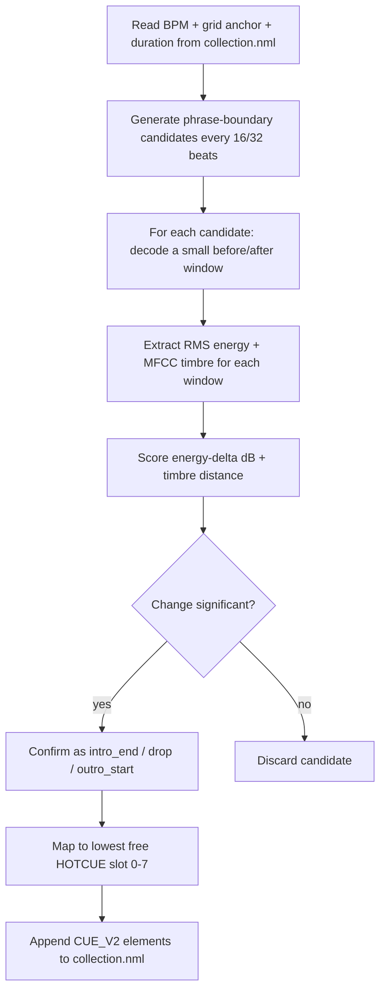

# traktorco

Analyzes audio tracks and automatically injects HotCues into Traktor
Pro's `collection.nml`, using **Traktor's own BPM and beatgrid data** as
the source of truth — no independent beat-detection or grid-fitting, and
no snapping/quantization step, because every cue this tool writes is
mathematically derived from the grid to begin with.

- Reads BPM and the grid anchor (`AutoGrid`) straight from your Traktor
  collection.
- Analyzes only small, targeted windows of audio at musically meaningful
  phrase boundaries (every 16/32 beats) — never the whole track.
- Confirms `intro_end`, `drop`, and `outro_start` cue points only where a
  real energy or timbre change is detected.
- Writes new `<CUE_V2>` HotCue elements back into your `collection.nml`,
  never touching your existing cues, grid, or any other track data.

Full technical specification: [`.openspec/2-spec.md`](.openspec/2-spec.md).

---

## Installation

Requires **Python 3.10+**.

```bash
git clone <this-repo>
cd traktorco
python -m venv .venv
.venv\Scripts\activate        # Windows
# source .venv/bin/activate   # macOS/Linux

pip install -e .
```

This installs the `traktorco` console command along with its runtime
dependencies (`librosa`, `numpy`).

For running the test suite too:

```bash
pip install -e ".[dev]"
pytest
```

> **Back up your collection first.** This tool writes directly to your
> `collection.nml`. It always creates a `<name>.nml.bak` backup before its
> first write in a given run (and never overwrites an existing backup),
> but you should still keep your own copy until you're comfortable with
> its behavior — see [Safety notes](#safety-notes).

---

## CLI usage

```
traktorco TRACK_PATH [--nml NML_PATH] [--title TITLE] [--artist ARTIST]
          [-v] [tuning flags...]
```

### Basic example

```bash
traktorco "D:\Music\Artist - Track.flac"
```

If `--nml` is omitted, `traktorco` auto-discovers your `collection.nml`
(see [Auto-discovery](#auto-discovery-of-collectionnml) below). Output
looks like:

```
Artist - Track
Detected 5 event(s):
     intro_end      6997.217 ms  confidence=3.152
          drop     27568.836 ms  confidence=10.403
          drop     54997.662 ms  confidence=11.565
          drop    137284.138 ms  confidence=19.706
   outro_start    240142.234 ms  confidence=7.078
Wrote 5 new CUE_V2 element(s) to C:\Users\you\Documents\Native Instruments\Traktor 4.4.0\collection.nml
```

### `--nml`: pointing at a specific collection

```bash
traktorco "D:\Music\Artist - Track.flac" --nml "D:\Backups\collection.nml"
```

Use this to target a specific collection file explicitly — useful if you
have multiple Traktor installations, work from a backup, or run this
tool in a script/CI context where auto-discovery isn't appropriate.

### Auto-discovery of `collection.nml`

If `--nml` is not given, `traktorco` searches the standard Traktor
install locations:

- **Windows / macOS:** `~/Documents/Native Instruments/Traktor */collection.nml`

Every installed Traktor version creates its own `Traktor x.x.x` folder
under that root; `traktorco` checks all of them and picks the
**most recently modified** `collection.nml`. If none is found anywhere,
it exits with an error asking you to pass `--nml` explicitly.

### `--title` / `--artist`: disambiguating duplicate tracks

A track is matched to an `<ENTRY>` in your collection by its file path.
In the rare case that more than one `<ENTRY>` shares the exact same
`LOCATION` (e.g. an edited/merged collection), `traktorco` will refuse to
guess and instead report the conflict:

```
error: 2 ENTRY elements matched path: 'd:/music/artist - track.flac' in collection.nml ('Artist' - 'Track (Radio Edit)', 'Artist' - 'Track (Extended Mix)'); disambiguate with --title/--artist

Multiple tracks share this LOCATION. Narrow it down with --title and/or --artist.
```

Resolve it with either or both flags:

```bash
traktorco "D:\Music\Artist - Track.flac" --title "Track (Extended Mix)"
traktorco "D:\Music\Artist - Track.flac" --artist "Artist" --title "Track (Extended Mix)"
```

Matching is case-insensitive and exact (not a substring search).

### `-v` / `--verbose`

Enables `INFO`-level logging (which `<ENTRY>` was matched, how many
events were detected, how many cues were written, etc.). Without it,
only warnings and the final summary are shown.

### Tuning flags (advanced)

Every knob in the analysis pipeline is exposed as a CLI flag. **All of
them are optional** — any flag you don't pass falls back to its own
default, shown in `--help`:

| Flag | Default | Meaning |
|---|---|---|
| `--phrase-beats` | `16` | Base phrase granularity, in beats (a 4-bar block). Candidates are generated every N beats from the grid anchor. |
| `--major-phrase-multiple` | `2` | Every Nth candidate is additionally tagged a "major" (8-bar / 32-beat) phrase boundary. |
| `--sample-rate` | native | Resample analysis windows to this rate; omit to keep each track's native sample rate. |
| `--hop-length` | `512` | Frame hop used for RMS/MFCC extraction within each window. |
| `--window-beats` | `4.0` | Size of the before/after analysis window around each candidate, in beats (so it scales with tempo instead of using a fixed number of seconds). |
| `--mfcc-count` | `13` | Number of MFCC coefficients extracted per window (timbre fingerprint size). |
| `--energy-threshold` | `3.0` | Minimum absolute RMS energy change, in dB, to flag a candidate as significant. |
| `--timbre-threshold` | `12.0` | Minimum Euclidean distance between MFCC vectors to flag a candidate as significant. |
| `--intro-fraction` | `0.25` | `intro_end` must fall within this fraction of the track's start. |
| `--outro-fraction` | `0.20` | `outro_start` must fall within this fraction of the track's end. |
| `--max-drop-cues` | `3` | Maximum number of `drop` cues written per track. |

Example — fewer, stronger drops only:

```bash
traktorco "D:\Music\Artist - Track.flac" --max-drop-cues 1 --energy-threshold 6.0
```

Run `traktorco --help` for the full, always-up-to-date list.

---

## How Grid-Guided Phrase Analysis works

Most auto-cue tools run beat/onset/novelty detection blindly across an
entire track. `traktorco` takes a different, DJ-centric approach: in
club-oriented electronic music, structural changes (drops, breakdowns,
intro/outro boundaries) overwhelmingly land on **musical phrase
boundaries** — 4-bar (16-beat) or 8-bar (32-beat) blocks. So instead of
searching everywhere, `traktorco` only looks *there*.



### 1. Candidates come from the grid, not from guessing

Given the track's `BPM` and its Traktor-assigned grid anchor `G` (the
`AutoGrid` cue's timestamp), the beat length is `L = 60000 / BPM`
milliseconds. A candidate timestamp is generated every `phrase_beats`
(default 16) beats from the anchor:

```
t_ms(n) = G + n * phrase_beats * L,   for n = 0, 1, 2, ... up to the track's duration
```

Every other candidate (`n` even, by default) is additionally tagged a
"major" 32-beat phrase boundary. Because every candidate is already
`G + k*L` for an integer `k`, **it is exactly grid-aligned by
construction** — there is no separate beat-snapping step, unlike tools
that detect an arbitrary timestamp first and then round it to the
nearest beat afterward.

### 2. Only small windows are ever decoded

For each candidate, `traktorco` decodes exactly two short audio windows —
one immediately before it, one immediately after (sized in beats, so the
window automatically scales with tempo) — using `librosa`'s
offset/duration seeking. The rest of the track is never touched. For a
typical 4-minute track this means analyzing on the order of a hundred
short windows instead of the entire waveform, which is both faster and,
because arrangement changes really are phrase-aligned in this genre, more
musically accurate than blind whole-track novelty detection.

### 3. A candidate is confirmed only if the change is real

Each window pair is scored on two independent signals:

- **Energy change** — the change in RMS loudness, in decibels.
- **Timbre change** — the Euclidean distance between MFCC vectors
  (a numeric fingerprint of the sound's texture/instrumentation).

A candidate is confirmed only if either signal crosses its threshold
(`--energy-threshold` / `--timbre-threshold`). The earliest confirmed
candidate near the start of the track becomes `intro_end`; the latest
near the end becomes `outro_start`; the strongest remaining
energy-rising candidates (up to `--max-drop-cues`) become `drop`.

### 4. Cues are written, never anything else touched

Confirmed events are mapped to the lowest free `HOTCUE` slot (0–7) and
appended as new `<CUE_V2>` elements. The writer:

- Never touches the existing `AutoGrid` cue or any other existing
  `<CUE_V2>`/child element — it only appends.
- Never overwrites a `HOTCUE` slot you (or a previous run) already used;
  if all 8 slots are taken, remaining events are skipped with a warning,
  not an error.
- Always backs up the original file to `<name>.nml.bak` before its first
  write of a run.

For the full algorithm, data structures, and edge-case handling, see
[`.openspec/2-spec.md`](.openspec/2-spec.md), sections 4 and 6.

---

## Safety notes

- Always keep your own backup of `collection.nml` in addition to the
  automatic `.bak` this tool creates — especially the first few times you
  run it.
- Close Traktor before running `traktorco` against your live collection,
  the same way you would for any other external collection editor.
- Re-running `traktorco` on a track it has already processed is safe: it
  will detect the already-used `HOTCUE` slots and either fill in
  remaining free slots or skip with a warning once all 8 are occupied —
  it will never overwrite a cue it (or you) already placed.

---

## Development

```bash
pip install -e ".[dev]"
pytest -v
```

The test suite includes a deterministic synthetic audio fixture
(`tests/fixtures/generate_synthetic_fixture.py`) so the detection logic
is fully covered without requiring any real music files.
