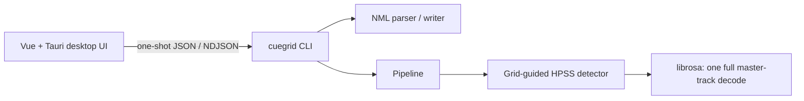

# CueGrid

CueGrid analyzes structurally meaningful, Traktor-grid-aligned phrase boundaries and writes standard HotCues into a Traktor `collection.nml`. The Python core is the authoritative implementation; this document describes the checked-out code as of 2026-07-16.

It is a hybrid application:



## What the core does

- Reads BPM, grid anchor, duration, existing cues, and track metadata from `collection.nml`.
- Generates candidate timestamps mathematically from Traktor's grid; it does not use whole-track novelty peak-picking or infer a new beat grid.
- Decodes the master audio once per detection run, keeps that waveform only in local memory, and slices before/after candidate windows from RAM.
- Separates each window into harmonic and percussive components with HPSS, then combines structural contrast with MFCC timbre distance.
- Emits one unified detected-event label, `cue`; historical roles such as `intro_end`, `drop`, and `outro` are not produced.
- Maps selected events to free standard HotCue slots (`0`–`7`) and writes atomically while preserving non-HotCue markers.
- Supports single-track, playlist, and title-selected sequential batch analysis.

## Detection model

CueGrid's detector is grid-guided from start to finish:

1. It calculates candidates at `grid_anchor_ms + beat_index * (60000 / BPM)`. The default candidate interval is `phrase_beats=4`; the `is_major_phrase` field is traceability metadata only and does not boost selection.
2. It rejects candidates in the first eight beats and within the final eight beats before feature extraction.
3. `detector.py` makes exactly one `librosa.load(..., mono=True)` call for the selected master track. Each candidate's before/after windows are NumPy slices of that local array.
4. Each slice is transformed with a 1024-point STFT and HPSS (`kernel_size=15`). Mean harmonic RMS, mean percussive RMS, and mean MFCCs are measured.
5. A structural contrast favors percussive arrivals over ordinary overall-volume changes and can recognize percussive removals where harmonic energy holds. A candidate is also significant when its MFCC distance crosses the timbre threshold.
6. Near-silent percussive after-windows are rejected. Significant candidates are weighted with `W(x) = 1 - alpha(2x - 1)^2` (`alpha=0.6` by default), filtered relative to the strongest weighted candidate, capped at `max_cues`, and returned in chronological order.

The detector deletes its full-track waveform after scoring and calls `gc.collect()`. There is no global audio cache. The live analysis pipeline does not call `audio.loader.load_window`, does not use native Stem sidecars, and does not run FFmpeg extraction or source fusion.

Legacy Stem/FFmpeg code is retained in `audio/legacy_stems.py` and `nml/stems.py` for reference only. Neither module is imported by the active core and both are explicitly excluded from the PyInstaller build. `ffmpeg-python` is not a CueGrid dependency.

## Installation

Requirements:

- Python 3.10 or newer (the packaged application may use a newer Python runtime)
- `librosa`, NumPy, and SoundFile, installed through the core project
- Node.js only when developing the optional Tauri/Vue GUI

```powershell
cd core
python -m venv .venv
.venv\Scripts\Activate.ps1
pip install -e ".[dev]"

# From the repository root
pytest core
```

FFmpeg is not required for CueGrid. Legacy reference code can only be used in a separate environment where its optional dependencies are installed manually.

## CLI reference

The current command has three analysis selectors; exactly one is required for an analysis run:

```text
cuegrid TRACK_PATH [options]
cuegrid --track-title TITLE [--artist ARTIST] [options]
cuegrid --playlist NAME [options]
```

`--nml PATH` selects the Traktor collection. If omitted, CueGrid searches the standard Native Instruments document directories and selects the most recently modified `collection.nml`.

### Analysis selection and writes

| Flag | Current behavior |
|---|---|
| `TRACK_PATH` | Analyze one path-matched collection entry. |
| `--track-title TITLE` | Batch-select every case-insensitive exact title match; `--artist` may narrow it. |
| `--playlist NAME` | Batch-select a case-sensitive playlist name in playlist order. Duplicate playlist names are an error. |
| `--title TITLE` | Disambiguates a duplicate path match in single-track mode only. |
| `--artist ARTIST` | Disambiguates a single-track match or narrows `--track-title`. It is invalid with `--playlist`. |
| `--clear-existing` | Removes only standard `TYPE="0"` HotCues before new cues are written; Grid and Load markers remain. |
| `--delete-cue HOTCUE_INDEX` | Standalone mutation: deletes one standard zero-based HotCue slot from `TRACK_PATH`. |
| `--update-cues JSON_STRING` | Standalone mutation: updates or creates standard HotCues from `[{'hotcue': 0, 'start_ms': 12000.0}]`. Use JSON double quotes in real shells. |
| `--grid-anchor MS` | Only valid with `--update-cues`; updates the sole Grid marker and rejects Flex Grid tracks. |
| `--bpm BPM` | Only valid with `--update-cues`; persists a finite BPM in the inclusive range 50–200. |

Examples:

```powershell
cuegrid "D:\Music\Artist - Track.flac" --nml "D:\Traktor\collection.nml"
cuegrid --playlist "Friday set" --mode hard --clear-existing
cuegrid --track-title "Untitled" --artist "Artist" --json
cuegrid "D:\Music\Artist - Track.flac" --delete-cue 2
cuegrid "D:\Music\Artist - Track.flac" --update-cues "[{\"hotcue\":0,\"start_ms\":12000.0}]" --bpm 128
```

### Read-only sidecar queries and output modes

| Flag | Output / behavior |
|---|---|
| `--json` | NDJSON lifecycle output for an analysis run. Messages include `nml_resolved`, `track_start`, zero or more `event_detected` / `cue_written`, `track_complete`, and `summary`; errors use `log`. |
| `--export-gui` | A single GUI analysis JSON document for one `TRACK_PATH`; cannot be combined with `--json`. |
| `--discover-nml` | Prints `{"path": "..."}` or an error JSON object, then exits. |
| `--list-playlists` | Prints a plain JSON array of playlist names and exits. |
| `--get-playlist-tracks NAME` | Prints a plain JSON array of playlist track summaries and exits. |
| `--get-track-metadata TRACK_PATH` | Prints one Super JSON metadata/preview object and exits. It includes track metadata, existing cues, `waveform_peaks`, and `color_map`. |
| `--get-library` | Prints one compact relational JSON object with a collection map and nested playlist/folder structure, then exits. |

The Super JSON preview is intentionally separate from detection: `generate_preview_payload()` performs its own complete low-rate decode at 11,025 Hz to produce interleaved signed-8-bit waveform extrema and 500 ms low/mid/high colour buckets.

### Advanced analysis and export flags

| Flag | Default / behavior |
|---|---|
| `--mode {soft,medium,hard}` | Applies the linked threshold presets: soft `(2, 8, .15)`, medium `(4, 18, .30)`, hard `(7, 30, .50)` for energy dB, MFCC distance, and relative confidence. |
| `--phrase-beats N` | Candidate interval in beats; default `4`. |
| `--major-phrase-multiple N` | Major-candidate traceability interval; default `1`. |
| `--sample-rate N` | Resamples the one detection decode; omitted keeps native rate. |
| `--hop-length N` | STFT/MFCC hop length; default `512`. |
| `--window-beats N` | Before/after context width; default `2.0`. |
| `--mfcc-count N` | MFCC coefficient count; default `13`. |
| `--energy-threshold N` | Structural contrast threshold in dB; default `4.0`. |
| `--timbre-threshold N` | MFCC Euclidean-distance threshold; default `18.0`. |
| `--relative-confidence-threshold N` | Fraction of the strongest weighted candidate; default `0.30`. |
| `--max-cues N` | Maximum selected cues; default `8`. |
| `--export-csv PATH` | Appends current candidate telemetry to a CSV file. |
| `-v`, `--verbose` | Enables INFO logging on stderr. |

`--stems-dir`, `--verify {fast,smart}`, and `--no-stems` are still accepted for command-line compatibility. They do not alter the active master-track detector. `--verify` only affects one human-readable reporting branch.

## NML safety

- Flex Grid entries (more than one `TYPE="4"` marker) are skipped before audio decoding.
- The writer preserves existing Grid, Load, and other nonstandard-Cue XML elements.
- Automated writes append only standard `TYPE="0"` cues and never overwrite occupied pad slots unless `--clear-existing` was requested.
- Manual update and delete commands validate their complete payload before mutation.
- Every mutation writes a daily backup in `CueGrid Backups/<collection.nml>.YYYYMMDD.bak`, retaining the five most recent backups, then atomically replaces the collection through a `.tmp` file.

Keep an independent backup of your collection until you are comfortable with the workflow.

## Development layout

```text
core/src/cuegrid/
  cli.py                 command-line and sidecar contracts
  audio/beatgrid.py      grid candidate arithmetic
  audio/detector.py      one-decode RAM-sliced HPSS detection
  audio/features.py      structural and timbral scoring
  audio/loader.py        active preview generation and seek-window utility
  audio/legacy_stems.py  excluded legacy FFmpeg/Stem reference code
  core/pipeline.py       single-track and sequential batch orchestration
  nml/                   XML parsing, mapping, and atomic persistence
gui/                     Vue + Tauri desktop application
.openspec/               implementation-aligned technical specifications
```

See [the core specification](.openspec/2-core-spec.md) for the definitive implementation contract.
