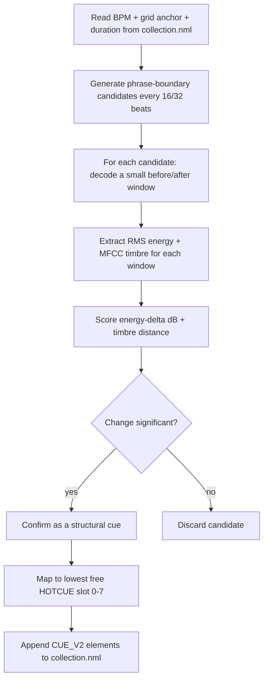

# cuegrid

A data-science and stem-separation-powered HotCue generation tool for
Traktor Pro. **cuegrid** analyzes your audio tracks and automatically
injects structural HotCues into Traktor's `collection.nml`, using
**Traktor's own BPM and beatgrid data** as the source of truth — no
independent beat-detection or grid-fitting, and no snapping/quantization
step, because every cue this tool writes is mathematically derived from
the grid to begin with.

- Reads BPM and the grid anchor (`AutoGrid`) straight from your Traktor
  collection.
- Analyzes only small, targeted windows of audio at musically meaningful
  phrase boundaries (every 16/32 beats) — never the whole track.
- Confirms structural cue points only where a real energy or timbre
  change is detected, selecting the strongest, most confident changes
  across the whole track (up to `--max-cues`) rather than fixed
  intro/outro roles.
- Writes new `<CUE_V2>` HotCue elements back into your `collection.nml`,
  never touching your existing cues, grid, or any other track data.
- **Batch Processing:** Process single tracks, search by title, or
  analyze entire playlists natively through the XML tree.
- **Stem Integration:** When Traktor's native Stems are present, isolates
  the drum/rhythm component for cleaner detection, with automatic
  fallback to the full mix for ambient or drum-light material.

Full technical specification: [`.openspec/2-spec.md`](.openspec/2-spec.md).

---

## Installation

Requires **Python 3.10+**.

```bash
git clone <this-repo>
cd cuegrid
python -m venv .venv
.venv\Scripts\activate        # Windows
# source .venv/bin/activate   # macOS/Linux

pip install -e .
```

This installs the `cuegrid` console command along with its runtime
dependencies (`librosa`, `numpy`).

For running the test suite too:

```bash
pip install -e ".[dev]"
pytest
```

> **Back up your collection first.** This tool writes directly to your
> `collection.nml`. It always creates a `<name>.nml.bak` backup before its
> first write in a given run (and never overwrites an existing backup),
> but you should still keep your own copy until you're comfortable with
> its behavior — see [Safety notes](#safety-notes).

---

## CLI usage

The CLI supports three mutually exclusive target modes (Path, Title, or
Playlist):

```
cuegrid [TRACK_PATH | --track-title TITLE | --playlist NAME]
        [--artist ARTIST] [--nml NML_PATH] [-v] [tuning flags...]
```

### 1. Single Track (By Path)
```bash
cuegrid "D:\Music\Artist - Track.flac"
```

### 2. Batch Processing (By Playlist)
Analyzes an entire Traktor playlist natively. If a track fails (e.g.
missing BPM or corrupted audio), it is safely skipped without halting the
batch.
```bash
cuegrid --playlist "My IDM Breaks"
```

### 3. Batch Processing (By Title)
Analyzes all tracks matching a specific title. You can narrow this down
by adding the artist.
```bash
cuegrid --track-title "Song Name" --artist "Artist Name"
```

### `--nml`: pointing at a specific collection

```bash
cuegrid --playlist "Techno Set" --nml "D:\Backups\collection.nml"
```

Use this to target a specific collection file explicitly — useful if you
have multiple Traktor installations, work from a backup, or run this tool
in a script/CI context where auto-discovery isn't appropriate.

### Auto-discovery of `collection.nml`

If `--nml` is not given, `cuegrid` searches the standard Traktor install
locations:

- **Windows / macOS:** `~/Documents/Native Instruments/Traktor */collection.nml`

Every installed Traktor version creates its own `Traktor x.x.x` folder
under that root; `cuegrid` checks all of them and picks the **most
recently modified** `collection.nml`. If none is found anywhere, it exits
with an error asking you to pass `--nml` explicitly.

### `--title` / `--artist`: disambiguating duplicate tracks

A track is matched to an `<ENTRY>` in your collection by its file path.
In the rare case that more than one `<ENTRY>` shares the exact same
`LOCATION` (e.g. an edited/merged collection), `cuegrid` will refuse to
guess and instead report the conflict:

```
error: 2 ENTRY elements matched path: 'd:/music/artist - track.flac' in collection.nml ('Artist' - 'Track (Radio Edit)', 'Artist' - 'Track (Extended Mix)'); disambiguate with --title/--artist

Multiple tracks share this LOCATION. Narrow it down with --title and/or --artist.
```

Resolve it with either or both flags:

```bash
cuegrid "D:\Music\Artist - Track.flac" --title "Track (Extended Mix)"
cuegrid "D:\Music\Artist - Track.flac" --artist "Artist" --title "Track (Extended Mix)"
```

Matching is case-insensitive and exact (not a substring search).

### `-v` / `--verbose`

Enables `INFO`-level logging (which `<ENTRY>` was matched, how many
events were detected, how many cues were written, etc.). Without it, only
warnings and the final summary are shown.

### Tuning flags (advanced)

Every knob in the analysis pipeline is exposed as a CLI flag. **All of
them are optional** — any flag you don't pass falls back to its own
default, shown in `--help`:

| Flag | Default | Meaning |
|---|---|---|
| `--mode` | (none) | Dynamic sensitivity preset: `soft`, `medium`, or `hard`. When set, overrides `--energy-threshold` and `--timbre-threshold`. See [Sensitivity Modes](#sensitivity-modes-v110). |
| `--phrase-beats` | `8` | Base phrase granularity, in beats (a 2-bar block). Candidates are generated every N beats from the grid anchor. |
| `--major-phrase-multiple` | `2` | Every Nth candidate is additionally tagged a "major" (4-bar / 16-beat) phrase boundary. |
| `--sample-rate` | native | Resample analysis windows to this rate; omit to keep each track's native sample rate. |
| `--hop-length` | `512` | Frame hop used for RMS/MFCC extraction within each window. |
| `--window-beats` | `4.0` | Size of the before/after analysis window around each candidate, in beats (1 bar). |
| `--mfcc-count` | `13` | Number of MFCC coefficients extracted per window (timbre fingerprint size). |
| `--energy-threshold` | `3.0` | Minimum absolute RMS energy change, in dB, to flag a candidate as significant. |
| `--timbre-threshold` | `12.0` | Minimum Euclidean distance between MFCC vectors to flag a candidate as significant. |
| `--max-cues` | `8` | Maximum number of cues written per track. |
| `--clear-existing` | (flag) | Clear existing standard HotCues (TYPE="0") before writing new ones. Grid/BPM (TYPE="4") and Load (TYPE="3") markers are preserved. **Smart slot reclamation:** when active, the tool calculates slot availability as if those old HotCues are already gone, preventing premature "all slots occupied" warnings and ensuring a perfect sequential fill from slot 0 upward. |
| `--relative-confidence-threshold` | `0.3` | Keep only candidates whose confidence is at least this fraction of the track's strongest candidate. |
| `--export-csv` | (none) | Write per-candidate telemetry to a CSV file for data-driven tuning (see [Data Export](#data-export-v18)). |

### Sensitivity Modes (v1.10)

Instead of manually tuning `--energy-threshold` and `--timbre-threshold`,
use the `--mode` flag to pick a preset sensitivity:

| Mode | Energy Threshold | Timbre Threshold | Best for |
|---|---|---|---|
| `soft` | 2.0 dB | 8.0 | Subtle transitions, ambient, downtempo |
| `medium` | 4.0 dB | 18.0 | General-purpose electronic music (default) |
| `hard` | 7.0 dB | 30.0 | Only the most dramatic drops/breaks |

```bash
# Gentle detection for ambient / downtempo
cuegrid --playlist "Ambient" --mode soft

# Only catch the biggest structural changes
cuegrid --playlist "Hard Techno" --mode hard
```

When `--mode` is set, any individual `--energy-threshold` or
`--timbre-threshold` flags are ignored in favor of the preset.

Example — tuning for complex IDM structures (fewer, stronger texture
shifts over energy drops):

```bash
cuegrid --playlist "Complex IDM" --max-cues 2 --timbre-threshold 8.0 --energy-threshold 15.0
```

Run `cuegrid --help` for the full, always-up-to-date list.

### `--verify`: Multi-Source Validation (v2.2)

`--verify {fast,smart}` (default: `fast`) controls how much
cross-checking happens when a track has a native Drums/Rhythm stem (see
Stems Integration):

- **`fast` (default):** analyzes only the isolated drum stem. If the
  extracted stem turns out to be practically silent/ambient (e.g.
  Ambient or IDM tracks with little to no real drum content), this is
  detected automatically via a lightning-fast energy probe, and `cuegrid`
  transparently falls back to analyzing the original Master track instead
  — no flag needed for this fallback, it's always on.
- **`smart`:** on top of everything `fast` does, cross-checks every
  confirmed cue against a small window of the Master audio and relabels
  it accordingly:
  - Rhythm-driven hit (drums *and* the full mix are both energetic) →
    named `"Drop (Rhythm)"`.
  - Melodic passage where the drums drop out but the mix stays energetic
    → named `"Breakdown (Melodic)"`.

  These names appear directly on the HotCue pad when you reload the
  track in Traktor.

```bash
cuegrid "D:\Music\Artist - Track.flac" --verify smart
```

`smart` only ever decodes a couple of extra seconds of the Master file
per confirmed cue — it never re-decodes the whole track.

---

## How Grid-Guided Phrase Analysis works

Most auto-cue tools run beat/onset/novelty detection blindly across an
entire track. `cuegrid` takes a different, DJ-centric approach: in
club-oriented electronic music, structural changes (drops, breakdowns,
intro/outro boundaries) overwhelmingly land on **musical phrase
boundaries** — 4-bar (16-beat) or 8-bar (32-beat) blocks. So instead of
searching everywhere, `cuegrid` only looks *there*.



### 1. Candidates come from the grid, not from guessing

Given the track's `BPM` and its Traktor-assigned grid anchor `G` (the
`AutoGrid` cue's timestamp), the beat length is `L = 60000 / BPM`
milliseconds. A candidate timestamp is generated every `phrase_beats`
(default 16) beats from the anchor:

```
t_ms(n) = G + n * phrase_beats * L,   for n = 0, 1, 2, ... up to the track's duration
```

Every other candidate (`n` even, by default) is additionally tagged a
"major" 32-beat phrase boundary. Because every candidate is already
`G + k*L` for an integer `k`, **it is exactly grid-aligned by
construction** — there is no separate beat-snapping step, unlike tools
that detect an arbitrary timestamp first and then round it to the
nearest beat afterward.

### 2. Only small windows are ever decoded

For each candidate, `cuegrid` decodes exactly two short audio windows —
one immediately before it, one immediately after (sized in beats, so the
window automatically scales with tempo) — using `librosa`'s
offset/duration seeking. The rest of the track is never touched. For a
typical 4-minute track this means analyzing on the order of a hundred
short windows instead of the entire waveform, which is both faster and,
because arrangement changes really are phrase-aligned in this genre, more
musically accurate than blind whole-track novelty detection.

### 3. A candidate is confirmed only if the change is real

Each window pair is scored on two independent signals:

- **Energy change** — the change in RMS loudness, in decibels.
- **Timbre change** — the Euclidean distance between MFCC vectors
  (a numeric fingerprint of the sound's texture/instrumentation).

A candidate is confirmed only if either signal crosses its threshold
(`--energy-threshold` / `--timbre-threshold`) *and* its "after" window
isn't practically silent (an anti-silence guard that keeps fade-outs from
ever being confirmed). All confirmed candidates across the whole track
form a single pool: only those within `--relative-confidence-threshold`
of the track's strongest candidate survive, and the top `--max-cues` (by
confidence) are written.

### 4. Cues are written, never anything else touched

Confirmed events are mapped to the lowest free `HOTCUE` slot (0–7) and
appended as new `<CUE_V2>` elements. The writer:

- Never touches the existing `AutoGrid` cue or any other existing
  `<CUE_V2>`/child element — it only appends.
- Never overwrites a `HOTCUE` slot you (or a previous run) already used;
  if all 8 slots are taken, remaining events are skipped with a warning,
  not an error.
- Always backs up the original file to `<name>.nml.bak` before its first
  write of a run.

For the full algorithm, data structures, and edge-case handling, see
[`.openspec/2-spec.md`](.openspec/2-spec.md), sections 4, 6, and 8.

---

## Data Export (v1.8)

Pass `--export-csv metrics.csv` to write per-candidate telemetry for
every track analyzed. Each row represents one phrase-boundary candidate
that was evaluated, with these columns:

| Column | Description |
|---|---|
| `track_title` | `"Artist - Title"` string identifying the track |
| `beat` | Beat index of the phrase-boundary candidate |
| `time_ms` | Timestamp of the candidate in milliseconds |
| `energy_delta_db` | RMS energy change (dB) across the candidate; positive = rising, negative = falling |
| `timbre_dist` | Euclidean distance between before/after MFCC vectors |
| `confidence` | Combined confidence score (arbitrary positive scale) |
| `status` | Final disposition: `SELECTED`, `DISCARDED_LIMIT`, `REJECTED_THRESHOLD`, `REJECTED_SILENCE`, or `REJECTED_MISSING_WINDOW` |

Rows are appended on each run, so you can accumulate data across multiple
sessions. Open the CSV in any spreadsheet or load it into a database to
filter by status, compare thresholds, and tune the detection parameters
data-driven.

```bash
# Export telemetry while analyzing a playlist
cuegrid --playlist "Techno Set" --export-csv tuning_data.csv -v
```

---

## Safety notes

- Always keep your own backup of `collection.nml` in addition to the
  automatic `.bak` this tool creates — especially the first few times
  you run it.
- Close Traktor before running `cuegrid` against your live collection,
  the same way you would for any other external collection editor.
- Re-running `cuegrid` on a track it has already processed is safe: it
  will detect the already-used `HOTCUE` slots and either fill in
  remaining free slots or skip with a warning once all 8 are occupied —
  it will never overwrite a cue it (or you) already placed.

---

## Development

```bash
pip install -e ".[dev]"
pytest -v
```

The test suite includes a deterministic synthetic audio fixture
(`tests/fixtures/generate_synthetic_fixture.py`) so the detection logic
is fully covered without requiring any real music files.
