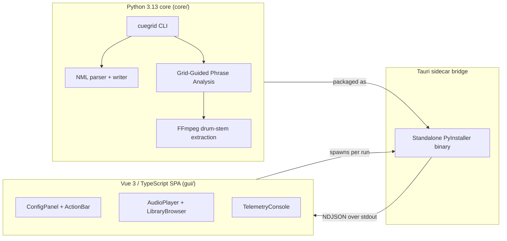
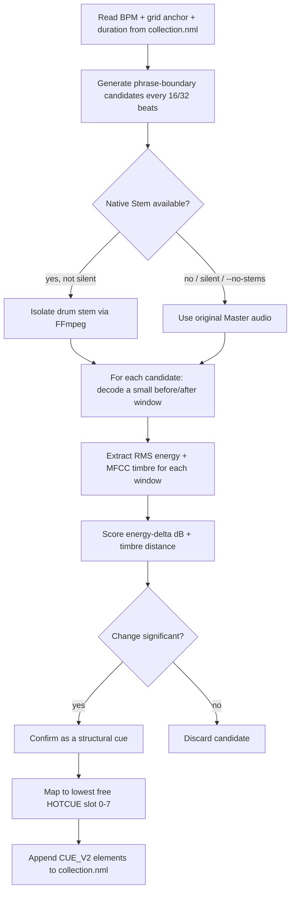

# CueGrid

**CueGrid** is a high-performance, asynchronous HotCue injector and surgical
Stem analyzer for **Native Instruments Traktor Pro 4**. It parses your native
XML `collection.nml`, evaluates auditory transients against Traktor's own
beatgrid, and maps intelligent, grid-aligned cues directly back into your
tracks — no independent beat-detection, no grid-fitting, and no
snapping/quantization step, because every cue this tool writes is
mathematically derived from the grid to begin with.

- Reads BPM and the grid anchor (`AutoGrid`) straight from your Traktor
  collection.
- Analyzes only small, targeted windows of audio at musically meaningful
  phrase boundaries (every 16/32 beats) — never the whole track.
- Confirms structural cue points only where a real energy or timbre
  change is detected, selecting the strongest, most confident changes
  across the whole track (up to `--max-cues`) rather than fixed
  intro/outro roles.
- Writes new `<CUE_V2>` HotCue elements back into your `collection.nml`,
  never touching your existing cues, grid, or any other track data.
- **Batch Processing:** Process single tracks, search by title, or
  analyze entire playlists natively through the XML tree.
- **Smart Stems Processing:** When Traktor's native Stems are present,
  isolates the drum/rhythm component via FFmpeg for cleaner detection,
  with automatic fallback to the full Master mix for ambient or
  drum-light material.
- **Desktop GUI:** A Tauri + Vue 3 studio-rack interface wraps the engine
  as a sidecar process, giving you waveform playback, virtual HotCue
  pads, a native library browser, and one-click telemetry export — no
  terminal required.

Full technical specifications: [`.openspec/2-core-spec.md`](.openspec/2-core-spec.md)
(engine) and [`.openspec/3-gui-spec.md`](.openspec/3-gui-spec.md) (GUI).

---

## Architecture

CueGrid is a hybrid-topology application with a strict process boundary
between analysis and presentation:



- **Engine (`core/`):** a standalone Python 3.13 audio-processing engine.
  It never imports into the GUI process — it is packaged as a
  single-file **Tauri sidecar** executable via PyInstaller, so end users
  never need a Python environment installed.
- **GUI (`gui/`):** a Vue 3 (`<script setup lang="ts">`) single-page
  application shell around Tauri, rendering the dark, studio-rack
  interface and spawning the sidecar per analysis run.
- **Safe reload loop:** the GUI never trusts its own in-memory state as
  the source of truth after a write. Every operation that mutates
  `collection.nml` — a full analysis run or a single-track context-menu
  trigger — is followed by a strict, user-driven **teardown → force-read
  → rebuild** cycle: the active waveform and HotCue pads are unmounted,
  the track's metadata is re-read directly from disk, and the player is
  rebuilt from that fresh result. This prevents Wavesurfer.js cache
  collisions and stale-state corruption between runs.

---

## Key Features (v1.8)

### Smart Stems Processing Engine

CueGrid detects native Traktor Stems by testing the `FLAGS & 0x40`
bitmask on each `<ENTRY><INFO>` element — a reverse-engineered,
non-literal comparison that survives whatever other flag bits Traktor
sets. When a stem is available, it predicts the sidecar `.stem.mp4`
path (reproducing Traktor's own MD5-derived hashing scheme) and uses
`ffmpeg` to demux the isolated Drums/Rhythm stream for surgical,
low-noise analysis.

Multi-source validation guards this pipeline at two levels:

- **Empty-stem detection (always on):** a fast, chunked RMS energy
  probe checks whether the extracted drum stem is practically silent
  (e.g. Ambient/IDM material with no real drum content). If so, CueGrid
  transparently falls back to analyzing the original Master audio — no
  flag required.
- **Smart cross-validation (`--verify smart`, default):** every
  confirmed cue is cross-checked against a small window of the Master
  track and relabeled — `"Drop (Rhythm)"` when both drums and the full
  mix are energetic, `"Breakdown (Melodic)"` when the drums drop out but
  the mix stays energetic. These labels appear directly on the HotCue
  pad in Traktor.

A global binary override, `--no-stems`, forces standard Master-file
analysis and bypasses `FLAGS` inspection, stem-path resolution, and
extraction entirely — useful for A/B comparisons or collections without
Stems.

### 3D Sensitivity Matrix v1.4

Instead of tuning raw thresholds by hand, pick one of three presets via
`--mode`. Each preset binds **three** detection variables together
(energy, timbre, and the relative-confidence gate), so the modes remain
behaviorally distinct rather than just scaling one number:

| Preset | CLI value | Energy threshold (dB) | Timbre threshold | Relative confidence | Best for |
|---|---|---:|---:|---:|---|
| **Granular** | `soft` | 2.0 | 8.0 | 0.15 | Atmospheric or IDM textures — open-gate capture |
| **Balanced** | `medium` (default) | 4.0 | 18.0 | 0.30 | General-purpose electronic music structures |
| **Strict** | `hard` | 7.0 | 30.0 | 0.50 | Massive drops and structural peak transitions only |

The relative-confidence gate is the decisive selector: **Granular**
admits candidates at just 15% of the track's strongest confidence
score, while **Strict** demands at least 50%.

### Strict Player Sandbox Lifecycle (v1.5)

The GUI treats Vue's reactive state, Wavesurfer's internal Regions
state, and the on-disk `collection.nml` as three independent stores —
no one of them is authoritative for the others. Clicking **Analyze**
immediately unmounts the active waveform, clears every Wavesurfer
region, and resets all virtual HotCue pads to unmapped/disabled — a
completely clean slate. The player is only rebuilt through the
mandatory teardown → force-read → rebuild chain once the operation
completes, eliminating frontend race conditions and stale-cache
collisions between runs.

### Contextual Single-Track Analysis (v1.7)

Right-click any track row in the library browser to open a native-style
context menu with a single action: **Analyze track**. This triggers the
single-track sidecar contract in isolation (never a synthetic one-track
playlist), with a smart execution guard:

- If the targeted track is the one currently loaded in the player, the
  full player teardown sequence runs before analysis starts.
- If it's a background track, analysis runs silently — the active
  waveform, playback position, and pads are left completely undisturbed.

### Studio-Rack Layout & Telemetry Export (v1.8)

A pixel-perfect dark theme (`#121212` base, teal accent) organizes the
interface into two segmented modular racks — Player (waveform +
library browser) and Config (sensitivity/stems/max-cues controls +
Action Bar) — separated by a single resizable splitter with a
hard anti-clip floor so the primary CTA is never squeezed out of view.

Every execution automatically dumps its evaluation metrics to a local
session cache, `last_run_telemetry.csv`, with a 9-column schema:

```text
track_title,beat,time_ms,energy_delta_db,timbre_dist,confidence,status,track_peak_db,track_perceived_db
```

Each run **overwrites** this cache (no stale rows survive across runs).
A fixed **Export** button lives in the bottom-right status bar, next to
the telemetry console launcher — always visible, but disabled until an
analysis completes successfully. Clicking it opens Tauri's native OS
save dialog and copies the cached CSV bytes to your chosen destination,
without triggering a new analysis run or mutating the internal cache.

---

## Installation

### Requirements

- **Python 3.13**
- **Node.js v18+**
- **FFmpeg** — must be discoverable on `PATH` at runtime (used for
  native Stem extraction; not a Python dependency and not bundled).

### Core engine (`core/`)

```bash
cd core
python -m venv .venv
.venv\Scripts\activate        # Windows
# source .venv/bin/activate   # macOS/Linux

pip install -e ".[dev]"
```

This installs the `cuegrid` console command along with its runtime
dependencies (`librosa`, `numpy`, `soundfile`, `ffmpeg-python`).

Run the test suite from the repository root:

```bash
pytest core
```

> **Back up your collection first.** This tool writes directly to your
> `collection.nml`. It always creates a `<name>.nml.bak` backup before its
> first write in a given run (and never overwrites an existing backup),
> but you should still keep your own copy until you're comfortable with
> its behavior — see [Safety notes](#safety-notes).

### Desktop GUI (`gui/`)

```bash
cd gui
npm install
npm run dev       # local development, hot-reloaded Tauri window
npm run build     # production build — runs vue-tsc --noEmit first
```

`npm run build` enforces a strict, zero-warning `vue-tsc --noEmit` type
check before invoking `vite build`; the build fails fast on any
TypeScript diagnostic. The GUI wraps the `cuegrid` engine as a packaged
Tauri sidecar binary (see `sync.ps1` for the PyInstaller → Tauri
binaries pipeline), so it never depends on a system Python install at
runtime.

---

## Workflow & Usage

### Via the GUI

1. Launch the app (`npm run tauri dev` or the packaged build). CueGrid
   auto-discovers `collection.nml` from the standard Traktor install
   locations, or you can point it at a specific file.
2. Browse your playlists and tracks in the **Library Browser**. Double-
   click a track to preview it in the waveform player.
3. Configure the run using the vertical **Config Rack** switches:
   - **Include Stems** — binary toggle; OFF appends `--no-stems`.
   - **Sensitivity** — segmented control: Granular / Balanced / Strict.
   - **Max Cues** — integer selector, 1–8.
   - **Clear Existing** — wipes existing standard HotCues (never grid
     or load markers) before writing new ones.
4. Either:
   - Press **Analyze & Inject** to batch-process the currently selected
     playlist, or
   - **Right-click** any individual track row and choose **Analyze
     track** for a single, isolated run that never disturbs a different
     track already playing in the background.
5. Once analysis completes, the player automatically tears down and
   rebuilds itself from the freshly written `collection.nml` — reload
   the track in Traktor to see the new HotCue pads and labels.
6. Open the telemetry console (bottom-right toggle) to watch structured
   log output live, or click **Export** to save the last run's
   per-candidate metrics as a CSV via the native OS file picker.

### Via the CLI

The CLI supports three mutually exclusive target modes (Path, Title, or
Playlist):

```
cuegrid [TRACK_PATH | --track-title TITLE | --playlist NAME]
        [--artist ARTIST] [--nml NML_PATH] [-v] [tuning flags...]
```

#### 1. Single Track (By Path)
```bash
cuegrid "D:\Music\Artist - Track.flac"
```

#### 2. Batch Processing (By Playlist)
Analyzes an entire Traktor playlist natively. If a track fails (e.g.
missing BPM or corrupted audio), it is safely skipped without halting the
batch.
```bash
cuegrid --playlist "My IDM Breaks"
```

#### 3. Batch Processing (By Title)
Analyzes all tracks matching a specific title. You can narrow this down
by adding the artist.
```bash
cuegrid --track-title "Song Name" --artist "Artist Name"
```

### `--nml`: pointing at a specific collection

```bash
cuegrid --playlist "Techno Set" --nml "D:\Backups\collection.nml"
```

Use this to target a specific collection file explicitly — useful if you
have multiple Traktor installations, work from a backup, or run this tool
in a script/CI context where auto-discovery isn't appropriate.

### Auto-discovery of `collection.nml`

If `--nml` is not given, `cuegrid` searches the standard Traktor install
locations:

- **Windows / macOS:** `~/Documents/Native Instruments/Traktor */collection.nml`

Every installed Traktor version creates its own `Traktor x.x.x` folder
under that root; `cuegrid` checks all of them and picks the **most
recently modified** `collection.nml`. If none is found anywhere, it exits
with an error asking you to pass `--nml` explicitly.

### `--title` / `--artist`: disambiguating duplicate tracks

A track is matched to an `<ENTRY>` in your collection by its file path.
In the rare case that more than one `<ENTRY>` shares the exact same
`LOCATION` (e.g. an edited/merged collection), `cuegrid` will refuse to
guess and instead report the conflict:

```
error: 2 ENTRY elements matched path: 'd:/music/artist - track.flac' in collection.nml ('Artist' - 'Track (Radio Edit)', 'Artist' - 'Track (Extended Mix)'); disambiguate with --title/--artist

Multiple tracks share this LOCATION. Narrow it down with --title and/or --artist.
```

Resolve it with either or both flags:

```bash
cuegrid "D:\Music\Artist - Track.flac" --title "Track (Extended Mix)"
cuegrid "D:\Music\Artist - Track.flac" --artist "Artist" --title "Track (Extended Mix)"
```

Matching is case-insensitive and exact (not a substring search).

### `-v` / `--verbose`

Enables `INFO`-level logging (which `<ENTRY>` was matched, how many
events were detected, how many cues were written, etc.). Without it, only
warnings and the final summary are shown.

### Tuning flags (advanced)

Every knob in the analysis pipeline is exposed as a CLI flag. **All of
them are optional** — any flag you don't pass falls back to its own
default, shown in `--help`:

| Flag | Default | Meaning |
|---|---|---|
| `--mode` | (none) | Sensitivity preset: `soft` (Granular), `medium` (Balanced), or `hard` (Strict). When set, overrides `--energy-threshold`, `--timbre-threshold`, and `--relative-confidence-threshold` together. See [3D Sensitivity Matrix](#3d-sensitivity-matrix-v14). |
| `--phrase-beats` | `16` | Base phrase granularity, in beats (a 4-bar block). Candidates are generated every N beats from the grid anchor. |
| `--major-phrase-multiple` | `2` | Every Nth candidate is additionally tagged a "major" (8-bar / 32-beat) phrase boundary. |
| `--sample-rate` | native | Resample analysis windows to this rate; omit to keep each track's native sample rate. |
| `--hop-length` | `512` | Frame hop used for RMS/MFCC extraction within each window. |
| `--window-beats` | `4.0` | Size of the before/after analysis window around each candidate, in beats (1 bar). |
| `--mfcc-count` | `13` | Number of MFCC coefficients extracted per window (timbre fingerprint size). |
| `--energy-threshold` | `4.0` | Minimum absolute RMS energy change, in dB, to flag a candidate as significant. |
| `--timbre-threshold` | `18.0` | Minimum Euclidean distance between MFCC vectors to flag a candidate as significant. |
| `--max-cues` | `8` | Maximum number of cues written per track (1–8). |
| `--clear-existing` | (flag) | Clear existing standard HotCues (TYPE="0") before writing new ones. Grid/BPM (TYPE="4") and Load (TYPE="3") markers are preserved. **Smart slot reclamation:** when active, the tool calculates slot availability as if those old HotCues are already gone, preventing premature "all slots occupied" warnings and ensuring a perfect sequential fill from slot 0 upward. |
| `--relative-confidence-threshold` | `0.30` | Keep only candidates whose confidence is at least this fraction of the track's strongest candidate. |
| `--verify` | `smart` | Multi-Source Validation mode: `fast` or `smart`. See [Smart Stems Processing Engine](#smart-stems-processing-engine). |
| `--no-stems` | (flag) | Bypass native Stems entirely and force Master-file analysis, regardless of `FLAGS`/`--verify`. |
| `--export-csv` | (none) | Write per-candidate telemetry to a CSV file for data-driven tuning (see [Data Export](#data-export)). |

```bash
# Gentle detection for ambient / downtempo
cuegrid --playlist "Ambient" --mode soft

# Only catch the biggest structural changes
cuegrid --playlist "Hard Techno" --mode hard

# Force Master-only analysis, skipping native Stems
cuegrid "D:\Music\Artist - Track.flac" --no-stems
```

Run `cuegrid --help` for the full, always-up-to-date list.

---

## How Grid-Guided Phrase Analysis works

Most auto-cue tools run beat/onset/novelty detection blindly across an
entire track. `cuegrid` takes a different, DJ-centric approach: in
club-oriented electronic music, structural changes (drops, breakdowns,
intro/outro boundaries) overwhelmingly land on **musical phrase
boundaries** — 4-bar (16-beat) or 8-bar (32-beat) blocks. So instead of
searching everywhere, `cuegrid` only looks *there*.



### 1. Candidates come from the grid, not from guessing

Given the track's `BPM` and its Traktor-assigned grid anchor `G` (the
`AutoGrid` cue's timestamp), the beat length is `L = 60000 / BPM`
milliseconds. A candidate timestamp is generated every `phrase_beats`
(default 16) beats from the anchor:

```
t_ms(n) = G + n * phrase_beats * L,   for n = 0, 1, 2, ... up to the track's duration
```

Every other candidate (`n` even, by default) is additionally tagged a
"major" 32-beat phrase boundary. Because every candidate is already
`G + k*L` for an integer `k`, **it is exactly grid-aligned by
construction** — there is no separate beat-snapping step, unlike tools
that detect an arbitrary timestamp first and then round it to the
nearest beat afterward.

### 2. Only small windows are ever decoded

For each candidate, `cuegrid` decodes exactly two short audio windows —
one immediately before it, one immediately after (sized in beats, so the
window automatically scales with tempo) — using `librosa`'s
offset/duration seeking. The rest of the track is never touched. For a
typical 4-minute track this means analyzing on the order of a hundred
short windows instead of the entire waveform, which is both faster and,
because arrangement changes really are phrase-aligned in this genre, more
musically accurate than blind whole-track novelty detection.

### 3. A candidate is confirmed only if the change is real

Each window pair is scored on two independent signals:

- **Energy change** — the change in RMS loudness, in decibels.
- **Timbre change** — the Euclidean distance between MFCC vectors
  (a numeric fingerprint of the sound's texture/instrumentation).

A candidate is confirmed only if either signal crosses its threshold
(`--energy-threshold` / `--timbre-threshold`) *and* its "after" window
isn't practically silent (an anti-silence guard that keeps fade-outs from
ever being confirmed). All confirmed candidates across the whole track
form a single pool: only those within `--relative-confidence-threshold`
of the track's strongest candidate survive, and the top `--max-cues` (by
confidence) are written.

### 4. Cues are written, never anything else touched

Confirmed events are mapped to the lowest free `HOTCUE` slot (0–7) and
appended as new `<CUE_V2>` elements. The writer:

- Never touches the existing `AutoGrid` cue or any other existing
  `<CUE_V2>`/child element — it only appends.
- Never overwrites a `HOTCUE` slot you (or a previous run) already used;
  if all 8 slots are taken, remaining events are skipped with a warning,
  not an error.
- Always backs up the original file to `<name>.nml.bak` before its first
  write of a run.

For the full algorithm, data structures, and edge-case handling, see
[`.openspec/2-core-spec.md`](.openspec/2-core-spec.md), sections 4, 6, and 8.

---

## Data Export

### CLI (`--export-csv`)

Pass `--export-csv metrics.csv` to write per-candidate telemetry for
every track analyzed. Each row represents one phrase-boundary candidate
that was evaluated, with these columns:

| Column | Description |
|---|---|
| `track_title` | `"Artist - Title"` string identifying the track |
| `beat` | Beat index of the phrase-boundary candidate |
| `time_ms` | Timestamp of the candidate in milliseconds |
| `energy_delta_db` | RMS energy change (dB) across the candidate; positive = rising, negative = falling |
| `timbre_dist` | Euclidean distance between before/after MFCC vectors |
| `confidence` | Combined confidence score (arbitrary positive scale) |
| `status` | Final disposition: `SELECTED`, `DISCARDED_LIMIT`, `REJECTED_THRESHOLD`, `REJECTED_SILENCE`, or `REJECTED_MISSING_WINDOW` |

Rows are appended on each run, so you can accumulate data across multiple
sessions. Open the CSV in any spreadsheet or load it into a database to
filter by status, compare thresholds, and tune the detection parameters
data-driven.

```bash
# Export telemetry while analyzing a playlist
cuegrid --playlist "Techno Set" --export-csv tuning_data.csv -v
```

### GUI (Last-Run Telemetry cache)

Every GUI-triggered run overwrites a fixed internal cache,
`last_run_telemetry.csv`, in the application's local data directory —
never appended, always the most recent execution only. Its schema adds
two loudness columns to the CLI's per-candidate shape:

```text
track_title,beat,time_ms,energy_delta_db,timbre_dist,confidence,status,track_peak_db,track_perceived_db
```

Click **Export** in the status bar to copy this cache to a
user-chosen path via Tauri's native save dialog — the export never
triggers a new analysis run or mutates the cache itself.

---

## Safety notes

- Always keep your own backup of `collection.nml` in addition to the
  automatic `.bak` this tool creates — especially the first few times
  you run it.
- Close Traktor before running `cuegrid` against your live collection,
  the same way you would for any other external collection editor.
- Re-running `cuegrid` on a track it has already processed is safe: it
  will detect the already-used `HOTCUE` slots and either fill in
  remaining free slots or skip with a warning once all 8 are occupied —
  it will never overwrite a cue it (or you) already placed.

---

## Development

### Core engine

```bash
cd core
pip install -e ".[dev]"
pytest -v
```

Or, from the repository root:

```bash
pytest core
```

The test suite includes a deterministic synthetic audio fixture
(`tests/fixtures/generate_synthetic_fixture.py`) so the detection logic
is fully covered without requiring any real music files.

### GUI

```bash
cd gui
npm install
npm run dev      # Vite + Tauri dev server, hot-reloaded
npm run build    # vue-tsc --noEmit type-check, then vite build
```

`npm run build` is a strict gate: any TypeScript diagnostic surfaced by
`vue-tsc` fails the build before `vite` ever runs.

### Packaging the sidecar

`sync.ps1` (Windows) automates the core → GUI packaging loop: it runs
PyInstaller against `core/src/cuegrid/cli.py`, moves the resulting binary
into `gui/src-tauri/binaries/cuegrid-x86_64-pc-windows-msvc.exe`, and
nudges Tauri's dev-server watcher to pick up the new sidecar without a
full restart.
